I installed the application and the server from here [https://github.com/dineshshetty/Android-InsecureBankv2/releases/tag/2.3.1](https://github.com/dineshshetty/Android-InsecureBankv2/releases/tag/2.3.1).

Let's have a look on the app:


This is the main activity.

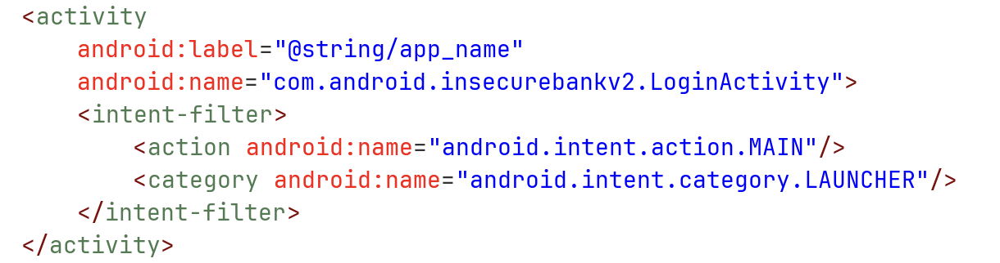

First, we can see it grabs some value from `values/strings.xml`, and checks if it's equal to `no`:

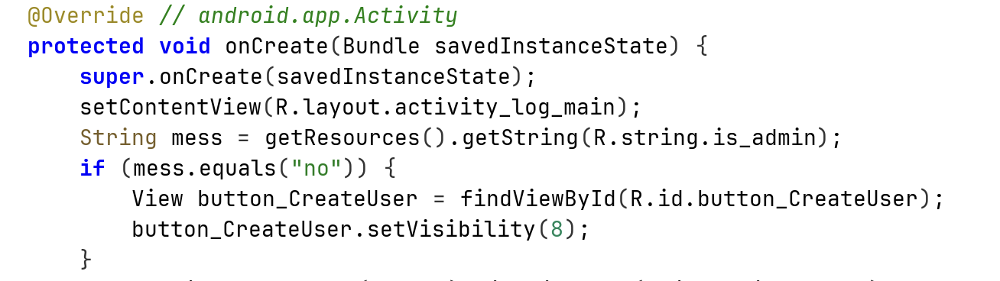


We can edit the file `strings.xml`, and then compile the apk again, sign it and use it.
#### Runtime Manipulation

Another way will be to simply hook it with frida:

```js
Java.perform(function() {
    Java.use('java.lang.String').equals.implementation = function(str) {
        if(str == 'no'){
            console.log("Hook equals");
            return false;
        }
        return this.equals(str);
    }

})
```

```bash
frida -U -f com.android.insecurebankv2 -l ./frida-script.js
```


This button do nothing, and after some time, the application crashes.

### Application Patching

Let's try to patch the application. For this, we'll learn something that is more general. 
In case you have xapk file, after installation you have several apk files, you'll want to download them all:

```bash
mkdir splits
# Pull all files from installation folder
adb shell pm path "com.android.insecurebankv2" | cut -d ":" -f 2 | xargs -I {} adb pull {} splits/
```

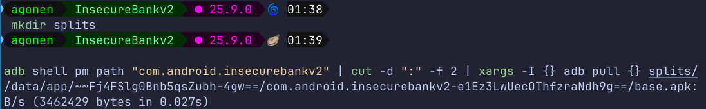

Now, we want to decompile the file `base.apk`, and then edit whatever we want in the smali code\ strings.xml in our case:

```bash
cd splits/
apktool d base.apk -o base/
```

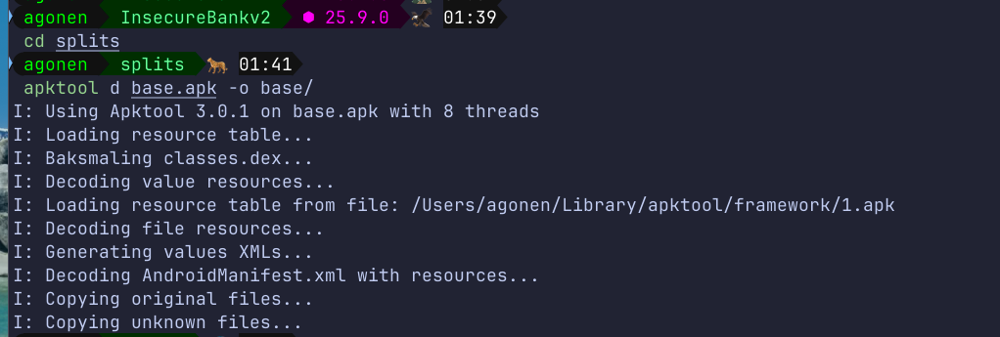

Now, we want to edit the files, in our case the file `values/strings.xml`:

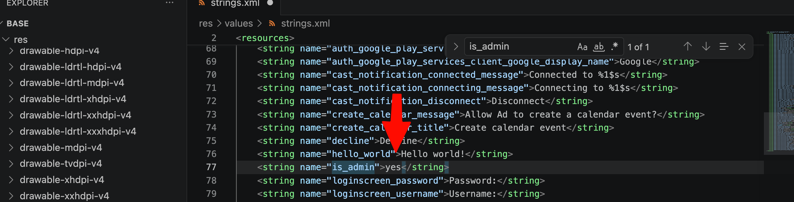

After editing, we need to compile it back to `base.apk`:

```bash
apktool b base/ -o base.apk
```

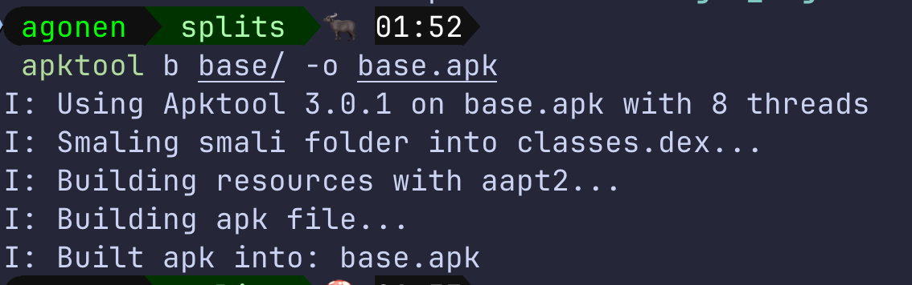

Then, we need to merge all the .apk files (in our case not really, because this isn't xapk, rather regular apk file):

```bash
java -jar ~/Library/Java/Extensions/APKEditor.jar m -i . -o merged.apk
```

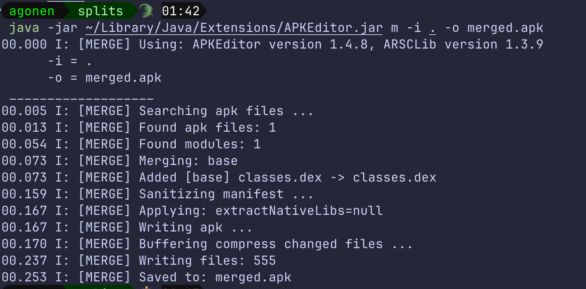

Now, let's sign the merged apk file:

```bash
java -jar ~/Library/Java/Extensions/uber-apk-signer.jar -a merged.apk --allowResign -o merged_signed
```

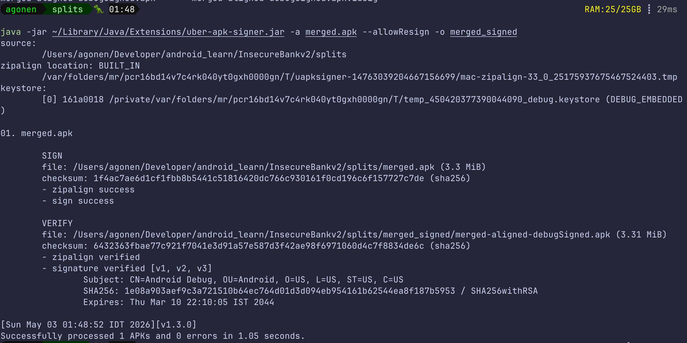

And we are ready for the installation back on the machine, not before uninstalling the older version:

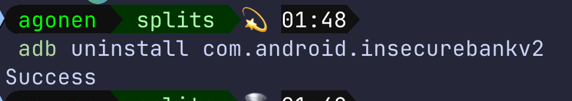

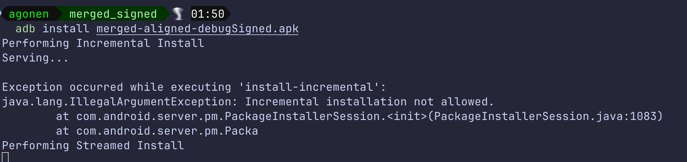

You'll need to allow its installation on the device, notice that i needed to use the flag `--bypass-low-target-sdk-block`, because the sdk version wasn't compatible with the device.

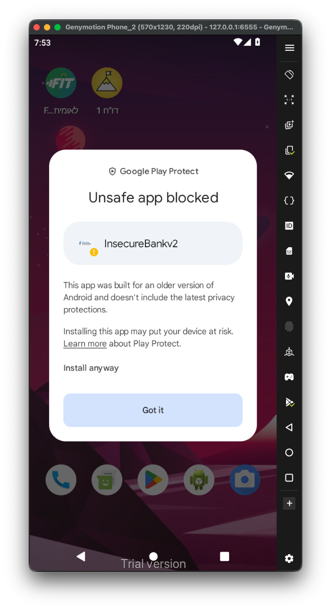

Now, when accessing the app:

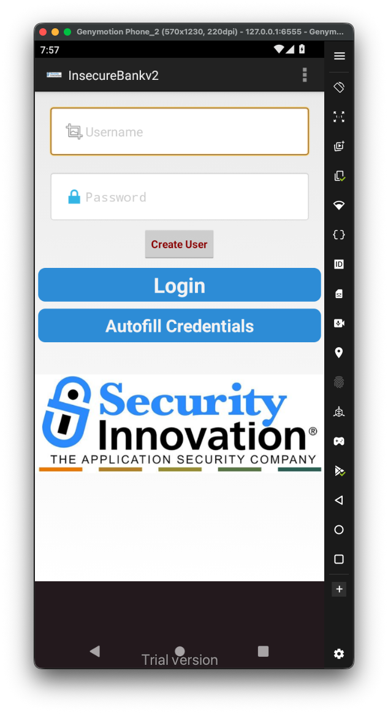
Perfect.


Now, I want to install the local server, and set it up. 

The original version was for python2, i needed to edit it a bit in order it fill work in python3, I'm using python3.10.

First, download the zip from [AndroLabServer](../AndroLabServer.zip), It hosted in my github too.

Then, create the virtual environment, and activate it:

```bash
python3.10 -m venv venv
source venv/bin/activate
```

We'll need to install the packages, just execute the next line:

```bash
pip install -r requirements.txt
```

and we are ready:

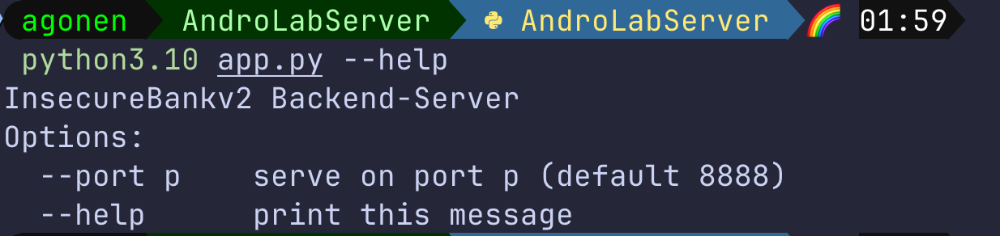

Spawn the server:

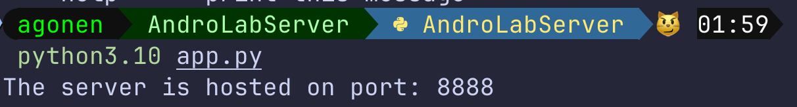

Yes, this is **2AM**.

On the preferences of the app you'll need to setup the address of the server, remember that the host ip address in genymotion is `10.0.3.2`. If it isn't working, try the address `127.0.0.1`.

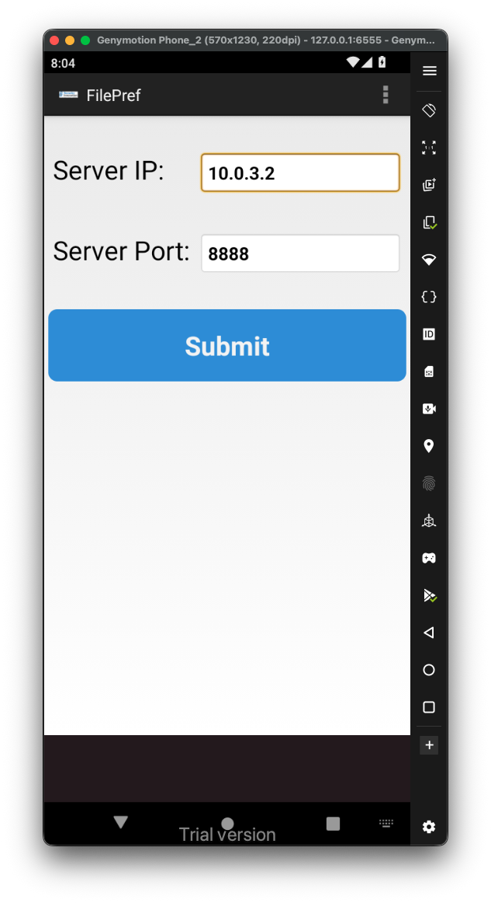
I've set up the proxy on the emulator, using the tool I've created that can be found here [https://github.com/avishaigonen123/CTF_writeups/blob/master/stuff/emulator_tool.sh](https://github.com/avishaigonen123/CTF_writeups/blob/master/stuff/emulator_tool.sh):

```bash
emulator_tool --setup-proxy --proxy-port 3333 --burp-port 8082
```

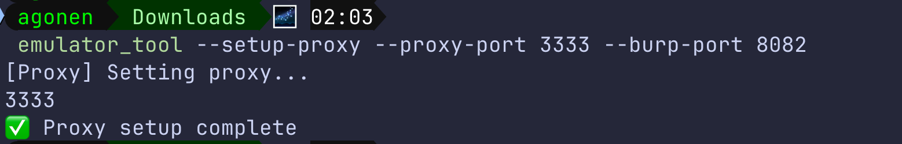

and also setup the listener on the burp suite itself:

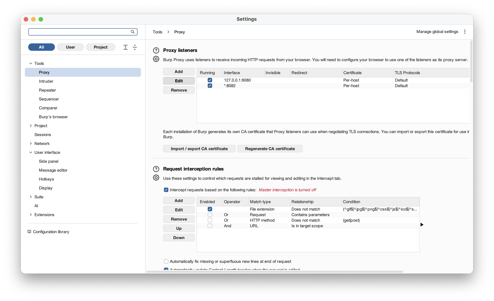
Now, we are ready to try and login to the application, and then inspect the request:


Now. we are ready to start working and exploring the application