After finishing the setup on [part1](./part1), we can start research the app.

### Developer Backdoors

When trying to login, it calls the function `performLogin`, which creates intent for the class `DoLogin` with the username and password:

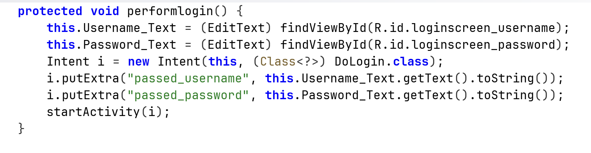


Then, it calls the function `postData`. In the read boxes we can see it has the regular endpoint `/login`, and also special endpoint `/devlogin` that can be accessed using the username `devadmin`.

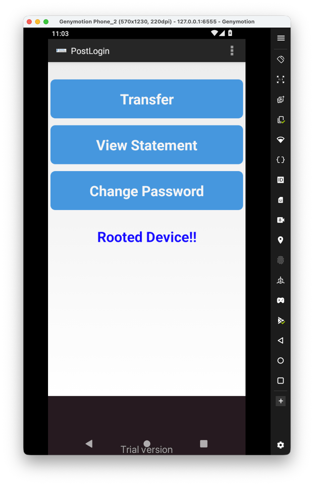

In addition, I've marked some more interesting code parts that might be vulnerable.

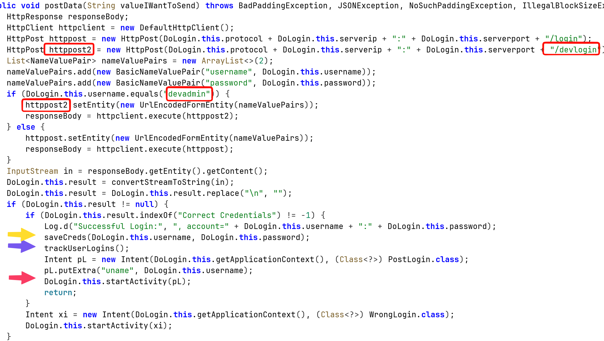

### Insecure Logging mechanism

We can see here also insecure logging, when login success, it prints the credentials for the log:

```bash
adb logcat --pid=$(adb shell pidof -s com.android.insecurebankv2) '*:D'
```

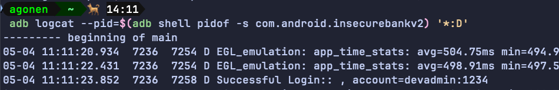

### Sensitive Information in Memory

Let's explore them, first, the `saveCreds`:

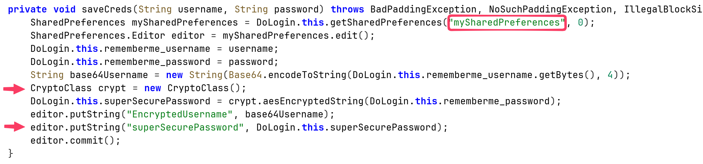

it saves inside `mySharedPreferences.xml`, the encoded username and the super secure password, which uses some unique `CryptClass` that is probably vulnerable.

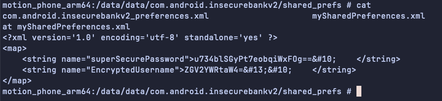

We can grab the username, and the password, note I logged in with the username `devadmin`:

```bash
echo 'ZGV2YWRtaW4=' | base64 -d; echo
devadmin
```

This can be used for username enumeration. More interestingly, we can go back to the login page, remember we have the `Autofiil Credentials`.

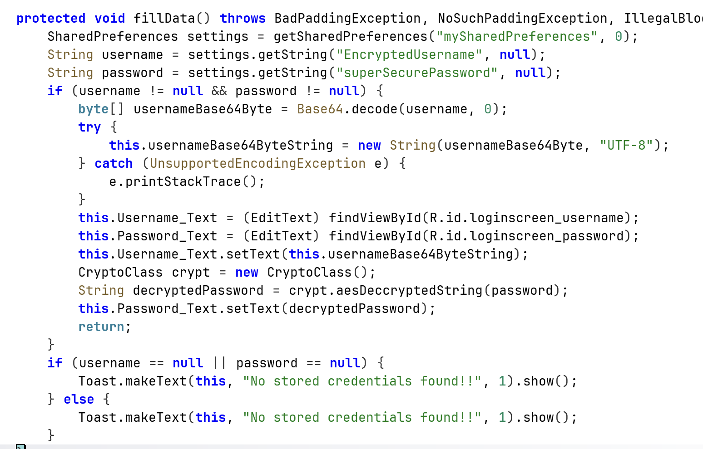

It simply grabs the data from the shared preferences. Since the username isn't encrypted, we can change the username and then use the same encrypted password that was used by another user to login in the past. 
In addition, we can login via the stored credentials, without knowing them, because that's what the button gives us.

### Insecure Content Provider access

Okay, now back to `trackUserLogin`:

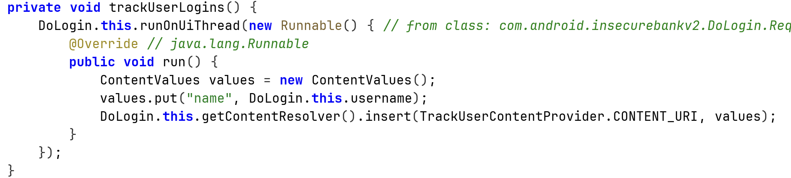

We can see it saves the data inside `mydb.db`:

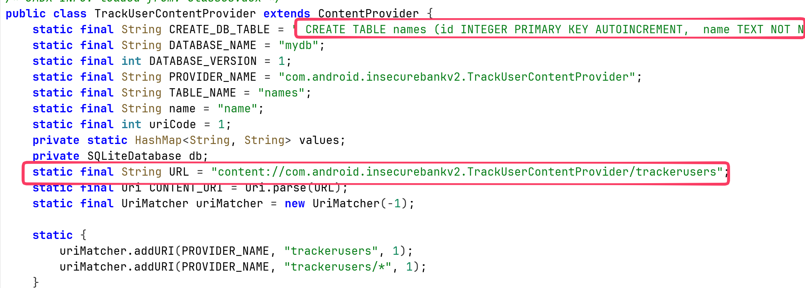

More interesting, it is contentProvider, means that we can assess the data by using query to:

```
content://com.android.insecurebankv2.TrackUserContentProvider/trackerusers
```

When checking on the `AndroidManifest.xml`, we can see it is exported:

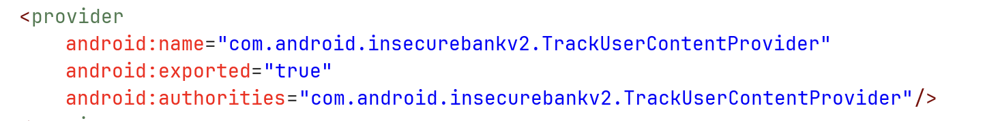

So, it means every application can simply query to credentials, via the content provider. For example, using `adb`:

```bash
adb shell content query --uri content://com.android.insecurebankv2.TrackUserContentProvider/trackerusers --projection '"*"'
```

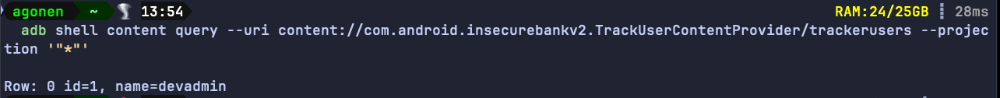

Notice, it'll work the same way from malicious app on the device, not only the user `shell` of the adb.

### Vulnerable Activity Components

Now, to the last arrow, the red one, we can see it creates explicit intent with the key `uname` and the value of the username, send to the class `PostLogin`.


This class get the intent, and spawn the window of after login:

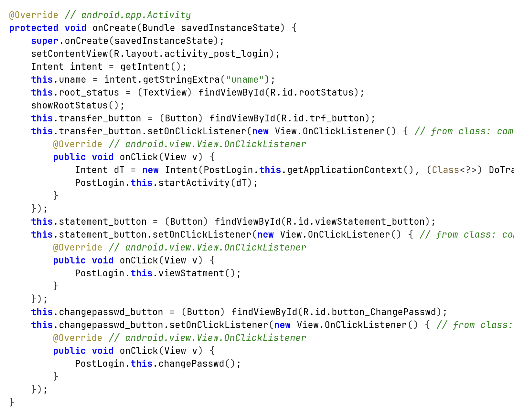

This is all fine, however, this class is exported:

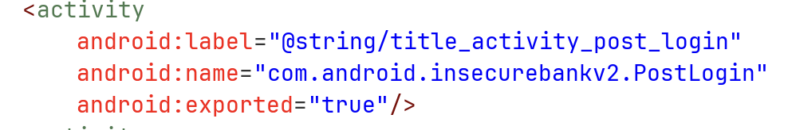

So, we can easily call it from every application, I'll show that with `adb`:

```bash
adb shell am start -n com.android.insecurebankv2/.PostLogin --es "uname" "kobi"
```

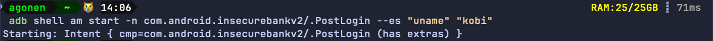

And we bypassed the login.

### Root Detection and Bypass

Now, let's explore the application, we can see it says the device is rooted:

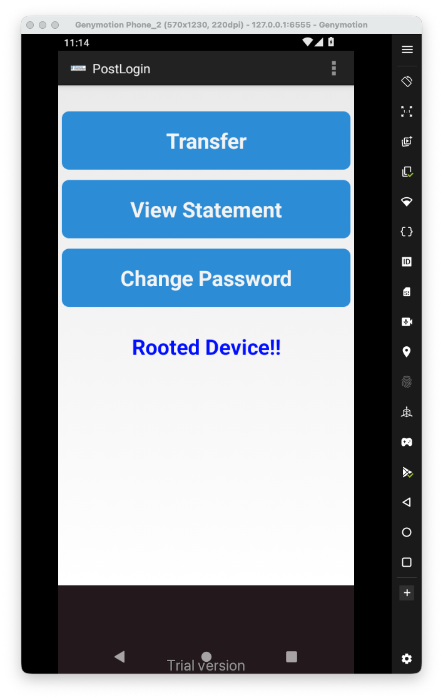

This is the function itself that shows this message:

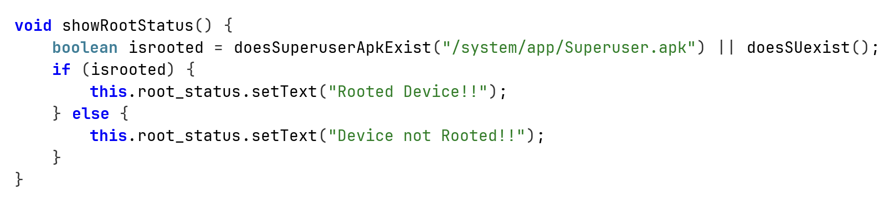

We can hook those two functions using frida. Notice I'm initiating an instance, and just then hook the functions:

```js
Java.perform(function() {
    // Bypass Root detection
    Java.scheduleOnMainThread(function() {
        var PostLogin = Java.use("com.android.insecurebankv2.PostLogin").$new();
        console.log("bypass root detection");
        bypass_root_detection();
    });


})

function bypass_root_detection(){
    var PostLogin = Java.use("com.android.insecurebankv2.PostLogin");
    PostLogin["doesSuperuserApkExist"].implementation = function (s) {
        console.log(`PostLogin.doesSuperuserApkExist is called`);
        return false;   
    };


    var PostLogin = Java.use("com.android.insecurebankv2.PostLogin");
    PostLogin["doesSUexist"].implementation = function () {
        console.log(`PostLogin.doesSUexist is called`);
        return false;
    };
}
```

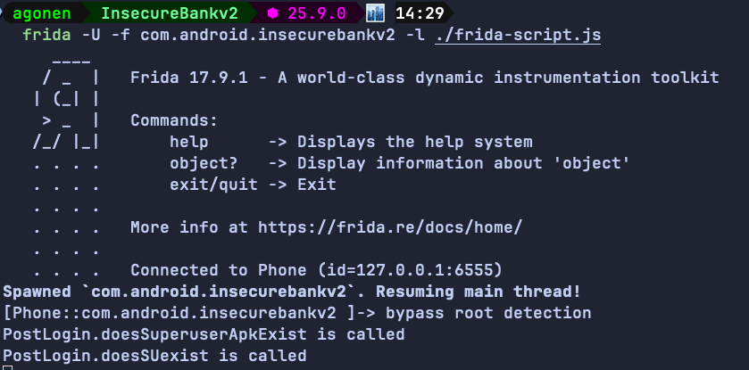

And we bypassed the anti-root:

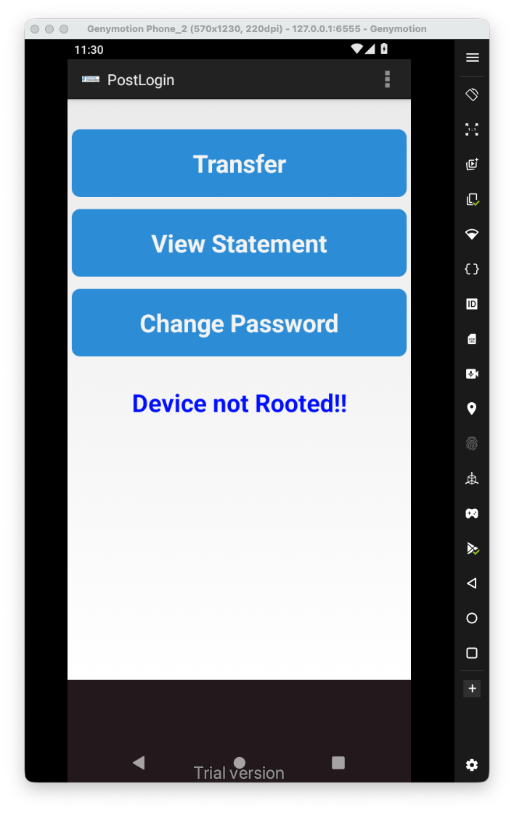

### Username Enumeration issue

when we try to login, if the user isn't exist we get the message "User Does not Exist" from the server:

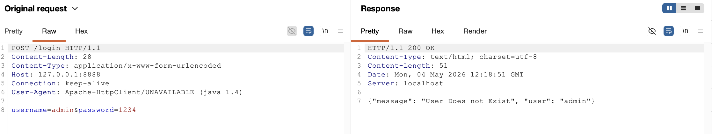

### Insecure Webview implementation

Let's login back with the debug username `devadmin`, we have the "View Statement" button, it shows are some page:

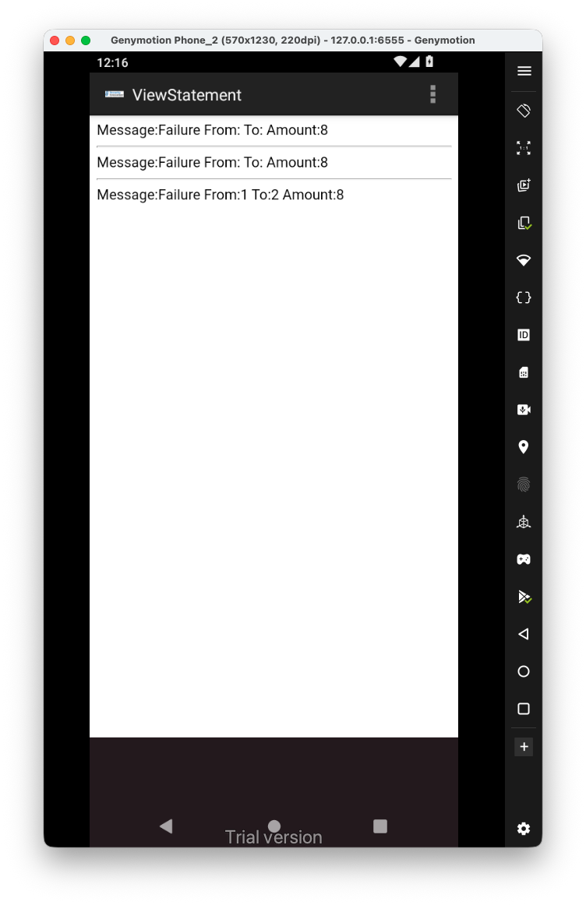
It loads the file `/sdcard/Statements_{uname}.html`, we can see it enables all the settings that allow `XSS` to exist.

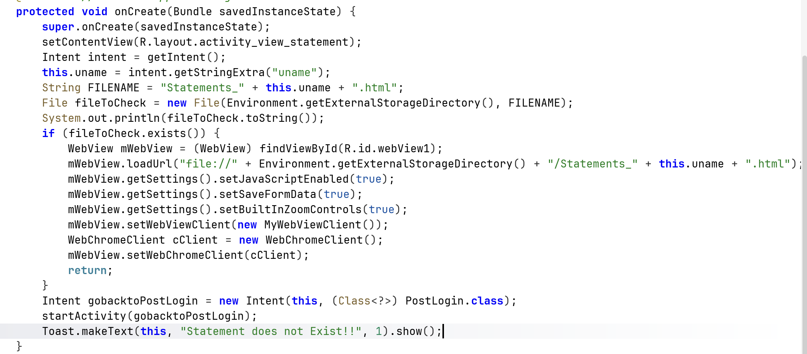

We have two ways, one to enter some payload inside the amount, for exampe `<script>alert(1337)</script>`:

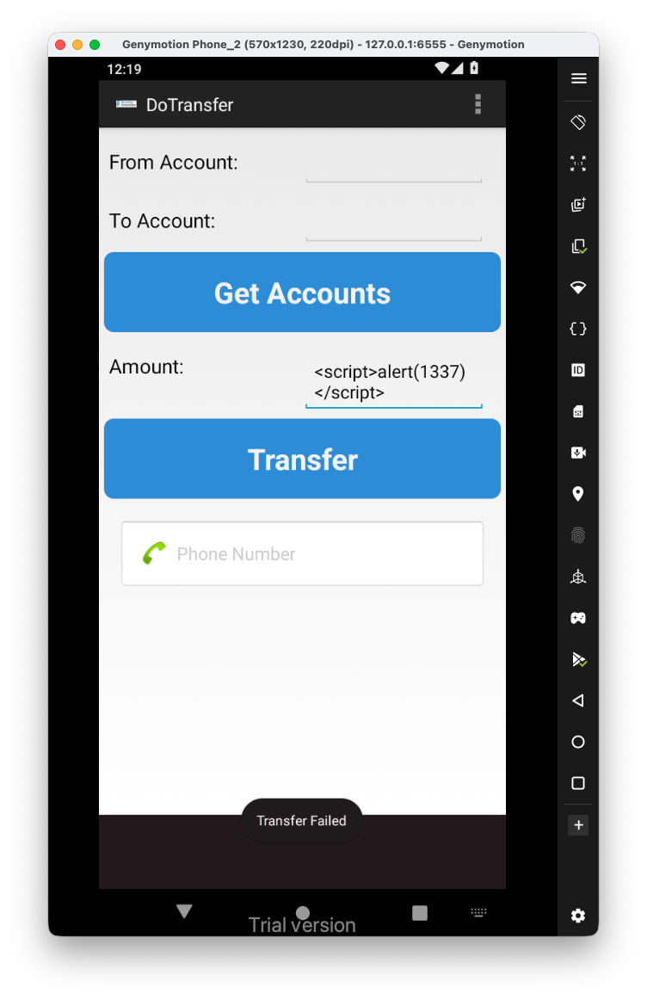
And then, when we go back to the view statements, we get the `XSS`:

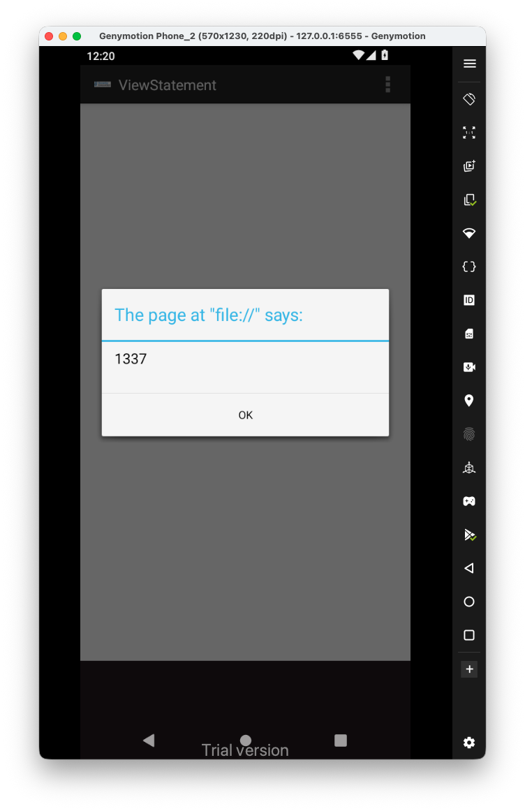
### Insecure SDCard storage

Another way will be to push the file into the `/sdcard`, because this is external storage:

```bash
adb push Statements_devadmin.html /sdcard/Statements_devadmin.html
```

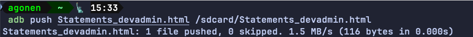

