At the last part [part2](../part2/index.md), we enumerated the app unauthentIcated, and found several issues:

- Runtime Manipulation
- Insecure Webview implementation
- Insecure SDCard storage
- Username Enumeration issue
- Root Detection and Bypass
- Vulnerable Activity Components
- Insecure Logging mechanism
- Developer Backdoors
- Application Patching
- Insecure Content Provider access

Now, we are going to use these two set of credentials, `dinesh:Dinesh@123$` and `jack:Jack@123$`.


### Android Backup vulnerability

Inside the `AndroidManifest.xml` we can see the application can be backed up, and also is debuggable:

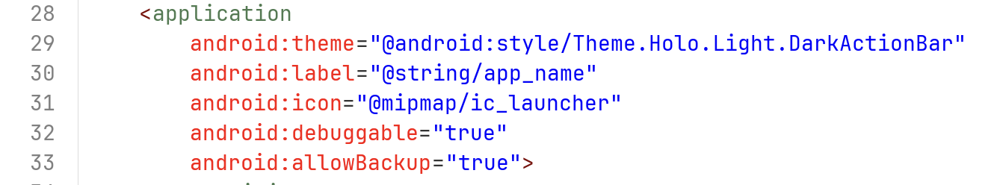

So, let's backup the application, and then extract it and get the internal storage. We can add the flag `-shared` if we want also the external storage.

```bash
adb backup -apk com.android.insecurebankv2 -f app_backup.ab
```

You need to accept the backup:

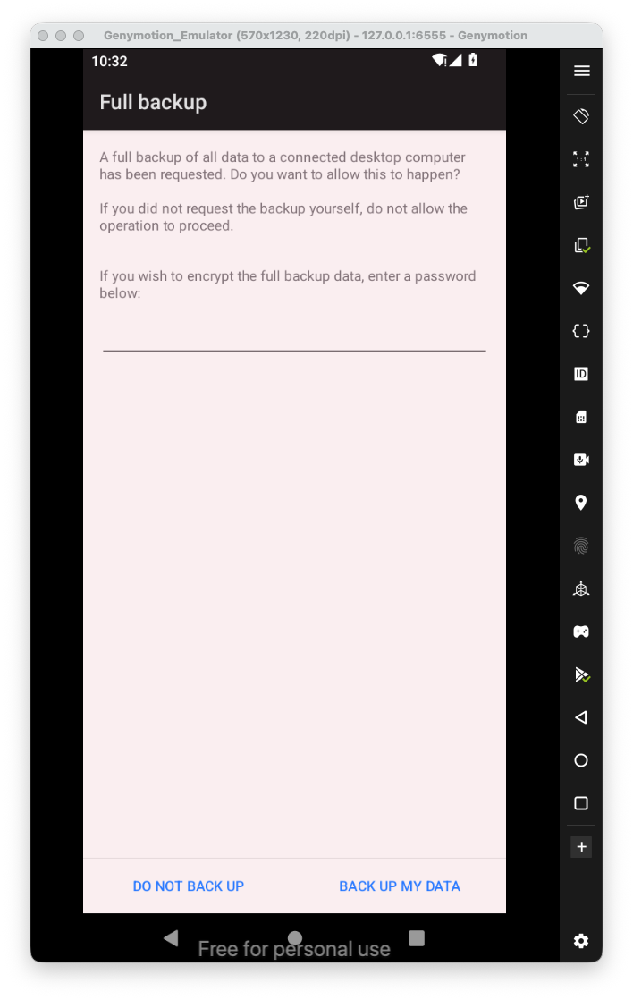
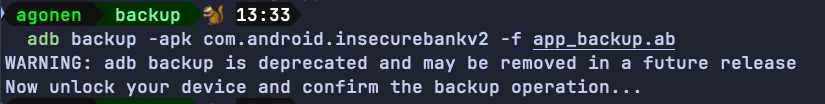

Now, we want to extract the data from the "android backup to some tar file, using jar file that is called `abe.jar`, which stands for "android backup extractor", you can download it from here [https://github.com/nelenkov/android-backup-extractor/releases/tag/latest](https://github.com/nelenkov/android-backup-extractor/releases/tag/latest).

```bash
java -jar ~/Library/Java/Extensions/abe.jar unpack app_backup.ab backup.tar
```

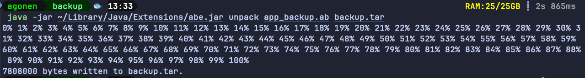

Now, all left is to extract the tar file:

```bash
tar -xvf backup.tar
```

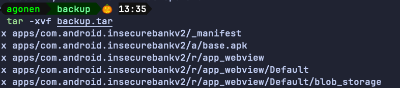

We can simply access the folder `apps`, and from there to access all internal sharedPreferences files and also database files.

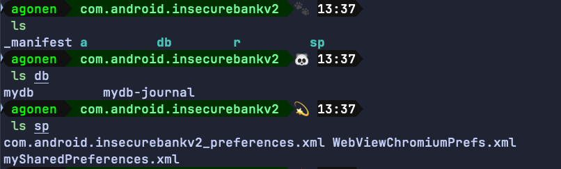

In order to find all applications that have backup enabled, that installed on your device, you can execute the next command:

```bash
adb shell dumpsys package | sed -n '/Package \[/{s/.*\[//;s/\].*//;h;}; /flags=.*ALLOW_BACKUP/{x;p;}'
```

In order tp get all applications that have debug enabled:

```bash
adb shell dumpsys package | sed -n '/Package \[/{s/.*\[//;s/\].*//;h;}; /flags=.*DEBUGGABLE/{x;p;}'
```


### Application Debuggable

Here we'll show two ways to get foothold on the debuggable app, one via `jdb` and the other via `Android Studio`.

So, first you'll recognize that the application has the flag of debuggable set to true:


Then, we want to attache a debugger to the app. 
Let's start manually, we want to attach `jdb` to the application.

We need to set the app to be debuggable:

```bash
adb shell am set-debug-app -w com.android.insecurebankv2
```

we can cancel this using the next command:

```bash
adb shell am clear-debug-app -w com.android.insecurebankv2
```

After setting the app to be debuggable, we need to open the app:

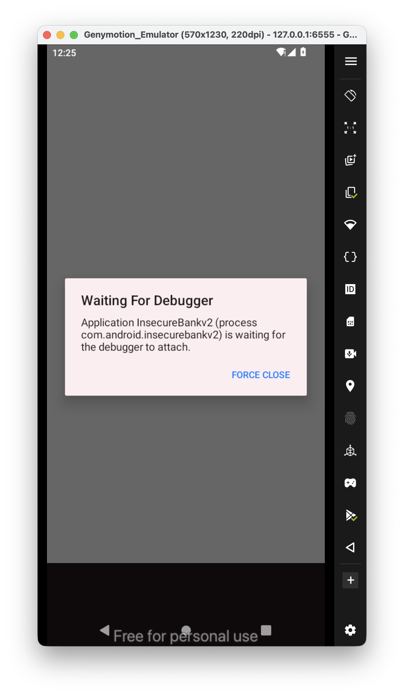
we want to find the pid, we can do it using two ways:

```bash
adb jdwp
```

Or using ps, like:

```bash
adb shell ps | grep "com.android.insecurebankv2"
```

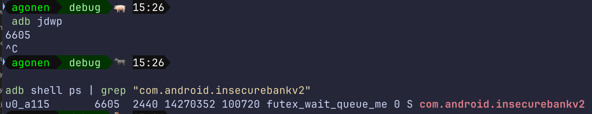

Now, we want to forward our local port `7777` to the process with the pid of `6605`.

```bash
adb forward tcp:7777 jdwp:6605
```

we can list all forwarding rules with `adb forward --list` and also delete anyone that we want, using `--remove-all` or specific one `--remove tcp:7777`.

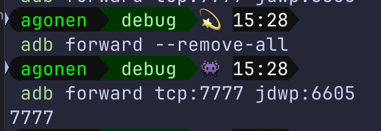

Next, we need to attach to this port, notice that you **must shut down android studio** before doing the next step.

```bash
jdb -connect com.sun.jdi.SocketAttach:hostname=localhost,port=7777
```

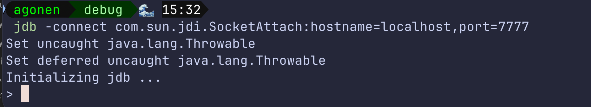

We got the debugging, very similar to gdb. Now, we can see the classes using the command `classes`.

I want to set a breakpoint, for example, here i want to set a breakpoint on the decode function, to check what is the auto filled username:

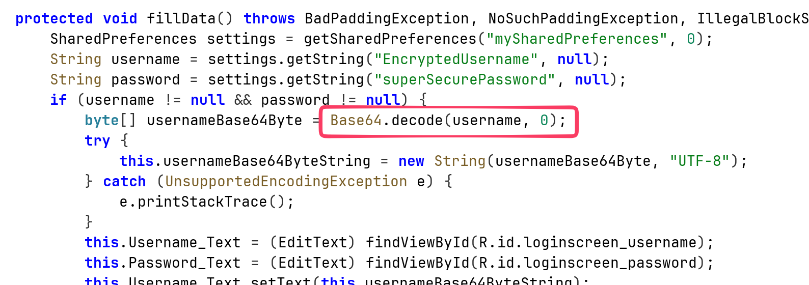

So, this is how we set the breakpoint:

```bash
stop in android.util.Base64.decode(java.lang.String, int)
```

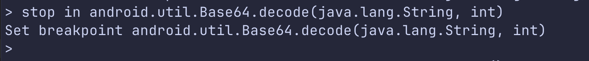

Then, I'll push the button of auto filled, and reach the breakpoint.
From there, I execute `locals` to see the local variables:

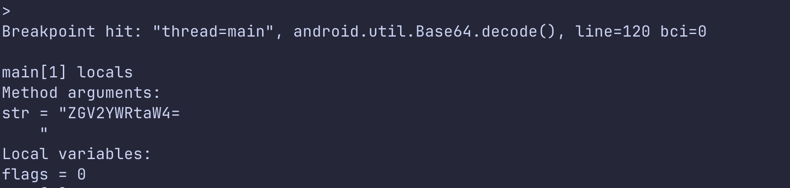

Okay, we got some string. After decoding we actually get the `devadmin`. We can continue the application by typing `cont`.

We can also modify the values:

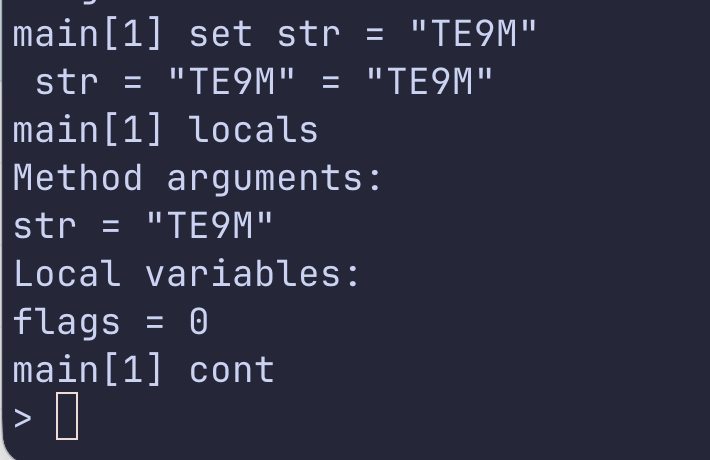

Then, on the application itself:

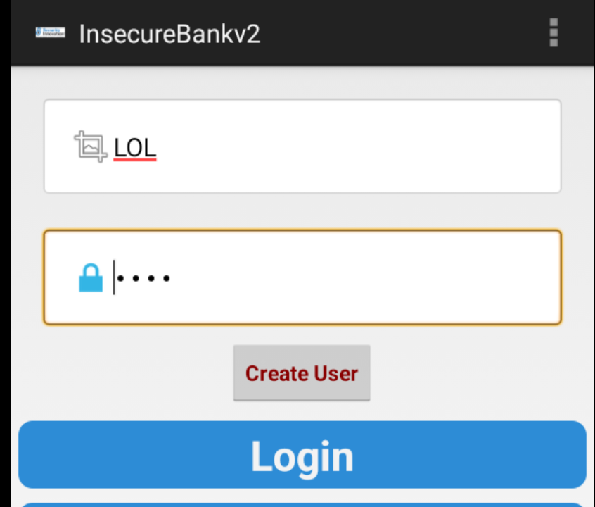

Okay. Now, using android studio.

First, we need to load the apk, you can derive it from the app, as shown here [https://avishaigonen123.github.io/CTF_writeups/android_hacking/InsecureBankv2/part1/#application-patching](https://avishaigonen123.github.io/CTF_writeups/android_hacking/InsecureBankv2/part1/#application-patching).

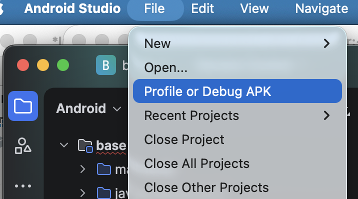

After loading the apk, we will start the application, and then search for the "Attach Debugger to Android Process":

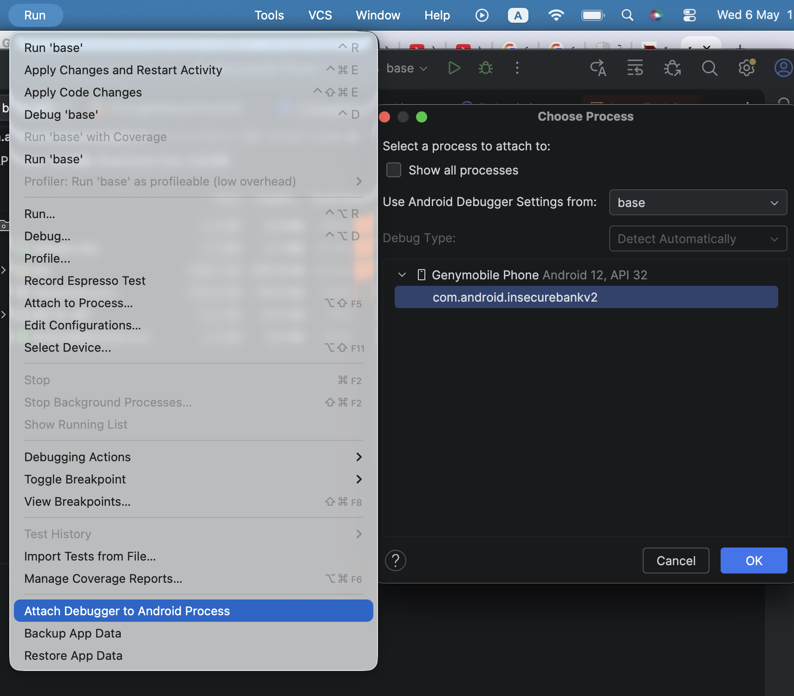
It finds the debuggable application, we simply attach to it. The tricky part is that the next step requires the source code, which we don't actually have... We can use `jadx` to get the decompiled code, but it doesn't work so perfect, since you'll never have the original source code.

Anyway, we can simply set breakpoints, and play with it like any other regular IDE debugger:

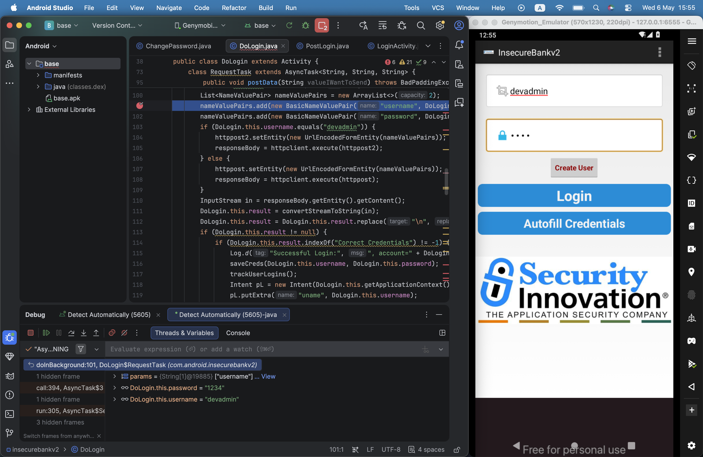


### Insecure HTTP connections

In the `DoTransfer` activity, we can see the button "Get Accounts". When pressing this button it sends request on `http`, and also transfer the credentials, on clear text:

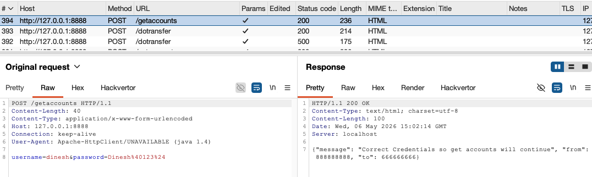

### Weak change password implementation

Changing password too is very weak. I've chosen the strong password `JD8jsd(#ksd9`, and typed this new password:

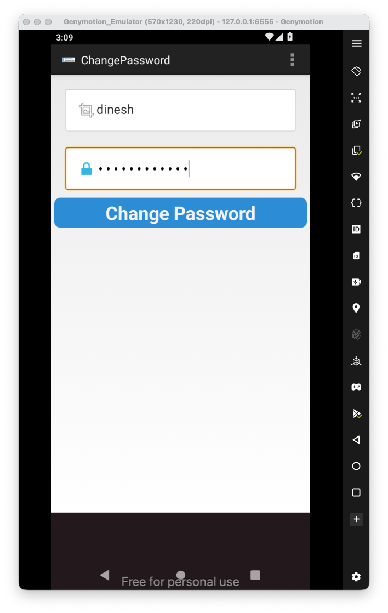

Then, I click the change password.

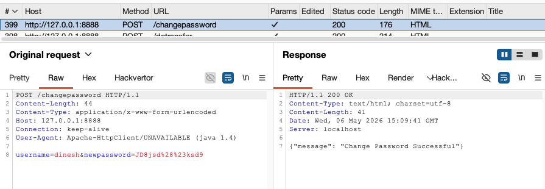

We can see there is no authentication, just simply send the request with the username and password.

### Intent Sniffing and Injection

Also, the activity is exported.

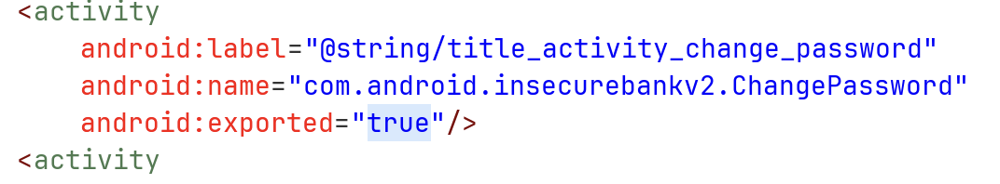

We can see it gets the new password from the intent:

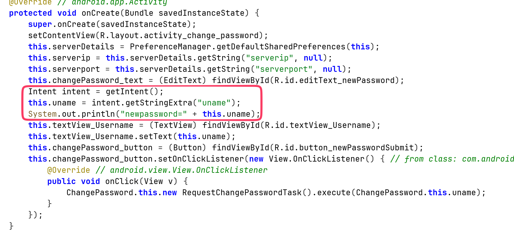

So, we can summon this activity of password reset, of every user we want:

```bash
adb shell am start -n com.android.insecurebankv2/.ChangePassword --es "uname" "'admin'"
```


Okay, that's it for now. There are more vulnerabilities like weak crypto, cache and pasteboard vulnerabilities and other.

Anyway, these are the vulnerabilities that I've showed:

- Intent Sniffing and Injection
- Insecure HTTP connections
- Application Debuggable
- Android Backup vulnerability
- Runtime Manipulation
- Insecure Webview implementation
- Insecure SDCard storage
- Username Enumeration issue
- Root Detection and Bypass
- Vulnerable Activity Components
- Insecure Logging mechanism
- Developer Backdoors
- Application Patching
- Insecure Content Provider access