---

layout: default

title: Golda Ice Cream — Broken Access Control & Credit Card Theft

---
# Golda Ice Cream — Hacking a Delivery App (and 2,600 Others)

  
**Target:** [com.golda.delivery](https://play.google.com/store/apps/details?id=com.golda.delivery)

**Vulnerabilities:** IDOR, Broken Access Control, Insecure Direct Object Reference on financial data

**Impact:** Read/write any user's address, steal any user's credit card token, place orders on their behalf — across 2,600+ apps sharing the same backend

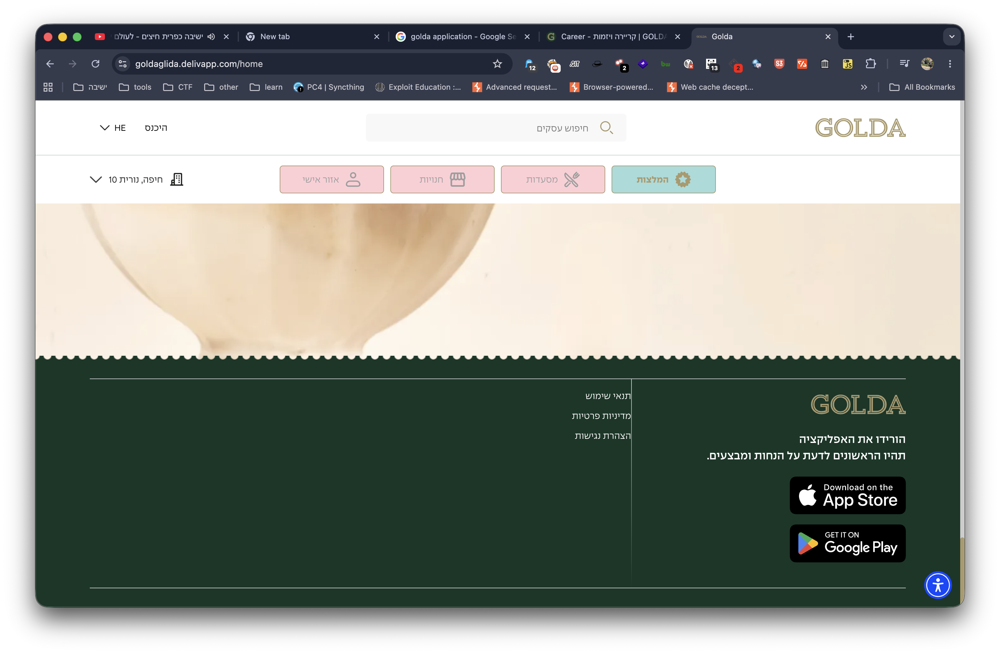
  

---

  

## Setup

  

The app is a well-known Israeli ice cream delivery service. To intercept its traffic, I configured Burp Suite as a proxy and scoped it to `delivapp.com` (including subdomains), since that's the backend the app communicates with.  

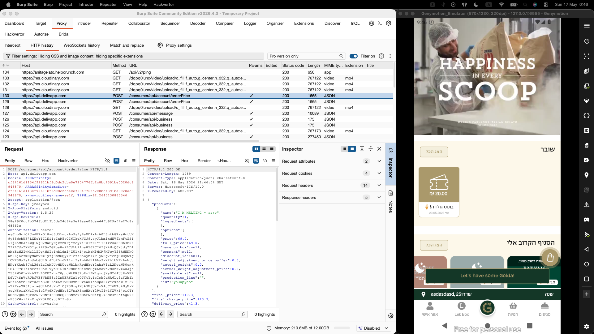

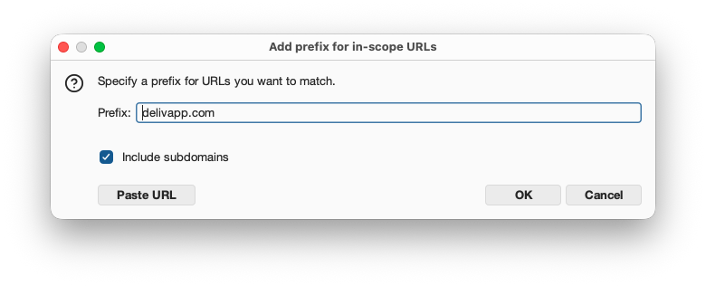

For the attack, I used two devices:

- **Attacker device:** a Genymotion emulator with Burp proxy configured
- **Victim device:** a physical rooted Android phone (SM-A145F)

Both have separate accounts registered with different phone numbers.


---

  

## Part 1: Address Hijacking (IDOR)

### Discovering the vulnerability

  
I navigated to the saved addresses section and edited one of my own addresses. The request that was sent looked like this:


```

PUT /consumer/api/account/addresses/6a02b23a66517d51e9e10f39

```

  
The address ID in the URL is a MongoDB ObjectID — a 24-character hex string that encodes a timestamp and is therefore **partially predictable**.

The server also exposes a `GET` endpoint on the same path, letting you fetch any address by ID with no ownership check.
  

### Stealing the victim's address

  
The victim created a new address on their device. I intercepted the creation response on the victim side to capture the address ID:
  

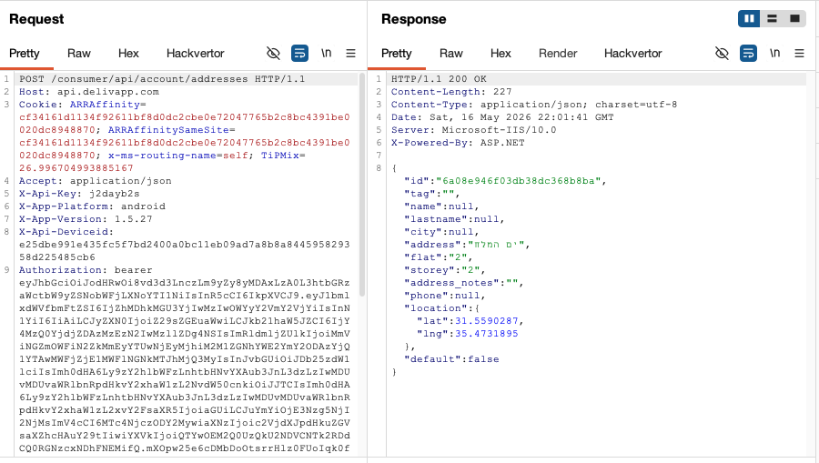

Using that ID, I sent a `GET` request **from the attacker's account** (using the attacker's JWT):
  
```

GET /consumer/api/account/addresses/6a08e946f03db38dc368b8ba

Authorization: Bearer <attacker_token>

```


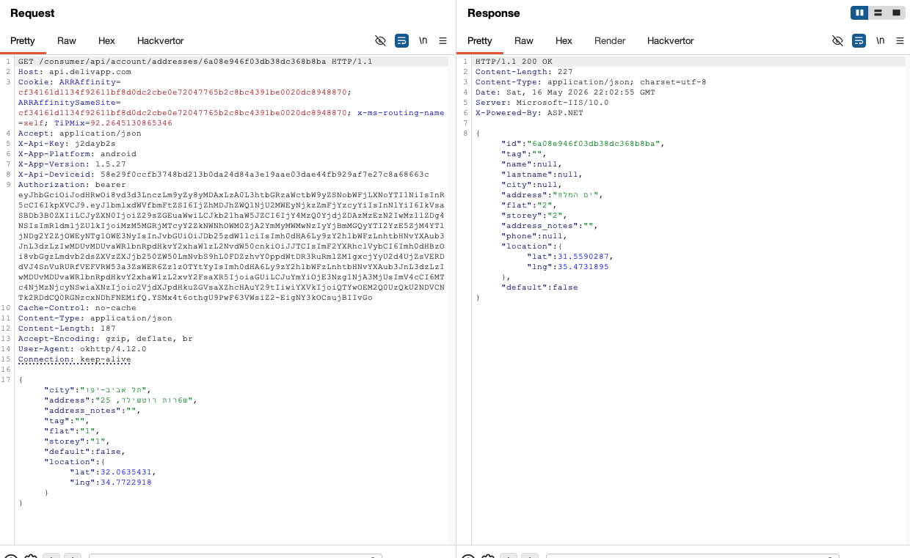

  
The server returned the victim's complete address — city, street, GPS coordinates — with no authorization error. This is a classic **Broken Access Control + IDOR** vulnerability: the server only checks that *a* valid JWT is present, not that it *belongs to the owner* of the resource.

  

### Modifying the victim's address


Going further, I sent a `PUT` to overwrite the victim's address with attacker-controlled data:
  

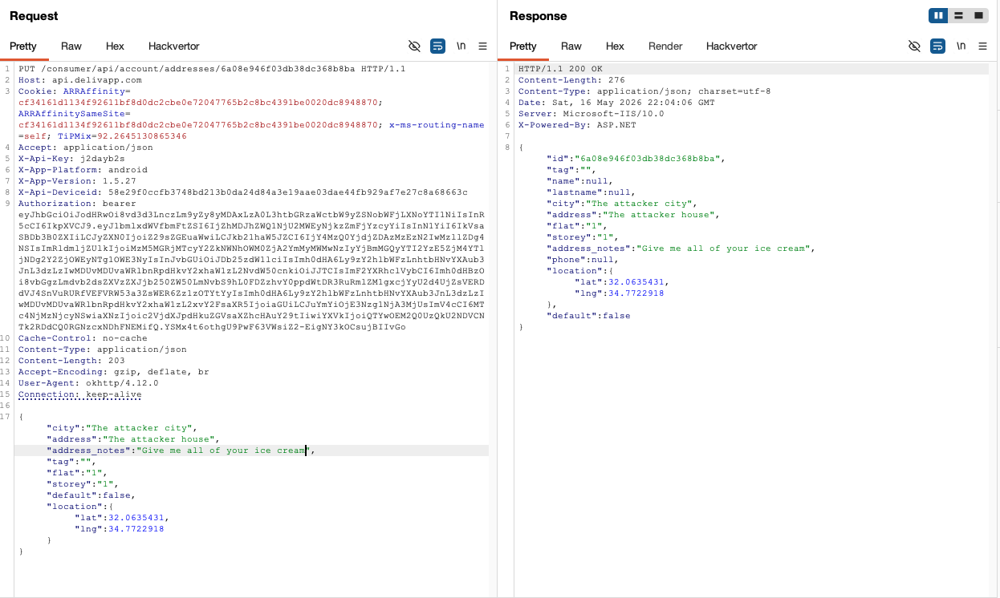

  

The `address_notes` field was set to `"Give me all of your ice cream"` — just to make the demo unambiguous. The server returned HTTP 200.
  

On the victim's device, the address was visibly changed:

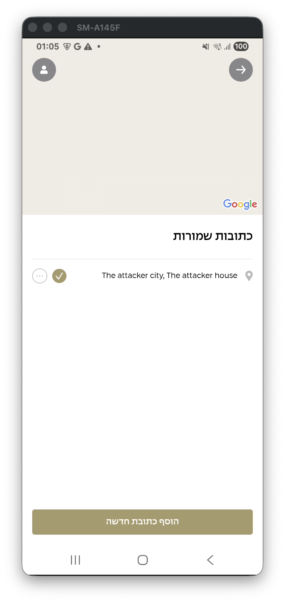

**What this enables in practice:** An attacker could silently redirect a victim's delivery to any address they control, or simply deny service by corrupting the address.

  

---

## Part 2: Credit Card Token Theft

  

This is where it gets serious.

### How the payment flow works

  

Golda uses [Tranzila](https://www.tranzila.com/) as its payment processor. The flow works as follows:

1. The app sends card details directly to `hf.tranzila.com`

2. Tranzila stores the card and returns a **token** (a surrogate identifier for the card)

3. The app sends the token to `api.delivapp.com` to associate it with the user's account

4. Future purchases use the token — the raw card number never touches DelivApp's servers

  

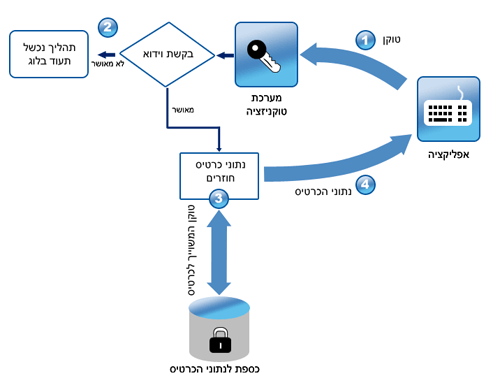

  
On the surface, this is a sound design. The problem is in how DelivApp handles the token registration step.

  

### The vulnerability: sequential transaction IDs

  
When a card is submitted to Tranzila, the response includes a `transaction_id` — a **plain sequential integer**:


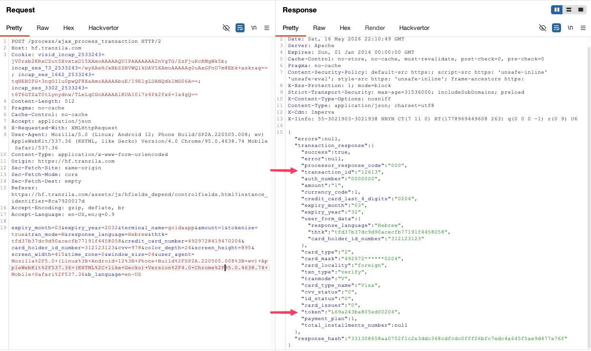


This `transaction_id` is then sent to DelivApp to add the card to the account:


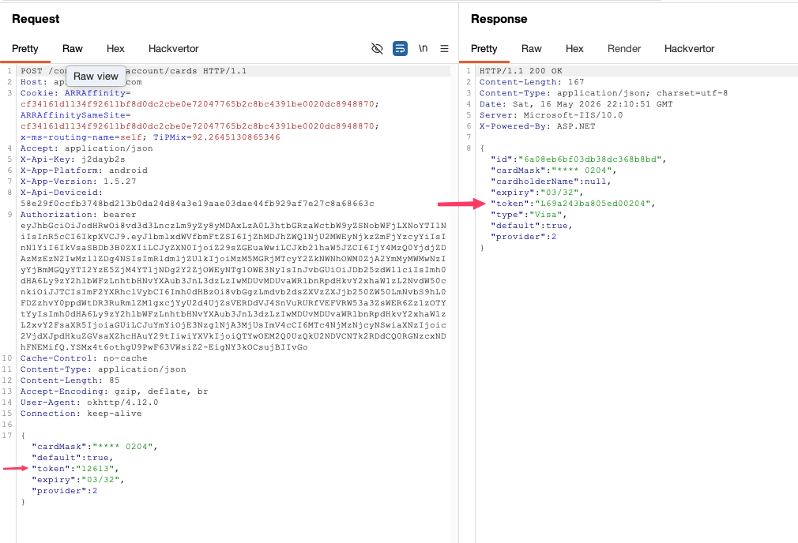

  
The server accepts the `transaction_id` and returns the associated Tranzila token. No check is made to verify that *this user's payment* generated *this transaction ID*.


This means: by sending `12610` instead of `12613`, I can retrieve the Tranzila token for a completely different user's card:


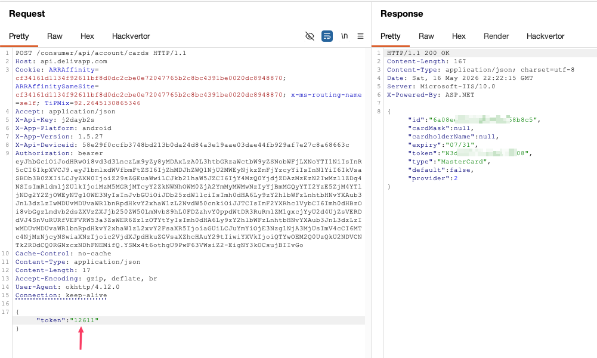

  

The attacker's account now shows both the attacker's original Visa **and** a stranger's MasterCard:


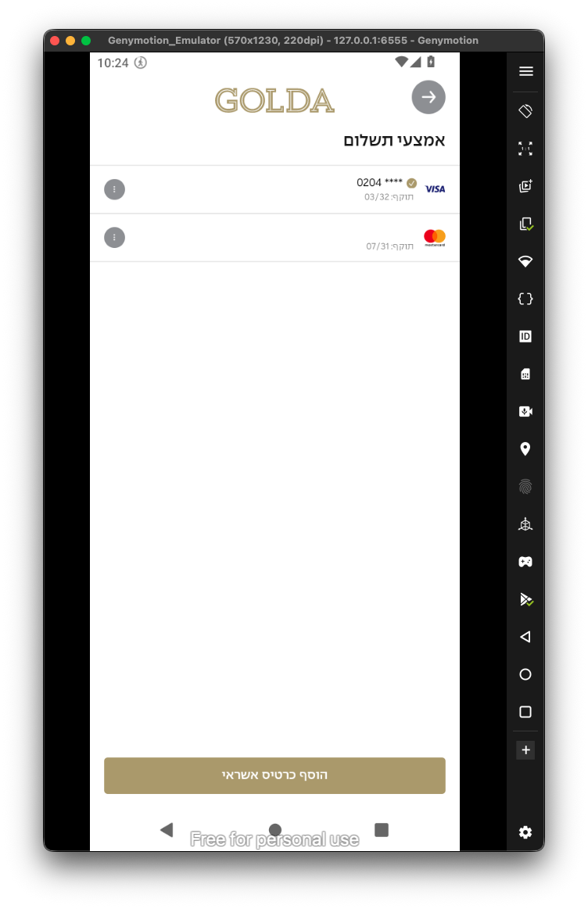


  

### Real-world exploit: stealing a victim's card and making a purchase

  
**(NOTE: I'm using here my real credit card, I'm not a thief...!)**
To prove this beyond test data, I used the second (physical) device as a real victim:

1. The victim adds their real credit card on their device → Tranzila assigns `transaction_id: 12614`

2. From the attacker's device, I POST `{"token": "12614"}` to `/consumer/api/account/cards`


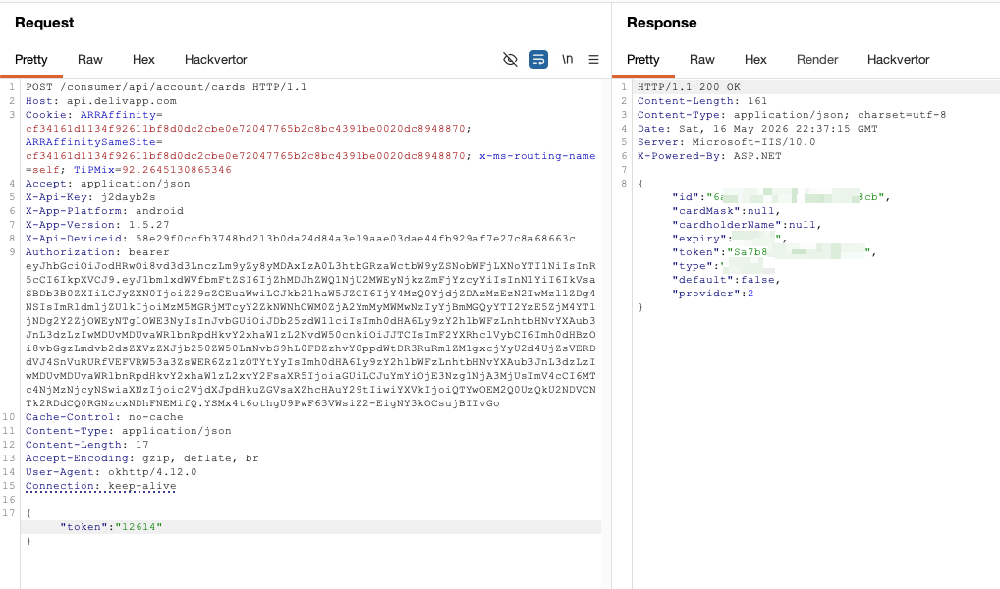


The victim's card now appears on the attacker's account:


I placed an order for 5 ice cream cones using the stolen token:

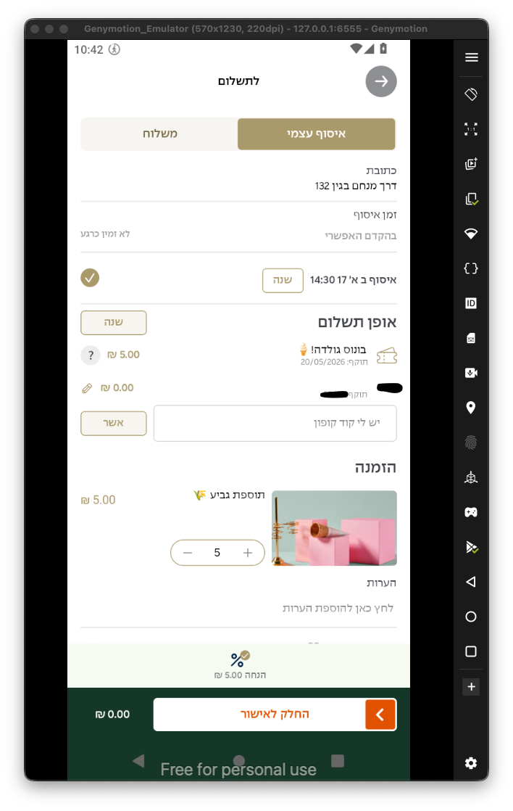

The order went through:

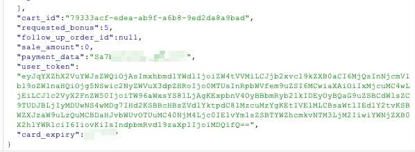


The victim was charged. The attacker received ice cream.
  

---

  

## Part 3: Order IDOR — Full PII Exposure

  
After placing an order, I noticed the order endpoint follows the same unauthenticated pattern:

```

GET /consumer/api/account/orders/<order_id>

```


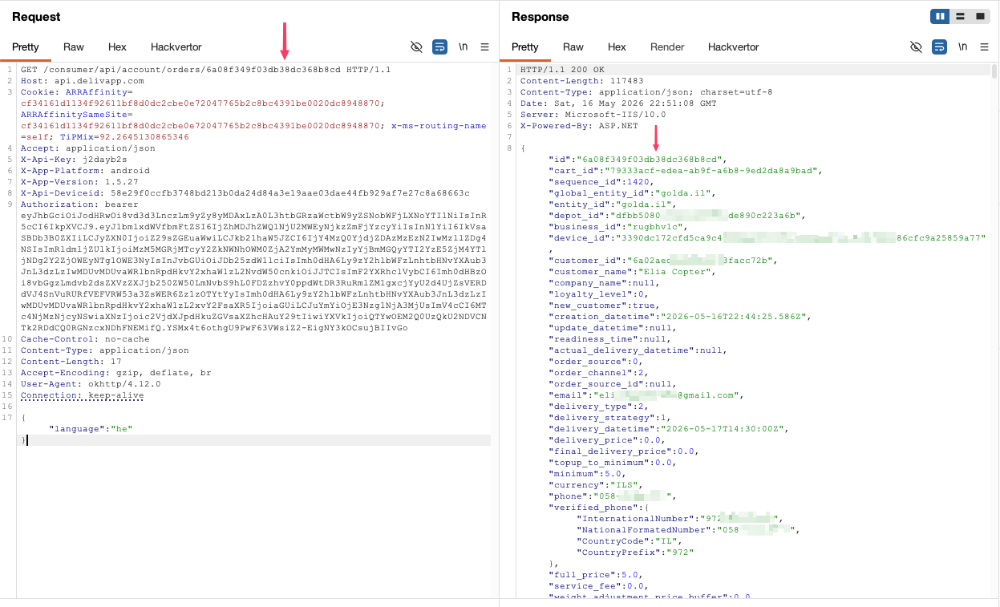


The response is a complete data dump. Beyond just the order contents, it exposes:

- **Full name** and **email address** of the customer

- **Phone number** (raw and formatted in E.164)

- **Delivery address** with GPS coordinates

- **Cart ID**, item names, quantities, and prices

- **Payment token** used for the transaction

- **Loyalty level** and account metadata

- **Business and depot IDs** (useful for further lateral movement)

  

This is a more severe exposure than the address IDOR — a single request leaks enough PII to fully identify and contact the victim. Combined with the credit card theft, an attacker could enumerate orders to harvest card tokens at scale, since the order response also contains the `payment_token` used for the purchase.

`PUT` on the same endpoint is equally unprotected, allowing modification of any in-flight order.

  

---

  
## The Bigger Picture: 2,600+ Apps Affected

  
All of the above assumes the attacker and victim are users of the same app. But here's the kicker.

Golda's backend is built by **DelivApp** (`api.delivapp.com`), a white-label delivery platform trusted by over 2,600 restaurants and delivery companies, with 10M+ orders processed:


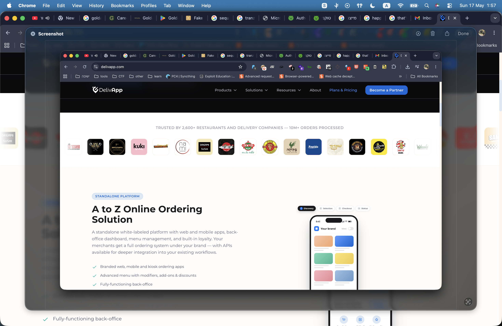

  

Every one of those 2,600+ brands runs on the **exact same codebase, API structure, and shared database**. I tested a random other DelivApp-powered app and confirmed:

  
- All endpoints are identical

- The database is shared across all apps — there is no per-tenant isolation

- **A JWT from the Golda app works against a completely different brand's user data**

  

The attack surface is not one ice cream app — it's the entire DelivApp ecosystem. Every restaurant, every sushi place, every burger chain in that logo grid is vulnerable to the same attacks against their users' addresses, credit cards, and orders.


  

---

  

## Summary

| #   | Vulnerability             | Method           | Endpoint                               | Impact                                  | Severity    |
| --- | ------------------------- | ---------------- | -------------------------------------- | --------------------------------------- | ----------- |
| 1   | IDOR — Read address       | `GET`            | `/consumer/api/account/addresses/<id>` | Read any user's home address + GPS      | 🟠 High     |
| 2   | IDOR — Modify address     | `PUT`            | `/consumer/api/account/addresses/<id>` | Silently redirect any delivery          | 🟠 High     |
| 3   | Sequential transaction ID | `POST`           | `/consumer/api/account/cards`          | Steal any user's credit card token      | 🔴 Critical |
| 4   | IDOR — Orders (PII dump)  | `GET` / `PUT`    | `/consumer/api/account/orders/<id>`    | Name, email, phone, payment token, cart | 🔴 Critical |
| 5   | Cross-app auth reuse      | All of the above | All endpoints                          | All 2,600+ DelivApp apps affected       | 🔴 Critical |

> [!danger] Root Cause
> The server **authenticates** the user (valid JWT required) but never **authorizes** them against the requested resource. Any valid token from any DelivApp-powered app is sufficient to read or write any object across the entire platform.

