The application we gonna hack now is [https://play.google.com/store/apps/details?id=com.rumble_mobile.leumit](https://play.google.com/store/apps/details?id=com.rumble_mobile.leumit):


First, we install the application on our emulator:

> I'm using this script to start the emulator:

```bash
#!/bin/bash
# Start the VM in the background
/Applications/Genymotion.app/Contents/MacOS/player.app/Contents/MacOS/player --vm-name "Genymotion_Emulator" &

echo "Waiting for device..."
adb wait-for-device

# Optional: wait until the Android OS is fully booted
until [ "$(adb shell getprop sys.boot_completed | tr -d '\r')" == "1" ]; do
  sleep 1
done

adb shell setprop persist.sys.root_access 3
adb root
echo "Root enabled!"
```

After installing the app, I tried to execute it, and got this error message:

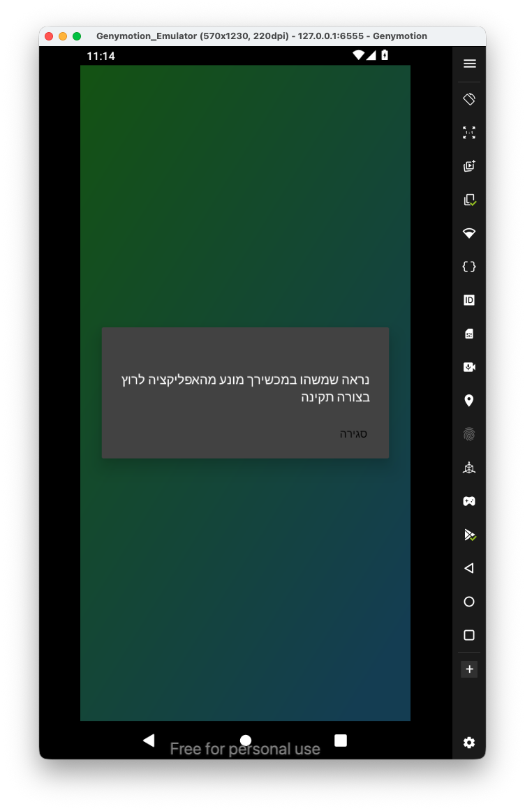
It detects I'm using unrooted device, let's open the source code using jadx and find what is blocking me.

First, we need to install the apk, In order to find the package name we'll use `friad-ps -Ua`:

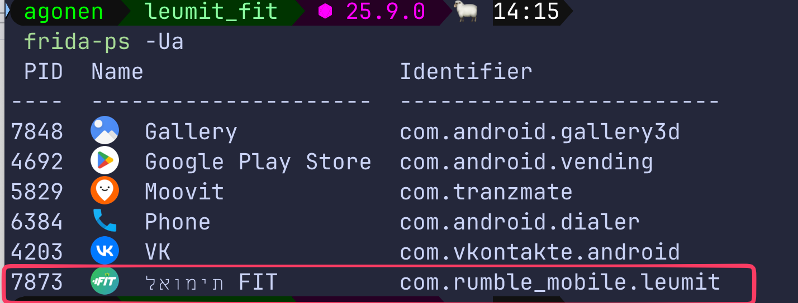

Now, we want to install all the apk files of this application:

```bash
adb shell pm path "com.rumble_mobile.leumit" | cut -d ':' -f2 | xargs -I {} adb pull {} splits/
```

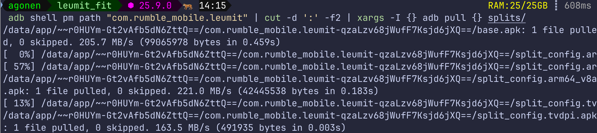

We'll open the `base.apk` with jadx:

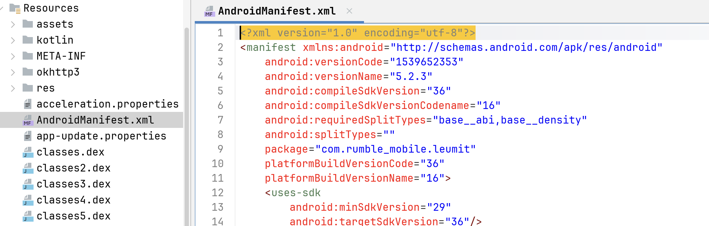

I know there is some blocking, let's search for common strings like `rooted` or `pinning`:

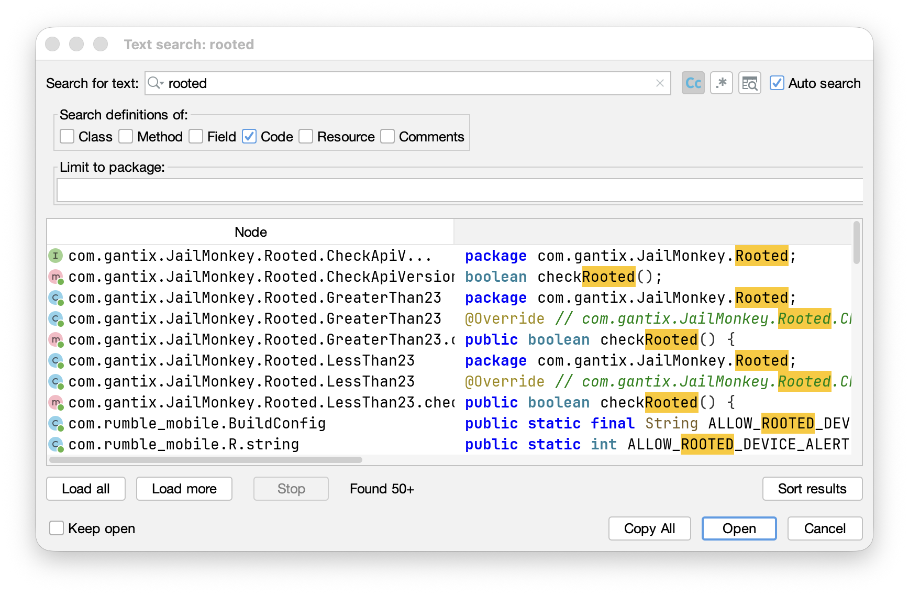

We can see there is some function `checkRooted` from the package `JailMonkey`. When googling this package name, with frida, I quickly found script to bypass this React Native library:

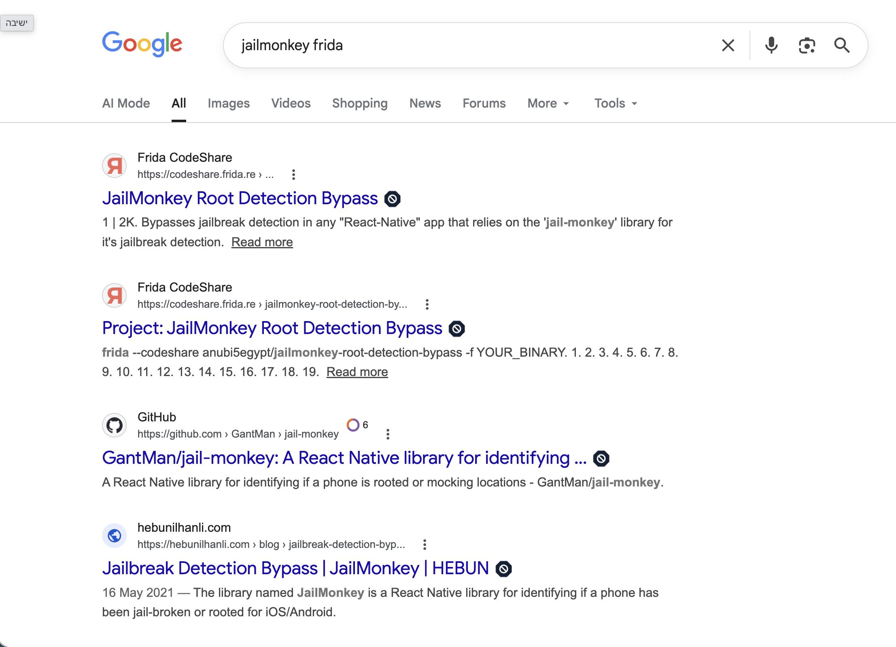

So, let's use the script from [https://codeshare.frida.re/@anubi5egypt/jailmonkey-root-detection-bypass/](https://codeshare.frida.re/@anubi5egypt/jailmonkey-root-detection-bypass/)

```bash
frida -U -f com.rumble_mobile.leumit  --codeshare tasyakurannn/bypassing-gantix-jailmonkey-and-ssl-pinning
```

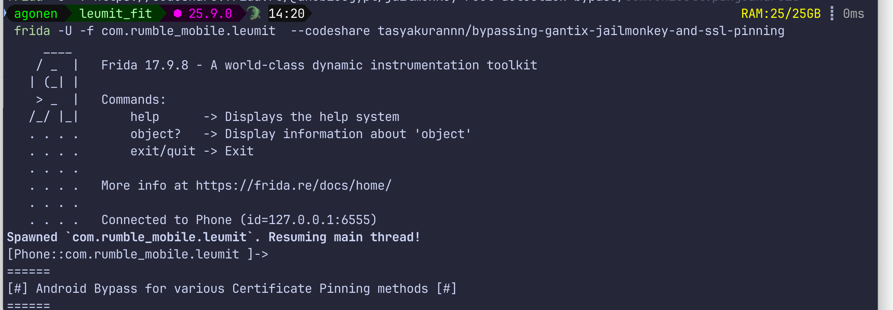

and check the app, it actually worked!


Okay, I setup the proxy on port `8082` and start the burp suite proxy:

```bash
emulator_tool --setup-proxy --proxy-port 3333 --burp-port 8082
```

We can see first requests to the hostname `api.yuvital.com`.

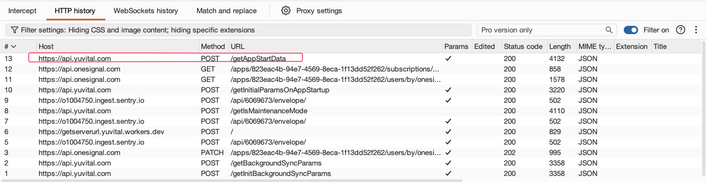

I add it to the scope window, to intercept only requests from this domain and subdomains:

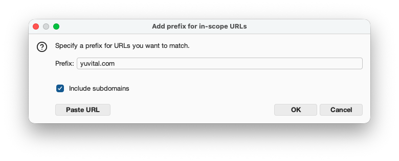
I signed in to the application, now we can start playing :)


I want to understand how the steps works, like how it updates the server with the steps I've done. For that, i need device that actually detects the steps I'm making, and send it up. I can try to mock it with the emulator, but I don't have power to do this...

Since I've already rooted my samsung a14, which I don't use anymore, and can simply play on this device. 
So, for this, I open the application on my old rooted phone, and start intercepting from there.
I'm using `scrcpy` to display the window of the device on my computer.

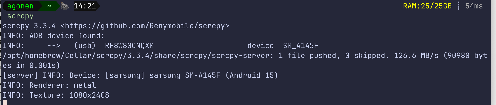


Now, I started moving my phone like a monkey, to make it think I walked, and trigger the update of steps.

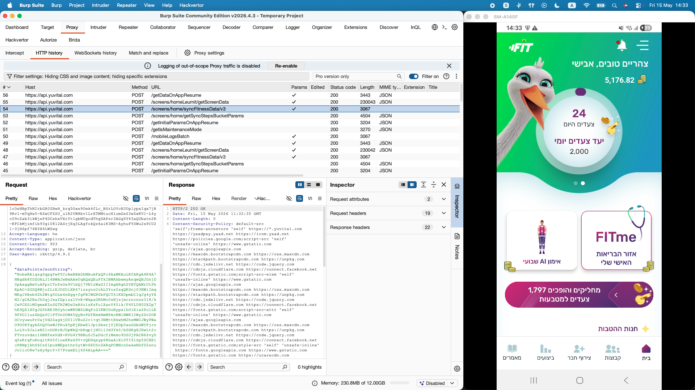

we can see that steps have been done, it sends request to `/screens/home/syncFitnessData/v3` with the payload:

```json
{
  "dataPointsJsonString": "NobwRAlgzgSgpgYwPYCcAmBBADhMAuAFxQFc4AaMKAuLKfARgA4K4A7NBgdk8YDZOALJ14BWAJwBmAAwUqAQxQEuPfkIBMAkbwmyAnqwQBJDnjD0pAxggBmYuAFprCTnPsDe9V1bQj79NIzWaGIIImgARghSYBTQAMrUtPhEpAC+ZODQ8Mjo2LiEJOSUiXR47izsynzCvAL0Yoz0sgQKSnj03NWiImqMEgJ6Bsb4ZhZWtg5OLm4eXgg+fgFBIWGR0bFQCTSlKXDpmbCIqJg4yYXN2/gCA2BsJh0qjJxafGpiza1VvE+WkpaDRhMo0sNjsjmcrncnns3l8/kCwVCESiMUgmxKZzSGTR2WOeUxRSolzKzFulXanV4Yik/F4VLUH0UX2p7hE9QZlH0gJG5hBE3B0yhcwW8OWSLWqPiGIKWIOuNypxlhOlEiaZPulLE9F4Ul1usZbQefC1PTUnDUMk5QyBvPGYKmkNmMPmcKWiNWKI2WySSv2OKOCvyuwuPrUajVd2ZagkjDUIlVBuZ2r1+qt3NMttBkwhM2hsMWCJWyPWaO9O0KfqyAZOQfOxWJPRukYpKjEbwE1JpiZbxrjYjEOp0aeGGbGWYFjrzLoLYo9JalxN2lcOORrBJDpWkQ+bRqpljNUi13d3Yk0/bZHKgXJHwLt2cFTvzovdxcl6MXFexVdX+KVG4Y9BNuSJ5aDGcYiMemo9DSUjPACN6ZvyDq5sKrqFuKnqltKS5fiueKKsG9Y+vQEHqsyp68GaAiXi0TI9lSp5SCREicPBNpjkhOZCs6IpukWEpethn5ytWv6EUSoZARqPCMNcnDakwNGfD2snuJoIicO8w7sXy9pcY+07PvxmELj6S4ALpAA==="
}
```

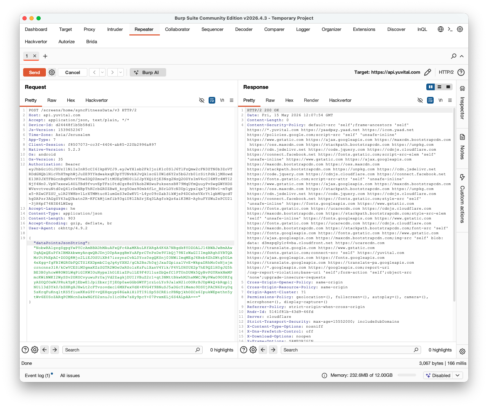
When base64 decoding this payload, we got some nonsense. Okay, this is probably some encrypted data, let's open the source code and check where it is being generated. 
For that, I'm searching for the string `dataPointsJsonString`:

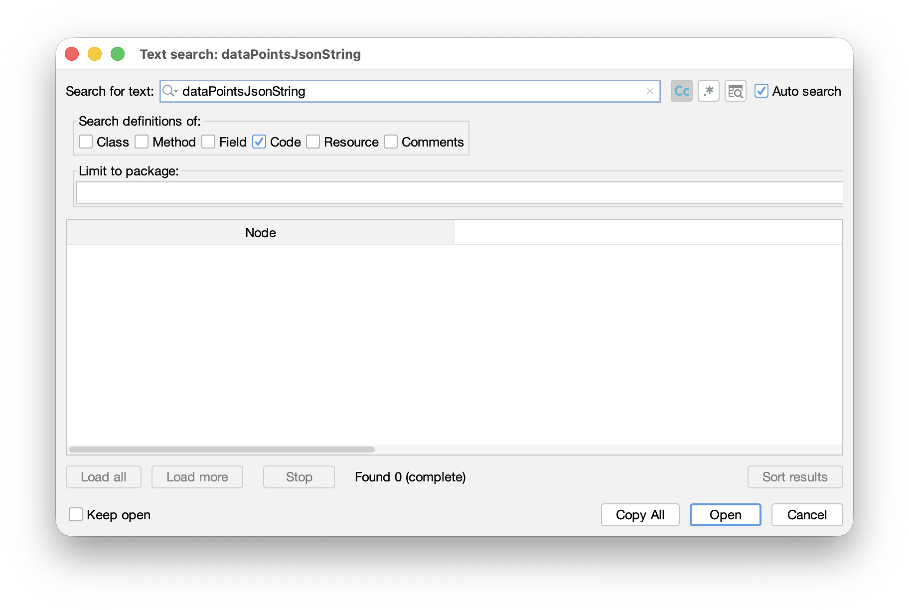
Nothing being found. The reason is because this application is React based application, it means the source code lies inside `/assets/index.android.bundle`, and this is hermes compiled data file:

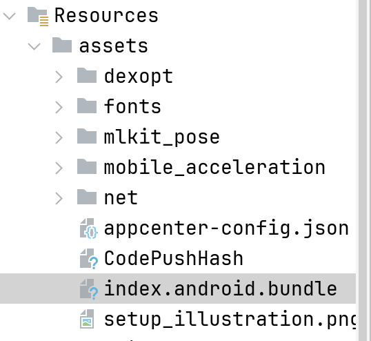

I want to decompile this file, we'll use the project [https://github.com/SymbioticSec/hermes-decomp](https://github.com/SymbioticSec/hermes-decomp).

First, let's extract the data from `base.apk` using `apktool`:

```bash
apktool d splits/base.apk -o base/ -f
```

Now, we can decompile the bundle file

```bash
hermes-decomp decompile ./index.android.bundle --output ./out.js
```

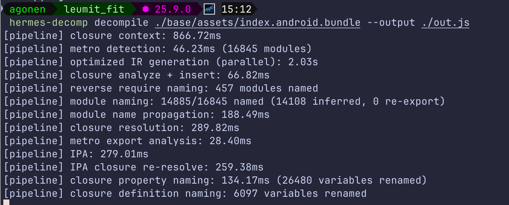

and open the file in vscode editor:

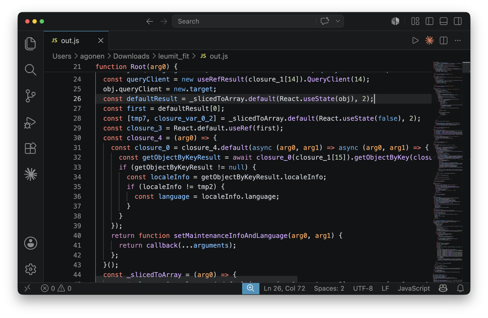

Okay, let's start looking for strings, first the string `dataPointsJsonString`:

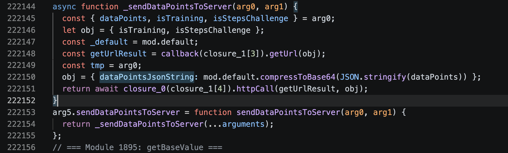

We actually can see it uses the function `compressToBase64` on the json object that contains the data points.

As we can see, this function uses the `LZ-String` compression, and then encode the string:

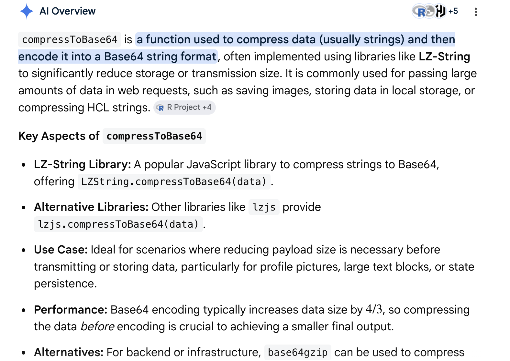

So, there is no encryption at all, let's have a look using `CyberChef`:

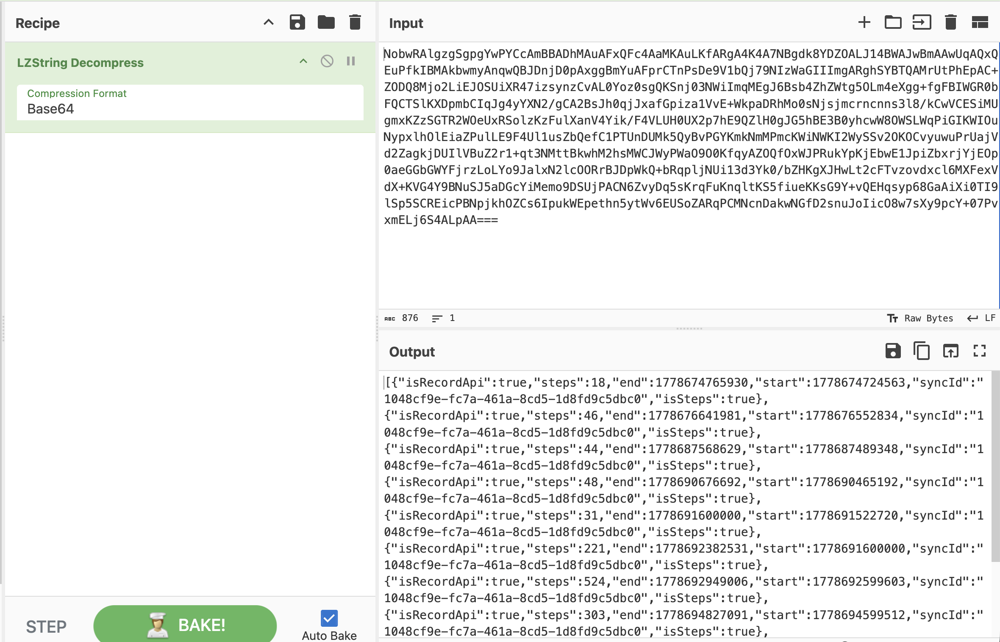

we get this json:

```json
[{"isRecordApi":true,"steps":18,"end":1778674765930,"start":1778674724563,"syncId":"1048cf9e-fc7a-461a-8cd5-1d8fd9c5dbc0","isSteps":true},{"isRecordApi":true,"steps":46,"end":1778676641981,"start":1778676552834,"syncId":"1048cf9e-fc7a-461a-8cd5-1d8fd9c5dbc0","isSteps":true},{"isRecordApi":true,"steps":44,"end":1778687568629,"start":1778687489348,"syncId":"1048cf9e-fc7a-461a-8cd5-1d8fd9c5dbc0","isSteps":true},{"isRecordApi":true,"steps":48,"end":1778690676692,"start":1778690465192,"syncId":"1048cf9e-fc7a-461a-8cd5-1d8fd9c5dbc0","isSteps":true},{"isRecordApi":true,"steps":31,"end":1778691600000,"start":1778691522720,"syncId":"1048cf9e-fc7a-461a-8cd5-1d8fd9c5dbc0","isSteps":true},{"isRecordApi":true,"steps":221,"end":1778692382531,"start":1778691600000,"syncId":"1048cf9e-fc7a-461a-8cd5-1d8fd9c5dbc0","isSteps":true},{"isRecordApi":true,"steps":524,"end":1778692949006,"start":1778692599603,"syncId":"1048cf9e-fc7a-461a-8cd5-1d8fd9c5dbc0","isSteps":true},{"isRecordApi":true,"steps":303,"end":1778694827091,"start":1778694599512,"syncId":"1048cf9e-fc7a-461a-8cd5-1d8fd9c5dbc0","isSteps":true},{"isRecordApi":true,"steps":114,"end":1778695638255,"start":1778695206075,"syncId":"1048cf9e-fc7a-461a-8cd5-1d8fd9c5dbc0","isSteps":true},{"isRecordApi":true,"steps":15,"end":1778699462742,"start":1778699401537,"syncId":"1048cf9e-fc7a-461a-8cd5-1d8fd9c5dbc0","isSteps":true},{"isRecordApi":true,"steps":24,"end":1778844716182,"start":1778844645579,"syncId":"1048cf9e-fc7a-461a-8cd5-1d8fd9c5dbc0","isSteps":true}]
```

interesting, at the last raw, we can see it reports we've done `24` steps, from one point of time to other. I wonder what happen If I'll change it to `1337` and send it back, this is the payload:

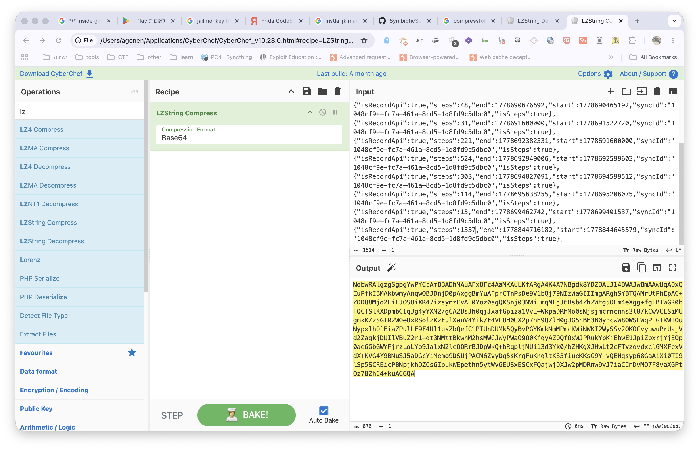

```
NobwRAlgzgSgpgYwPYCcAmBBADhMAuAFxQFc4AaMKAuLKfARgA4K4A7NBgdk8YDZOALJ14BWAJwBmAAwUqAQxQEuPfkIBMAkbwmyAnqwQBJDnjD0pAxggBmYuAFprCTnPsDe9V1bQj79NIzWaGIIImgARghSYBTQAMrUtPhEpAC+ZODQ8Mjo2LiEJOSUiXR47izsynzCvAL0Yoz0sgQKSnj03NWiImqMEgJ6Bsb4ZhZWtg5OLm4eXgg+fgFBIWGR0bFQCTSlKXDpmbCIqJg4yYXN2/gCA2BsJh0qjJxafGpiza1VvE+WkpaDRhMo0sNjsjmcrncnns3l8/kCwVCESiMUgmxKZzSGTR2WOeUxRSolzKzFulXanV4Yik/F4VLUH0UX2p7hE9QZlH0gJG5hBE3B0yhcwW8OWSLWqPiGIKWIOuNypxlhOlEiaZPulLE9F4Ul1usZbQefC1PTUnDUMk5QyBvPGYKmkNmMPmcKWiNWKI2WySSv2OKOCvyuwuPrUajVd2ZagkjDUIlVBuZ2r1+qt3NMttBkwhM2hsMWCJWyPWaO9O0KfqyAZOQfOxWJPRukYpKjEbwE1JpiZbxrjYjEOp0aeGGbGWYFjrzLoLYo9JalxN2lcOORrBJDpWkQ+bRqpljNUi13d3Yk0/bZHKgXJHwLt2cFTvzovdxcl6MXFexVdX+KVG4Y9BNuSJ5aDGcYiMemo9DSUjPACN6ZvyDq5sKrqFuKnqltKS5fiueKKsG9Y+vQEHqsyp68GaAiXi0TI9lSp5SCREicPBNpjkhOZCs6IpukWEpethn5ytWv6EUSxESCxFQajwjDXJw2pMDRnw9vJ7iaCInDvMO7F8vaXGPtOz78ZhC4+kuAC6QA
```


Boom! GG, we can now cheat it and send whatever number of steps we want, then change it to money, and buy free shakes, while being lazy sitting on the chair.


