The application we gonna hack now is [https://steps.app/](https://steps.app/), with more than 100M downloads:


My brother told me about this app, this time I don't want to cheat with the steps like in [leumit fit](../leumit%20fit/index.md).

This time, I want to get pro subscription, let's go for it.

First, install the application from [https://play.google.com/store/apps/details?id=com.stepsappgmbh.stepsapp](https://play.google.com/store/apps/details?id=com.stepsappgmbh.stepsapp).


While walking through the setup, I saw this annoying message. Okay, this will be the challenge.

First, fetch the apk from the device:

```bash
adb shell pm path "com.stepsappgmbh.stepsapp" | cut -d ':' -f2 | xargs -I {} adb pull {} splits/
```

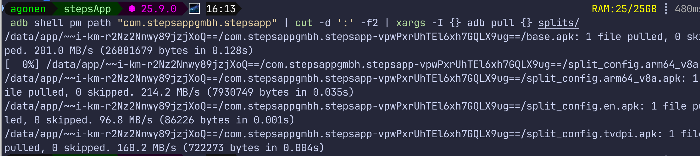

Then, I opened `base.apk` with jadx:

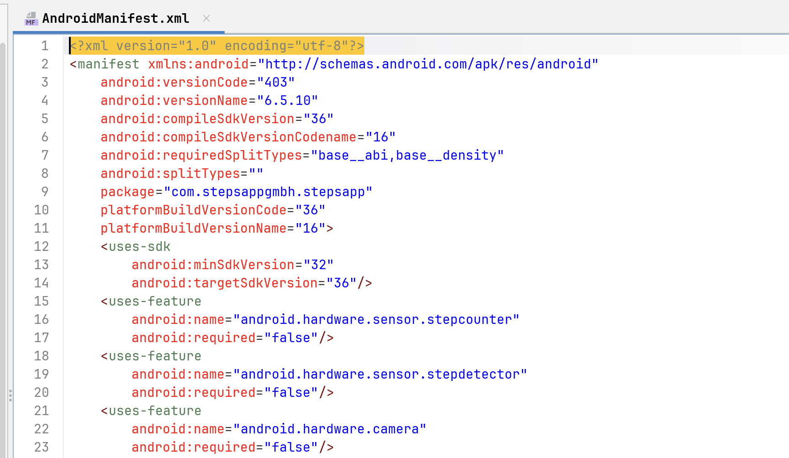

I searched for strings like `premium`, and found this application:

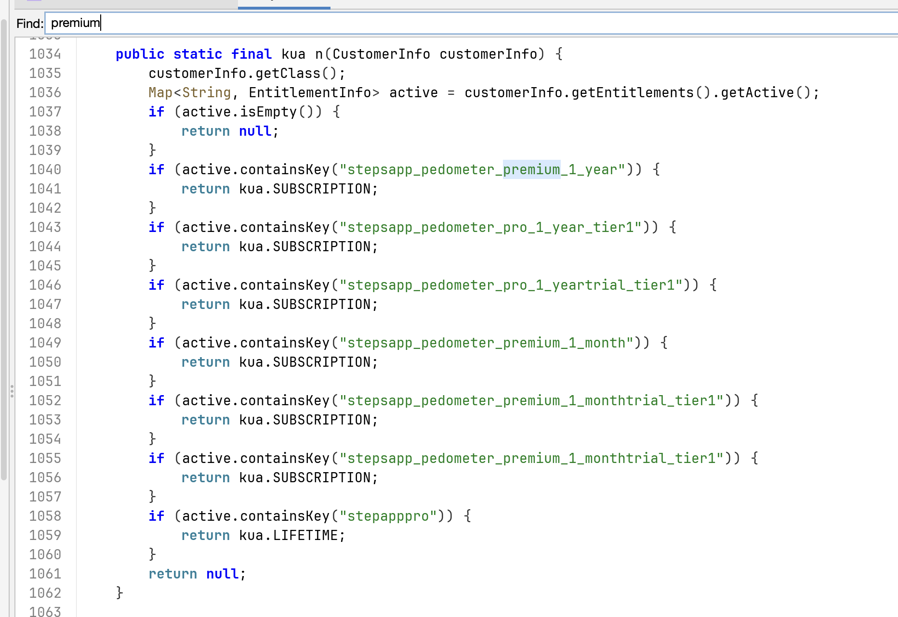

Wow, very interesting, there is some function that returns null or SUBSCRIPTION or LIFETIME, based on some value from the customerInfo.

The values are from this enum:

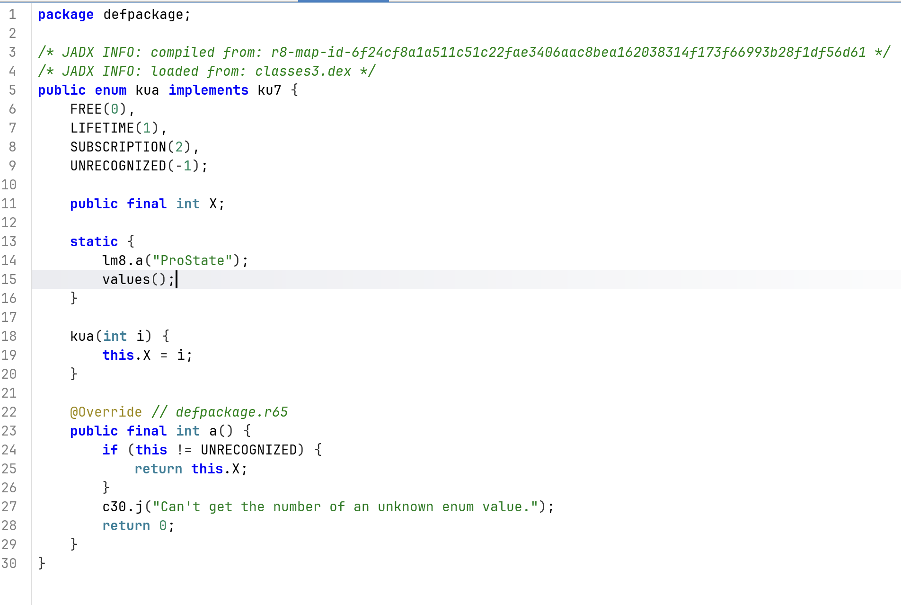

What will happen if we'll use frida to hook this function, and simply return the `LIFETIME`:

```bash
frida -U -f com.stepsappgmbh.stepsapp -l frida-script.js
```

where the script is:

```js
Java.perform(function () {
    var y0d = Java.use("y0d");
    y0d["n"].implementation = function (customerInfo) {
        console.log(`y0d.n is called: customerInfo=${customerInfo}`);
        let result = this["n"](customerInfo);
        const Kua = Java.use("kua");
        const values = Kua.values();
        for (let i = 0; i < values.length; i++) {
            console.log(values[i].toString());
        }
        console.log("Returning LIFETIME subscription");
        return values[1];
    };
});
```

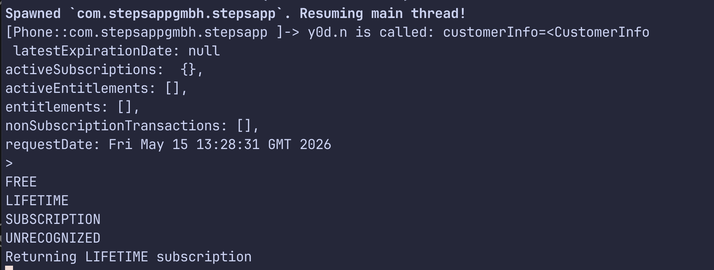

And when we check, we are actually pro!


However, I want more. I want to patch the whole apk, and create new one. For that, let's first unpack it:

```bash
apktool d splits/base.apk -o base/ -f
```

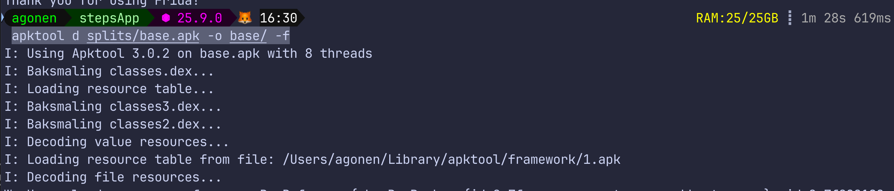

Then, we want to add the method here on the smali code:

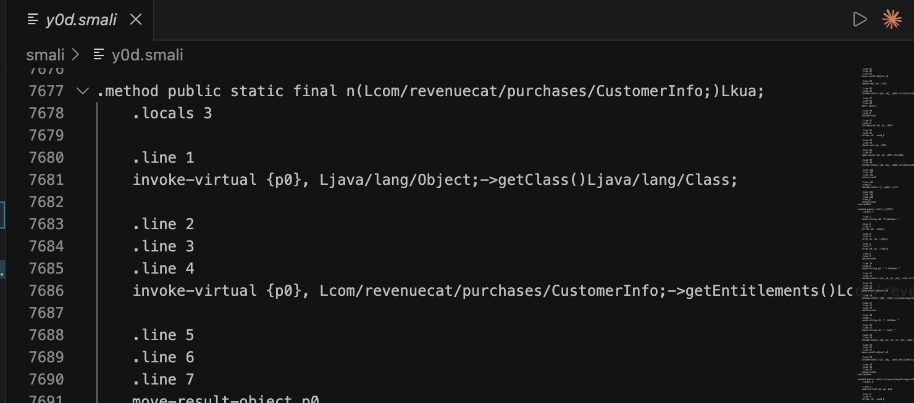

Let's go to the enum declaration, and check what is exactly the value of the `LIFETIME`:

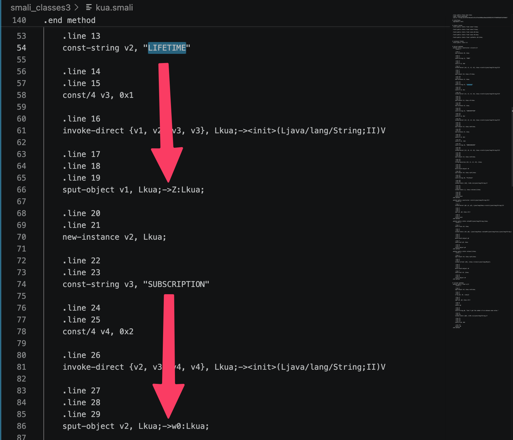

As we can see here, `LIFETIME` is inside `Lkua;->Z:Lkua;`, while `SUBSCRIPTION` is inside `Lkua;->w0:Lkua;`.

So, we want to execute these two lines, at the beginning of the function:

```
# retrieve the value LIFETIME
sget-object v1, Lkua;->Z:Lkua;

return-object v1
```

I pasted these two lines:

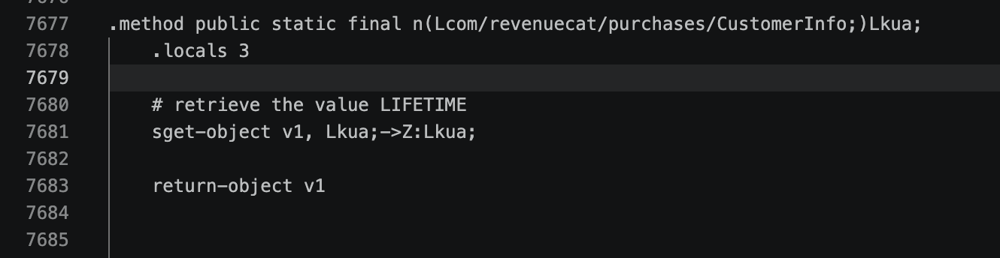

Now, we just need to use apktool to compile it back:

```bash
apktool b base/ -o splits/base.apk
```

Then, we want to sign all these files:

```bash
java -jar ~/Library/Java/Extensions/uber-apk-signer.jar -a splits/*.apk --allowResign -o merged_signed
```

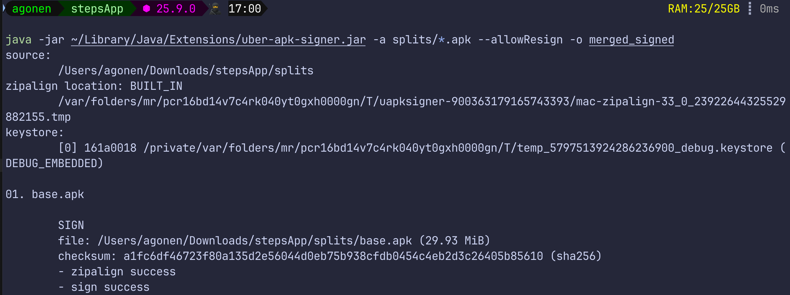

and install them back, using `adb install-multiple`:

```bash
adb install-multiple merged_signed/base-aligned-debugSigned.apk merged_signed/split_config.arm64_v8a-aligned-debugSigned.apk merged_signed/split_config.en-aligned-debugSigned.apk merged_signed/split_config.tvdpi-aligned-debugSigned.apk
```

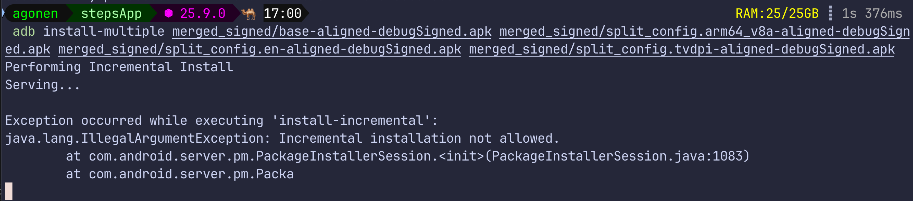

You need to **not** sending the app, that they won't know I'm cheating:

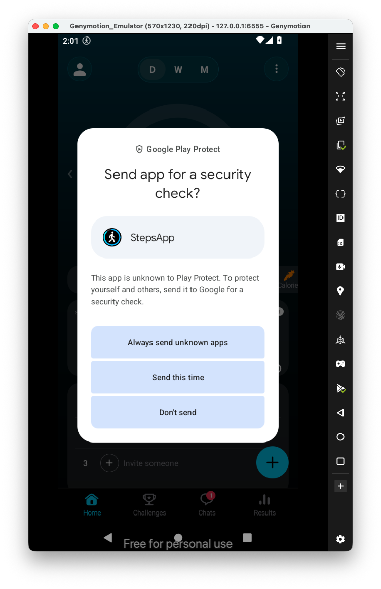

Notice it fails, because we need first to uninstall the older version:

```bash
adb uninstall com.stepsappgmbh.stepsapp
```

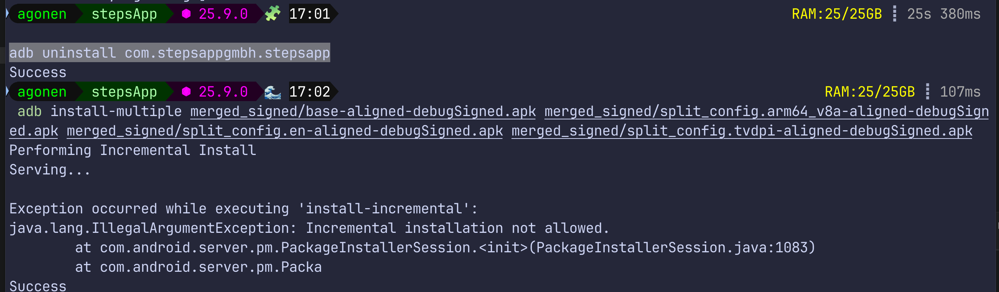

Now, we can access the app, and now we got apk we can send to my brother, that he'll have pro too :)


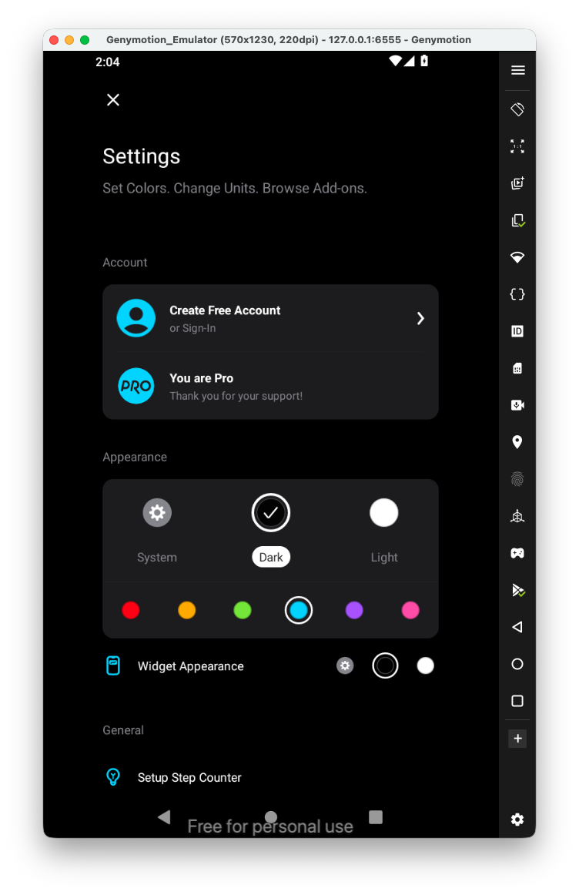

