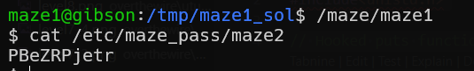

# maze level0 Solution

in this level we exploit race condition.
first it checks access to a file, and then change to higher privileges and print the content of the file. 
so, we will link it to maze0 privilege, and before it opens the file for reading, we'll change to maze1 privilege.

we can use these two script files, the one that working on links [link_script.sh](./scripts/level0/link_script.sh)

and the one that tries that runs the file, and tries reading the content [run_script.sh](./scripts/level0/run_script.sh)

then, we'll run this
```
./link_script.sh &
./run_script.sh | grep -av "maze0"
```



**Flag:** ***`kfL7RRfpkY`*** 
