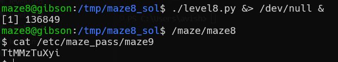

# maze level8 Solution

in this stage we need to open a socket on port 1337, and send data. then, we exploit format string attack, in `snprintf`

you can run this commands:
`./level8.py &> /dev/null &`
and then
`/maze/maze8`
the code can be found here [level8.py](./scripts/level8.py)

**Flag:** ***`TtMMzTuXyi`*** 
