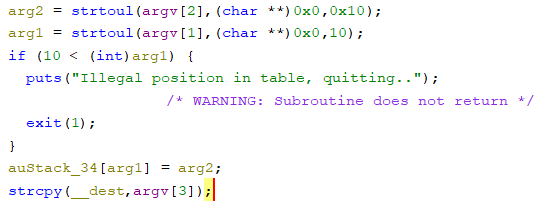
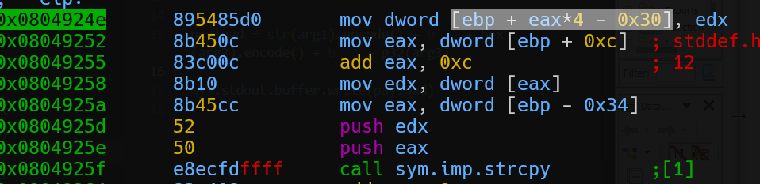
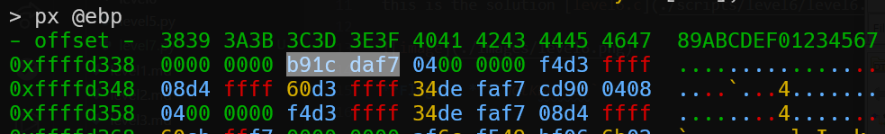
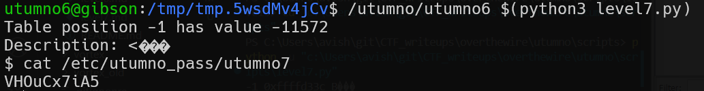

# utumno level6 Solution

first i took the code and decompiled it using ghidra.
i can see integer overflow, that we can give it negative value and go back in the memory.

the idea behind the attack is to override where the return address is found, and put our shellcode address.

we can see that the address of the `auStack_34` is located in [ebp-0x34], so if we'll set `arg1 = -1`, we can override the address. than, we need to find where on the stack the return address is found, take this memory location, and this will be the new address of our `auStack_34`

lastly, we need to insert the take the shellcode  [shellcode.py](./general/shellcode.py) and also the [get_address.c](./general/get_address.c), and insert the shellcode into the solution, which is [level6.py](./scripts/level6/level6.py).

**Flag:** ***`VHOuCx7iA5`*** 
