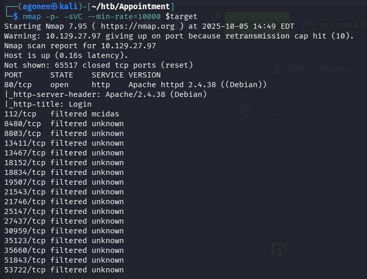

first, we'll start with the `nmap`:
```bash
nmap -p- -sVC --min-rate=10000 $target
```

As we can see, the only open port is `80`.



We can see there is an *apache* server on this port, and it serves a page that its title is `login`, so it's probably some sort of login page.
```
PORT      STATE    SERVICE VERSION
80/tcp    open     http    Apache httpd 2.4.38 ((Debian))
|_http-server-header: Apache/2.4.38 (Debian)
|_http-title: Login
```

Okay, when i try to give some dummy creds, nothing happens. Let's try to do `SQL Injection` here.

we'll give something like: `2' or '1'='1'#` as a username, and `password` as password.


And we get the flag!


**Flag:*****`e3d0796d002a446c0e622226f42e9672`***
