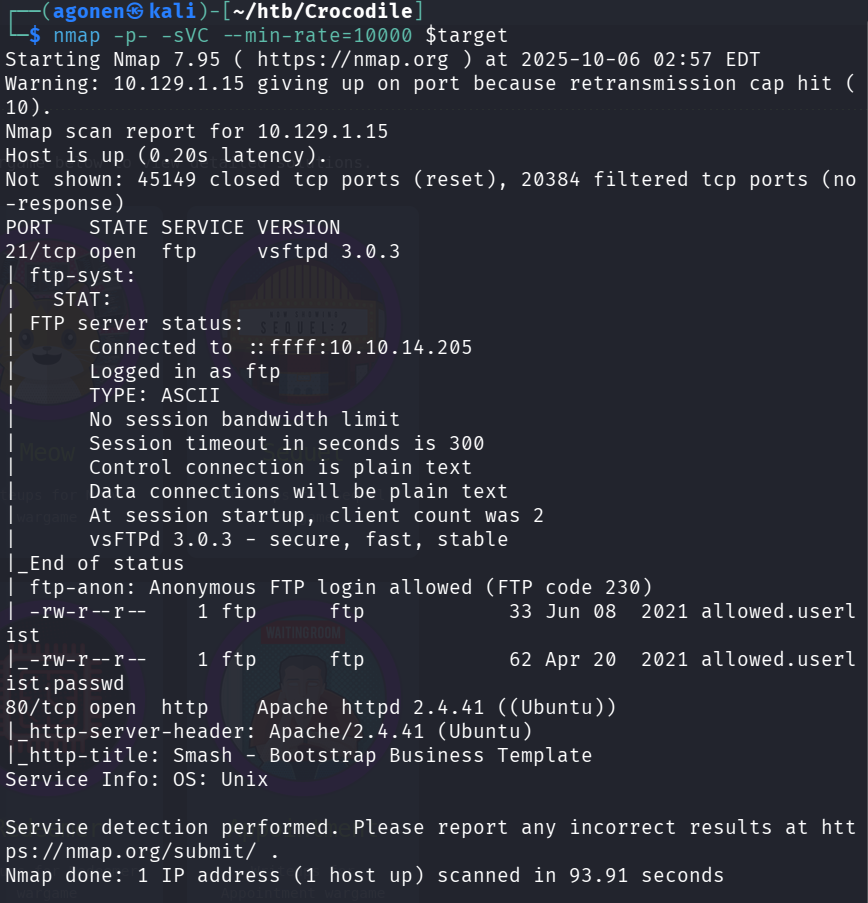
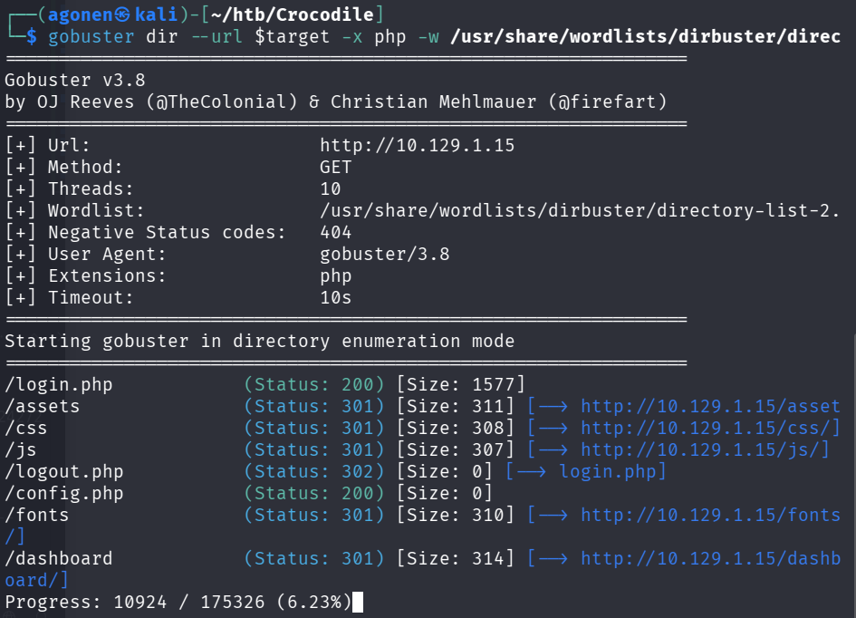
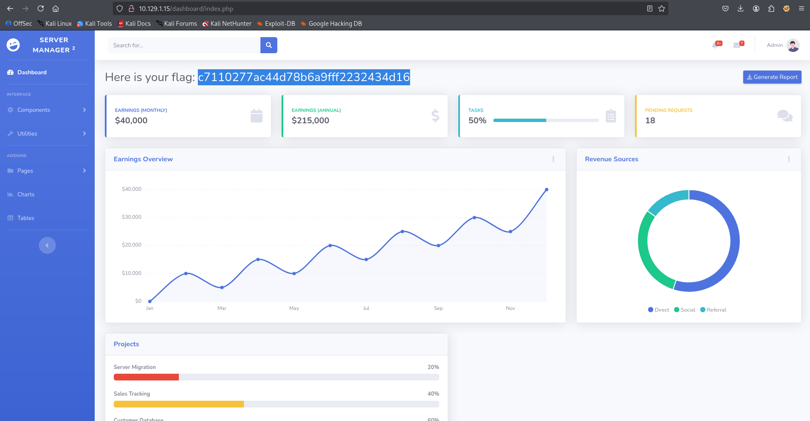

## TL;DR

We get the password from anonymous ftp login, and then login in `/login.php`, which we find using `gobuster`

### Recon

first, we do `nmap` using this command:
```bash
nmap -p- -sVC --min-rate=10000 $target
```



As we can see, there are 2 ports that are opened, port `21` for *ftp* and port `80` for *apache* server:
```
PORT   STATE SERVICE VERSION
21/tcp open  ftp     vsftpd 3.0.3
| ftp-syst: 
|   STAT: 
| FTP server status:
|      Connected to ::ffff:10.10.14.205
|      Logged in as ftp
|      TYPE: ASCII
|      No session bandwidth limit
|      Session timeout in seconds is 300
|      Control connection is plain text
|      Data connections will be plain text
|      At session startup, client count was 2
|      vsFTPd 3.0.3 - secure, fast, stable
|_End of status
| ftp-anon: Anonymous FTP login allowed (FTP code 230)
| -rw-r--r--    1 ftp      ftp            33 Jun 08  2021 allowed.userlist
|_-rw-r--r--    1 ftp      ftp            62 Apr 20  2021 allowed.userlist.passwd
80/tcp open  http    Apache httpd 2.4.41 ((Ubuntu))
|_http-server-header: Apache/2.4.41 (Ubuntu)
|_http-title: Smash - Bootstrap Business Template
Service Info: OS: Unix
```

### Login anonymously to ftp

As we can see, the scan told us that we can log to `ftp` anonymously, and that there are files there.

Let's connect using the user `anonymous`:
```bash
ftp anonymous@$target
```

And then, we'll get the files, using the command `get`:
```bash
ftp> get allowed.userlist
local: allowed.userlist remote: allowed.userlist
229 Entering Extended Passive Mode (|||41624|)
150 Opening BINARY mode data connection for allowed.userlist (33 bytes).
100% |********************************|    33      145.16 KiB/s    00:00 ETA
226 Transfer complete.
33 bytes received in 00:00 (0.15 KiB/s)
ftp> get allowed.userlist.passwd
local: allowed.userlist.passwd remote: allowed.userlist.passwd
229 Entering Extended Passive Mode (|||48638|)
150 Opening BINARY mode data connection for allowed.userlist.passwd (62 bytes).
100% |********************************|    62      220.97 KiB/s    00:00 ETA
226 Transfer complete.
62 bytes received in 00:00 (0.37 KiB/s)
```

when we open the files, we can find usernames:
```bash
aron
pwnmeow
egotisticalsw
admin
```

and also passwords:
```bash
root
Supersecretpassword1
@BaASD&9032123sADS
rKXM59ESxesUFHAd
```

okay, now let's use `gobuster` to find files in the website that is behind port `80`, the *apache* server. we use the `-x` to specify which filetypes we are looking for, in this case `php`, because we might find some login pages.
```bash
gobuster dir --url $target -x php -w /usr/share/wordlists/dirbuster/directory-list-2.3-small.txt
```



The `gobuster` shows us there is `/login.php` file, let's try the credentials we achieved to login to the page. 

Let's connect using the `admin` credentials, the password is `rKXM59ESxesUFHAd`.



**Flag:*****`c7110277ac44d78b6a9fff2232434d16`***
