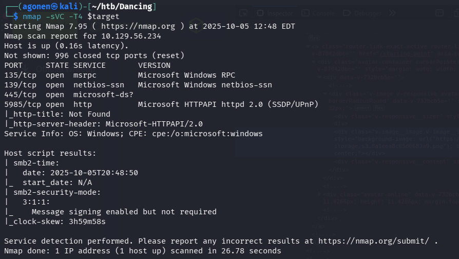
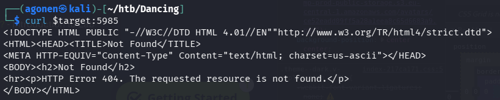
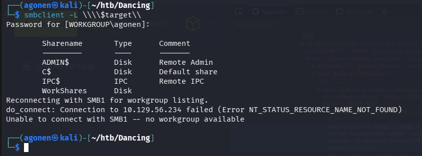
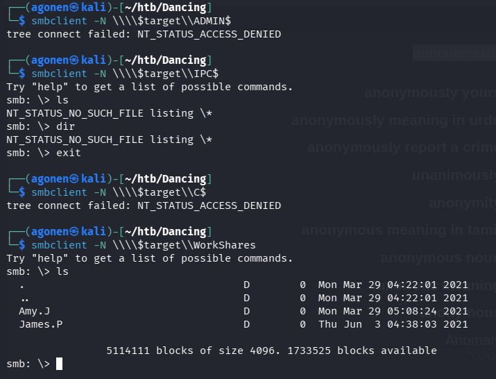
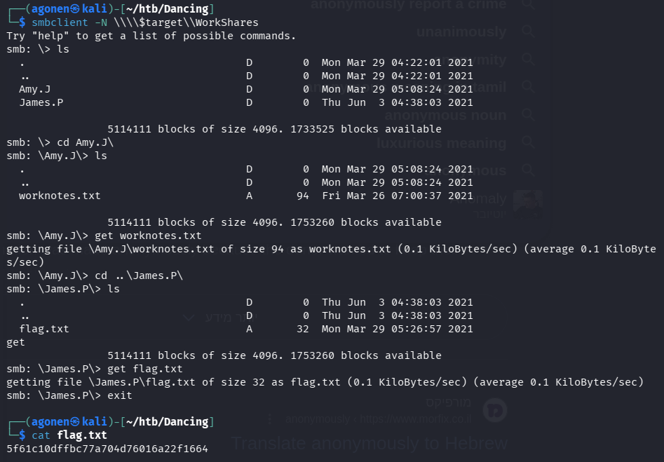

We start with the `nmap`
```bash
nmap -sVC -T4 $target
```



As we can see, it find 4 open ports:
```
135/tcp  open  msrpc         Microsoft Windows RPC
139/tcp  open  netbios-ssn   Microsoft Windows netbios-ssn
445/tcp  open  microsoft-ds?
5985/tcp open  http          Microsoft HTTPAPI httpd 2.0 (SSDP/UPnP)
|_http-title: Not Found
|_http-server-header: Microsoft-HTTPAPI/2.0
Service Info: OS: Windows; CPE: cpe:/o:microsoft:windows
```

the interesting port is `445`, which shows us there is an `SMB` service behind the scences.

Notice there is also an `http` server on port `5985`, I tried to `curl` to see if there is something interesting, and i got `404 Not Found`




When trying to connect with `smbclient`, with wrong creds, it still let us see all the shared folders, using the `-L` flag.



These are the folders we find:
```
        Sharename       Type      Comment
        ---------       ----      -------
        ADMIN$          Disk      Remote Admin
        C$              Disk      Default share
        IPC$            IPC       Remote IPC
        WorkShares      Disk     
```

Let's try to connect to those folders anonymously, using the `-N` flag.

```bash
smbclient -N \\\\$target\\WorkShares
```



as we can see, `ADMIN$` and `C$` didn't work, and `IPC$` doesn't show anything interesting.

However, when connect to `WorkShares`, we can see the folders. 
Let's `cd` to the folders, and retrieve the files using `get`.

And we can find the flag inside `James.P` folder



**Flag:*****`5f61c10dffbc77a704d76016a22f1664`***
