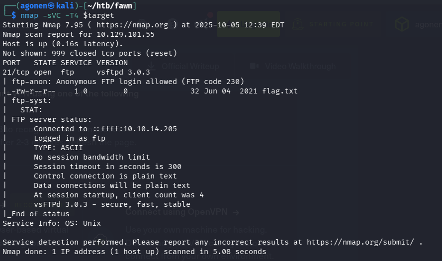
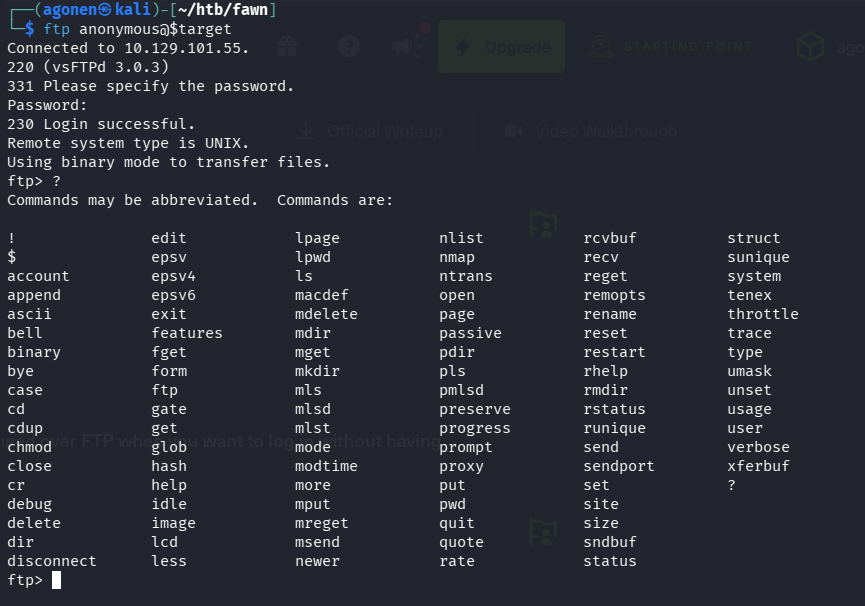
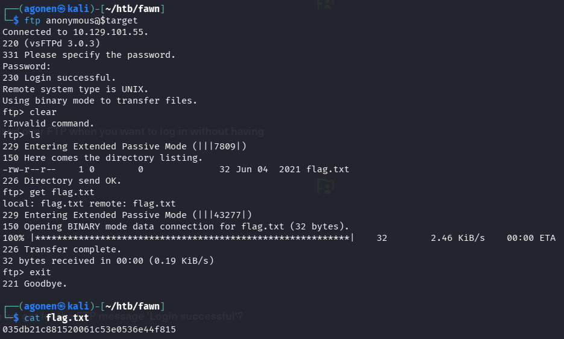

First, we execute `nmap` to gather info:
```bash
nmap -sVC -T4 $target
```



As we can see, port 21 is opened, and has `ftp` service that is runing there:
```
21/tcp open  ftp     vsftpd 3.0.3
| ftp-anon: Anonymous FTP login allowed (FTP code 230)
|_-rw-r--r--    1 0        0              32 Jun 04  2021 flag.txt
| ftp-syst: 
|   STAT: 
| FTP server status:
|      Connected to ::ffff:10.10.14.205
|      Logged in as ftp
|      TYPE: ASCII
|      No session bandwidth limit
|      Session timeout in seconds is 300
|      Control connection is plain text
|      Data connections will be plain text
|      At session startup, client count was 4
|      vsFTPd 3.0.3 - secure, fast, stable
|_End of status
Service Info: OS: Unix
```

We want to try to login anonymously using `anonymous`, and maybe we won't need to supply any password.
```bash
ftp anonymous@$target
```



As we can see, it worked.

So, now we'll run `ls` to view which files it has, as we can see it has the `flag.txt`, so let's take it to our local machine using 
```bash
get flag.txt
```



**Flag:*****`035db21c881520061c53e0536e44f815`***
