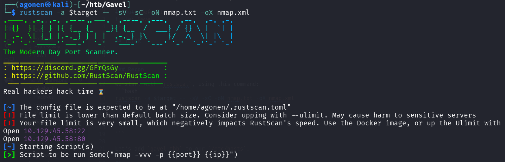

## TL;DR


### Recon

we start with `rustscat`, using this command:
```bash
rustscan -a $target -- -sV -sC -oN nmap.txt -oX nmap.xml
```



we can see port `22` with ssh and port `80` with apache http server.

```bash
PORT   STATE SERVICE REASON         VERSION
22/tcp open  ssh     syn-ack ttl 63 OpenSSH 8.9p1 Ubuntu 3ubuntu0.13 (Ubuntu Linux; protocol 2.0)
| ssh-hostkey: 
|   256 1f:de:9d:84:bf:a1:64:be:1f:36:4f:ac:3c:52:15:92 (ECDSA)
| ecdsa-sha2-nistp256 AAAAE2VjZHNhLXNoYTItbmlzdHAyNTYAAAAIbmlzdHAyNTYAAABBBN/Hhg1nYlWGdi109d6k/OXFg0xbLVuEho3xQqX/DkRDPQ5Y9P6l2XLkbsSscgiQIq3/bHeX6T4mLci0/I/kHeI=
|   256 70:a5:1a:53:df:d1:d0:73:3e:9d:90:ad:c1:aa:b4:19 (ED25519)
|_ssh-ed25519 AAAAC3NzaC1lZDI1NTE5AAAAIMYFumAaeF6fOwurP+3zFG7iyLB1XC40te7RWDNVze0x
80/tcp open  http    syn-ack ttl 63 Apache httpd 2.4.52
| http-methods: 
|_  Supported Methods: GET HEAD POST OPTIONS
|_http-title: Did not follow redirect to http://gavel.htb/
|_http-server-header: Apache/2.4.52 (Ubuntu)
Service Info: Host: gavel.htb; OS: Linux; CPE: cpe:/o:linux:linux_kernel
```

Let's add `gavel.thb` to our `/etc/hosts`.

### ...


### Privilege Escalation to Root

