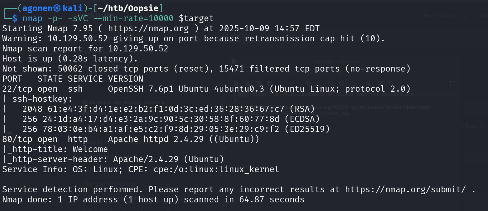

We start with `nmap`, using this command:
```bash
nmap -p- -sVC --min-rate=10000 $target
```


As you can see, there are two ports, port `22` for *ssh* and port `80` for http server, in this case *apache* server.

```
PORT   STATE SERVICE VERSION
22/tcp open  ssh     OpenSSH 7.6p1 Ubuntu 4ubuntu0.3 (Ubuntu Linux; protocol 2.0)
| ssh-hostkey: 
|   2048 61:e4:3f:d4:1e:e2:b2:f1:0d:3c:ed:36:28:36:67:c7 (RSA)
|   256 24:1d:a4:17:d4:e3:2a:9c:90:5c:30:58:8f:60:77:8d (ECDSA)
|_  256 78:03:0e:b4:a1:af:e5:c2:f9:8d:29:05:3e:29:c9:f2 (ED25519)
80/tcp open  http    Apache httpd 2.4.29 ((Ubuntu))
|_http-title: Welcome
|_http-server-header: Apache/2.4.29 (Ubuntu)
Service Info: OS: Linux; CPE: cpe:/o:linux:linux_kernel
```

    

**User Flag:*****`b40abdfe23665f766f9c61ecba8a4c19`***

**Root Flag:*****`b40abdfe23665f766f9c61ecba8a4c19`***
