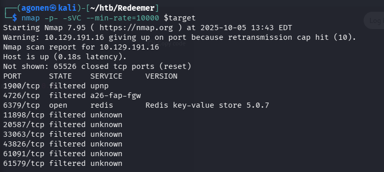
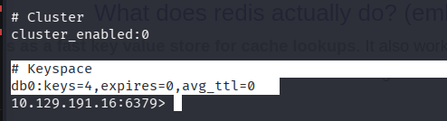
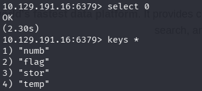
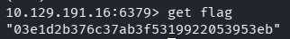

### TL;DR

We find port 6379 is open, which means `redis` server. We connect without password and get the flag. 

### Recon

We start with `nmap`, this time with `-p-` to scan all ports:
```bash
nmap -p- -sVC -T4 $target
```



As we can see, it finds only one open port, port number `6379`, which is the port for `redis`. 
`redis` is database that is used for caching, because it saves all in the *RAM*. `redis` stands for `REmote DIctionary Server`, and saves the data in key-value format.

```bash
PORT     STATE SERVICE VERSION
6379/tcp open  redis   Redis key-value store 5.0.7
```

### Get flag from the redis server

Okay, so let's try to connect without password. We'll use the `redis-cli` util, with the flag `-h` for hostname:
```bash
redis-cli -h $target
``` 

First, we execute `info`, to get info about the service:



As we can see, there is only one database, which contains 4 keys.
```bash
# Keyspace
db0:keys=4,expires=0,avg_ttl=0
```

Ok, so let's try using this database, using `select 0`, and then execute `keys *` to view all keys.



As we can see, there is some `key` which is called `flag`, so we want the value it contains.

We can achieve this by using `get`, and in our case, `get "flag"`



**Flag:*****`03e1d2b376c37ab3f5319922053953eb`***
