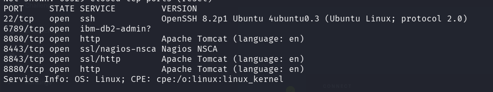

### Recon

we start as usual with `nmap`, using this command:
```bash
nmap -p- -sV --min-rate=10000 $target
``` 



As we can see there are several open ports:
```bash
PORT     STATE SERVICE         VERSION
22/tcp   open  ssh             OpenSSH 8.2p1 Ubuntu 4ubuntu0.3 (Ubuntu Linux; protocol 2.0)
6789/tcp open  ibm-db2-admin?
8080/tcp open  http            Apache Tomcat (language: en)
8443/tcp open  ssl/nagios-nsca Nagios NSCA
8843/tcp open  ssl/http        Apache Tomcat (language: en)
8880/tcp open  http            Apache Tomcat (language: en)
Service Info: OS: Linux; CPE: cpe:/o:linux:linux_kernel
```

### Access the webserver and exploit vulnerable version


**User Flag:*****`b40abdfe23665f766f9c61ecba8a4c19`***

**Root Flag:*****`b40abdfe23665f766f9c61ecba8a4c19`***
