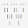
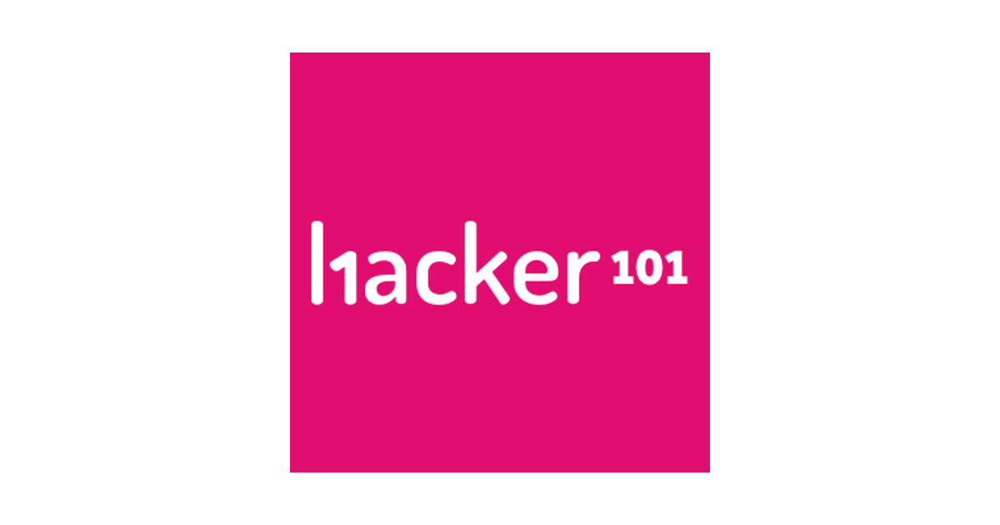
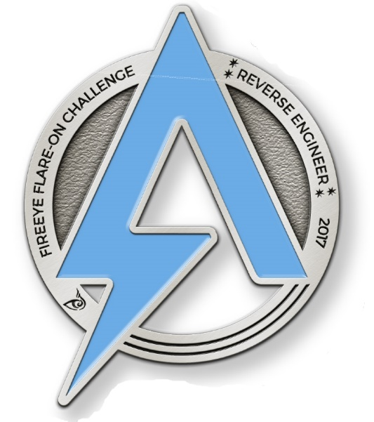
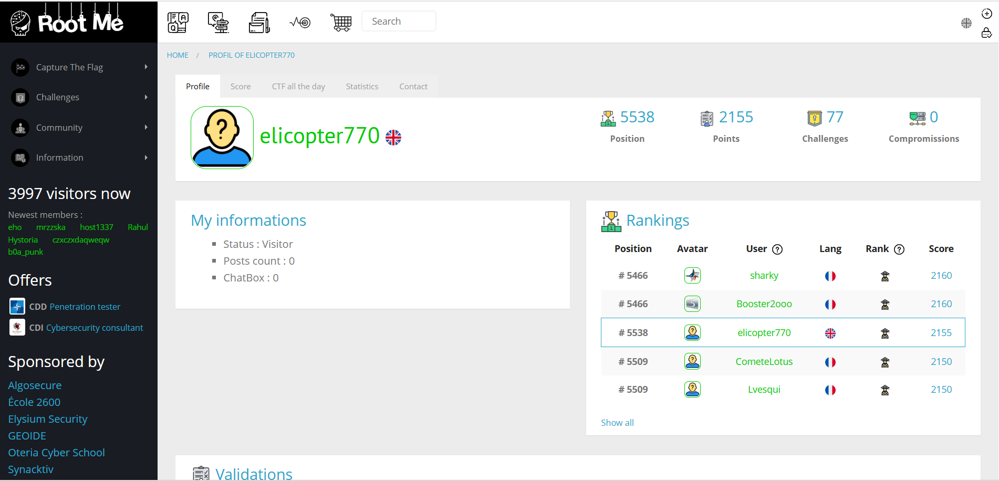
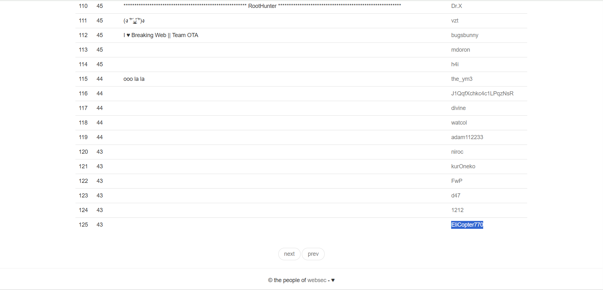

# 🛡️ Welcome to My CTF Writeups

> A collection of writeups for Capture The Flag (CTF) challenges and wargames — solved, documented, and shared for learning.


  Writeup counter.

  Replaces a rule that undercounted by 108. Three separate faults:
    - only 12 of the 15 platforms were listed; websec.il was absent entirely
    - hackthebox and tryhackme were counted through a second, separate branch
    - the `file_name != "index.md"` test skipped every writeup stored as
      <name>/index.md, which is how android_hacking, websec.il and several
      sub-wargames (overthewire/vortex, ringzer0/*, root-me/*) are organised

  The rule now: every page under a known platform, excluding that platform's own
  hub index, and excluding anything marked `status: incomplete`. That is 687
  pages total, 661 of them finished - the number shown.

  The platform list stays hardcoded deliberately. Deriving it from site.pages is
  what caused the undercount. RENAMING A TOP-LEVEL DIRECTORY REQUIRES EDITING
  THIS LIST, or the count silently drops.









  
  
  
  
  
  
    
    
    
  


<!-- MAIN CIRCLE -->

  <svg>
    <defs>
      <linearGradient id="gradient" x1="0%" y1="0%" x2="100%" y2="0%">
        <stop offset="0%" stop-color="#3b82f6"/>
        <stop offset="100%" stop-color="#06b6d4"/>
      </linearGradient>
    </defs>
    <circle class="bg" cx="130" cy="130" r="110"></circle>
    <circle class="progress" cx="130" cy="130" r="110"></circle>
  </svg>

  

    
0

    
Writeups so far

  

<!-- SMALL CIRCLES WRAPPER -->

  <!-- HTB -->
  

    <svg>
      <defs>
        <linearGradient id="gradient-htb" x1="0%" y1="0%" x2="100%" y2="0%">
          <stop offset="0%" stop-color="#2d3748"/>
          <stop offset="100%" stop-color="#4a5568"/>
        </linearGradient>
      </defs>
      <circle class="bg" cx="80" cy="80" r="65"></circle>
      <circle class="progress" cx="80" cy="80" r="65" stroke="url(#gradient-htb)"></circle>
    </svg>
    

      
      
{{ htb_count }}

      
HTB

    

  

  <!-- THM -->
  

    <svg>
      <defs>
        <linearGradient id="gradient-thm" x1="0%" y1="0%" x2="100%" y2="0%">
          <stop offset="0%" stop-color="#fbbf24"/>
          <stop offset="100%" stop-color="#fcdb61"/>
        </linearGradient>
      </defs>
      <circle class="bg" cx="80" cy="80" r="65"></circle>
      <circle class="progress" cx="80" cy="80" r="65" stroke="url(#gradient-thm)"></circle>
    </svg>
    

      
      
{{ thm_count }}

      
THM

    

  

<!-- JS Link -->

<!-- CSS Link -->
<link rel="stylesheet" href="{{ '/assets/css/counter.css' | relative_url }}">

<!-- JS Link -->

---

## 📁 Contents

  <ul style="list-style-type: none; padding: 0;">
    <li style="margin-bottom: 12px; border: 1px solid #ddd; padding: 10px; border-radius: 8px; transition: background-color 0.3s; display:flex; align-items:center; gap:8px;">
    
      <a href="./overthewire/" style="text-decoration: none; color: #16a085;"> OverTheWire</a>
    </li>
    <li style="margin-bottom: 12px; border: 1px solid #ddd; padding: 10px; border-radius: 8px; transition: background-color 0.3s; display:flex; align-items:center; gap:8px;">
    
      <a href="./root-me/" style="text-decoration: none; color: #16a085;"> Root-me</a>
    </li>
    <li style="margin-bottom: 12px; border: 1px solid #ddd; padding: 10px; border-radius: 8px; transition: background-color 0.3s; display:flex; align-items:center; gap:8px;">
    
      <a href="./trythis0ne/" style="text-decoration: none; color: #16a085;"> trythis0ne</a>
    </li>
    <li style="margin-bottom: 12px; border: 1px solid #ddd; padding: 10px; border-radius: 8px; transition: background-color 0.3s; display:flex; align-items:center; gap:8px;">
    
      <a href="./webhacking.kr/" style="text-decoration: none; color: #16a085;"> Webhacking.kr</a>
    </li>
    <li style="margin-bottom: 12px; border: 1px solid #ddd; padding: 10px; border-radius: 8px; transition: background-color 0.3s; display:flex; align-items:center; gap:8px;">
    
      <a href="./websec.fr/" style="text-decoration: none; color: #16a085;"> Websec.fr</a>
    </li>
    <li style="margin-bottom: 12px; border: 1px solid #ddd; padding: 10px; border-radius: 8px; transition: background-color 0.3s; display:flex; align-items:center; gap:8px;">
    
      <a href="./websec.il/" style="text-decoration: none; color: #16a085;"> Websec.co.il</a>
    </li>
    <li style="margin-bottom: 12px; border: 1px solid #ddd; padding: 10px; border-radius: 8px; transition: background-color 0.3s; display:flex; align-items:center; gap:8px;">
    
      <a href="./pwnable.kr/" style="text-decoration: none; color: #16a085;"> Pwnable.kr</a>
    </li>
    <li style="margin-bottom: 12px; border: 1px solid #ddd; padding: 10px; border-radius: 8px; transition: background-color 0.3s; display:flex; align-items:center; gap:8px;">
    
      <a href="./lord-of-sql-injection/" style="text-decoration: none; color: #16a085;"> Lord of SQL Injection</a>
    </li>
    <li style="margin-bottom: 12px; border: 1px solid #ddd; padding: 10px; border-radius: 8px; transition: background-color 0.3s; display:flex; align-items:center; gap:8px;">
    
       <a href="./ringzer0" style="text-decoration: none; color: #16a085;"> RingZer0</a>
    </li>
    <li style="margin-bottom: 12px; border: 1px solid #ddd; padding: 10px; border-radius: 8px; transition: background-color 0.3s; display:flex; align-items:center; gap:8px;">
    
      <a href="./AppSec-IL-2025/" style="text-decoration: none; color: #16a085;"> AppSec-IL-2025</a>
    </li>
    <li style="margin-bottom: 12px; border: 1px solid #ddd; padding: 10px; border-radius: 8px; transition: background-color 0.3s; display:flex; align-items:center; gap:8px;">
    
     <a href="./hackthebox/" style="text-decoration: none; color: #16a085; font-weight:500;">HackTheBox</a>
    </li>
    <li style="margin-bottom: 12px; border: 1px solid #ddd; padding: 10px; border-radius: 8px; transition: background-color 0.3s; display:flex; align-items:center; gap:8px;">
      
      <a href="./tryhackme/" style="text-decoration: none; color: #16a085; font-weight:500;">TryHackMe</a>
    </li>
    <li style="margin-bottom: 12px; border: 1px solid #ddd; padding: 10px; border-radius: 8px; transition: background-color 0.3s; display:flex; align-items:center; gap:8px;">
      
      <a href="./android_hacking/" style="text-decoration: none; color: #16a085; font-weight:500;">Android Hacking</a>
    </li>
    <li style="margin-bottom: 12px; border: 1px solid #ddd; padding: 10px; border-radius: 8px; transition: background-color 0.3s; display:flex; align-items:center; gap:8px;">
      
      <a href="./hacker101/" style="text-decoration: none; color: #16a085; font-weight:500;">Hacker 101</a>
    </li>
    <li style="margin-bottom: 12px; border: 1px solid #ddd; padding: 10px; border-radius: 8px; transition: background-color 0.3s; display:flex; align-items:center; gap:8px;">
      
      <a href="./flare-on/" style="text-decoration: none; color: #16a085; font-weight:500;">Flare-On</a>
    </li>

  </ul>

---

## 🧭 Wargame Guide

Each folder includes:
- ✍️ **Level Writeups**: Short, step-by-step walkthroughs with clear flags.
- 💻 **Scripts/Code**: Relevant exploit or helper code placed alongside the writeups.

---

## 📝 Notes

- Writeups are **concise**, focusing only on the **essential steps** to solve each challenge.
- This project is constantly growing — **new challenges will be added regularly**.
- All content is meant for **educational purposes**.

---

## 🙌 Happy Hacking!

Feel free to [connect with me](https://github.com/avishaigonen123) or contribute.  
Learn, explore, and enjoy the world of CTFs 🧠💥

<link rel="stylesheet" href="{{ '/assets/css/scoreboard.css' | relative_url }}">

<!-- CTF Ranks -->

  

     
WeChall

    <iframe src="https://www.wechall.net/profile/EliCopter" title="WebHacking.kr Profile"></iframe>
  

  

     
WebHacking.kr

    <iframe src="https://webhacking.kr/rank.php?page=2" title="WebHacking.kr Profile"></iframe>
  

  

    
Root-Me

    
    <!-- <iframe src="https://www.root-me.org/elicopter770?lang=en#fd3288f941c568ba4d7b3d56ed57d3db" title="Root-Me Profile"></iframe> -->
  

  

     
WebSec.fr

     
    <!-- <iframe src="https://websec.fr/scoreboard/5" title="WebSec.fr Profile"></iframe> -->
  

<!-- change to see if num of CTF's changing -->
